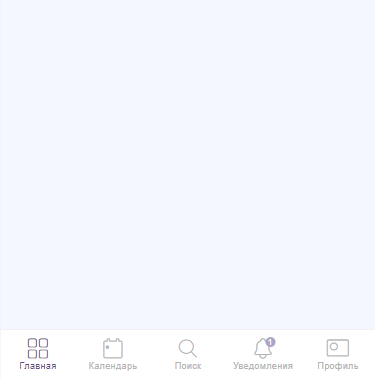

==================================
Салон Красоты
==================================

Вы можете воспользоваться готовым шаблоном и настроить его под свой бизнес:

* `Посмотреть пример <https://torrow.net/app/tabs/tab-search/note;id=aae6103ebd77d60f317b58700019ab3d9>`_

* `Воспользоваться готовым шаблоном <https://trrw.me/Ya4KZXVZN1Fwn34>`_

Ниже представлена инструкция для самостоятельной настройки услуги.

-------------------------------
Создание профиля
-------------------------------

Регистрация в Torrow

Для начала работы с **Torrow** зарегистрируйтесь (:ref:`registration-label`) и заполните **Визитку** (:ref:`buisnesscard-label`)

-----------------

**Создание Раздела**

   .. |плюс| image:: media/plus.png
      :width: 21
      :alt: alternative text
   .. |контакт| image:: media/contact.png
      :width: 21
      :alt: alternative text
   .. |точка| image:: media/tochka.png
      :width: 21
      :alt: alternative text
   .. |элементы| image:: media/reserved.png
      :width: 21
      :alt: alternative text
   .. |галка| image:: media/galka.png
      :width: 21
      :alt: alternative text

1. Нажмите на |точка| в верхнем правом углу и выберите пункт **Добавить раздел**.

.. figure:: media/gif/add_section.gif
    :scale: 60 %
    :alt: alternate text
    :align: center  

-----------------

2. Назовите раздел, как Вам удобно и выберите подходящую иконку. Для завершения нажмите |галка|.

--------------------

**Создание Контакта**

1) Войдите в созданный Вами раздел, нажмите |плюс| и выберите иконку |контакт| (:ref:`contact-label`).
      

-----------------

2) Заполните **Контакт** от лица Компании

-----------------

3) Настройте **тип доступности** контакта, подходящим Вам способом. Рекомендуем, установить "по ссылке"
         

-----------------

4) Настройте **Внешний вид** Вашего аккаунта, так он будет более привлекательным
          

-----------------

5) Добавьте **Уникальное имя** Вашему контакту

-----------------

6) Вернитесь в раздел и создайте **Контакт** "База контактов" для хранения данных о клиентах
      

--------------------

-------------------------------------
Создание услуг
-------------------------------------

Заполните профиль 

1) Откройте **Контакт** и создайте **Услугу** (:ref:`service-label`).
   

-----------------

2) Установите **Тип услуги** — **Запись на время**
      

-----------------

3) Заполните **Место** и **Описание**
      

-----------------

4) Установите **Расписание** услуги
   

---------------     

5) Установите **Вид расписания по умолчанию** услуги
   

-----------------

6) Установите **Время регистрации** на услугу
   

-----------------

7) Установите необходимые **Ограничения** и **Шаги записи** (к примеру Вид услуги). Отметьте "Выбор ресурсов без просмотра"
       

-----------------

8) Установите необходимые **Контактные данные**, которые Вы хотите получить от пользователя при записи
      

-----------------

9) Настройте **внешний вид** Вашей услуги.
          

-----------------

10) **Прикрепите** услугу к Контакту, чтобы она была видна Вашим клиентам (нажмите и долго удерживайте элемент).
       

--------------------

**Добавление Ресурса**  

1) Откройте **Услугу** и создайте **Ресурс** (:ref:`resources-label`)
   

-----------------

2) Установите **Тип ресурса** Спецификация
   

-----------------

3) Установите **Расписание** ресурса

-----------------

4) Заполните **Описание** ресурса
      

-----------------

5) Установите **Стоимость**
      

-----------------

6) Укажите **Параметры** ресурса
      

-----------------

7) Выберите **Условия использования** ресурса  
   

Теперь Вы можете заполнить **Контакт** своими **Услугами** и начать пользоваться сервисом.

----------------------

Если у Вас несколько однотипных **Услуг**, например, Маникюр, Педикюр, Покрытие гель-лаком и т.д. (или различные стрижки и окрашивания), то их можно объединить в дополнительные **Ресурсы**.

1) Добавьте в **Услуге** дополнительный **Шаг**

-----------------

2) Создайте **Ресурсы** с обобщенными названиями, не задавая дополнительные параметры и цену.
   Установите новые **Условия использования** для каждого ресурса

-----------------

3) Теперь на Ваши **Услуги** можно записываться

--------------------

--------------------------------------------
Оформление профиля
--------------------------------------------

**Создание Заметки**

1) В созданном Вами **Контакте**, нажмите |плюс| и выберите **заметку** (:ref:`zametka-label`).
      

-----------------

2) Назовите **Заметку** и загрузите обложку
   

-----------------

3) Измените размер обложки и заполните необходимую информацию

-----------------

Внутри **Заметки** можно создавать другие **Заметки** с разными темами и объявлениями, а также **Контакты**, **События** и другие **Элементы Torrow**.

--------------------

**Создание Календаря**

В **Календаре** можно отмечать Мастер классы или Обучения, которые проводятся в Вашем Салоне

1) В созданном Вами **Контакте**, нажмите |плюс|, нажмите на |элементы| и выберите **Календарь**.
      

-----------------

2) Загрузите обложку **Календаря** и выберите **Вид расписания по умолчанию**.
   

-----------------

**Добавление Событий**

Откройте **Календарь**, нажмите |плюс| и заполните **Событие** (:ref:`event-label`)

.. .. raw:: html
   
..    <torrow-widget
..       id="torrow-widget"
..       url="https://web.torrow.net/app/tabs/tab-search/service;id=103edf7f8c4affcce3a659502c23a?closeButtonHidden=true&tabBarHidden=true"
..       modal="right"
..       modal-active="false"
..       show-widget-button="true"
..       button-text="Заявка эксперту"
..       modal-width="550px"
..       button-style = "rectangle"
..       button-size = "60"
..       button-y = "top"
..    ></torrow-widget>
..    

.. .. raw:: html

..    