.. _buisnesscard-label:

=======
Визитка
=======

Нажмите кнопку |профиль|

Здесь хранятся ваши визитные карточки, после регистрации по умолчанию у вас две визитки.

Заполните данные визитных карточек, которые будут вам необходимы для дальнейшей работы в приложении.

.. hint:: Вы можете добавить до 12 визиток для разных видов своей деятельности.

Создание визитки
~~~~~~~~~~~~~~~~

1. Зайдите в Ваш профиль |профиль| и нажмите |точка|
    
    .. |профиль| image:: media/profile.png
        :scale: 42 %
    .. |точка| image:: media/tochka.png
        :scale: 42 %

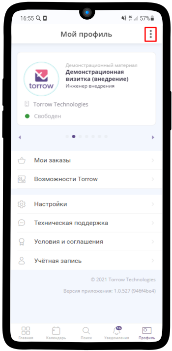

2. Нажмите **Добавить визитку**

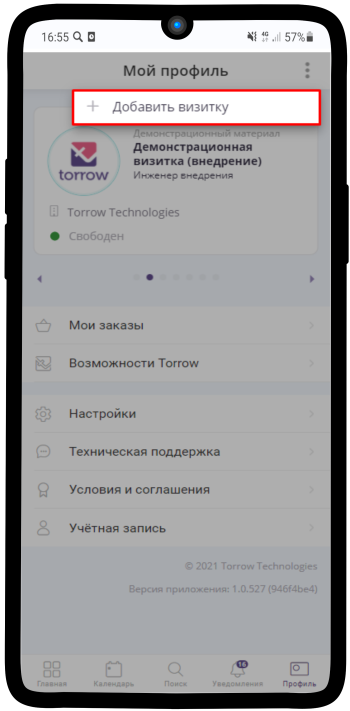

3. Заполните **Вашу визитку**

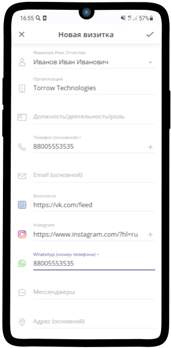

4. Выберите **фото** для текущей визитки

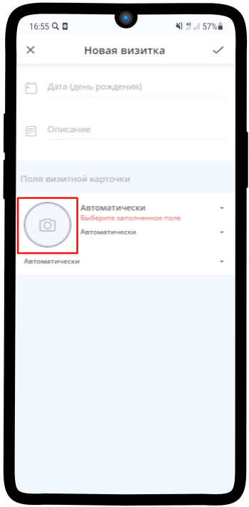

5. **Определите рамки изображения** и нажмите на |галка|
    
    .. |галка| image:: media/galka.png
        :scale: 42 %

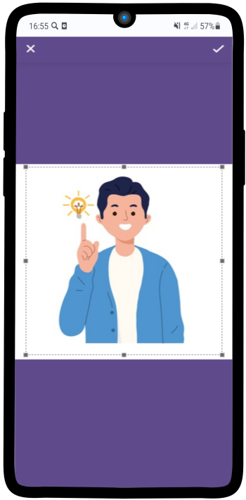

6. **Заполните информацию**, которая будет отображаться в Вашей визитке

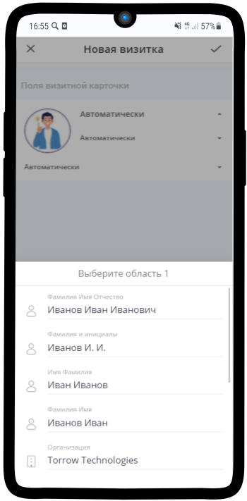

7. **Сохраните Ваши изменения**, для этого нажмите на |галка|

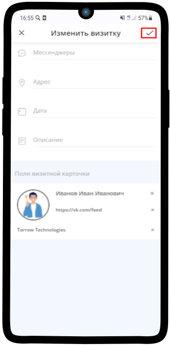

8. **Ваша визитка готова**, теперь можно перейти к `Настройка визитки`_

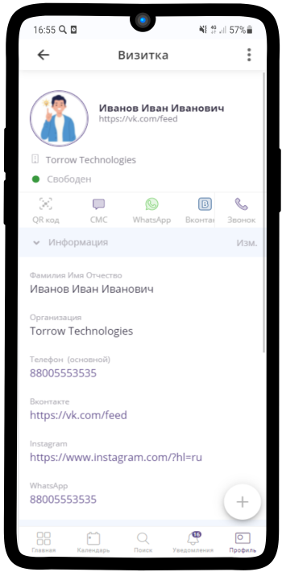

--------------------

Настройка визитки
~~~~~~~~~~~~~~~~~

1. Выберите **тип доступности визитки**. Для этого перейдите в **Общие настройки** и нажмите на соответствующее поле

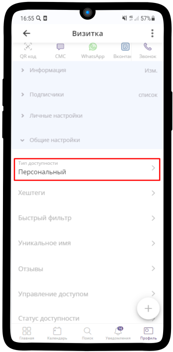

2. В списке присутствует 4 типа доступности: **Персональный**, **По ссылке**, **Открытый по запросу**, **Открытый**. Ознакомьтесь с описанием и выберите желаемый. Нажмите на |галка|

.. hint:: Рекомендуем выбрать тип доступности **По ссылке**.

.. figure:: media/card10.png
    :scale: 60 %
    :alt: alternate text
    :align: center

3. В общих настройках Вашей визитки нажмите на поле **Уникальное имя**

.. hint:: Уникальное имя будет отображаться в **ссылке** Вашего контакта.

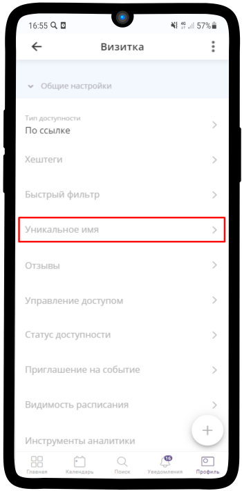

4. Введите **Уникальное имя** по-своему усмотрению и нажмите |галка|

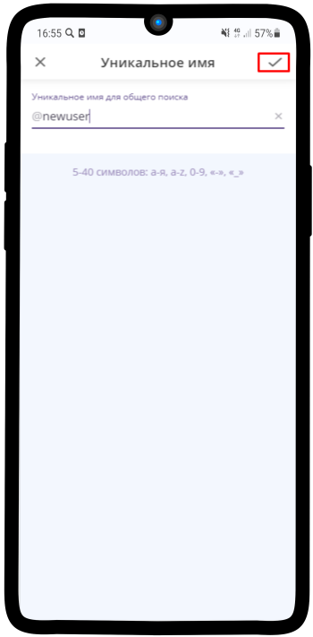

5. В общих настройках Вашей визитки нажмите на поле **Видимость расписания**

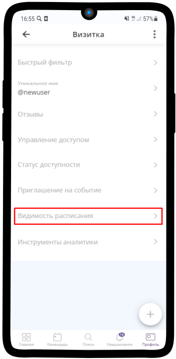

6. Измените **Видимость расписания** по Вашему усмотрению и нажмите |галка|

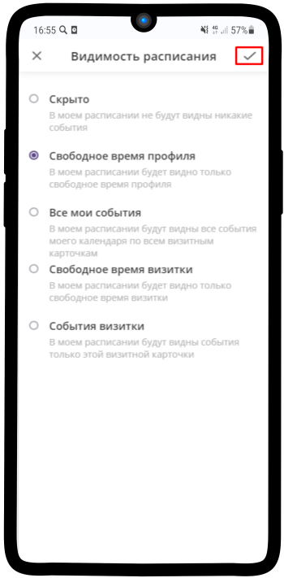

7. В общих настройках Вашей визитки нажмите на поле **Статус доступности**

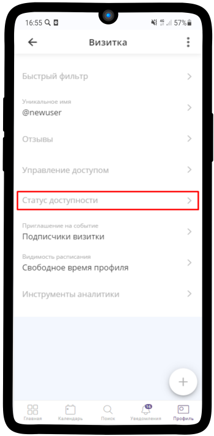

8. Измените **Статус доступности** по Вашему усмотрению и нажмите |галка|

.. hint:: Рекомендуем выбрать статус доступности **По календарю визитки**.

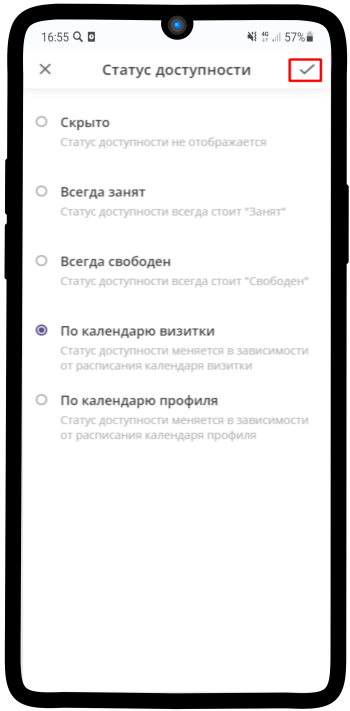

--------------------

Расписание визитки
~~~~~~~~~~~~~~~~~~

.. hint:: В расписании визитки Вы можете посмотреть перечень событий, которые относятся **конкретно к данной визитке**. В **Личном календаре** мы можем видеть общий список событий с градацией по цвету в зависимости от типа визитки участника/исполнителя.

Чтобы посмотреть расписание визитки:

1. Перейдите в Ваш профиль |профиль| и нажмите на кнопку **Расписание**

.. note:: Перед Вами откроется расписание на текущий день.

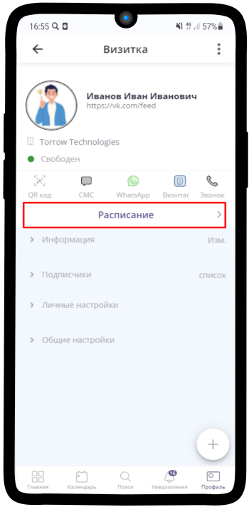

2. Нажмите на кнопку |точка| в правом верхнем углу

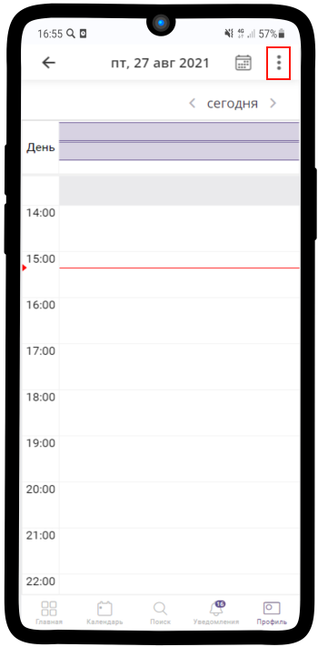

3. Выберите удобный для Вас вариант отображения **расписания**. На изображении ниже, в качестве примера, выбран **Список событий**

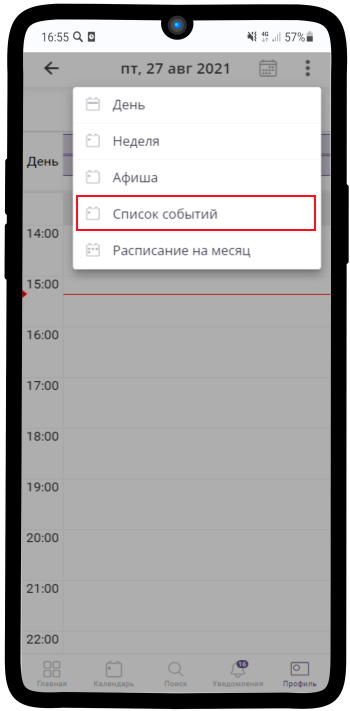

4. Перед Вами откроется **список событий** с разбивкой по дням и месяцам. Чтобы перейти обратно в профиль, нажмите |назад|

    .. |назад| image:: media/back.png
        :scale: 20 %

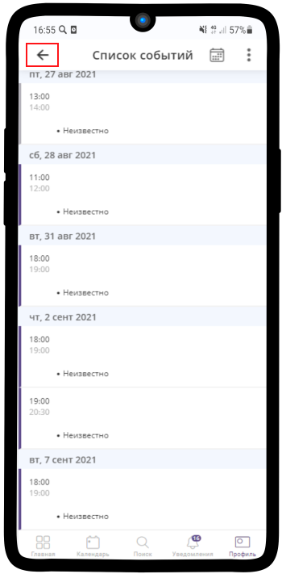

.. raw:: html
   
   <torrow-widget
      id="torrow-widget"
      url="https://web.torrow.net/app/tabs/tab-search/service;id=103edf7f8c4affcce3a659502c23a?closeButtonHidden=true&tabBarHidden=true"
      modal="right"
      modal-active="false"
      show-widget-button="true"
      button-text="Заявка эксперту"
      modal-width="550px"
      button-style = "rectangle"
      button-size = "60"
      button-y = "top"
   ></torrow-widget>
   

.. raw:: html

   