=========
Календарь
=========

.. note:: **Календарь Torrow** представляет собой перечень событий (:ref:`event-label`), которые логически связаны между собой.

Например, **туристический маршрут** или **афиша концертного зала**, где есть четкий список мероприятий, ограниченных во времени.

Создание календаря
~~~~~~~~~~~~~~~~~~

    .. |галка| image:: media/galka.png
        :scale: 42 %
    .. |плюс| image:: media/plus.png
        :scale: 42 %
    .. |меню| image:: media/reserved.png
        :scale: 42 %
    .. |точка| image:: media/tochka.png
        :scale: 32 %

1. Нажмите на |плюс| в правом нижнем углу

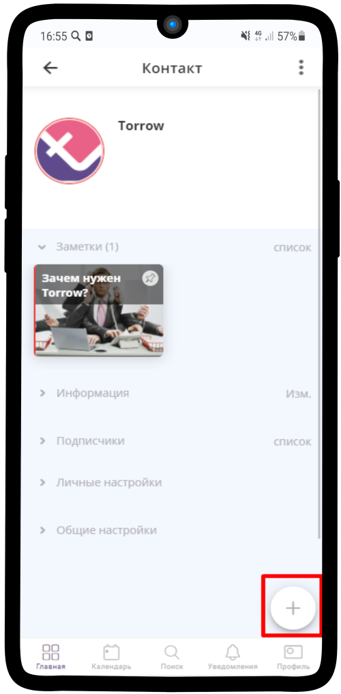

---------------------

2. Выберите |меню|

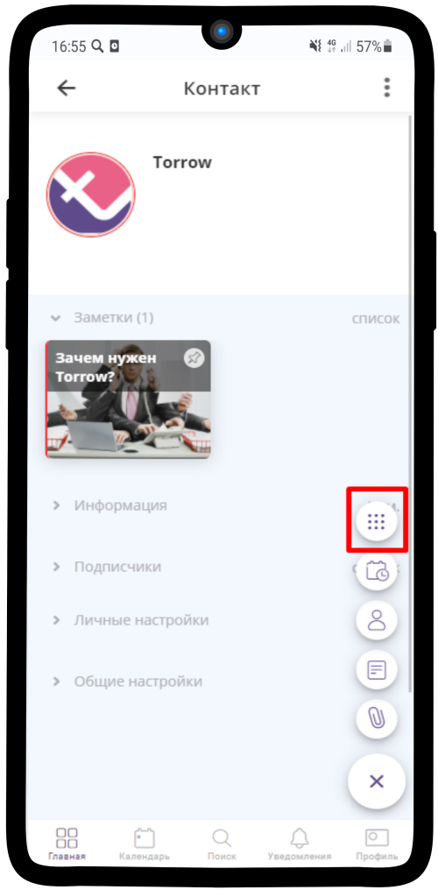

---------------------

3. В списке элементов выберите **Создать календарь**

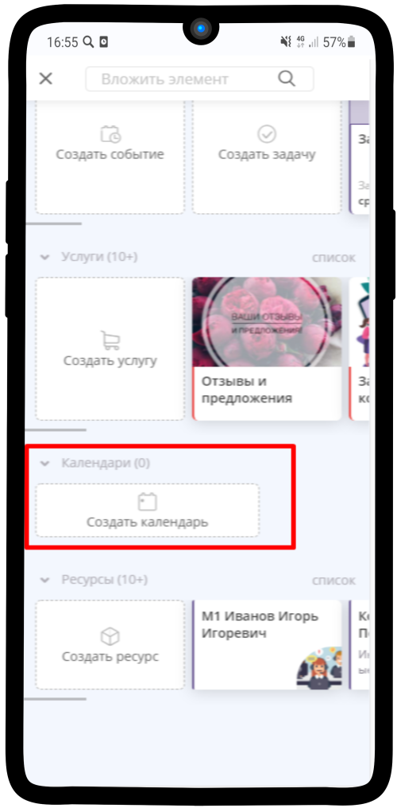

---------------------

4. Выберите **Вид расписания по умолчанию**

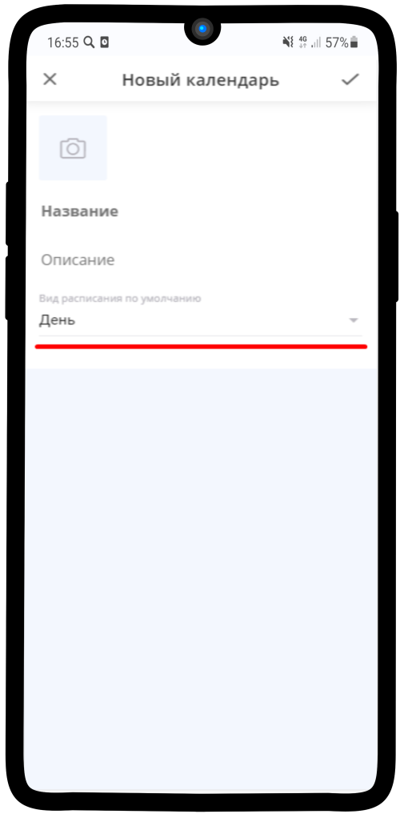

---------------------

5. Рекомендуем выбрать **Список событий**

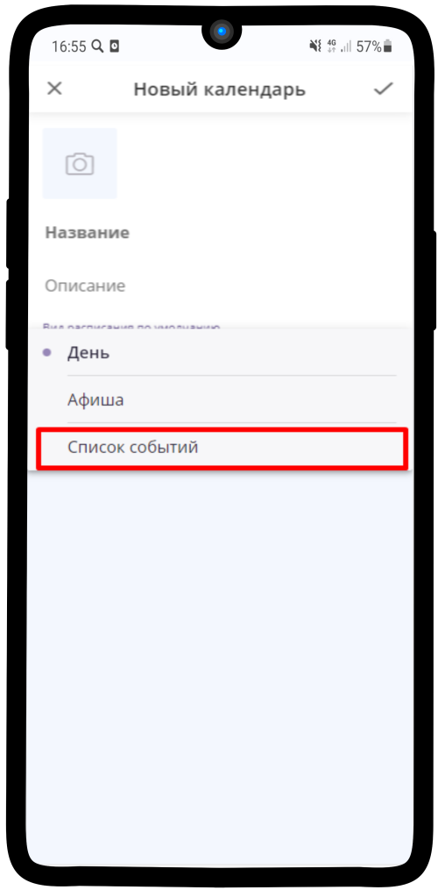

---------------------

6. Впишите название Календаря, загрузите обложку и нажмите на |галка|

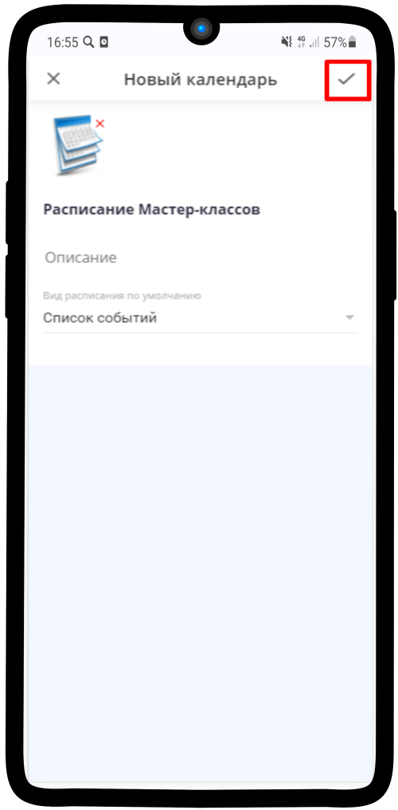

---------------------

7. Календарь готов!

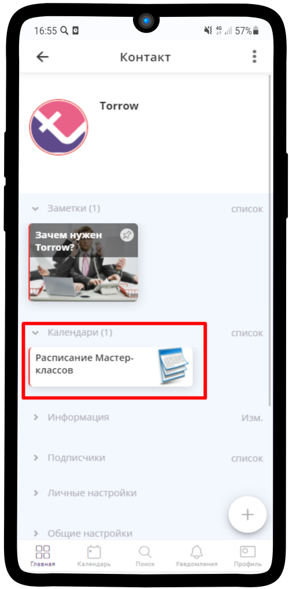

---------------------

8. Откройте календарь, нажмите на |точка| в правом верхнем углу: вы можете Изменить календарь, удалить его, поделиться им и т.д.

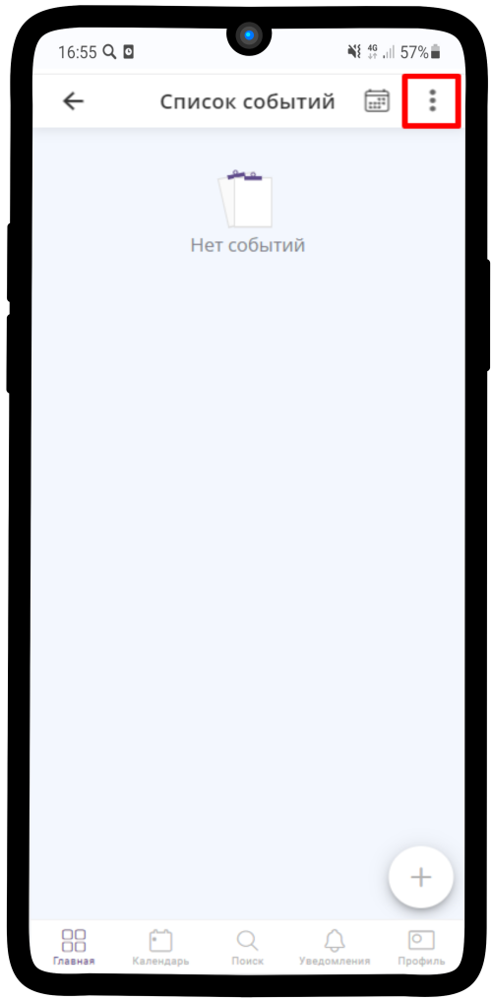

---------------------

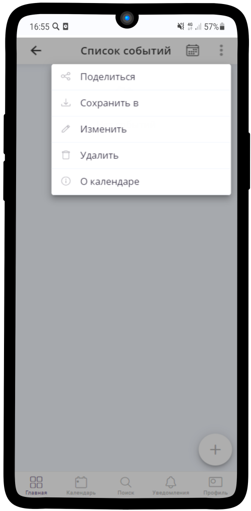

---------------------

9. Изменить **Вид расписания** можно, нажав на иконку календаря рядом с |точка|

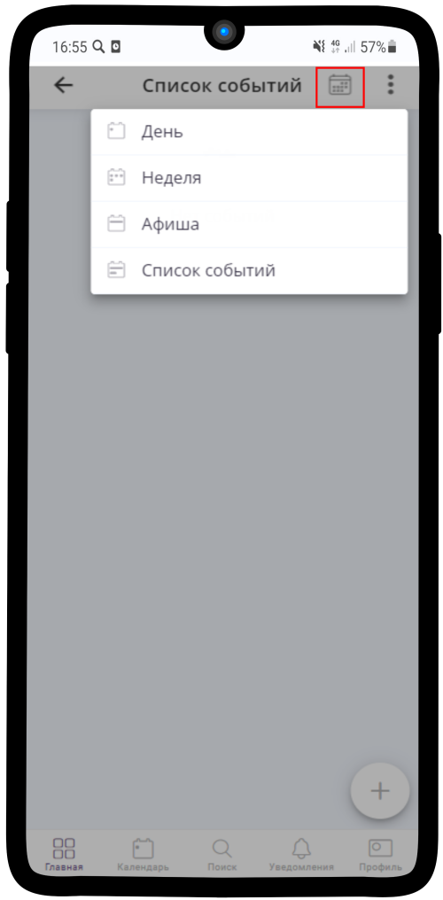

---------------------

Добавление событий
~~~~~~~~~~~~~~~~~~

1. Чтобы добавить Событие, нажмите на |плюс|

.. hint:: Более подробно о создании События (:ref:`event-label`)

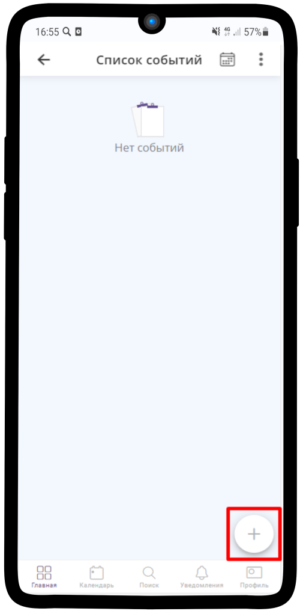

---------------------

2. Готовое событие в **Списке событий** отображается таким образом

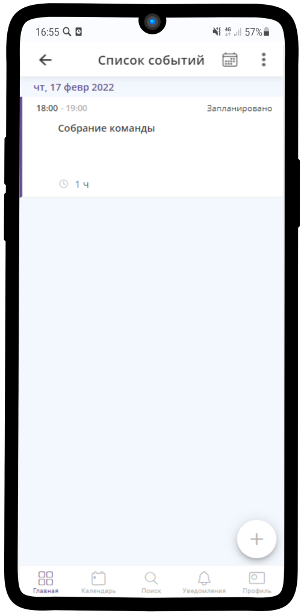

---------------------

3. В дневном виде так:

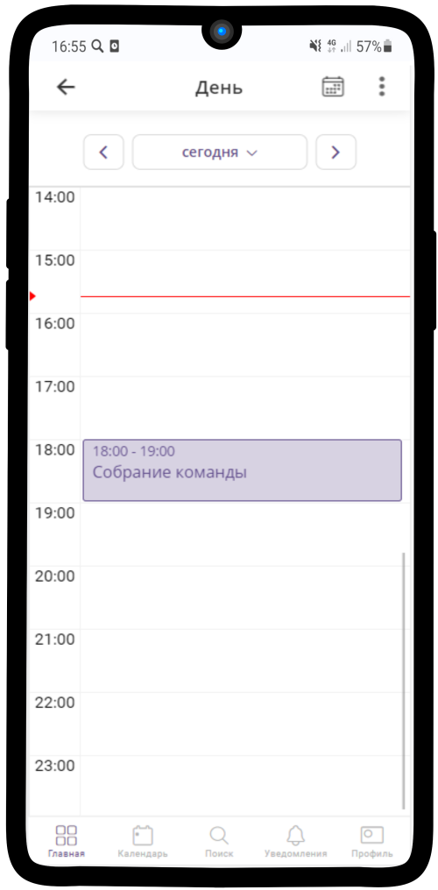

---------------------