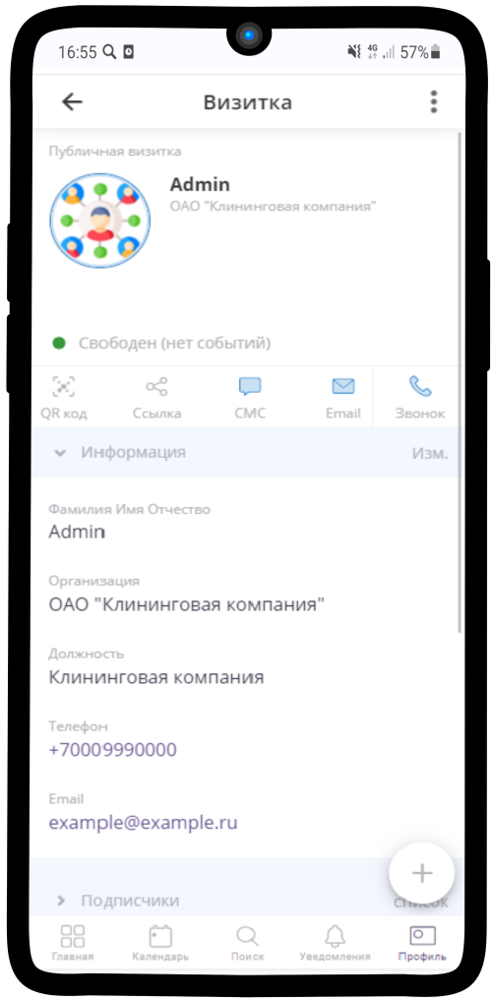
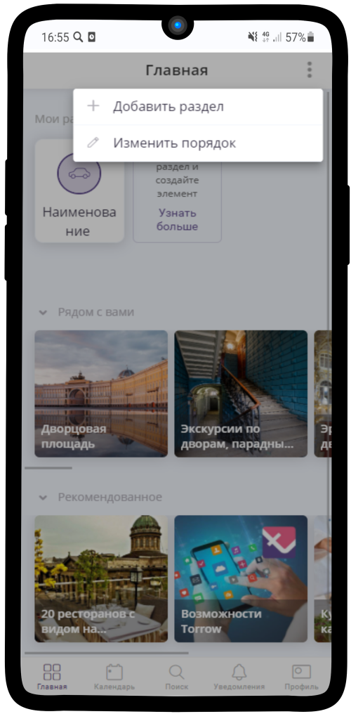

====================
Клининговая компания
====================

В данном кейсе рассмотрен пример оформления для Клининговой компании.

---------------------------------
Создание профиля
---------------------------------

**Регистрация в Torrow**

Для начала работы с **Torrow** пройдите регистрацию (:ref:`registration-label`) и заполните **Визитку** (:ref:`buisnesscard-label`)

.. |плюс| image:: media/plus.png
      :width: 21
      :alt: alternative text
.. |контакт| image:: media/contact.png
      :width: 21
      :alt: alternative text
.. |галка| image:: media/galka.png
      :width: 21
      :alt: alternative text
.. |точка| image:: media/tochka.png
      :width: 21
      :alt: alternative text

-------------------------

**Создание Раздела**

1. Нажмите на |точка| в верхнем правом углу и выберите пункт **Добавить раздел**.

   
--------------------

2. Назовите раздел, как Вам удобно и выберите подходящую иконку. Для завершения нажмите |галка|.

.. figure:: media/gif/razdel2.png
   :scale: 53 %
   :alt: alternate text
   :align: center

--------------------

**Создание Контакта**

1) Войдите в созданный Вами раздел, нажмите |плюс|, потом на |меню|  и выберите иконку |контакт| (:ref:`contact-label`).
      
.. figure:: media/gif/add_contact.png
   :scale: 53 %
   :alt: alternative text
   :align: center

--------------------

2) Заполните **Контакт** от лица Компании. 
      

--------------------

.. figure:: media/gif/clining_info2.png
   :scale: 53 %
   :alt: alternative text
   :align: center

--------------------
          
3) Настройте **тип доступности** контакта, подходящим Вам способом. Добавьте **Уникальное имя** Вашему контакту и измените **внешний вид** Вашего аккаунта.
          
.. figure:: media/gif/edit_contactinfo2.png
   :scale: 53 %
   :alt: alternative text
   :align: center

---------------------
    
4) Вернитесь в раздел и создайте **Контакт** "База клиентов" для хранения данных о клиентах
      

---------------------

--------------------------------------------------------------------
Создание Услуги
--------------------------------------------------------------------

1) Откройте **Контакт**, нажмите |плюс| в правом нижнем углу, потом на |меню| и выберите **Создать услугу** (:ref:`service-label`).
   

---------------------

2) Установите **Тип услуги** - Запись на время. Заполните поля **Название**, **Описание**. Загрузите Фотографию.

---------------------

3) Заполните **Расписание** услуги. Настройте поля **Выравнивание времени**, **Вид расписания по умолчанию** и **Время регистрации**.

.. figure:: media/gif/service_timetable2.png
   :scale: 53 %
   :alt: alternative text
   :align: center

---------------------

4) Установите часы и дни работы Вашей компании.

.. figure:: media/gif/service_timeedit2.png
   :scale: 53 %
   :alt: alternative text
   :align: center

---------------------

5) Установите необходимые **Шаги записи** (к примеру Выбор пакета услуги)

---------------------

6) Добавьте **новый шаг** записи, **переместите его вверх** при необходимости, или **удалите** лишний.

---------------------

7) Впишите **название**, выберите **тип использования**. Также можно выбрать **Выбор ресурсов без просмотра**
   
.. figure:: media/gif/set_stepnewinfo2.png
   :scale: 53 %
   :alt: alternative text
   :align: center

---------------------

8) Для шага Выбор времени можно изменить **Формат выбора времени** - **Дата** или **Дата и время**. Если у ваших услуг разная длительность, то **Длительность по умолчанию** установите 0.

---------------------

9) Также можно настроить **Контактные данные**, которые Вы будете получать от клиента при записи. Если хотите, чтоб на Вашу услугу могли записываться без регистрации в Torrow, установите галочку **Запись без регистрации в Torrow**. 

---------------------

10) Прикрепите контакт, в который будут сохраняться данные о Ваших клиентах.
     
.. figure:: media/gif/set_reginfo32.png
   :scale: 53 %
   :alt: alternative text
   :align: center

---------------------

11) Выберите необходимые **Контактные данные**, которые Вы хотите получить от пользователя при записи. Можно **добавить новое поле**, **удалить** существующее и отметить **обязательное поле**.

---------------------

12) **Прикрепите** услугу к Контакту, чтобы она была видна Вашим клиентам: зажмите и долго удерживайте элемент, нажмите **Прикрепление к элементам**.
       

-------------------

13) Нажмите на переключатель 

.. figure:: media/gif/set_pin2.png
   :scale: 53 %
   :alt: alternative text
   :align: center

-------------------

14) Включите в Ваш контакт.

-------------------

15) Теперь Ваша услуга видна другим пользователям.

-------------------

**Создание Ресурсов**

1) Вернитесь в контакт и создайте **Ресурс** (:ref:`resources-label`). Нажмите на |плюс| в правом нижнем углу, далее на |меню|.
   

----------------------

2) В списке элементов выберите **создать ресурс**

----------------------

3) Установите **тип использования** - **Спецификация**. Заполните **Название**, **Описание** и добавьте фотографию.

----------------------

4) Укажите **Стоимость** оказываемой услуги

----------------------

5) Заполните **Параметры**: **Длительность** услуги, установите Минимальное и Максимальное значение - 1

----------------------

6) Назначьте **Использование** ресурса

----------------------

7) Выберите созданную ранее **услугу**, определите шаг, на котором используется ресурс. Также можно установить порядковый номер.

----------------------

----------------------------------------------------------------
Оформление профиля
----------------------------------------------------------------

Добавьте при необходимости **Заметки** (:ref:`zametka-label`).

1) Нажмите на |плюс| в правом нижнем углу и выберите заметку

----------------------

2) Напишите название и заполните текст заметки

----------------------

3) При необходимости добавьте обложку, нажав на скрепку в правом нижнем углу

Добавьте также **Контакты** работников при наличии.

.. raw:: html
   
   <torrow-widget
      id="torrow-widget"
      url="https://web.torrow.net/app/tabs/tab-search/service;id=103edf7f8c4affcce3a659502c23a?closeButtonHidden=true&tabBarHidden=true"
      modal="right"
      modal-active="false"
      show-widget-button="true"
      button-text="Заявка эксперту"
      modal-width="550px"
      button-style = "rectangle"
      button-size = "60"
      button-y = "top"
   ></torrow-widget>
   

.. raw:: html

   <!--  -->