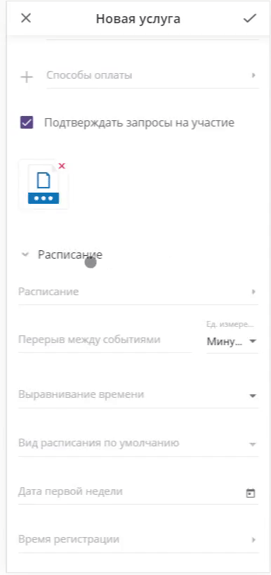
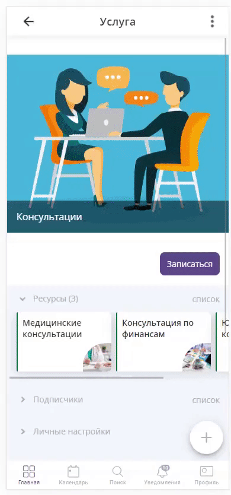

==================================
Центр консультаций
==================================

В данном кейсе рассмотрен пример оформления для Консультаций по широкому спектру услуг.

-------------------------------
Заполнение профиля
-------------------------------

**Регистрация в Torrow**

Для начала работы с **Torrow** зарегистрируйтесь (:ref:`registration-label`) и заполните **Визитку** (:ref:`buisnesscard-label`)

------------------------

**Создание Раздела**

   .. |плюс| image:: media/plus.png
      :width: 21
      :alt: alternative text
   .. |контакт| image:: media/contact.png
      :width: 21
      :alt: alternative text
   .. |точка| image:: media/tochka.png
      :width: 21
      :alt: alternative text
   .. |элементы| image:: media/reserved.png
      :width: 21
      :alt: alternative text
   .. |галка| image:: media/galka.png
      :width: 21
      :alt: alternative text

1. Нажмите на |точка| в верхнем правом углу и выберите пункт **Добавить раздел**.

.. figure:: media/gif/add_section.gif
    :scale: 60 %
    :alt: alternate text
    :align: center  

2. Назовите **Раздел**, как Вам удобно и выберите подходящую иконку. Для завершения нажмите |галка|.

3. Прикрепите в **Личных настройках** нужную **Визитку**

--------------------

**Создание Контакта** 

1) Войдите в созданный Вами раздел, нажмите |плюс| и выберите иконку |контакт| (:ref:`contact-label`).
      
.. figure:: media/gif/create_contact.gif
    :scale: 60 %
    :alt: alternative text
    :align: center

2) Заполните **Контакт** от лица Компании

3) Настройте **тип доступности** контакта, подходящим Вам способом
         

          
4) Настройте **внешний вид** Вашего аккаунта
          

5) Добавьте **Уникальное имя** Вашему контакту

6) Вернитесь в раздел и создайте **Контакт** "База контактов" для хранения данных о клиентах
      

--------------------

--------------------------------------------------------------------
Запись на консультацию
--------------------------------------------------------------------

Если Вам необходима простая запись на консультацию без дополнительных параметров

1) Откройте **Контакт** и создайте **Услугу** (:ref:`service-label`). Запишите **Название** услуги. Установите **Тип услуги** - Запись на время.
   Если Вам не нужно подтверждение записи, то уберите галочку "Подтверждать запросы на участие"

      
2) Заполните **Расписание** услуги. Выберите **Вид расписания по умолчанию**. Установите **Время регистрации** на услугу
   

3. Выберите необходимые **Контактные данные**, которые Вы хотите получить от пользователя при записи.
Укажите контакт **База контактов** для хранения информации

         
4) **Прикрепите** услугу к Контакту, чтобы она была видна Вашим клиентам (нажмите и долго удерживайте элемент).
       

Запись на консультацию

--------------------

--------------------------------------------------------------------
Консультации по широкому спектру услуг
--------------------------------------------------------------------

**Добавление Услуги**

1) Откройте **Контакт** и создайте **Услугу** (:ref:`service-label`).
   

2) Запишите **Название** услуги
   

1) Установите **Тип услуги** Запись на время
      

       
4) Заполните **Расписание** услуги
   

      
5) Выберите **Вид расписания по умолчанию** услуги
   

6) Установите **Время регистрации** на услугу
   

7) Установите необходимые **Ограничения** и **Шаги записи** (к примеру Вид услуги), если одновременно на одну услугу могут записаться несколько человек, то **Квоту использования** не нужно заполнять.
       

         
8) Установите необходимые **Контактные данные**, которые Вы хотите получить от пользователя при записи
      

9) Укажите контакт **База контактов** для хранения информации

10) Настройте **внешний вид** Вашей услуги.
          

11) **Прикрепите** услугу к Контакту, чтобы она была видна Вашим клиентам (нажмите и долго удерживайте элемент).
       

--------------------

**Добавление Ресурса**

1) Откройте **Услугу** и создайте **Ресурс** (:ref:`resources-label`).
   

2) Установите **Тип ресурса**, по умолчанию - **Спецификация**.
   
3) Установите **Расписание** ресурса.
   
.. figure:: media/gif/set_restimetable.gif
    :scale: 60 %
    :alt: alternative text
    :align: center
     
4) Заполните **Описание** ресурса, загрузите обложку.
         
5) Выберите **Условия использования** ресурса  
   

Теперь вы можете заполнить **Контакт** своими **Услугами** и начать пользоваться сервисом.

