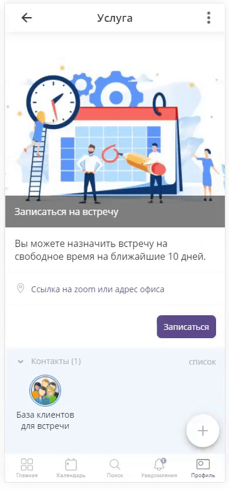
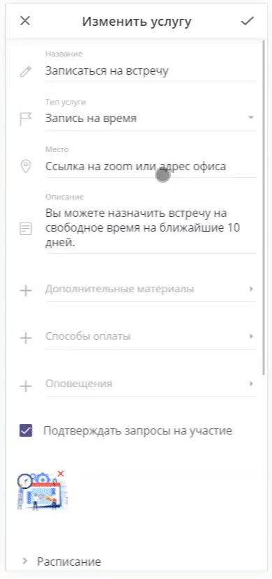
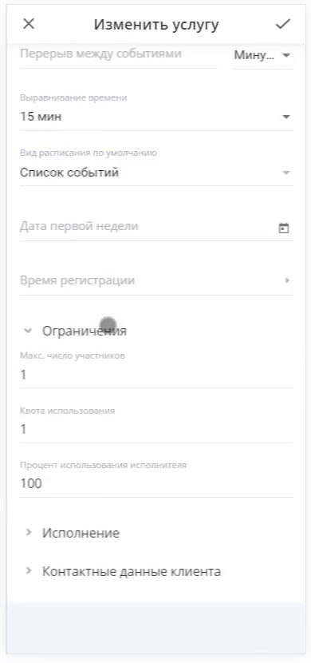
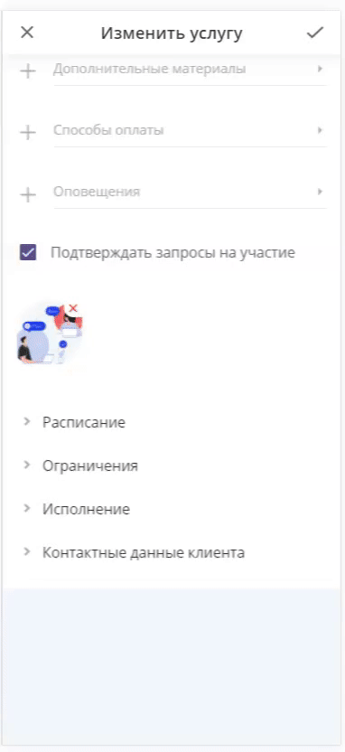
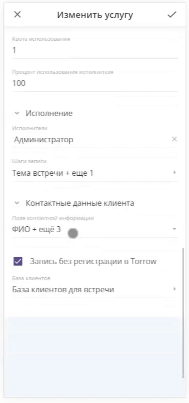
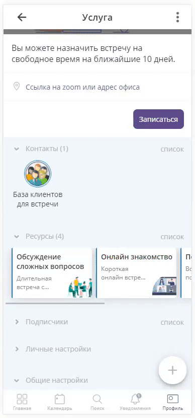
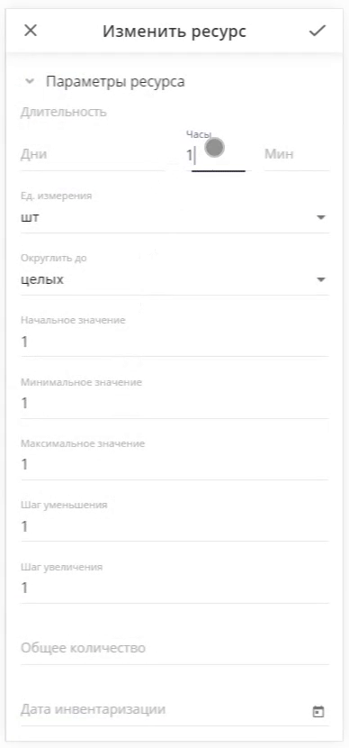
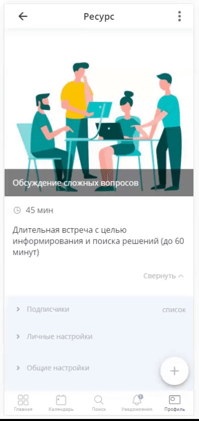

==================================
Настройка услуги "Записаться на встречу"
==================================

   .. |плюс| image:: media/plus.png
      :width: 21
      :alt: alternative text
   .. |контакт| image:: media/contact.png
      :width: 21
      :alt: alternative text
   .. |точка| image:: media/tochka.png
      :width: 21
      :alt: alternative text
   .. |элементы| image:: media/reserved.png
      :width: 21
      :alt: alternative text
   .. |галка| image:: media/galka.png
      :width: 21
      :alt: alternative text
   .. |визитка| image:: media/profile.png
      :width: 21
      :alt: alternative text
   .. |меню| image:: media/reserved.png
      :width: 21
      :alt: alternative text

Нажмите на |визитка| в нижнем правом углу, выберите **Публичную визитку**.

.. figure:: media/gif/overview2.gif
    :scale: 60 %
    :alt: alternate text
    :align: center  

--------------------

Так выглядит процесс **Записи на встречу** с Вами

.. figure:: media/gif/zapis.gif
    :scale: 60 %
    :alt: alternate text
    :align: center

Таким образом она будет отображаться в Вашем календаре

.. figure:: media/gif/reg_in_calendar.gif
    :scale: 60 %
    :alt: alternate text
    :align: center

--------------------

1. Для того, чтоб настроить **услугу** (:ref:`service-label`), как Вам удобно, нажмите на |точка| и выберите **Изменить**

2. Вы можете настроить **Расписание** под Ваше рабочее время.

3. Также можно изменить **Шаги записи** на встречу.

4. Установите **Исполнителя**, чтобы занятое время учитывалось в Вашем расписании

5. Измените **Контактные данные** на те, которые Вам необходимы. Можно добавить дополнительные поля или удалить лишние.
   

--------------------

1. Чтобы изменить имеющийся **ресурс** (:ref:`resources-label`), выберите нужный, нажмите на |точка| и **Изменить**.

2. Также можно настроить поля ресурсов. Например, продолжительность встречи.

--------------------

Чтобы **удалить** имеющийся ресурс, выберите нужный, нажмите на |точка| и **Удалить**. Не выбирая дополнительных настроек, нажмите на корзину.

--------------------

Чтобы **добавить новый** ресурс, нажмите на |плюс|, потом на |меню| и выбираем **Создать ресурс**.

.. figure:: media/gif/add_resource.gif
    :scale: 60 %
    :alt: alternate text
    :align: center