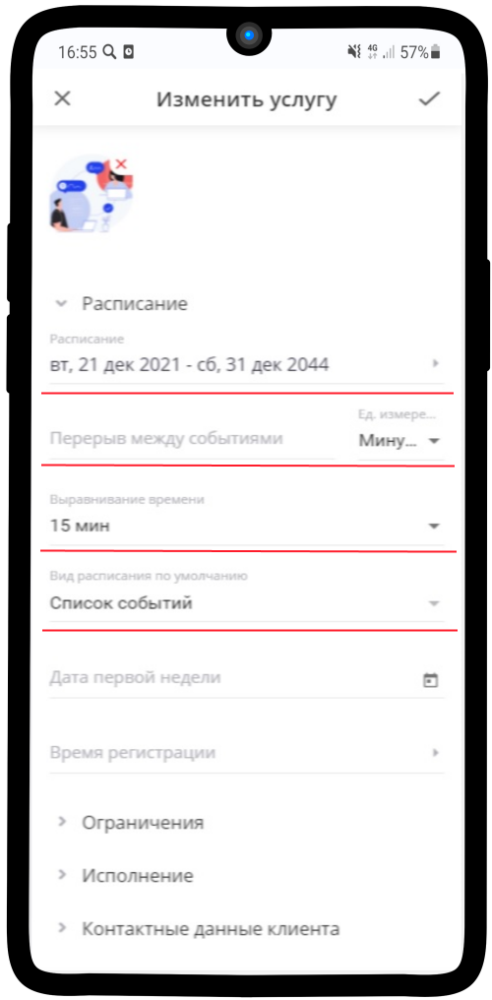
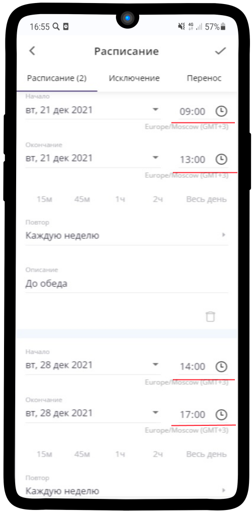

==================================
Настройка услуги "Записаться на встречу"
==================================

   .. |плюс| image:: media/plus.png
      :width: 21
      :alt: alternative text
   .. |контакт| image:: media/contact.png
      :width: 21
      :alt: alternative text
   .. |точка| image:: media/tochka.png
      :width: 21
      :alt: alternative text
   .. |элементы| image:: media/reserved.png
      :width: 21
      :alt: alternative text
   .. |галка| image:: media/galka.png
      :width: 21
      :alt: alternative text
   .. |визитка| image:: media/profile.png
      :width: 21
      :alt: alternative text
   .. |меню| image:: media/reserved.png
      :width: 21
      :alt: alternative text

Так выглядит процесс **Записи на встречу** с Вами

--------------------

Таким образом она будет отображаться в Вашем **календаре**

--------------------

1. Для того, чтоб настроить **услугу** (:ref:`service-label`), как Вам удобно, нажмите на |точка| и выберите **Изменить**

--------------------

2. Вы можете настроить **Расписание** под Ваше рабочее время. Добавить **перерывы между событиями**. Установить **Выравнивание времени** и **Вид расписания по умолчанию**.

--------------------

3. Установите Ваши рабочие часы в  **Расписании**. Установленные промежутки времени можно откорректировать 

--------------------

4. Лишние промежутки времени можно **удалить**, нажав на корзину.

--------------------

5. Также можно установить параметры **Повтора**: в какие дни к Вам можно записаться на встречу. Для разных промежутков можно задать индивидуальный повтор.

--------------------

--------------------

6. При необходимости измените **Шаги записи** на встречу.

.. figure:: media/gif/editt_steps.png
    :scale: 53 %
    :alt: alternate text
    :align: center

--------------------

7. Удалите лишний **Шаг записи** на встречу.

--------------------

8. Или добавьте необходимый **Шаг записи** на встречу.

--------------------

9. Также **Шаги записи** можете менять местами - выстраивать порядок записи.

--------------------

10. Установите **Исполнителя**, чтобы занятое время учитывалось в Вашем расписании

--------------------

11. Измените **Контактные данные** на те, которые Вам необходимы.
   

--------------------

12. Добавьте дополнительные поля или удалите лишние. Сделайте обязательными, поставив галочку.
   

После всех необходимых настроек нажмите на |галка| и изменения сохранятся.

--------------------

1. Чтобы изменить имеющийся **ресурс** (:ref:`resources-label`), выберите нужный, нажмите на |точка| и **Изменить**.

--------------------

2. Настройте поля ресурсов. Например, продолжительность встречи.

--------------------

3. Чтобы **удалить** имеющийся ресурс, выберите нужный, нажмите на |точка| и **Удалить**. Не выбирая дополнительных настроек, нажмите на корзину.

--------------------

4. Чтобы **добавить новый** ресурс, нажмите на |плюс|, потом на |меню| и выбираем **Создать ресурс**.

.. figure:: media/gif/add_resource.gif
    :scale: 70 %
    :alt: alternate text
    :align: center

5. Какой-то текст.

.. container:: row 
    
    .. container:: column-3
        
        .. figure:: media/gif/delete_resource.png
            :scale: 30 %
            :alt: alternate text
            :align: center

            Шаг №1
    
    .. container:: column-3
        
        .. figure:: media/gif/delete_resource.png
            :scale: 30 %
            :alt: alternate text
            :align: center

            Шаг №1
    
    .. container:: column-3
        
        .. figure:: media/gif/delete_resource.png
            :scale: 30 %
            :alt: alternate text
            :align: center

            Шаг №1

1. Чтобы **добавить новый** ресурс, нажмите на |плюс| в правом нижнем углу, потом на |меню| и выбираем **Создать ресурс**.
