==================================
Фотостудия
==================================

В данном кейсе рассмотрен пример оформления для Фотостудии и Записи на съемку.

-------------------------------
Создание профиля
-------------------------------

**Регистрация в Torrow**

Для начала работы с **Torrow** зарегистрируйтесь (:ref:`registration-label`) и заполните **Визитку** (:ref:`buisnesscard-label`)

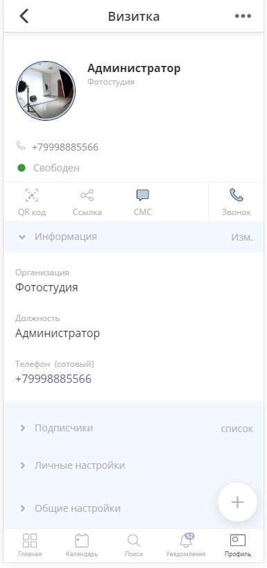

**Создание Раздела**

   .. |плюс| image:: media/plus.png
      :width: 21
      :alt: alternative text
   .. |контакт| image:: media/contact.png
      :width: 21
      :alt: alternative text
   .. |точка| image:: media/tochka.png
      :width: 21
      :alt: alternative text
   .. |элементы| image:: media/reserved.png
      :width: 21
      :alt: alternative text
   .. |галка| image:: media/galka.png
      :width: 21
      :alt: alternative text

1. Нажмите на |точка| в верхнем правом углу и выберите пункт **Добавить раздел**.

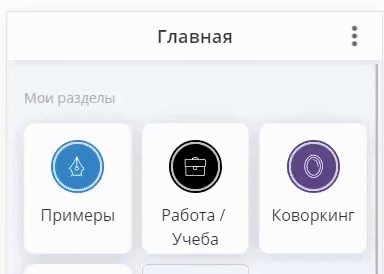

2. Назовите раздел, как Вам удобно и выберите подходящую иконку. Для завершения нажмите |галка|.

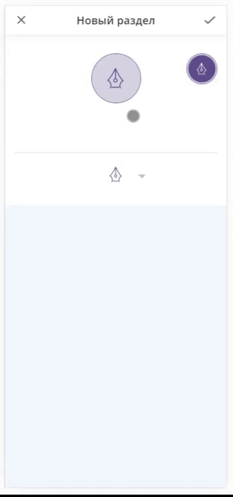

--------------------

**Создание Контакта** 

1. Войдите в созданный Вами раздел, нажмите |плюс| и выберите иконку |контакт| (:ref:`contact-label`).
Заполните **Контакт** от лица Компании. 
Настройте **тип доступности** контакта, подходящим Вам способом. Рекомендуем, установить "по ссылке". Настройте **внешний вид** контакта.

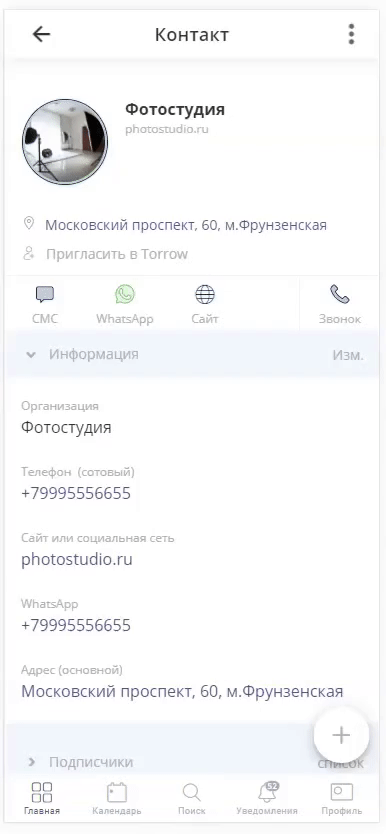
         
2. Добавьте **Уникальное имя** Вашему контакту

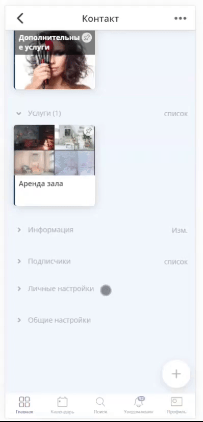

3. Вернитесь в раздел и создайте **Контакт** "База контактов" для хранения данных о клиентах
      
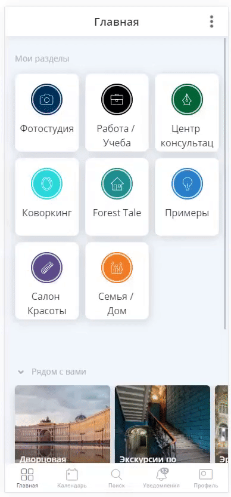

--------------------

-------------------------------------
Аренда студии
-------------------------------------

**Создание Услуги** 

1. Откройте **Контакт** и создайте **Услугу** (:ref:`service-label`). Установите **Тип услуги** - **Аренда**
   
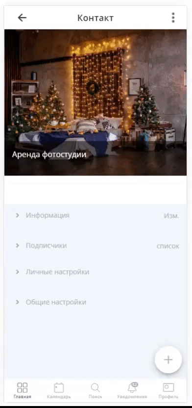
    
2. Заполните **Место** и **Описание**, загрузите фотографию.
Установите **Расписание** услуги. Выберите **Вид расписания по умолчанию** услуги. Определите **Время регистрации** на услугу
   
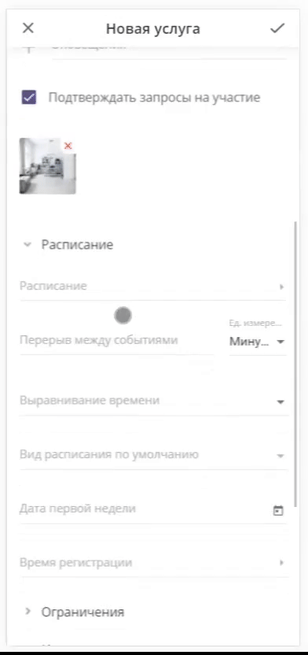
      
3. Установите необходимые **Контактные данные**, которые Вы хотите получить от пользователя при записи.
**Шаги записи**, **Ограничения** оставьте без изменений.
       
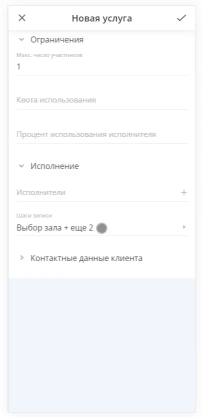
         
4. Настройте **внешний вид** Вашей услуги, **Тип доступности** и **Уникальное имя**
          
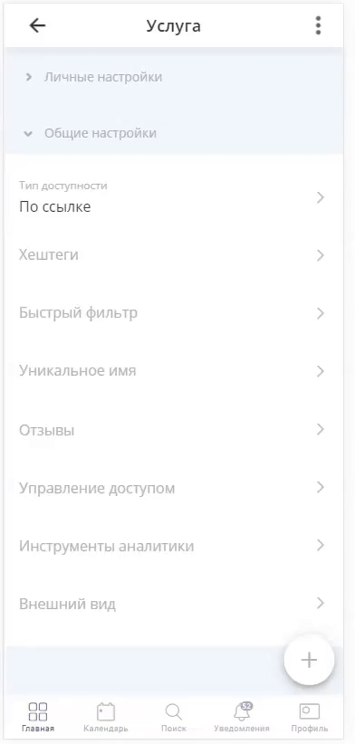

5. **Прикрепите** услугу к Контакту, чтобы она была видна Вашим клиентам (нажмите и долго удерживайте элемент).
       
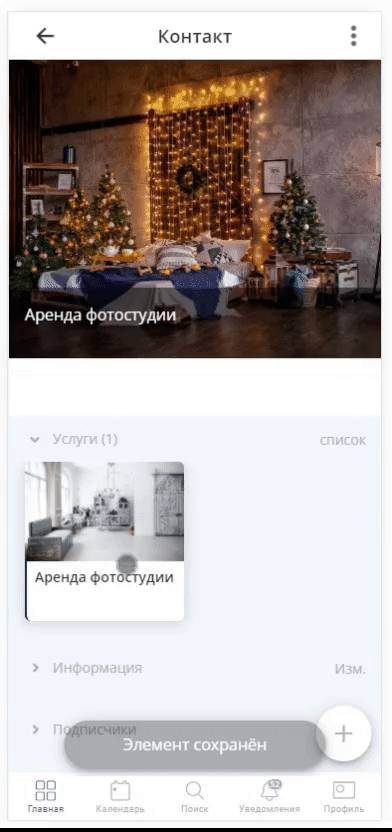

Теперь Вашу фотостудию можно арендовать

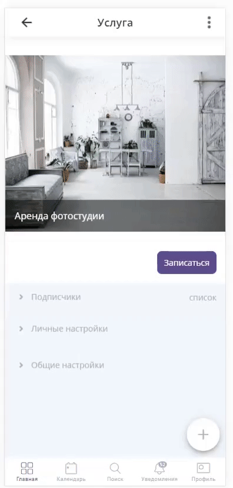

--------------------

-------------------------------------
Аренда зала
-------------------------------------

**Создание Услуги** 

1. Откройте **Контакт** и создайте **Услугу** (:ref:`service-label`). Установите **Тип услуги** - **Аренда**
   
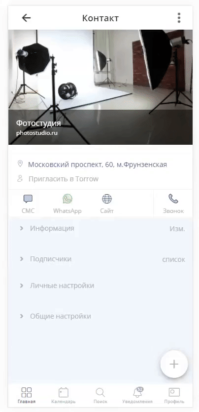
    
2. Заполните **Место** и **Описание**, загрузите фотографию.
      
3. Установите **Расписание** услуги. Выберите **Вид расписания по умолчанию** услуги. Определите **Время регистрации** на услугу
   
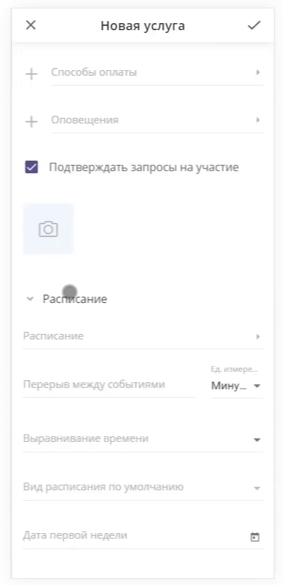
      
4. Установите **Ограничения** и **Шаги записи**. Шаг 1 - "Выбор зала", тип использования - Аренда. Шаг 2 - "Дополнительные услуги", тип использования - Спецификация. Если у Вас нет дополнительных услуг, то этот шаг пропустите. Установите минимальное количество - 0. Отметьте "Выбор ресурсов без просмотра". Шаг 3 - "Выбор времени", тип использования - Дата и время. Поле "Длительность по умолчанию" оставьте пустым.
       
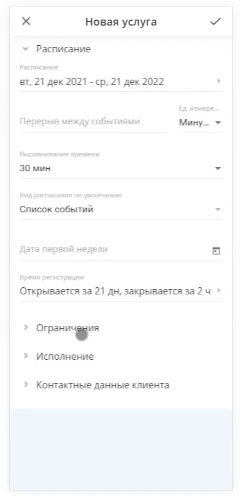
         
5. Установите необходимые **Контактные данные**, которые Вы хотите получить от пользователя при записи
      

6. Настройте **внешний вид** Вашей услуги.
          
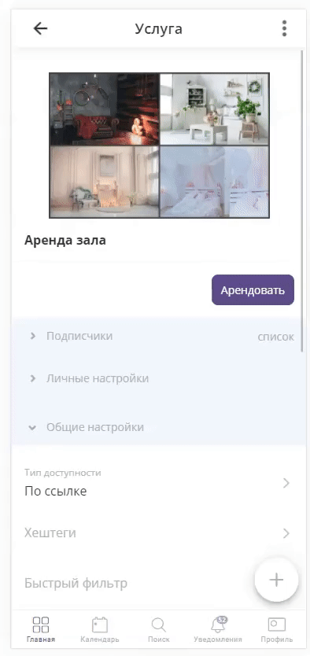

7. **Прикрепите** услугу к Контакту, чтобы она была видна Вашим клиентам (нажмите и долго удерживайте элемент).
       
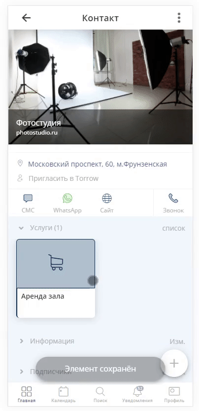

--------------------

**Добавление Ресурса**
      

1. Откройте **Услугу** и создайте **Ресурс** (:ref:`resources-label`). Установите **Тип ресурса** - **Аренда**.
Заполните **Описание** ресурса

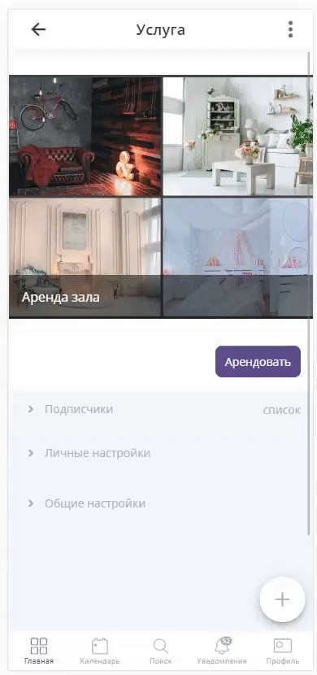

2. Установите **Расписание** ресурса

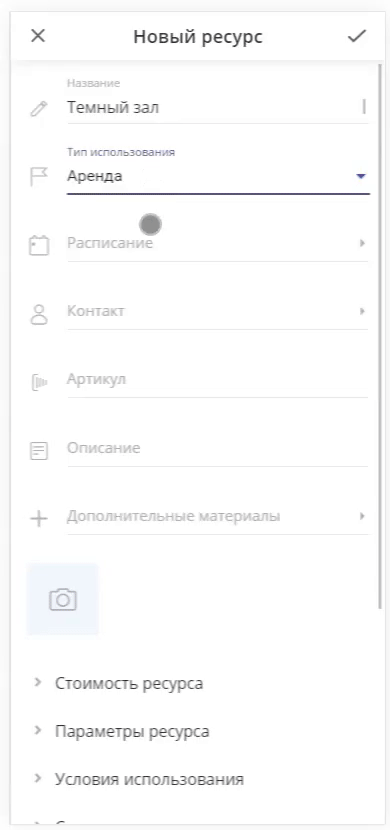
       
3. Укажите **Стоимость** и **Параметры** ресурса
      
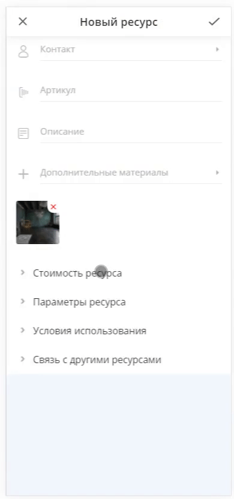
       
4. Выберите **Условия использования** ресурса  
   
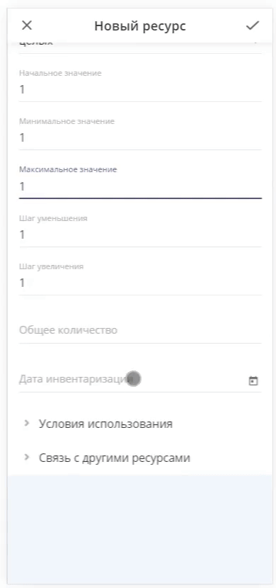

--------------------------

-------------------------------------------------------------------
Дополнительные услуги
------------------------------------------------------------------- 

Если есть Дополнительные услуги или позже они появятся, то можно добавить их в уже созданные **Услуги**.
Создайте отдельную **Заметку** и добавьте необходимые **Ресурсы**.

1. Создайте **Заметку**
   
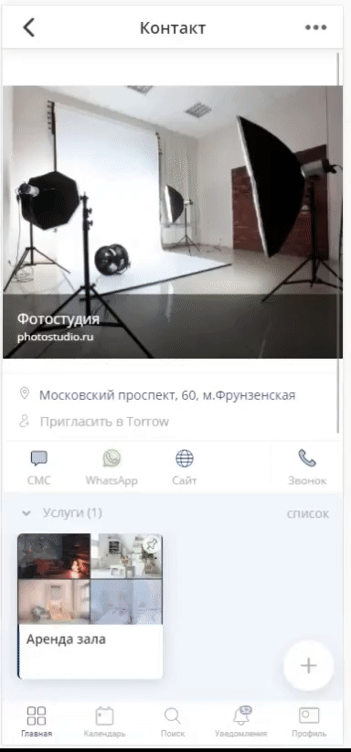

2. Откройте **Заметку** и создайте **Ресурс**. Установите **Тип ресурса** - Спецификация.
   
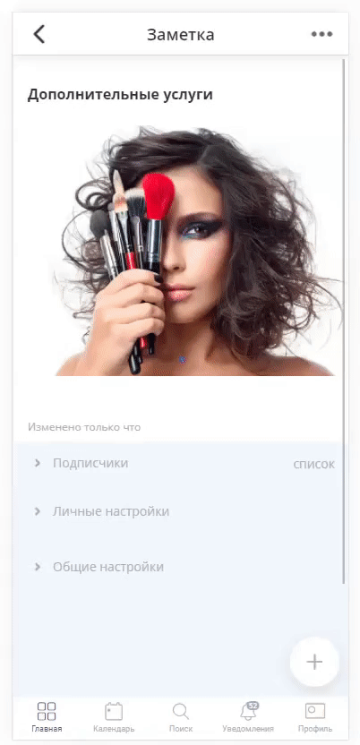

3. Установите **Параметры** ресурса.
   
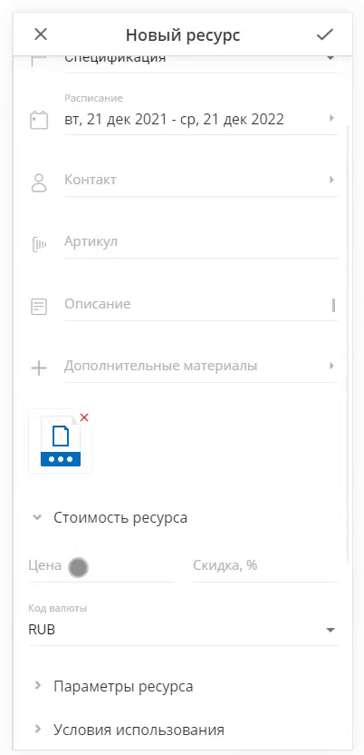
     
4. Заполните **Описание** ресурса, загрузите фотографию.

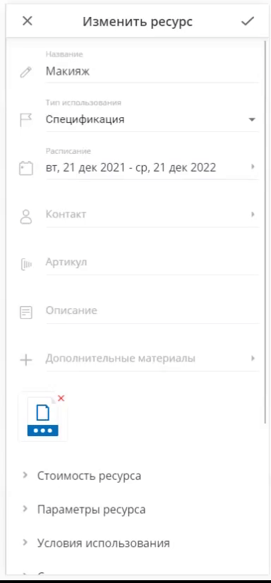
         
5. Выберите **Условия использования** ресурса - также прикрепите к каждому Ресурсу и Услуге, где могут использоваться Дополнительные услуги.
   
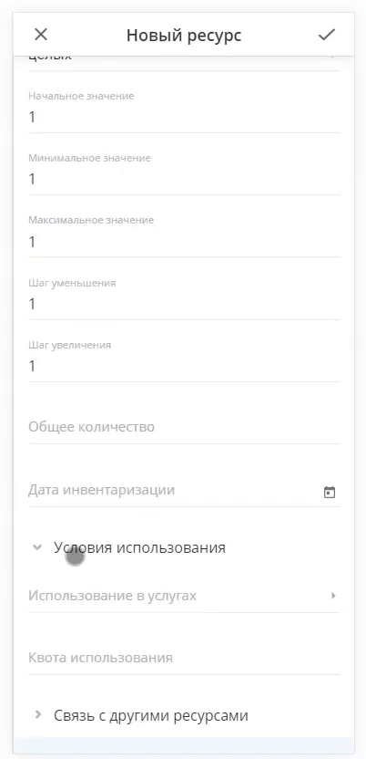

**Ресурсы залов** можно закрепить, тогда они будут доступны для ознакомления.

Для более удобного хранения **Ресурсов** создайте **Заметки**. Внутри **Заметки** также можно создавать другие **Заметки** с разными темами и объявлениями, а также **Контакты**, **События** и другие **Элементы Torrow**.

Готовый **Контакт** будет выглядеть так:

.. figure:: media/gif/profile.gif
    :scale: 60 %
    :alt: alternative text
    :align: center

Аренда зала:

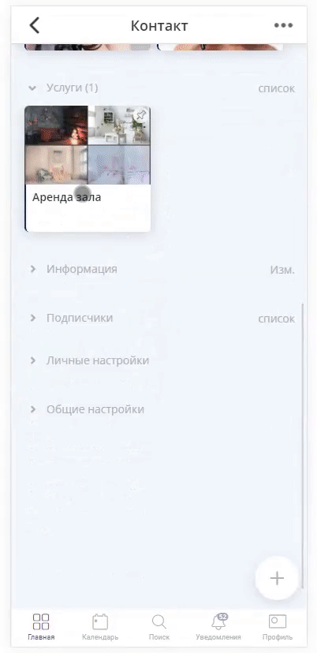

----------------------

-------------------------------------
Запись на фотосъемку
-------------------------------------

**Создание Услуги** 

1. Откройте **Контакт** и создайте **Услугу** (:ref:`service-label`). Установите **Тип услуги** - **Запись на время**
   
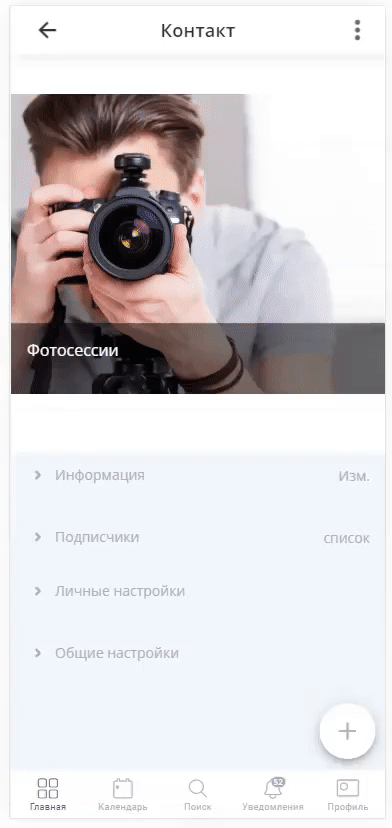
    
2. Заполните **Место** и **Описание**, загрузите фотографию.
      
3. Установите **Расписание** услуги. Выберите **Вид расписания по умолчанию** услуги. Определите **Время регистрации** на услугу
   
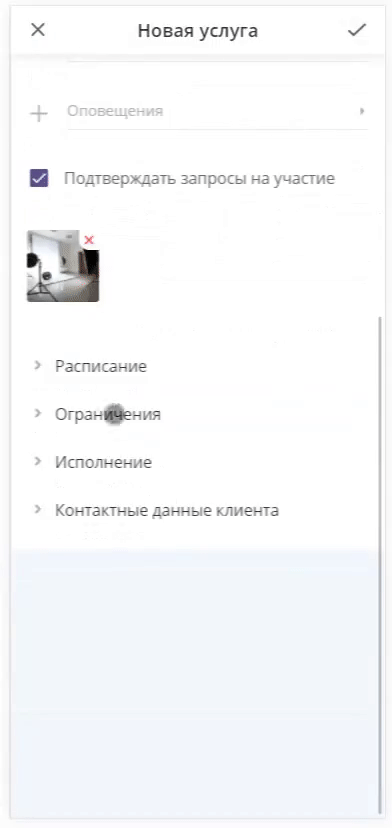
      
4. Установите **Ограничения**: квота - 1 и **Шаги записи**. Шаг 1 - "Выберите фотосессию", тип использования - Спецификация. Шаг 2 - "Дополнительные услуги", тип использования - Спецификация. Если у Вас нет дополнительных услуг, то этот шаг пропустите. Установите минимальное количество - 0. Отметьте "Выбор ресурсов без просмотра". Шаг 3 - "Выбор времени", тип использования - Дата и время. Поле "Длительность по умолчанию" оставьте пустым.
       
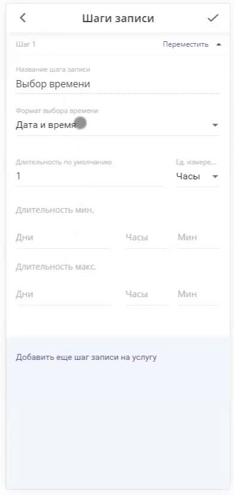
         
5. Установите необходимые **Контактные данные**, которые Вы хотите получить от пользователя при записи
      
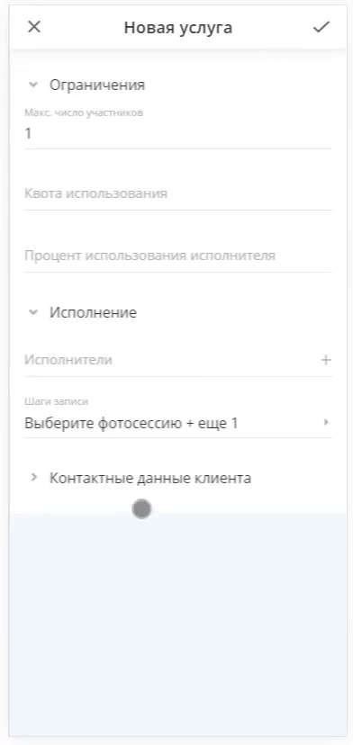

6. Настройте **внешний вид** Вашей услуги.
**Прикрепите** услугу к Контакту, чтобы она была видна Вашим клиентам (нажмите и долго удерживайте элемент).
       
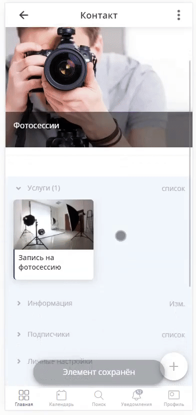

--------------------

**Добавление Ресурса**
      

1. Откройте **Услугу** и создайте **Ресурс** (:ref:`resources-label`). Установите **Тип ресурса** - **Аренда**.
Заполните **Описание** ресурса

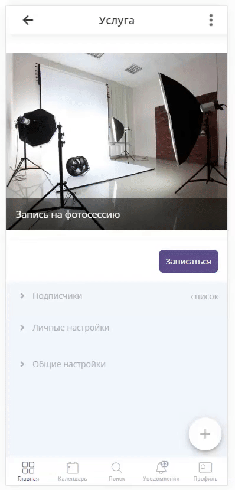

2. Установите **Расписание** ресурса

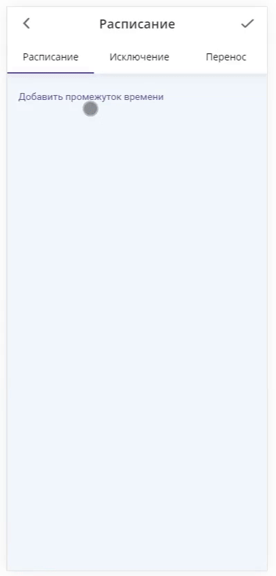
       
3. Укажите **Стоимость** и **Параметры** ресурса
      
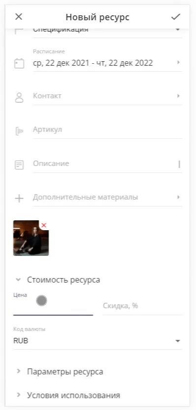
       
4. Выберите **Условия использования** ресурса  
   
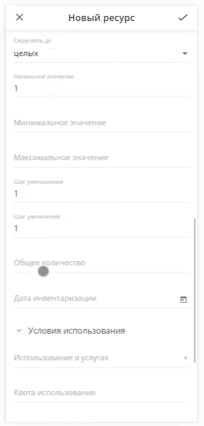

Теперь к Вам можно записаться на фотосессию:

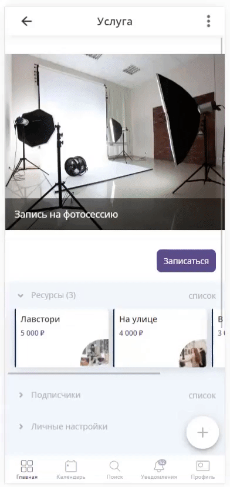