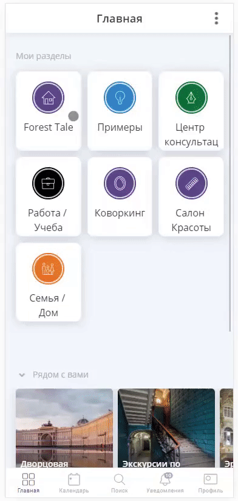
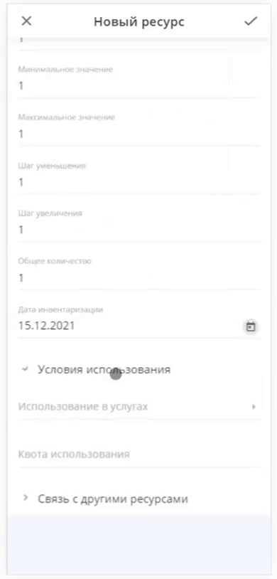

=========
Аренда
=========

Вы можете воспользоваться готовым шаблоном **Почасовой аренды объекта** и настроить его под свой бизнес:

* `Посмотреть пример почасовой аренды <https://torrow.net/app/tabs/tab-search/contact;id=aae6103ea7c1e1a5ff915af00015951eb>`_

* `Воспользоваться готовым шаблоном <https://trrw.me/YBtHVndZSWtXig>`_

А также шаблоном **Посуточной аренды объекта** и настроить его под свой бизнес:

* `Посмотреть пример посуточной аренды <https://torrow.net/app/tabs/tab-search/contact;id=aae6103ea0a0e0486f915af0001595215>`_

* `Воспользоваться готовым шаблоном <https://trrw.me/YBswT1VMaGtDIw>`_

Ниже представлена инструкция для самостоятельной настройки услуги для **Базы отдыха**.

-----------------------------------------
Создание профиля
-----------------------------------------

**Регистрация в Torrow**

Для начала работы с **Torrow** зарегистрируйтесь (:ref:`registration-label`) и заполните **Визитку** (:ref:`buisnesscard-label`)

--------------------

**Создание Раздела**

   .. |плюс| image:: media/plus.png
      :width: 21
      :alt: alternative text
   .. |контакт| image:: media/contact.png
      :width: 21
      :alt: alternative text
   .. |точка| image:: media/tochka.png
      :width: 21
      :alt: alternative text
   .. |элементы| image:: media/reserved.png
      :width: 21
      :alt: alternative text
   .. |галка| image:: media/galka.png
      :width: 21
      :alt: alternative text

1. Нажмите на |точка| в верхнем правом углу и выберите пункт **Добавить раздел**.

.. figure:: media/gif/add_section.gif
    :scale: 60 %
    :alt: alternate text
    :align: center  

-----------------

2. Назовите раздел, как Вам удобно и выберите подходящую иконку. Для завершения нажмите |галка|.

-----------------

3. Прикрепите в **Личных настройках** нужную **Визитку**

--------------------

**Создание Контакта** 

1) Войдите в созданный Вами раздел, нажмите |плюс| и выберите иконку |контакт| (:ref:`contact-label`).
      
.. figure:: media/gif/create_contact.gif
    :scale: 60 %
    :alt: alternative text
    :align: center

-----------------

2) Заполните **Контакт** от лица Компании

-----------------

3) Настройте **тип доступности** контакта, подходящим Вам способом.
         

-----------------

4) Настройте **внешний вид** Вашего аккаунта.
          

-----------------

5) Добавьте **Уникальное имя** Вашему контакту

-----------------

6) Вернитесь в раздел и создайте **Контакт** "База контактов" для хранения данных о клиентах
      

--------------------

**Добавление Услуг** 

Для почасовой и суточной **Аренды** необходимо создать две разные **Услуги** (:ref:`service-label`).

------------------------------------------------------------
Почасовая аренда
------------------------------------------------------------

1. Откройте **Контакт** и создайте **Услугу**. 
Запишите **Название** услуги и установите **Тип услуги** - Аренда
   

-----------------

2) Установите **Время регистрации** и **Вид расписания по умолчанию**
   

-----------------

3) Задайте необходимые **Шаги записи**: Выбор времени (Дата и время), Аренда домов почасовая (аренда), Выберите дом (аренда). Порядок отображения шага можно изменить, переместив его вверх или вниз. Также можно отметить "Выбор ресурсов без просмотра", если нет необходимости просматривать подробное описание.
   **Ограничения** оставьте без изменений.
       

-----------------

4) Установите **Контактные данные**, которые Вы хотите получить от пользователя при записи
      

-----------------

5) Настройте **внешний вид** Вашей услуги.
          

-----------------

6) **Прикрепите** услугу к Контакту, чтобы она была видна Вашим клиентам (нажмите и долго удерживайте элемент).
       

--------------------

Создание **Заметки** 

1) В созданном Вами **Контакте** нажмите |плюс| и добавьте **заметку** (:ref:`zametka-label`).
      

-----------------

2) Назовите **Заметку** и загрузите обложку, измените размер обложки и заполните необходимую информацию
   

Прикрепите Заметку к Контакту.

--------------------

Создание **Ресурсов** для Почасовой оплаты в **Будние дни**.

1) Откройте **Заметку** и создайте **Ресурс**. Установите **Тип ресурса** - Аренда
   

-----------------

2) Заполните **Расписание**. Для выбора определенных дней недели в пункте "Повтор" нажмите "Каждую неделю" и отметьте необходимые. 
      
.. figure:: media/gif/set_budnihourtime.gif
    :scale: 60 %
    :alt: alternative text
    :align: center

-----------------

3) Установите **Параметры** ресурса: длительность - 1 час, стоимость одного часа.
   

-----------------

4) Заполните **Описание** ресурса, загрузите изображение.
         
5) Выберите **Условия использования** ресурса - отметьте услугу, в которой используется ресурс, и шаг, на котором он отображается. Установите **Связь с другими ресурсами** - **Дополняет** и выберите **Ресурсы**, в которых используется данный тип аренды.
   

--------------------

Создание **Ресурсов** для Почасовой оплаты в **Выходние дни**.

1) Откройте **Заметку** и создайте внутри нее **Ресурс**. Установите **Тип ресурса** - Аренда.
   

-----------------

2) Заполните **Расписание**. Для выбора определенных дней недели в пункте "Повтор" нажмите "Каждую неделю" и отметьте необходимые.
      

-----------------

3) Установите **Параметры** ресурса: длительность - 1 час, стоимость одного часа.
   

-----------------

4) Заполните **Описание** ресурса, загрузите фотографию.
         
5) Выберите **Условия использования** ресурса - отметьте услугу, в которой используется ресурс, и шаг, на котором он отображается. Установите **Связь с другими ресурсами** - **Дополняет** и выберите **Ресурсы**, в которых используется данный тип аренды.
   

--------------------

------------------------------------------------------------
Посуточная аренда
------------------------------------------------------------

1. Откройте **Контакт** и создайте внутри него **Услугу**. 
Запишите **Название** услуги и установите **Тип услуги** - Аренда
   

-----------------

2) Установите **Время регистрации** и **Вид расписания по умолчанию** услуги.
   

-----------------

3) Измените **Ограничения**
   

-----------------

4) Установите необходимые **Шаги записи**: Выбор времени (Дата), Выберите дом (аренда), Выбор пакета (аренда). Порядок отображения шага можно изменить, переместив его вверх или вниз. Также можно отметить "Выбор ресурсов без просмотра", если нет необходимости просматривать подробное описание. 
       

-----------------

5) Установите необходимые **Контактные данные**, которые Вы хотите получить от пользователя при записи
      

Аналогично **Почасовой аренде** прикрепите **Услугу** и настройте **внешний вид**.

--------------------

Создайте **Заметку** для посуточной Аренды.

1) Откройте **Заметку** и создайте **Ресурс**. Установите **Тип ресурса** - Аренда.
   

-----------------

2) Установите **Параметры** ресурса: длительность аренды (минимальная) и стоимость
   

-----------------

3) Заполните **Описание** ресурса, загрузите фотографию.
         
4) Выберите **Условия использования** - отметьте услугу, в которой используется ресурс, и шаг, на котором он отображается. Установите **Связь с другими ресурсами** - **Дополняет** и выберите **Ресурсы**, в которых используется данный тип аренды. 
   

--------------------

-------------------------------------------------------------------
Создание Домов
-------------------------------------------------------------------      

В роли **Ресурсов** будут выступать Дома, которые сдаются в Аренду. 

1) Откройте **Услугу** и создайте **Ресурс** (:ref:`resources-label`). Установите **Тип ресурса** - Аренда.
   

-----------------

2) Впишите **Название** дома.
      

-----------------

3) Установите **Параметры** ресурса.
   

-----------------

4) Заполните **Описание** ресурса, загрузите фотографию.
         
5) Выберите **Условия использования** ресурса. Если **Ресурс** используется в нескольких **Услугах**, то необходимо указать условие для каждой.  
   

-----------------

**Ресурсы домов** можно закрепить, тогда они будут доступны для ознакомления.

Для более удобного хранения **Ресурсов** создайте **Заметки**. Внутри **Заметки** также можно создавать другие **Заметки** с разными темами и объявлениями, а также **Контакты**, **События** и другие **Элементы Torrow**.

--------------------

-------------------------------------------------------------------
Дополнительные услуги
------------------------------------------------------------------- 

Если есть Дополнительные услуги (Уборка комнат, Завтраки, Аренда лодок и т.д.) или позже они появятся, то можно добавить их в уже созданные **Услуги**.
Создайте отдельную **Заметку** и добавьте необходимые **Ресурсы**.

1) Добавьте в исходной **Услуге** дополнительный Шаг с **Типом использования** - **Спецификация**. Установите минимальное значение 0, а максимальное - по количеству Дополнительных услуг. Переместите Этот шаг выше.

-----------------

2) Откройте **Заметку** и создайте **Ресурс**. Установите **Тип ресурса** - Спецификация.
   

-----------------

3) Установите **Параметры** ресурса.
   

-----------------
    
4) Заполните **Описание** ресурса, загрузите фотографию.
         
5) Выберите **Условия использования** ресурса - также прикрепите к каждому Ресурсу и Услуге, где могут использоваться Дополнительные услуги.
   

--------------------

Готовый **Контакт** будет выглядеть так:

.. figure:: media/gif/final.gif
    :scale: 60 %
    :alt: alternative text
    :align: center

--------------------

Оформление Аренды на сутки:

--------------------

Оформление Аренды на несколько часов:

