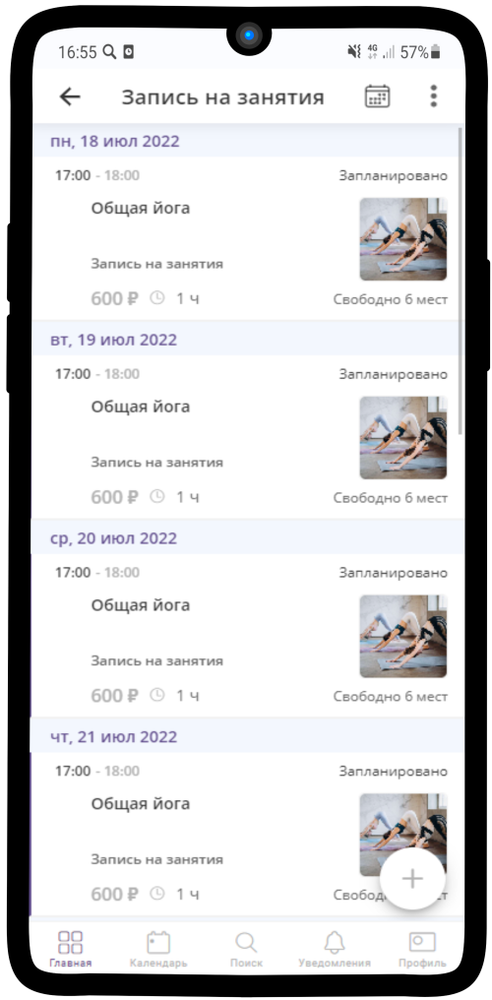

====================
Фитнес занятия
====================

Вы можете воспользоваться готовым шаблоном и настроить его под свой бизнес:

* `Посмотреть пример <https://torrow.net/app/tabs/tab-search/contact;id=aae6103ea00000066fd034b0001963f9c>`_

* `Воспользоваться готовым шаблоном <https://torrow.net?importTemplateUniqueName=запись_групповая&importingMessage=Идёт%20загрузка%20шаблона&contextName=Работа%20%2F%20Учеба&contextIcon=work&importMessage=Шаблон%20успешно%20загружен%20в%20раздел%20%22Работа%22&importMessageHeader=Запись%20на%20групповые%20занятия&importWithoutRoot=false&showOnboarding=false&utm_content=yoga>`_

Ниже представлена инструкция для самостоятельной настройки услуги.

В данном кейсе рассмотрен пример оформления для **Записи на регулярные групповые занятия**.

---------------------------------
Создание профиля
---------------------------------

**Регистрация в Torrow**

Для начала работы с **Torrow** пройдите регистрацию (:ref:`registration-label`) и заполните **Визитку** (:ref:`buisnesscard-label`)

.. |галка| image:: media/galka.png
      :width: 21
      :alt: alternative text

.. |меню| image:: media/reserved.png
      :width: 21
      :alt: alternative text
-------------------------

**Создание Раздела**

1. Нажмите на |точка| в верхнем правом углу и выберите пункт **Добавить раздел**.

   
--------------------

   
--------------------

2. Назовите раздел, как Вам удобно, выберите ранее созданную визитку и подходящую иконку. Для завершения нажмите **Сохранить**.

--------------------

.. figure:: media/png/yoga6.png
   :scale: 53 %
   :alt: alternate text
   :align: center

--------------------

Также Вы можете использовать уже созданные разделы

--------------------

**Создание Страницы для клиентов**

1) Для удобства работы и настройки сначала создадим Рабочий кабинет: войдите в созданный Вами раздел, нажмите |плюс|, потом на иконку заметки. 
      

--------------------
      

--------------------

2) Впишите название Кабинета и нажмите на |галка|, чтобы сохранить изменения

--------------------
          
3) В разделе создалась *Заметка* с введенным Вами названием
          

---------------------
    
4) Откройте заметку и создайте **Контакт** "База клиентов" для хранения данных о клиентах. Нажмите |плюс|, потом на |меню|  и выберите иконку |контакт| (:ref:`contact-label`)
      

---------------------

    

---------------------    

5) Впишите понятное для Вас название Базы клиентов и нажмите на |галка| для сохранения изменений.
      

---------------------  

6) **База клиентов** готова. О том, как работать с БК, можно подробнее почитать `здесь <https://torrownet.readthedocs.io/ru/latest/faq/contact_base.html>`_
      

---------------------  

7) Настроим поиск внутри Базы клиентов. Откройте **Общие настройки**
      

---------------------    

8) Выберите раздел **Управление доступом**
      
.. figure::  media/png/yoga16.png
   :scale: 53 %
   :alt: alternative text
   :align: center

---------------------    

9) В пункте **Могут искать прикрепленные элементы** отметьте **владельцы и менеджеры**
      

---------------------

    
10) Поиск настроен
      
.. figure::  media/png/yoga18.png
   :scale: 53 %
   :alt: alternative text
   :align: center

---------------------

11) Теперь создадим страничку, которая будет видна Вашим клиентам. Нажмите |плюс|, потом на |меню|  и выберите иконку |контакт|

---------------------

    

--------------------- 

12) Заполните основную информацию, укажите контактные телефоны, адрес, ссылки на соц. сети, загрузите картинку. Для сохранения изменений нажмите на |галка|
      

---------------------
    
13) Откройте созданный контакт и **Общие настройки**
      

---------------------
    
14) Перейдите в раздел **Внешний вид**
      

---------------------
    
15)  Выберите подходящий размер Обложки. Рекомендуем выбирать *Большой баннер*
      

---------------------

      

---------------------

--------------------------------------------------------------------
Создание Услуги
--------------------------------------------------------------------

1) Откройте **Заметку-кабинет**, нажмите |плюс| в правом нижнем углу, потом на |меню| и выберите **Создать услугу** (:ref:`service-label`).
   

---------------------

---------------------

2) Установите **Тип услуги** - Запись на сеанс. Заполните поля **Название**, **Описание**. Загрузите Фотографию.

---------------------

3) Заполните **Расписание** услуги. Настройте поля **Выравнивание времени**, **Вид расписания по умолчанию**.

.. figure:: media/png/yoga27.png
   :scale: 53 %
   :alt: alternative text
   :align: center

---------------------

4) Установите **Время регистрации**.

---------------------

5) Поле **Квота использования** оставьте пустым

---------------------

6) Также можно настроить **Контактные данные**, которые Вы будете получать от клиента при записи. Если хотите, чтобы на Вашу услугу могли записываться без регистрации в Torrow, установите галочку **Запись без регистрации в Torrow**. 
   

---------------------

7) Выберите необходимые **Контактные данные**, которые Вы хотите получить от пользователя при записи. Можно **добавить новое поле**, **удалить** существующее и отметить **обязательное поле**.

---------------------

---------------------
     

---------------------

8) Прикрепите контакт, в который будут сохраняться данные о Ваших клиентах. Выберите созданную ранее Базу клиентов

---------------------
       

-------------------

-------------------

9) Нажмите на |галка| для сохранения

-------------------

**Создание Событий**

1) Откройте созданную услугу и нажмите на **Расписание**.
   

----------------------

2) В открытой услуге нажмите на |плюс| для создания **События** (:ref:`event-label`) - каждое событие будет представлять собой занятие. Основные настройки передадутся из услуги (Время регистрации, Контактные данные)

----------------------

3) По умолчанию события создаются **Разовыми**. 

----------------------

4) В нашем примере Занятия повторяются в определенные дни в определенное время, поэтому Тип события - **Повторяющееся** и отметим **Создавать штучное событие**

----------------------

5) Заполните **Расписание**: установите время, в которое проводится занятие

----------------------

6) Если оно повторяется, то выберите тип повтора

----------------------

7) Отметьте дни для повтора и дату, до какого числа повторять (н-р, год)

----------------------

8) Заполните расписание по дням недели для данного типа занятий

----------------------

9) Укажите максимальное количество участников

----------------------

1)  Добавьте `Доп. материалы <https://torrownet.readthedocs.io/ru/latest/service/add-materials-customization.html>`_ и `Способы оплаты <https://torrownet.readthedocs.io/ru/latest/resource/payment-resource.html>`_ при необходимости

----------------------

11) Укажите стоимость занятия. Проверьте Контактные данные и нажмите на |галка|

----------------------

12) Перезайдите в Расписание и увидите Занятия согласно указанному расписанию на ближайшие две недели

----------------------

----------------------

Ваша услуга готова! Можете `делиться ссылкой <https://torrownet.readthedocs.io/ru/latest/faq/share-element.html>`_, `размещать виджет <https://torrownet.readthedocs.io/ru/latest/widget/index.html>`_ на сайте или `мини-приложение Вконтакте <https://torrownet.readthedocs.io/ru/latest/integration/vk-widget.html>`_

----------------------------------------------------------------
Оформление профиля
----------------------------------------------------------------

Для оформления страницы для клиентов перейдите в ранее созданный контакт

1) Нажмите на |плюс| в правом нижнем углу

.. figure:: media/png/yoga51.png
   :scale: 53 %
   :alt: alternative text
   :align: center

----------------------

2) Откройте меню |меню|

----------------------

3) Выберите созданную услугу

----------------------

4) Нажмите на **Вложить**

----------------------

5) Услуга добавлена на страницу, но значок зачеркнутого глаза означает, что она видна только Вам
   

----------------------

6) Нажмите правой кнопкой мыши или долгим нажатием по услуге и в выпадающем меню выберите пункт **Прикрепление к элементам**

----------------------

7) Нажмите на |галка|

----------------------

Добавьте при необходимости **Заметки** (:ref:`zametka-label`) с рассказом о Вас, прикрепив фотографии

----------------------

.. raw:: html
   
   <torrow-widget
      id="torrow-widget"
      url="https://web.torrow.net/app/tabs/tab-search/service;id=103edf7f8c4affcce3a659502c23a?closeButtonHidden=true&tabBarHidden=true"
      modal="right"
      modal-active="false"
      show-widget-button="true"
      button-text="Заявка эксперту"
      modal-width="550px"
      button-style = "rectangle"
      button-size = "60"
      button-y = "top"
   ></torrow-widget>
   

.. raw:: html

   <!--  -->