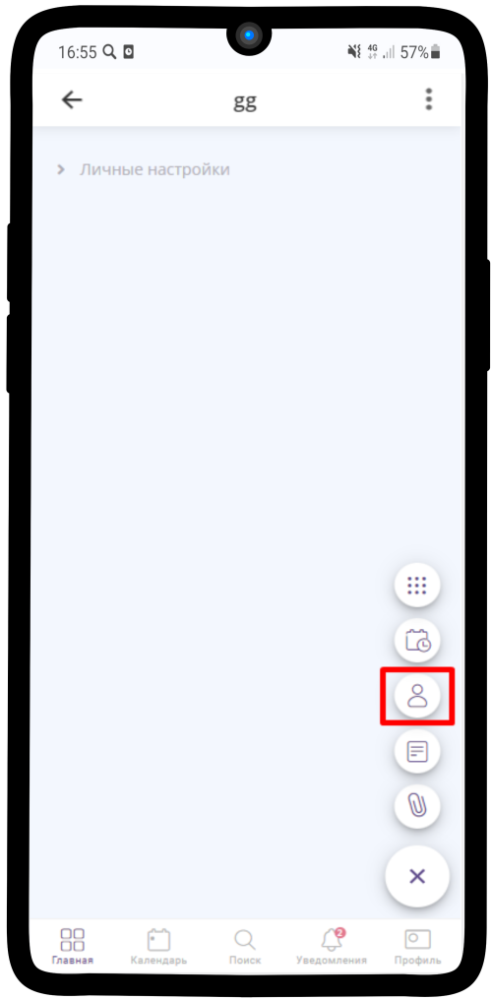
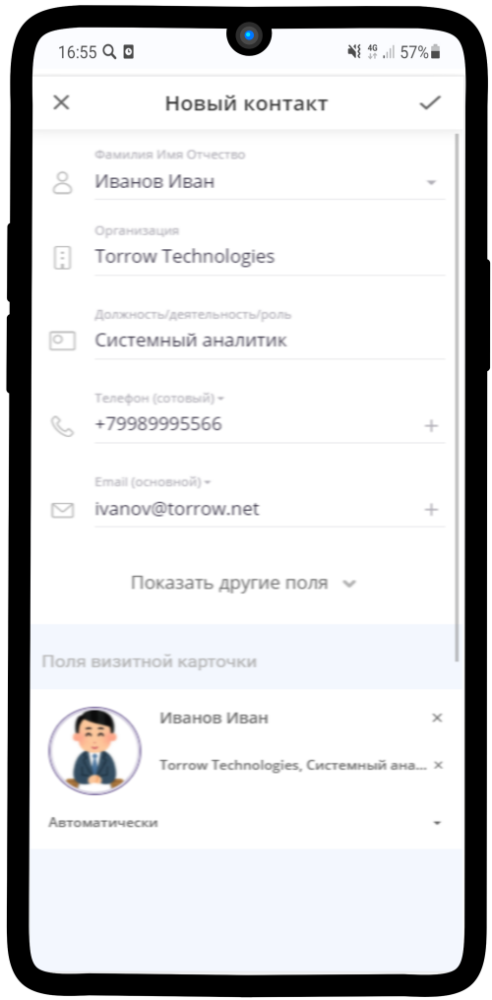
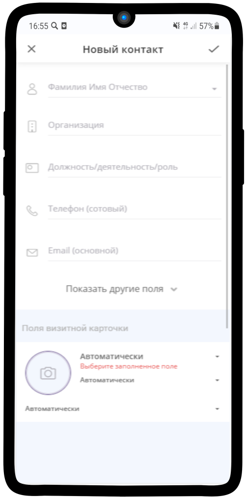
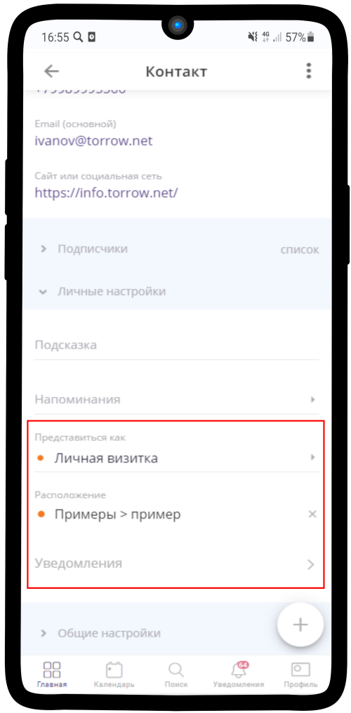
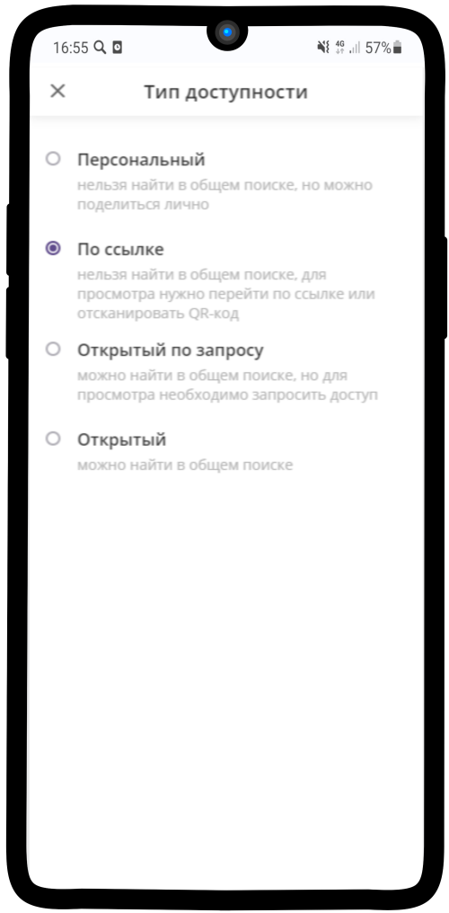
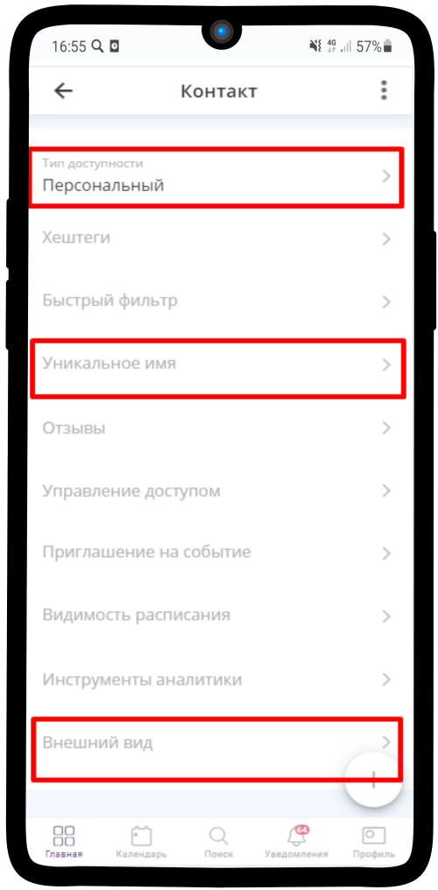
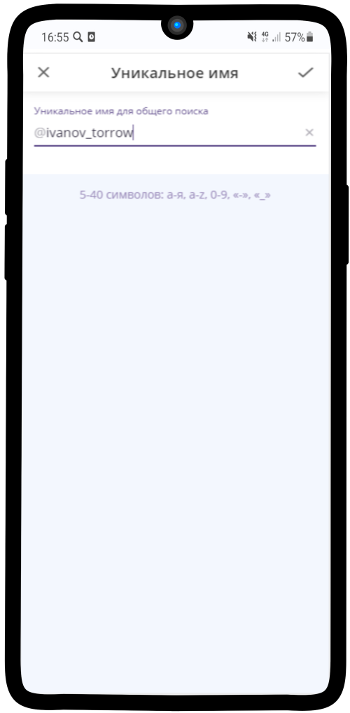
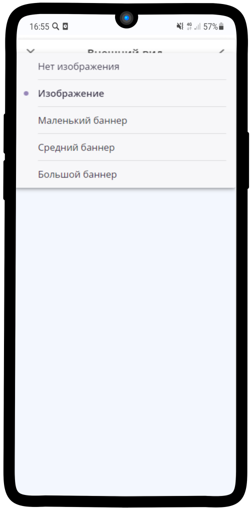

.. _contact-label:

=======
Контакт
=======

Все мы привыкли вести свои контакты в телефонной книге мобильного устройства и ограничивать доступную информацию о человеке ФИО и номером мобильного.

.. note:: В **Torrow** Вы сможете отойти от привычного формата хранения контактных данных и создать свою собственную **CRM-систему**. Функционал приложения практически ничем не ограничен, поэтому без какого-либо труда любой пользователь сможет завести контакт физ. или юр. лица, отметить геопозицию, задать уникальное имя, вести список событий, встреч, добавить заметки с информацией о контакте, указать ссылки на социальные сети, внести мессенджеры, а затем сгруппировать контакты по своему усмотрению.

Создание контакта
-----------------

   .. |плюс| image:: media/plus.png
      :width: 21
      :alt: alternative text
   .. |контакт| image:: media/contact.png
      :width: 21
      :alt: alternative text
   .. |галка| image:: media/galka.png
      :width: 21
      :alt: alternative text

1) Нажмите |плюс| и выберите иконку |контакт| (:ref:`contact-label`).
      

-----------------

2) Заполните **Контакт** и нажмите на |галка|

-----------------

3) Укажите **визитку**. Если вам не нужно, чтоб контакт был виден другим пользователям, то отключите тумблер **прикрепить**

-----------------

Настройка контакта
-----------------

1) Настройте **тип доступности** контакта, подходящим Вам способом. Рекомендуем, установить "по ссылке"
         

-----------------

-----------------

2) Настройте **Внешний вид** Вашего аккаунта, так он будет более привлекательным
          

-----------------

3) Добавьте **Уникальное имя** Вашему контакту

-----------------

-----------------