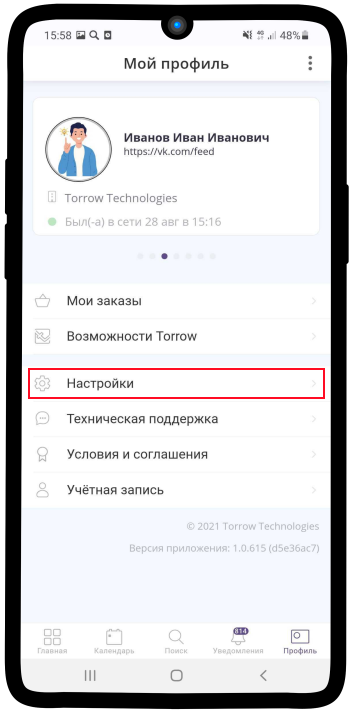

Настройка
=========

.. note:: Раздел постоянно пополняется, если Вы не нашли ответ на свой вопрос можете написать его нашей `службе поддержки`_
.. _`службе поддержки`: support@torrow.net

Синхронизация Torrow с календарем мобильного устройства
-------------------------------------------------------

Чтобы синхронизировать календарь Вашего устройства с календарем Torrow выполните следующие действия:

1. Зайдите в Ваш профиль |профиль| и нажмите **Настройки**

    .. |профиль| image:: _static/profile.png

2. Выберите **Календарь**

3. Выберите параметр **Синхронизация**

.. figure:: _static/calend3.png
    :scale: 60 %
    :alt: alternate text
    :align: center

4. Нажмите на раскрывающийся список **Синхронизация события с календарем**

.. figure:: _static/calend4.png
    :scale: 60 %
    :alt: alternate text
    :align: center

5. Выберите **Torrow**
    

6. На изображении ниже первоначальный вариант календаря устройства **до синхронизации**

7. Календарь устройства **после синхронизации**

.. hint:: **Подсказка:** Таким же образом можно привязать календарь Torrow к сервису **Outlook**. В таком случае информация о Ваших встречах будет переносится в календарь Torrow и наоборот.