.. _synchronization-label:

=======================================================
Синхронизация Torrow с календарем мобильного устройства
=======================================================

Приложение Torrow может сохранять события и заказы во **внешний календарь**, который Вы используете для хранения своих событий (например, Google Calendar, Outlook и другие). Чтобы настроить Torrow, требуется Ваш **внешний календарь** подключить к мобильному устройству Android или iOS (смотрите: `Просмотр доступных календарей мобильного устройства`_) и правильно выбрать в настройках Torrow его название из списка всех доступных календарей (смотрите: `Подключение календаря устройства к календарю Torrow`_). 

Просмотр доступных календарей мобильного устройства
---------------------------------------------------

.. note:: **Список возможных календарей:** Google Календарь, Samsung Calendar, Outlook, Яндекс.Календарь, Microsoft Exchange, ICloud, Yahoo, Aol и другие.

1. Зайдите в стандартный календарь на Вашем устройстве и перейдите в **главное меню**.

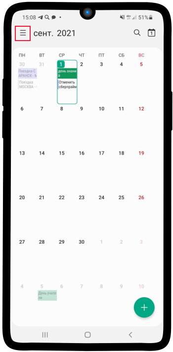

1. Нажмите на кнопку **Управление календарями**

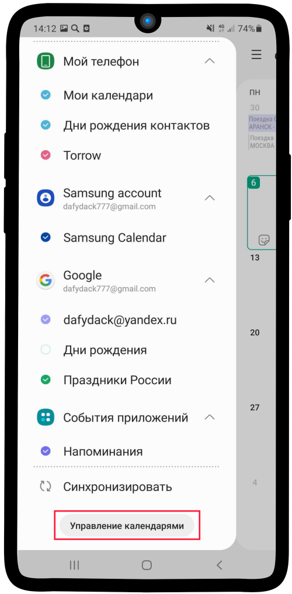

3. Перед Вами список **подключенных к устройству календарей**. Чтобы добавить возможные календари, которые не отображаются в списке, нажмите на **кнопку в правом верхнем углу**.

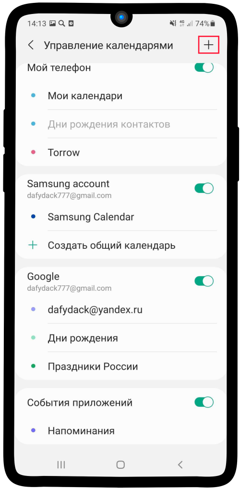

4. В данном случае в списке активных отсутствует календарь **Outlook**. Чтобы подключить Outlook, нажмите на соответствующее поле и внесите данные от учетной записи почтового ящика.

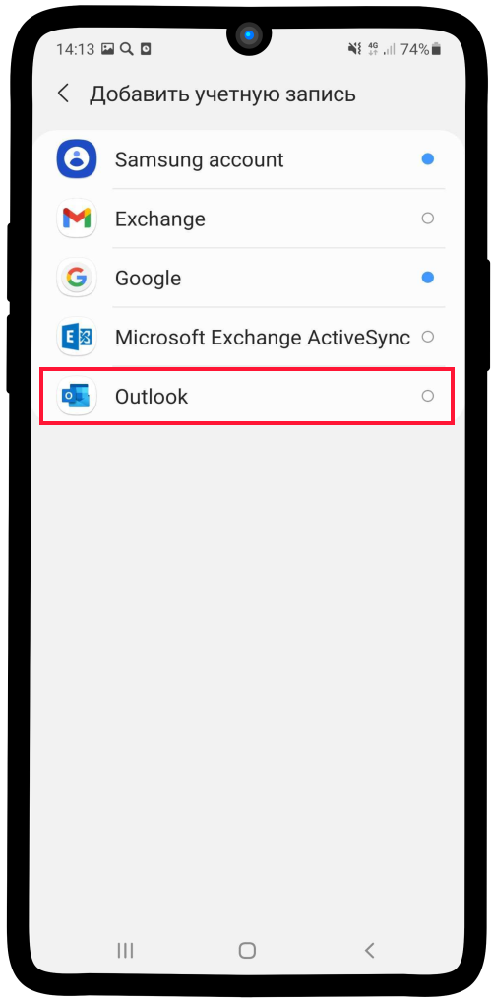

5. После ввода данных с последующей авторизацией наш список будет выглядеть следующим образом. Теперь вернитесь к списку **подключенных календарей**.

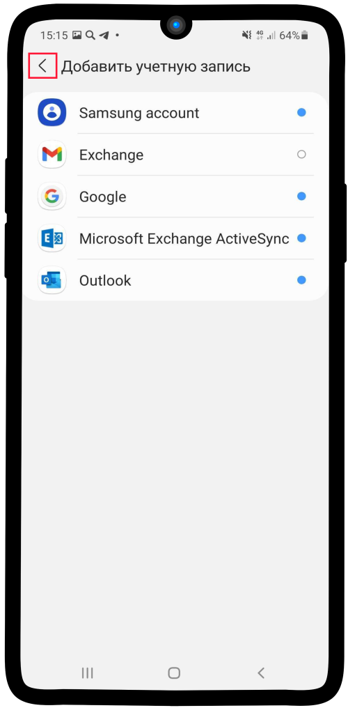

6. Календарь Outlook присутствует в списке доступных.

.. hint:: Обратите внимание, что по-умолчанию календарь Outlook называется **Календарь**. Таким же образом он будет отображаться в списке доступных календарей в приложении Torrow.

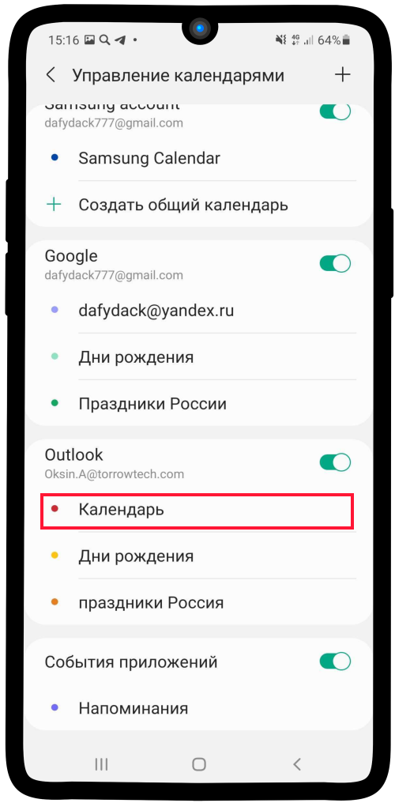

.. attention:: Если календарь Outlook не появился в списке доступных, воспользуйтесь иструкцией:
    :ref:`Outlook-label`

-----------------------------

Подключение календаря устройства к календарю Torrow
---------------------------------------------------

Чтобы синхронизировать **выбранный** календарь Вашего устройства с календарем **Torrow** выполните следующие действия:

1. Зайдите в Ваш профиль |профиль| и нажмите **Настройки**

    .. |профиль| image:: media/profile.png
        :scale: 42 %

.. figure:: media/calend_synchronization/calend1.png
    :scale: 60 %
    :alt: alternate text
    :align: center

2. Выберите **Календарь**

.. figure:: media/calend_synchronization/calend2.png
    :scale: 60 %
    :alt: alternate text
    :align: center

3. Выберите параметр **Синхронизация**

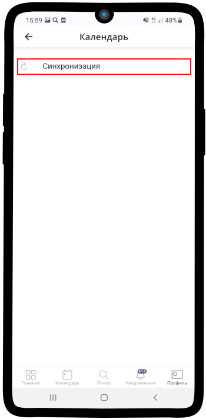

4. Нажмите на раскрывающийся список **Синхронизация события с календарем**

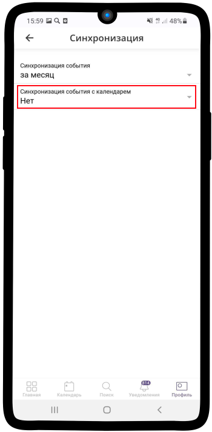

5. Выберите необходимый календарь из инструкции: `Просмотр доступных календарей мобильного устройства`_. Также установите период синхронизации (**рекомендуем** установить параметр: **за месяц**). В качестве примера выберем **календарь Outlook**.

.. hint:: Обратите внимание на название календаря Outlook. Он может отличаться от приведенного.
    
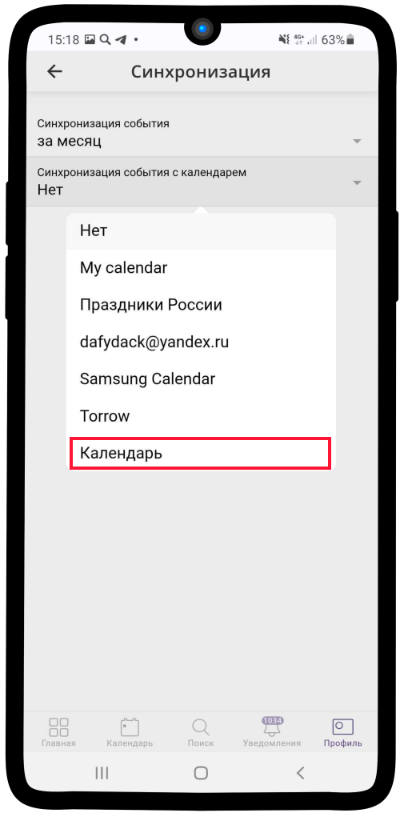

6. На изображении ниже первоначальный вариант календаря Outlook **до синхронизации**

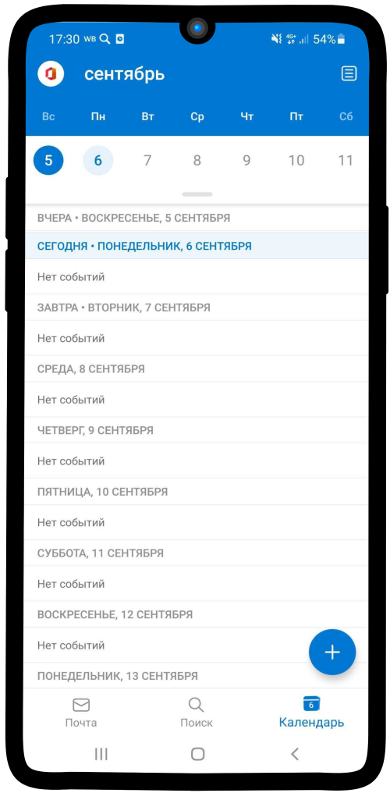

7. Календарь Outlook **после синхронизации**. Информация о событиях заведенных в Torrow теперь отображается в календаре Outlook. В личном календаре пользователя Torrow также появятся встречи, которые были заведены под учетной записью Outlook.

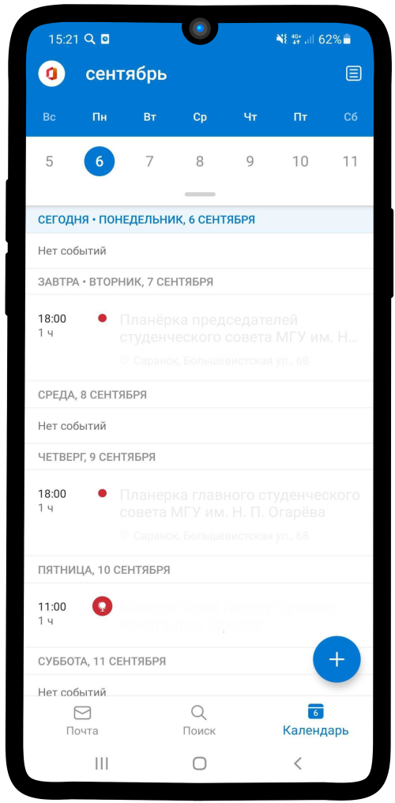

.. hint:: Таким же образом можно привязать календарь Torrow к любому сервису, который представлен в календаре по-умолчанию.

.. raw:: html
   
   <torrow-widget
      id="torrow-widget"
      url="https://web.torrow.net/app/tabs/tab-search/service;id=103edf7f8c4affcce3a659502c23a?closeButtonHidden=true&tabBarHidden=true"
      modal="right"
      modal-active="false"
      show-widget-button="true"
      button-text="Заявка эксперту"
      modal-width="550px"
   ></torrow-widget>
   