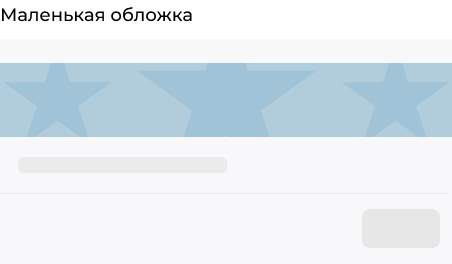
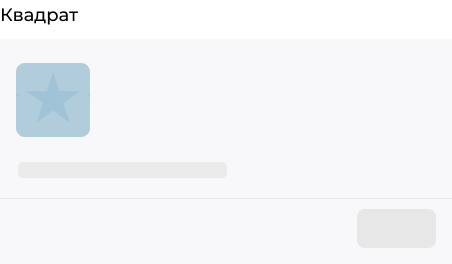
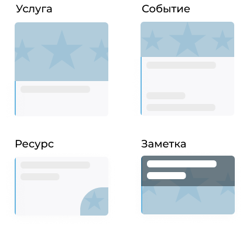
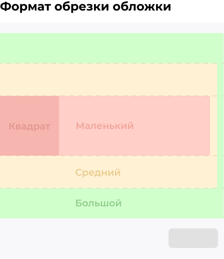

.. _design-label:

====================
Оформление
====================

.. note:: Разделы постоянно пополняются, если Вы не нашли ответ на свой вопрос, можете написать его нашей `службе поддержки`_
.. _`службе поддержки`: support@torrow.net

**Отображение обложки в просмотре услуги, ресурса, события**

При просмотре услуги, ресурса и события обложка может иметь один из четырёх видов. Заранее выберите, какой вид больше подходит для вашего элемента, чтобы подготовить изображение именно для него. Рекомендуемое соотношение сторон — 3:2.

.. note:: Соотношение сторон обложки одинаковое на всех платформах — в полной версии сайта и на мобильных устройствах.

Для удобства мы подготовили схему с размерами, а также выделили области отображения.

-----------------

-----------------

-----------------

-----------------

**Отображение обложки элемента в блочном в виде**

Обратите внимание, что при просмотре блочного вида элементы имеют различные обложки.

-----------------

-----------------

.. raw:: html
   
   <torrow-widget
      id="torrow-widget"
      url="https://web.torrow.net/app/tabs/tab-search/service;id=103edf7f8c4affcce3a659502c23a?closeButtonHidden=true&tabBarHidden=true"
      modal="right"
      modal-active="false"
      show-widget-button="true"
      button-text="Заявка эксперту"
      modal-width="550px"
      button-style = "rectangle"
      button-size = "60"
      button-y = "top"
   ></torrow-widget>
   

.. raw:: html

   <!--  -->