.. _event-label:

=======
Событие
=======

.. note:: **Событие Torrow** - это универсальный элемент, который можно создавать для проведения встреч, распределения задач между сотрудниками и планирования собственной личной или профессиональной деятельности.

Как и в случае с другими **элементами Torrow**, Вы можете вкладывать в событие любую информацию (**заметки, контакты, календари, услуги, ресурсы**), которые поспособствуют успешному проведению предстоящего мероприятия.

   .. |плюс| image:: media/plus.png
      :width: 21
      :alt: alternative text
   .. |контакт| image:: media/contact.png
      :width: 21
      :alt: alternative text
   .. |точка| image:: media/tochka.png
      :width: 21
      :alt: alternative text
   .. |элементы| image:: media/reserved.png
      :width: 21
      :alt: alternative text
   .. |галка| image:: media/galka.png
      :width: 21
      :alt: alternative text

Создание разового события
~~~~~~~~~~~~~~~~

1. Нажмите на |плюс| в нижнем правом углу.

.. figure:: media/single-event/single1.png
    :scale: 60 %
    :alt: alternate text
    :align: center

--------------------

2. Выберите |элементы|.

.. figure:: media/single-event/single2.png
    :scale: 60 %
    :alt: alternate text
    :align: center

--------------------

3. Нажмите **Создать событие**.

.. figure:: media/single-event/single3.png
    :scale: 60 %
    :alt: alternate text
    :align: center

--------------------

4. Выберите **Тип** - **Разовое**

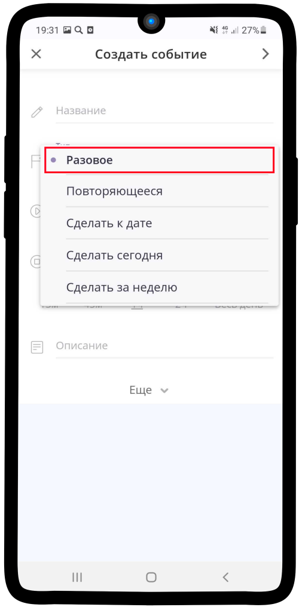

--------------------

5. Заполните поля **Название** и **Описание**.

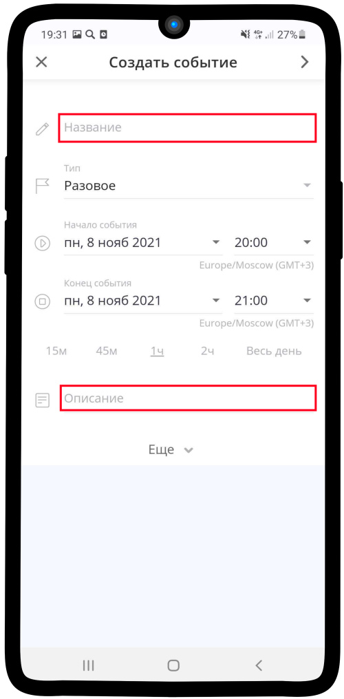

--------------------

6. Заполните **Начало** и **Конец события**
   
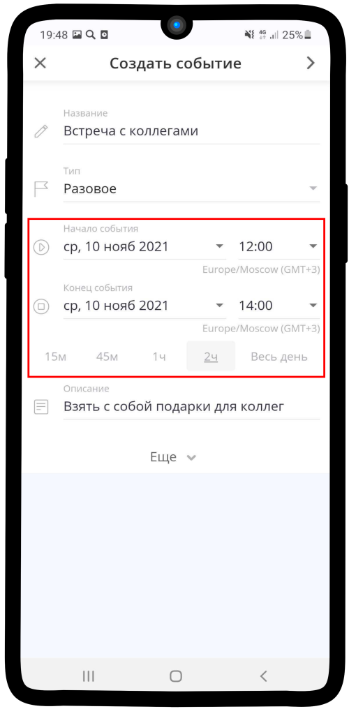

--------------------

7. Нажмите на **Еще** для заполнения остальных полей.
   
.. figure:: media/single-event/single10.png
    :scale: 60 %
    :alt: alternate text
    :align: center

--------------------

8. Отметьте поле **Подтверждать запросы на участие**, если Вам это необходимо.

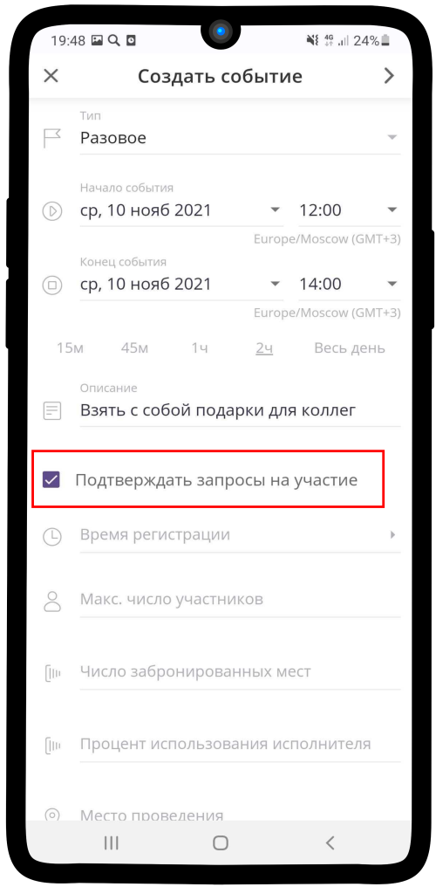

--------------------

9. Установите **Время регистрации** на событие.

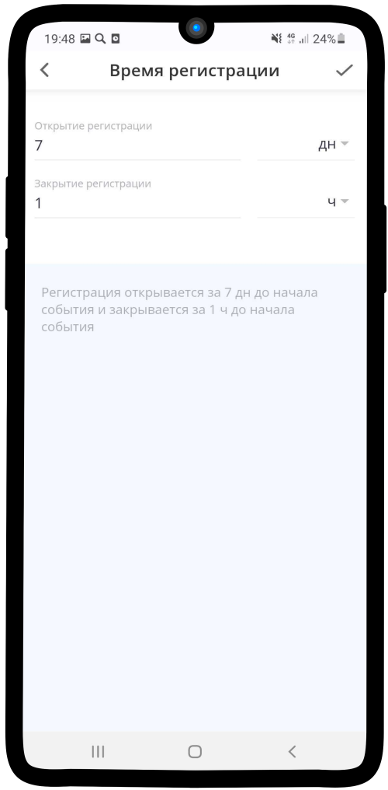

--------------------

10. Укажите **максимальное число участников**.

.. figure:: media/single-event/set_eventparticipants.png
    :scale: 13 %
    :alt: alternate text
    :align: center

--------------------

11. Установите **Место проведения** мероприятия. Также можно добавить **Дополнительные материалы**, они придут участнику, когда он запишется на событие.

.. figure:: media/single-event/set_eventadress.png
    :scale: 13 %
    :alt: alternate text
    :align: center

--------------------

12. Если участие в Вашем событии платное, то укажите **Стоимость**. Если нет, то пропустите пункт 12-14.

.. figure:: media/single-event/set_eventprice.png
    :scale: 13 %
    :alt: alternate text
    :align: center

--------------------

13. Установите способ оплаты.

.. figure:: media/single-event/set_eventpayment.png
    :scale: 13 %
    :alt: alternate text
    :align: center

--------------------

14. Укажите нужный способ.

.. figure:: media/single-event/set_eventpayment2.png
    :scale: 13 %
    :alt: alternate text
    :align: center

--------------------

15. Укажите **Базу клиентов** - контакт, в который будут сохраняться данные незарегистрированных пользователей.

.. figure:: media/single-event/set_eventreg.png
    :scale: 13 %
    :alt: alternate text
    :align: center

--------------------

16. Отметьте необходимые **Контактные данные**, которые Вы хотите получить от пользователя при записи. 

.. figure:: media/single-event/set_eventreg2.png
    :scale: 13 %
    :alt: alternate text
    :align: center

--------------------

17. Регистрация в событии выглядит таким образом: укажите **Визитку**, которой вы представляетесь, и **Тип участия** в событии. Проверьте заполненные контактные данные.

.. figure:: media/single-event/set_eventpart.png
    :scale: 13 %
    :alt: alternate text
    :align: center

--------------------

18. Так выглядит созданное событие.

.. figure:: media/single-event/finalevent.png
    :scale: 13 %
    :alt: alternate text
    :align: center

--------------------

19. Таким образом оно отображается в Вашем календаре.

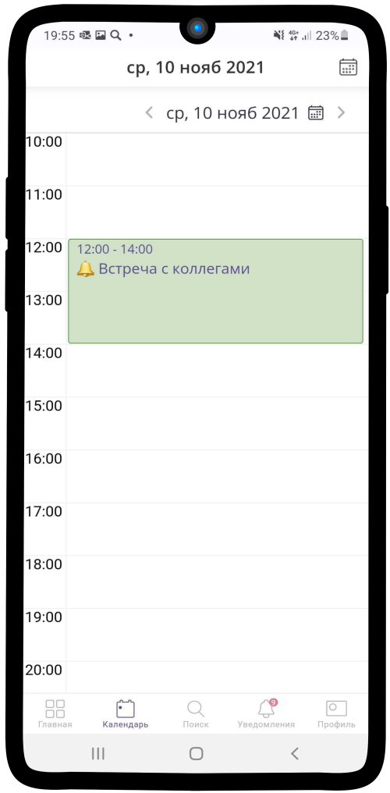

--------------------

Создание повторяющегося события
~~~~~~~~~~~~~~~~~

1. Нажмите на |плюс| в нижнем правом углу.

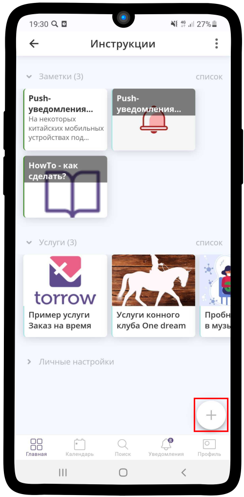

--------------------

2. Выберите |элементы|.

.. figure:: media/repeated-event/single2.png
    :scale: 60 %
    :alt: alternate text
    :align: center

--------------------

3. Нажмите **Создать событие**.

.. figure:: media/repeated-event/single3.png
    :scale: 60 %
    :alt: alternate text
    :align: center

--------------------

4. Выберите **Тип** - **Потворяющееся**

.. figure:: media/repeated-event/repeated1.png
    :scale: 60 %
    :alt: alternate text
    :align: center

--------------------

5. Заполните поля **Название** и **Описание**.

.. figure:: media/repeated-event/repeated2.png
    :scale: 60 %
    :alt: alternate text
    :align: center

--------------------

6. Установите **Расписание** события: время начала и окончания, повторяется ли событие.
   
.. figure:: media/repeated-event/repeated3.png
    :scale: 60 %
    :alt: alternate text
    :align: center

--------------------

7. Если событие повторяется не каждый день, а в определенные дни, Вы можете это настроить

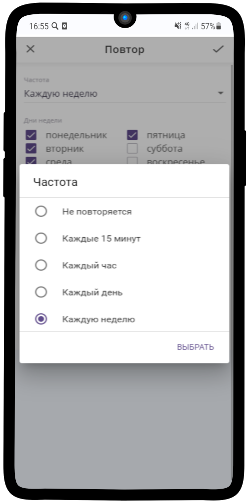

--------------------

8. Нажмите на **Еще** для заполнения остальных полей.
   
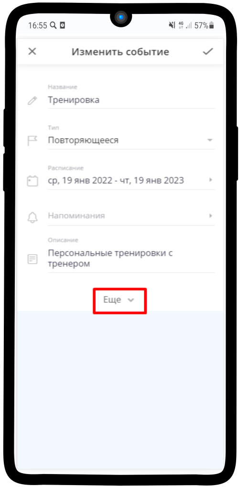

--------------------

9. Отметьте поле **Подтверждать запросы на участие**, если Вам это необходимо. Также установите галочку **Создавать штучное событие**

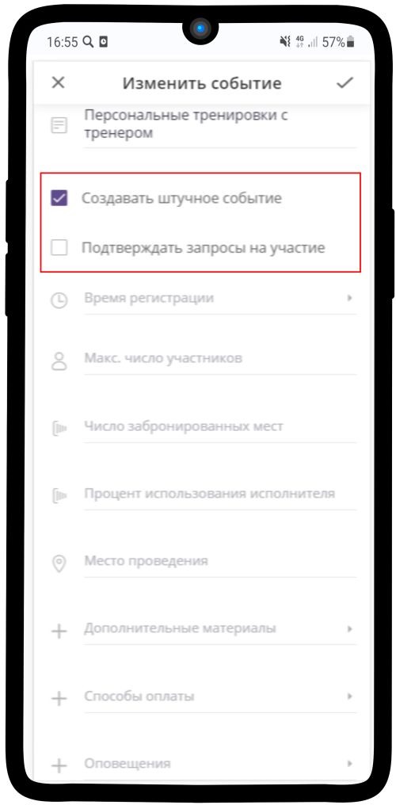

--------------------

10. Установите **Время регистрации** на событие.

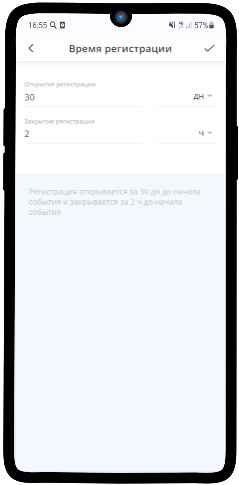

--------------------

11. Укажите **максимальное число участников**. Установите **Место проведения** мероприятия. Также можно добавить **Дополнительные материалы**, они придут участнику, когда он запишется на событие.

.. figure:: media/repeated-event/repeated19.png
    :scale: 60 %
    :alt: alternate text
    :align: center

--------------------

12. Если участие в Вашем событии платное, то укажите **Стоимость**. Если нет, то пропустите пункт 12-14.

.. figure:: media/repeated-event/repeated20.png
    :scale: 60 %
    :alt: alternate text
    :align: center

--------------------

13. Установите способ оплаты.

.. figure:: media/repeated-event/set_eventpayment.png
    :scale: 13 %
    :alt: alternate text
    :align: center

--------------------

14. Укажите нужный способ.

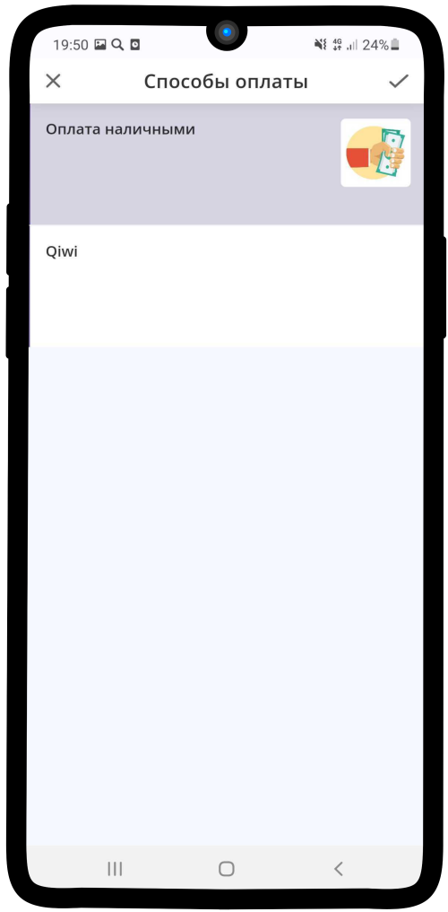

--------------------

15.  Укажите **Базу клиентов** - контакт, в который будут сохраняться данные незарегистрированных пользователей.

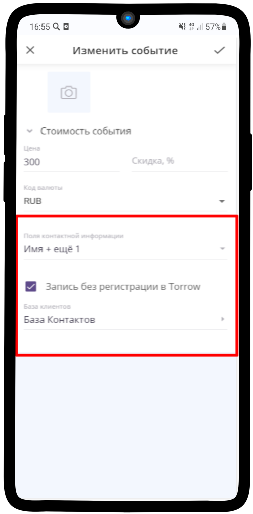

--------------------

16. Отметьте необходимые **Контактные данные**, которые Вы хотите получить от пользователя при записи. Вы можете изменить необходимые данные: добавить новые или удалить. 

.. figure:: media/repeated-event/repeated22.png
    :scale: 60 %
    :alt: alternate text
    :align: center

--------------------

17. Регистрация в событии выглядит таким образом: укажите **Визитку**, которой вы представляетесь, и **Тип участия** в событии. Проверьте заполненные контактные данные.

.. figure:: media/repeated-event/set_eventpart.png
    :scale: 13 %
    :alt: alternate text
    :align: center

--------------------

18. Таким образом оно отображается в Вашем календаре.

.. figure:: media/repeated-event/repeated25.png
    :scale: 60 %
    :alt: alternate text
    :align: center

--------------------

19. Так выглядят штучные события.

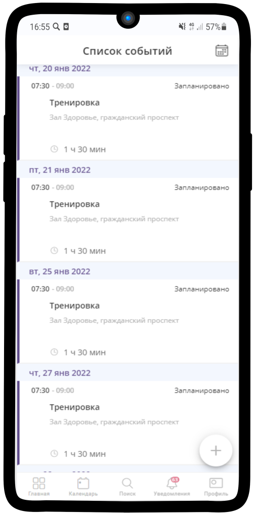
