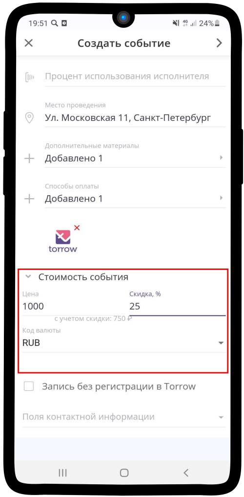
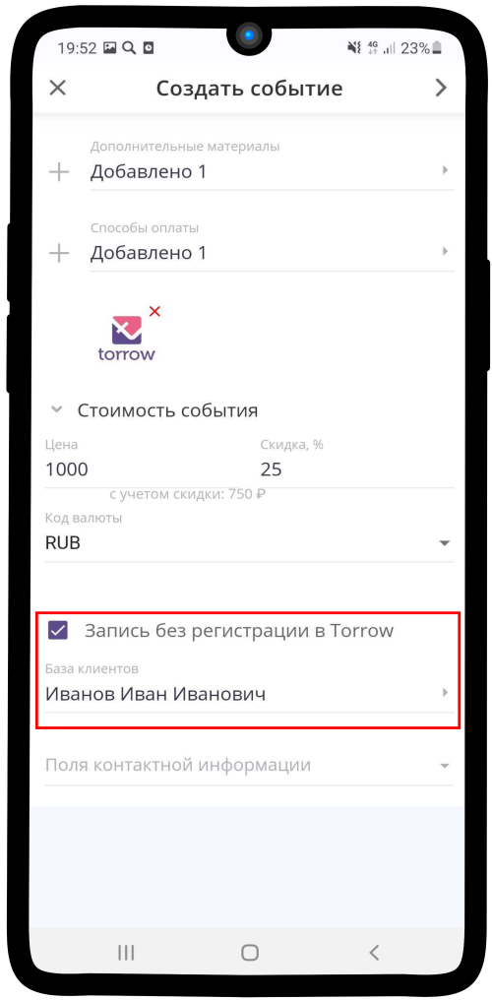
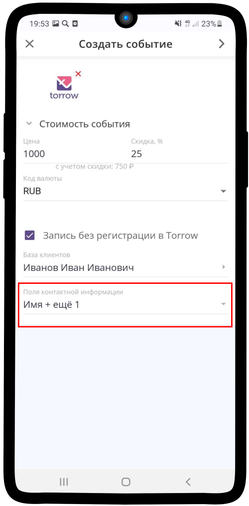

Разовое событие
~~~~~~~~~~~~~~~~

   .. |плюс| image:: media/plus.png
      :width: 21
      :alt: alternative text
   .. |контакт| image:: media/contact.png
      :width: 21
      :alt: alternative text
   .. |точка| image:: media/tochka.png
      :width: 21
      :alt: alternative text
   .. |элементы| image:: media/reserved.png
      :width: 21
      :alt: alternative text
   .. |галка| image:: media/galka.png
      :width: 21
      :alt: alternative text
      
1. Нажмите на |плюс| в нижнем правом углу.

.. figure:: media/single-event/single1.png
    :scale: 53 %
    :alt: alternate text
    :align: center

--------------------

2. Выберите |элементы|.

.. figure:: media/single-event/single2.png
    :scale: 53 %
    :alt: alternate text
    :align: center

--------------------

1. Нажмите **Создать событие**.

.. figure:: media/single-event/single3.png
    :scale: 53 %
    :alt: alternate text
    :align: center

--------------------

4. Выберите **Тип** — **Разовое**

.. figure:: media/single-event/single5.png
    :scale: 53 %
    :alt: alternate text
    :align: center

--------------------

5. Заполните поля **Название** и **Описание**.

.. figure:: media/single-event/single6.png
    :scale: 53 %
    :alt: alternate text
    :align: center

--------------------

6. Заполните **Начало** и **Конец события**
   
.. figure:: media/single-event/set_eventtime.png
    :scale: 53 %
    :alt: alternate text
    :align: center

--------------------

7. Нажмите на **Еще** для заполнения остальных полей.
   

--------------------

8. Отметьте поле **Подтверждать запросы на участие**, если Вам это необходимо.

.. figure:: media/single-event/set_eventparticipate.png
    :scale: 53 %
    :alt: alternate text
    :align: center

--------------------

9. Установите **Время регистрации** на событие.

.. figure:: media/single-event/set_eventregtime.png
    :scale: 53 %
    :alt: alternate text
    :align: center

--------------------

10. Укажите **максимальное число участников**.

--------------------

11. Установите **Место проведения** мероприятия. Также можно добавить **Дополнительные материалы**, они придут участнику, когда он запишется на событие.

.. figure:: media/single-event/set_eventadress.png
    :scale: 53 %
    :alt: alternate text
    :align: center

--------------------

12. Если участие в Вашем событии платное, то укажите **Стоимость**. Если нет, то пропустите пункт 12-14.

--------------------

13. Установите способ оплаты.

--------------------

14. Укажите нужный способ.

.. figure:: media/single-event/set_eventpayment2.png
    :scale: 53 %
    :alt: alternate text
    :align: center

--------------------

15. Укажите **Базу клиентов** — контакт, в который будут сохраняться данные незарегистрированных пользователей.

--------------------

16. Отметьте необходимые **Контактные данные**, которые Вы хотите получить от пользователя при записи. 

--------------------

17. Запись на событие для зарегистрированного пользователя выглядит таким образом: укажите **Визитку**, которой вы представляетесь, и **Тип участия** в событии. Проверьте заполненные контактные данные.

.. figure:: media/single-event/set_eventpart.png
    :scale: 53 %
    :alt: alternate text
    :align: center

--------------------

18. Так выглядит созданное событие.

.. figure:: media/single-event/finalevent.png
    :scale: 53 %
    :alt: alternate text
    :align: center

--------------------

19. Таким образом оно отображается в Вашем календаре.

.. figure:: media/single-event/eventcalendar.png
    :scale: 53 %
    :alt: alternate text
    :align: center

--------------------

20.  Запись на событие для незарегистрированного пользователя выглядит таким образом. Нажмите на **Принять участие**.

--------------------

21. Заполните **контактную информацию**

--------------------

22. Вы зарегистрированы!

--------------------

.. raw:: html
   
   <torrow-widget
      id="torrow-widget"
      url="https://web.torrow.net/app/tabs/tab-search/service;id=103edf7f8c4affcce3a659502c23a?closeButtonHidden=true&tabBarHidden=true"
      modal="right"
      modal-active="false"
      show-widget-button="true"
      button-text="Заявка эксперту"
      modal-width="550px"
      button-style = "rectangle"
      button-size = "60"
      button-y = "top"
   ></torrow-widget>
   

.. raw:: html

   