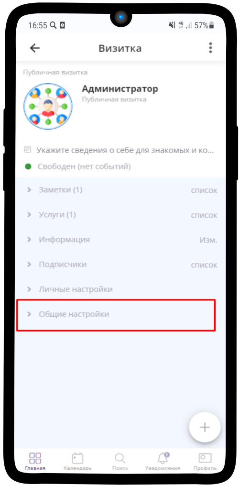
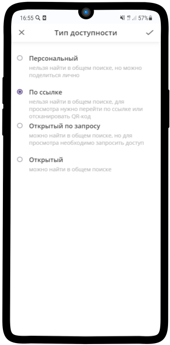

====================
Тип доступности
====================

1. Выберите **Тип доступности** элемента. Для этого перейдите в **Общие настройки**

-------------------------------

2. Нажмите на соответствующее поле

.. figure:: media/card9.png
    :scale: 60 %
    :alt: alternate text
    :align: center

-------------------------------

3. В списке присутствует 4 типа доступности: 

* **Персональный** — нельзя найти в общем поиске, но можно поделиться лично
* **По ссылке** — нельзя найти в общем поиске, для просмотра нужно перейти по ссылке или отсканировать QR-код
* **Открытый по запросу** — можно найти в общем поиске, но для просмотра необходимо запросить доступ
* **Открытый** — можно найти в общем поиске, открыт к просмотру

.. hint:: Рекомендуем выбрать тип доступности **По ссылке**.

