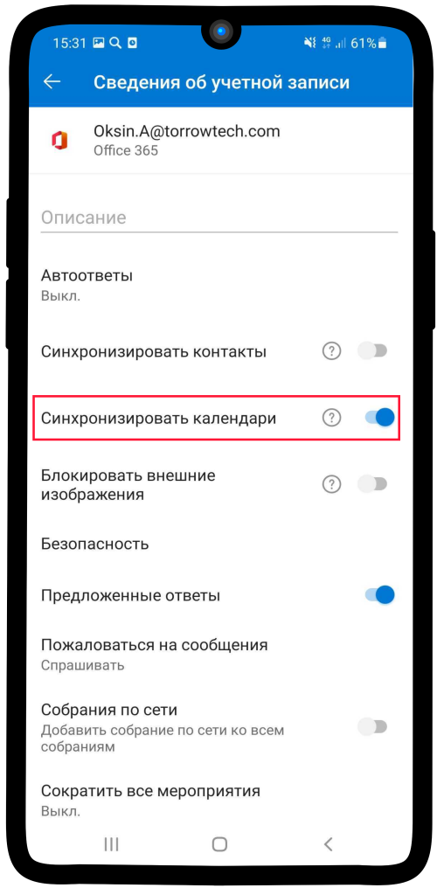

.. _Outlook-label:

=====================================================================
Что делать если календарь Outlook не отображается в списке доступных?
=====================================================================

1. Зайдите в приложение **Outlook** на Вашем устройстве и перейдите в профиль. В профиле нажмите на кнопку **Настройки** |шарнир|

    .. |шарнир| image:: media/nastroy.png
        :scale: 42 %

.. figure:: media/outlook/calend14.png
    :scale: 42 %
    :alt: alternate text
    :align: center

----------------------------------------

2. Выберите необходимую **учетную запись**, как показано на изображении ниже.

.. figure:: media/outlook/calend15.png
    :scale: 42 %
    :alt: alternate text
    :align: center

------------------------------------

3. Переведите в активный режим поле **Синхронизировать календари**, нажав на кнопку |принять|
    
    .. |принять| image:: media/prin.png
        :scale: 75 %

----------------------------------

4. Теперь проверьте **список доступных календарей на Вашем устройстве**. Результат приведен на изображении ниже.

.. figure:: media/outlook/calend17.png
    :scale: 42 %
    :alt: alternate text
    :align: center