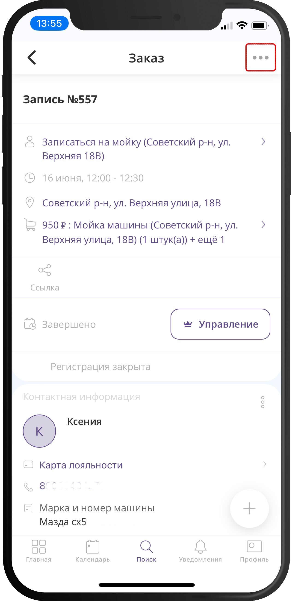
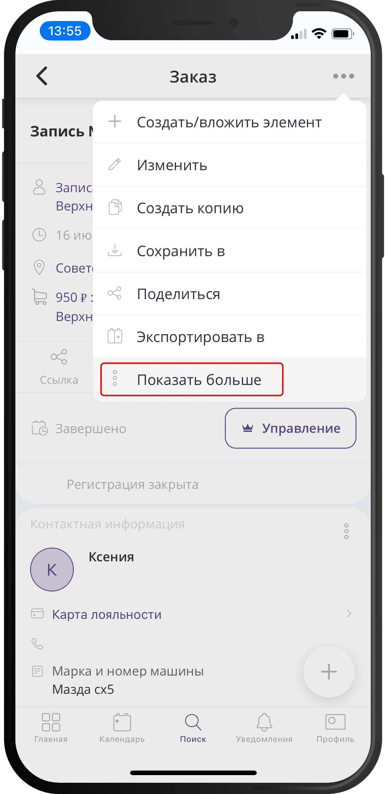
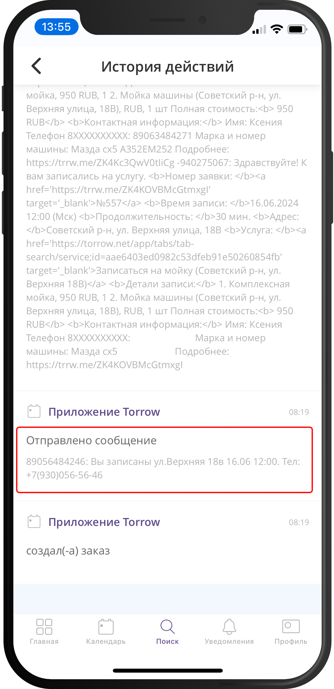
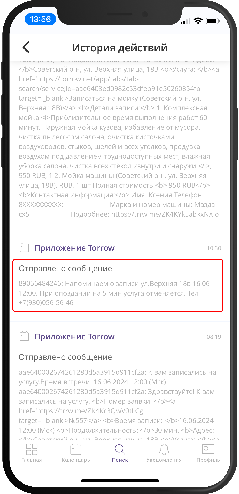

===================================================
Как посмотреть историю действий над элементом?
===================================================

   .. |точка| image:: media/tochka.png
      :width: 21
      :alt: alternative text
   .. |галка| image:: media/galka.png
      :width: 21
      :alt: alternative text

В "Истории действий" элемента сохраняется информация о создании или изменении элемента, отправке уведомлений или смс, а так же вызове интеграционных WebHook.

1. Откройте нужный элемент (например, заказ по услуге)

-----------------------

2. Нажмите на |точка|

-----------------------

3. Из выпадающего списка меню выберите **История действий**

-----------------------

4. Пролистайте записи и изучите их

-----------------------

-----------------------

На рисунках в качестве пример выделены записи об отправке смс на телефон.

.. raw:: html
   
   <torrow-widget
      id="torrow-widget"
      url="https://web.torrow.net/app/tabs/tab-search/service;id=103edf7f8c4affcce3a659502c23a?closeButtonHidden=true&tabBarHidden=true"
      modal="right"
      modal-active="false"
      show-widget-button="true"
      button-text="Заявка эксперту"
      modal-width="550px"
      button-style = "rectangle"
      button-size = "60"
      button-y = "top"
   ></torrow-widget>
   

.. raw:: html

   