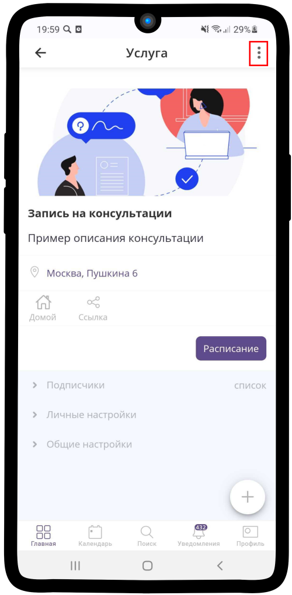
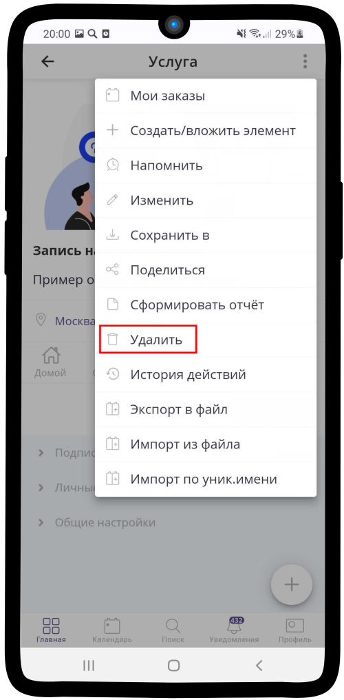
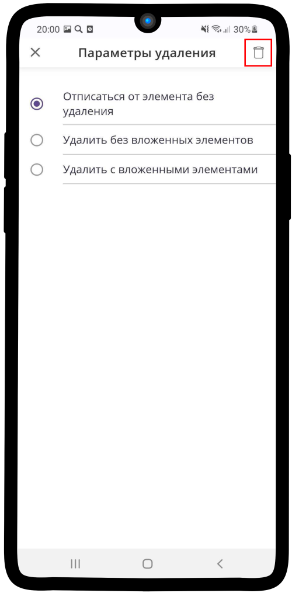

.. _delete_element-label:

====================
Как удалить элемент?
====================

   .. |точка| image:: media/tochka.png
      :width: 21
      :alt: alternative text
   .. |галка| image:: media/galka.png
      :width: 21
      :alt: alternative text
   .. |корзина| image:: media/garbage-bucket.png
      :width: 21
      :alt: alternative text

**Чтобы удалить элемент:**

1. Перейдите в элемент, который планируете **удалить**. Нажмите на |точка|.

2. Из выпадающего списка меню выберите **Удалить**

.. hint:: Вы можете воспользоваться одним из вариантов удаления:

    * **Отписаться от элемента без удаления** - элемент пропадет из Вашего личного списка, но не будет удален у других **владельцев** или **менеджеров** элемента.
    * **Удалить без вложенных элементов** - элемент будет удален у всех **владельцев** или **менеджеров** элемента. Другие элементы, которые находятся внутри него, удалены не будут. Например, Вы удаляете услугу, внутри неё находится ресурс. После удаления ресурс останется доступным.
    * **Удалить с вложенными элементами** - элемент и все, что находится внутри него, будет удалено.

3. Нажмите на |корзина|, чтобы подтвердить удаление.

