.. note:: Разделы постоянно пополняются, если Вы не нашли ответ на свой вопрос, можете написать его нашей `службе поддержки`_
.. _`службе поддержки`: support@torrow.net

=========================
Как изменить отображение секций и их названия?
=========================

1. Если расположение секций и их стандартное название Вам не подходит, то это можно изменить.

    .. |галка| image:: media/galka.png
        :scale: 42 %

-----------------------

2. Перейдите в **Общие настройки**

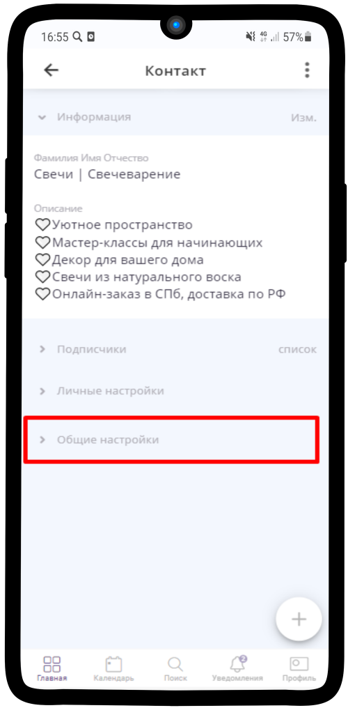

-----------------------

3. Выберите **Внешний вид** 

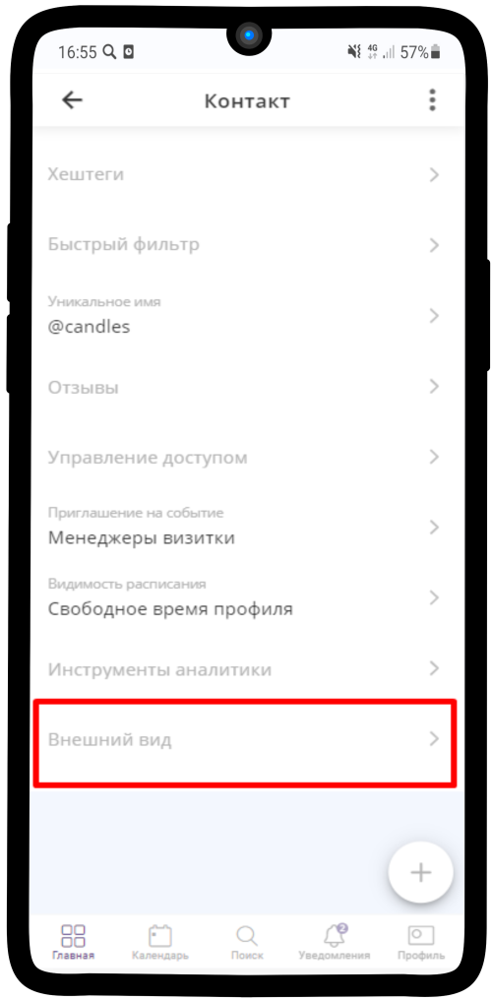

-----------------------

4. Отображение секций

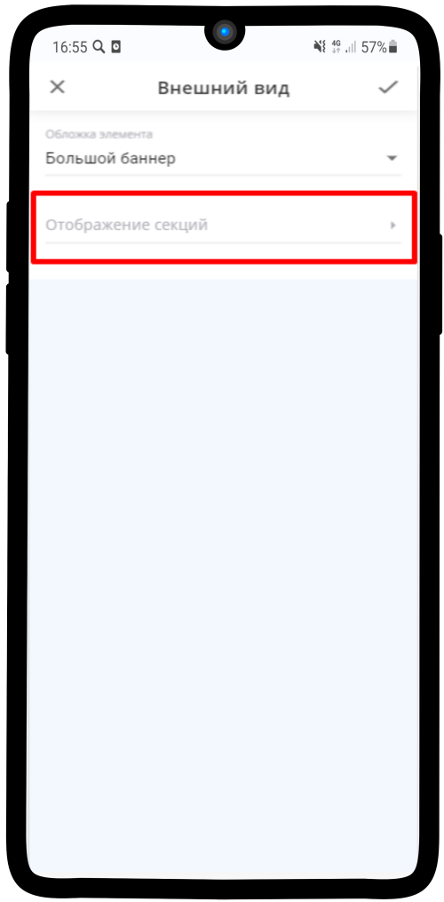

-----------------------

5. Нажмите на кнопку **Добавить секцию**

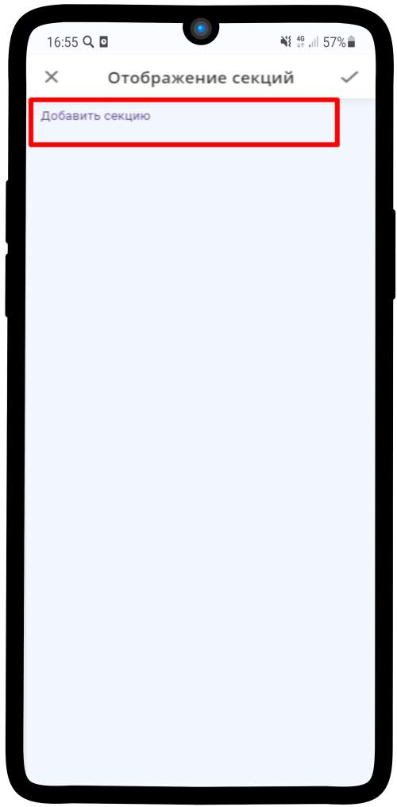

-----------------------

6. Выберите нужную секцию и впишите новое название

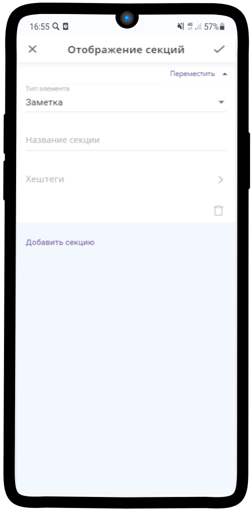

-----------------------

7. Вы можете изменить так любую секцию

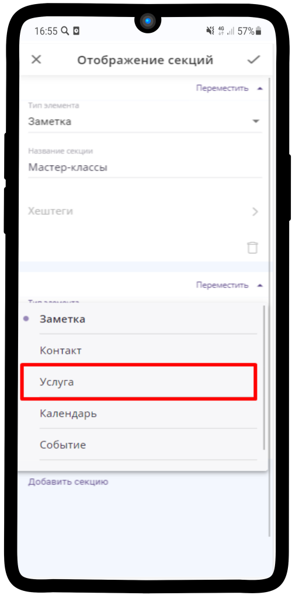

-----------------------

8. Также поменять порядок, нажав на кнопку **Переместить**

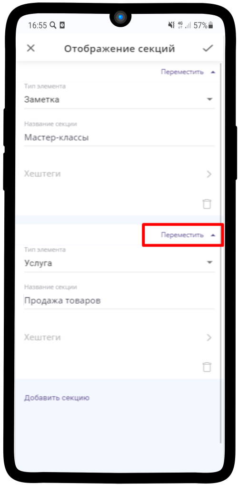

-----------------------

9. После всех изменений нажмите на |галка|

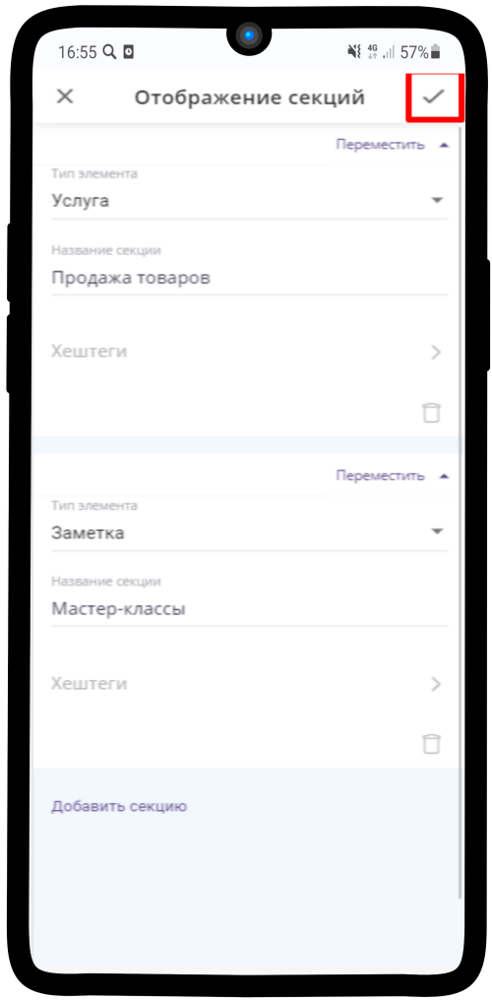

-----------------------

10. Готово!

-----------------------

=========================
Как изменить порядок элементов в секции?
=========================

1. Также можно изменить порядок отображаемых элементов внутри секции. При создании они располагаются в алфавитном порядке. Нажмите на **Список**

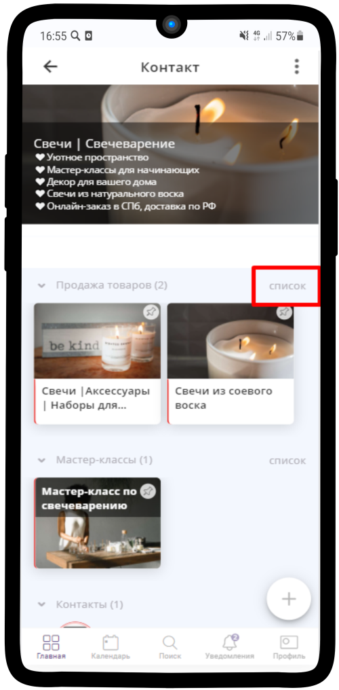

-----------------------

2. Нажмите на пару стрелок в правом верхнем углу

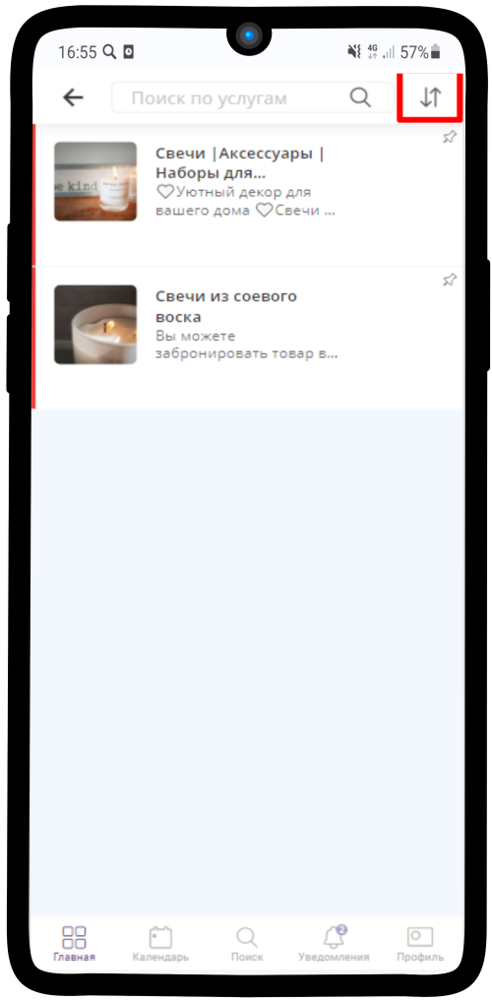

-----------------------

3. Можете расположить элементы в нужном порядке

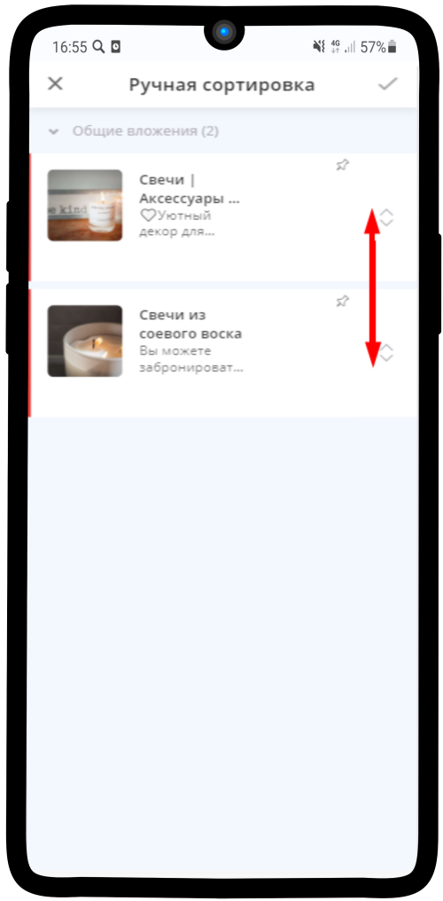

-----------------------

4. Нажмите на |галка| в правом верхнем углу для сохранения изменений

-----------------------

=========================
Какие подходят картинки?
=========================

Общие рекомендации можно посмотреть здесь — :ref:`design-label`

.. raw:: html
   
   <torrow-widget
      id="torrow-widget"
      url="https://web.torrow.net/app/tabs/tab-search/service;id=103edf7f8c4affcce3a659502c23a?closeButtonHidden=true&tabBarHidden=true"
      modal="right"
      modal-active="false"
      show-widget-button="true"
      button-text="Заявка эксперту"
      modal-width="550px"
      button-style = "rectangle"
      button-size = "60"
      button-y = "top"
   ></torrow-widget>
   

.. raw:: html

   