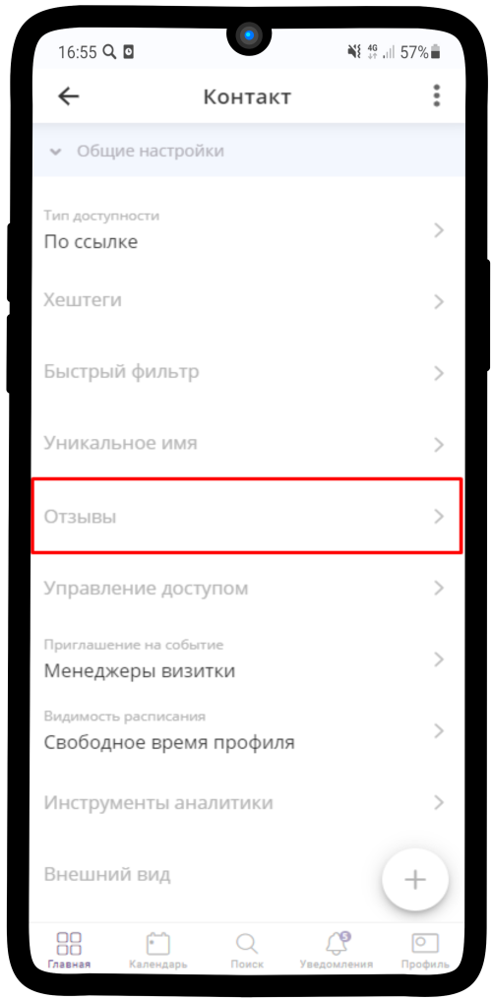
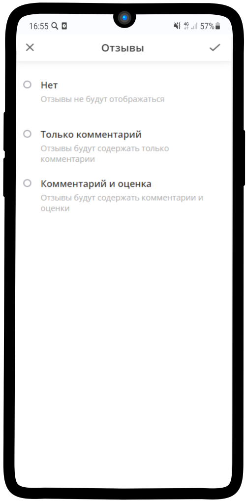
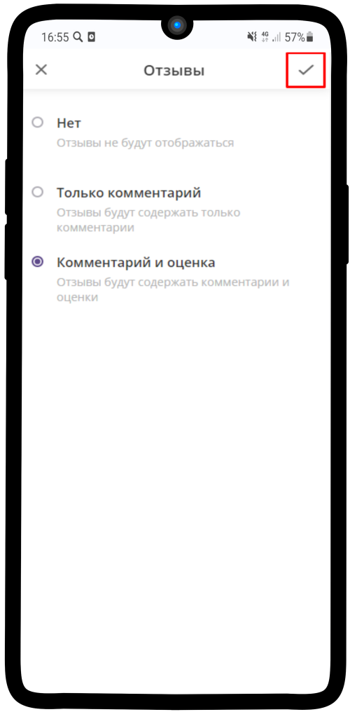
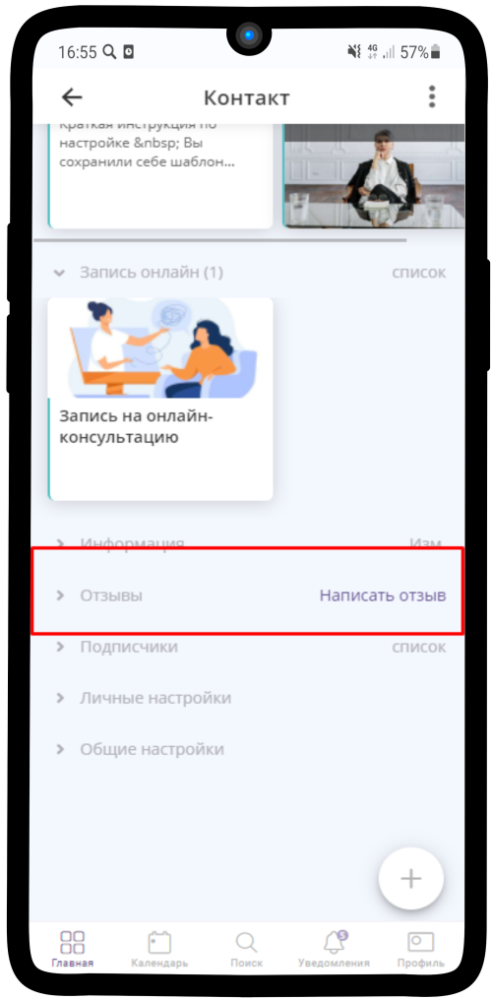
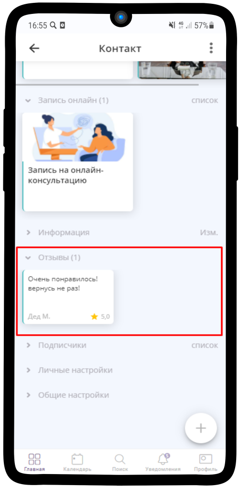

=================================
Как настроить отзывы и рейтинг?
=================================

**Если Вам необходимо подключить отзывы и рейтинг, воспользуйтесь инструкцией:**

1. Перейдите в **Общие настройки** Вашей страницы/услуги

.. figure:: media/feedback/feedback2.png
    :scale: 42 %
    :alt: alternate text
    :align: center

----------------------------------------

2. Нажмите на пункт **Отзывы**

----------------------------------------

3. Выберите подходящий Вам вариант

----------------------------------------

И нажмите на |галка|, чтобы сохранить изменения

    .. |галка| image:: media/galka.png
        :scale: 42 %

----------------------------------------

4. Отзывы и отображение рейтинга включены

----------------------------------------

5. Нажав на **Написать отзыв**, откроется окно для написания комментария
   

----------------------------------------

6. Вверху страницы отображается рейтинг (средняя оценка по всем отзывам)

----------------------------------------

7. В секции **Отзывы** отображается оставленный отзыв

----------------------------------------