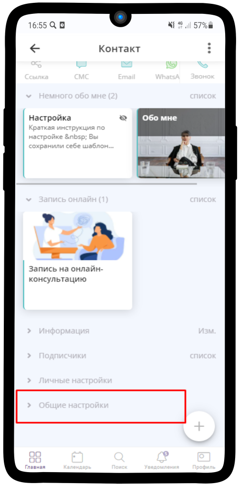
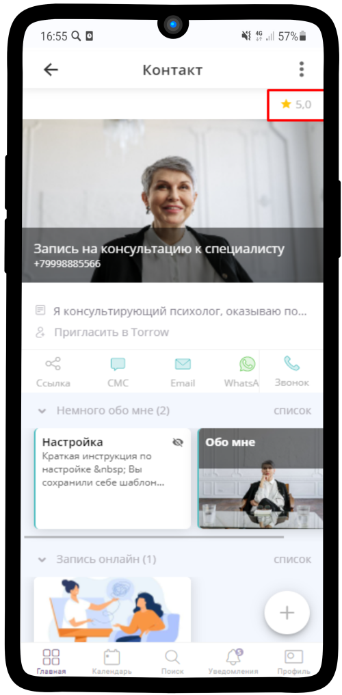
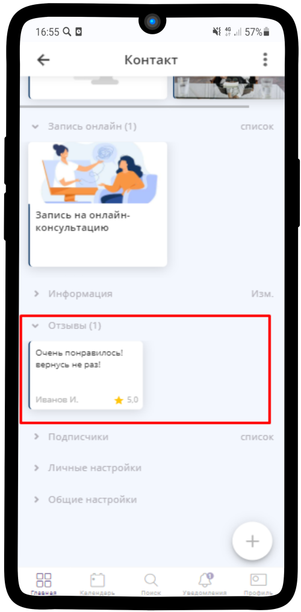

=================================
Как настроить отзывы и рейтинг?
=================================

**Если Вам необходимо подключить отзывы и рейтинг, воспользуйтесь инструкцией:**

1. Перейдите в **Общие настройки** Вашей страницы/услуги

----------------------------------------

2. Нажмите на пункт **Отзывы**

----------------------------------------

3. Выберите подходящий Вам вариант

----------------------------------------

И нажмите на |галка|, чтобы сохранить изменения

    .. |галка| image:: media/galka.png
        :scale: 42 %

----------------------------------------

4. Отзывы и отображение рейтинга включены

----------------------------------------

5. Нажав на **Написать отзыв**, откроется окно для написания комментария
   

----------------------------------------

6. Вверху страницы отображается рейтинг (средняя оценка по всем отзывам)

----------------------------------------

7. В секции **Отзывы** отображается оставленный отзыв

----------------------------------------

.. .. raw:: html
   
..    <torrow-widget
..       id="torrow-widget"
..       url="https://web.torrow.net/app/tabs/tab-search/service;id=103edf7f8c4affcce3a659502c23a?closeButtonHidden=true&tabBarHidden=true"
..       modal="right"
..       modal-active="false"
..       show-widget-button="true"
..       button-text="Заявка эксперту"
..       modal-width="550px"
..       button-style = "rectangle"
..       button-size = "60"
..       button-y = "top"
..    ></torrow-widget>
..    

.. .. raw:: html

..    