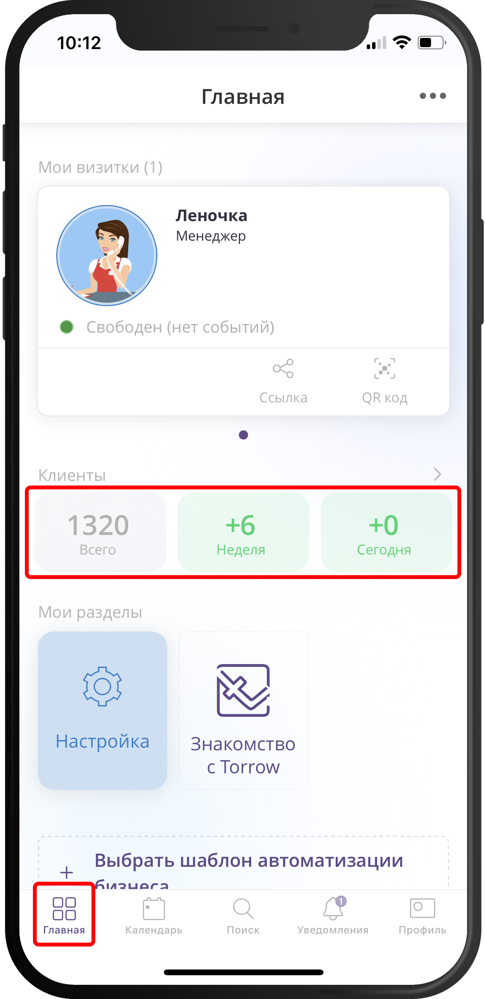
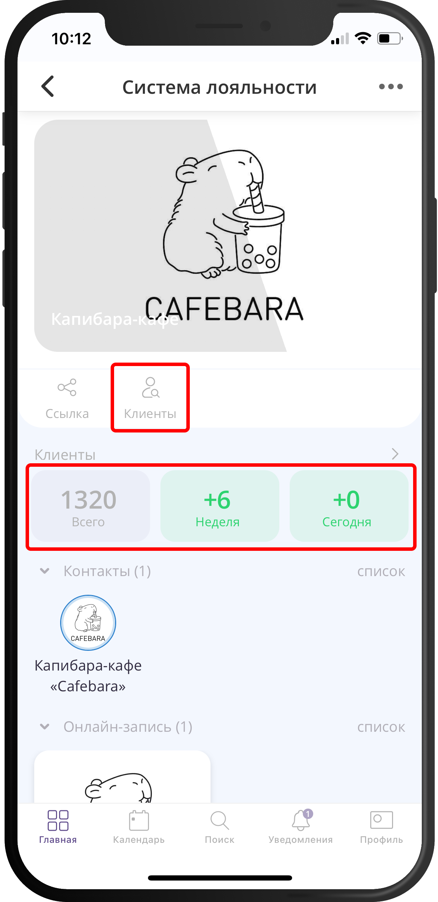
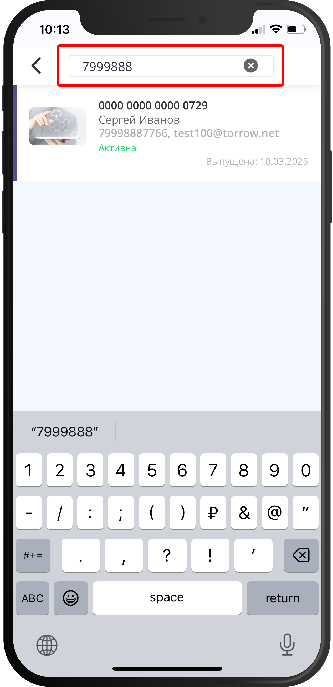
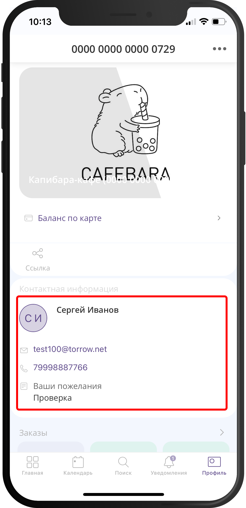
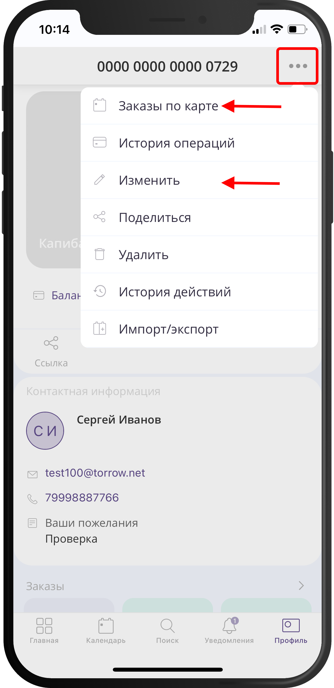
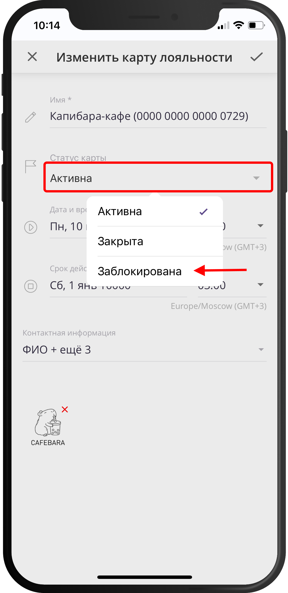

=====================================
Как найти карту и заблокировать клиента?
=====================================

   .. |меню| image:: media/open-menu.png
      :width: 21
      :alt: alternative text
   .. |галка| image:: media/galka.png
      :width: 21
      :alt: alternative text

.. note:: 
   
   В сервисе Torrow можно настроить небольшую CRM-систему, которая называется "Система лояльности".
   В этой системе сохраняются данные о клиентах: контактная информация и сделанные заказы.
   Чтобы найти карту клиента, нужно открыть систему лояльности и в строке поиска ввести номер телефона, фамилию или другую контактную информацию клиента.

1. Откройте раздел "Главная" и нажмите на плашку с числом клиентов, чтобы открыть систему лояльности.

-----------------------

2. Нажмите на кнопку "Клиенты" или еще раз на плашку с числом клиентов, чтобы открыть список клиентов со строкой поиска.

-----------------------

3. Введите в строку поиска номер телефона, фамилию, номер карты клиента или другую контактную информацию клиента.

-----------------------

4. Нажмите на плашку с найденным клиентом, чтобы открыть его карточку и увидеть контактную информацию.

-----------------------

5. В карте клиента вы можете открыть меню (|меню|) и выбрать пункт меню **"Заказы по карте"**, чтобы посмотреть сделанные заказы, или пункт меню **"Изменить"**, чтобы изменить статус карты клиента.

-----------------------

6. Если нажать на пункт меню **"Изменить"**, то в форме редактирования можно изменить статус карты клиента на **"Заблокирована"**, чтобы запретить данному клиенту заказывать ваши услуги.

-----------------------

.. raw:: html
   
   <torrow-widget
      id="torrow-widget"
      url="https://web.torrow.net/app/tabs/tab-search/service;id=103edf7f8c4affcce3a659502c23a?closeButtonHidden=true&tabBarHidden=true"
      modal="right"
      modal-active="false"
      show-widget-button="true"
      button-text="Заявка эксперту"
      modal-width="550px"
      button-style = "rectangle"
      button-size = "60"
      button-y = "top"
   ></torrow-widget>
   

.. raw:: html

   <!--  -->