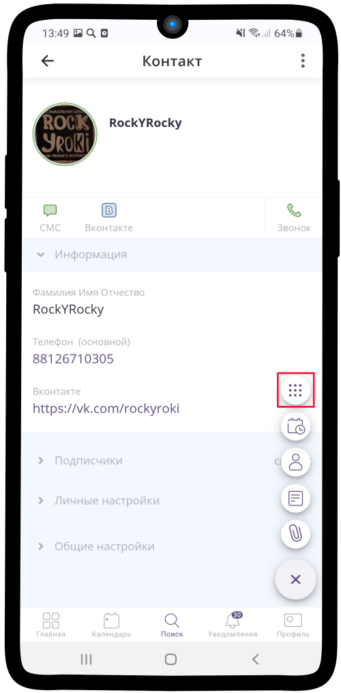
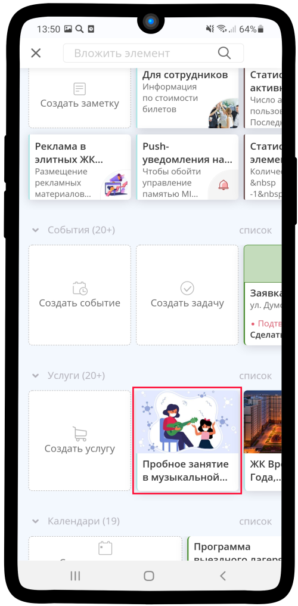
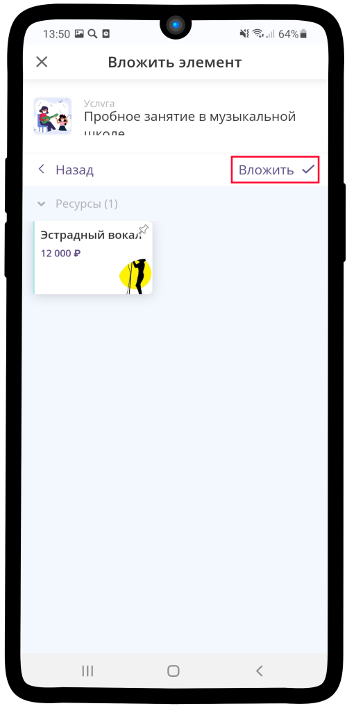
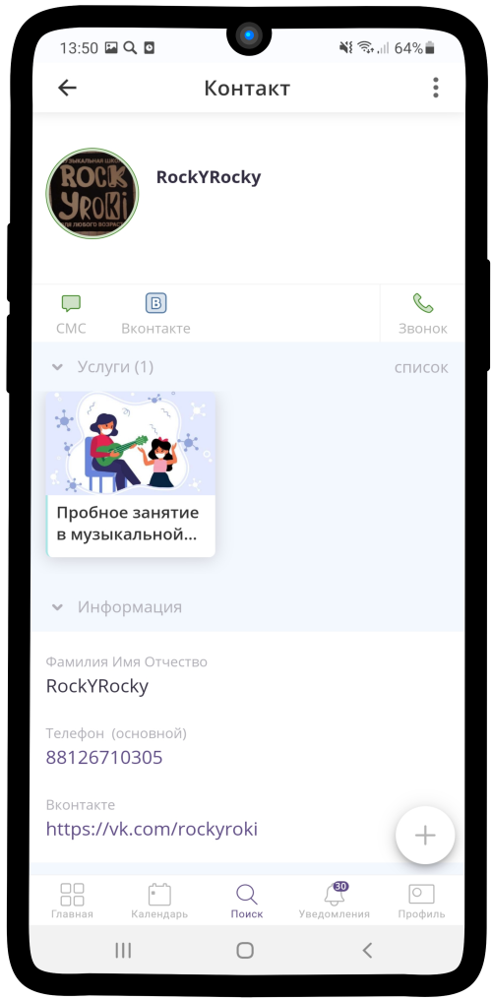

=================================================================
Как вкладывать услугу, календарь, ресурс или сохраненные элементы?
=================================================================

1. Нажмите на кнопку |плюс| в нижнем левом углу.

    .. |плюс| image:: media/plus.png
        :scale: 42 %

.. figure:: media/vloj1.png
    :scale: 42 %
    :alt: alternate text
    :align: center

2. Из раскрывающегося **списка** выберите |массив|.

    .. |массив| image:: media/reserved.png
        :scale: 42 %

3. Выберите необходимый **элемент**.

4. Нажмите на кнопку **Вложить**.

5. **Готово!** Вы вложили выбранный элемент в текущий.

