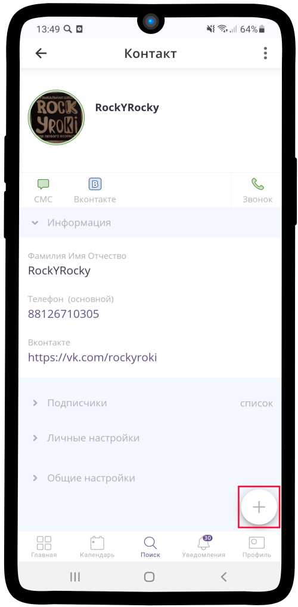

=================================================================
Как вкладывать услугу, календарь, ресурс или сохраненные элементы?
=================================================================

1. Нажмите на кнопку |плюс| в нижнем левом углу.

    .. |плюс| image:: media/plus.png
        :scale: 42 %

--------------------------

2. Из раскрывающегося **списка** выберите |массив|.

    .. |массив| image:: media/reserved.png
        :scale: 42 %

.. figure:: media/invest_element/vloj2.png
    :scale: 42 %
    :alt: alternate text
    :align: center

----------------------------------

3. Выберите необходимый **элемент**.

.. figure:: media/invest_element/vloj3.png
    :scale: 42 %
    :alt: alternate text
    :align: center

------------------------------

4. Нажмите на кнопку **Вложить**.

.. figure:: media/invest_element/vloj4.png
    :scale: 42 %
    :alt: alternate text
    :align: center

------------------------------

5. **Готово!** Вы вложили выбранный элемент в текущий.

.. figure:: media/invest_element/vloj5.png
    :scale: 42 %
    :alt: alternate text
    :align: center

.. raw:: html
   
   <torrow-widget
      id="torrow-widget"
      url="https://web.torrow.net/app/tabs/tab-search/service;id=103edf7f8c4affcce3a659502c23a?closeButtonHidden=true&tabBarHidden=true"
      modal="right"
      modal-active="false"
      show-widget-button="true"
      button-text="Заявка эксперту"
      modal-width="550px"
      button-style = "rectangle"
      button-size = "60"
      button-y = "top"
   ></torrow-widget>
   

.. raw:: html

   