.. _metrika-label:

===================================================
Как подключить Яндекс.Метрику или Google Analytics?
===================================================

.. note:: Инструменты аналитики позволят Вам получать статистику посещений, использований услуг и других элементов приложения клиентами.

--------------------------
Подключение Яндекс.Метрики
--------------------------

1. Зайдите в свой аккаунт Яндекс.Метрики и добавьте новый счетчик.

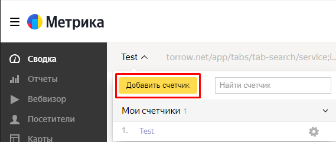

----------------------------

2. Задайте **имя счетчика**, укажите **ссылку** на элемент torrow и почту, куда будут приходить уведомления от сервиса.

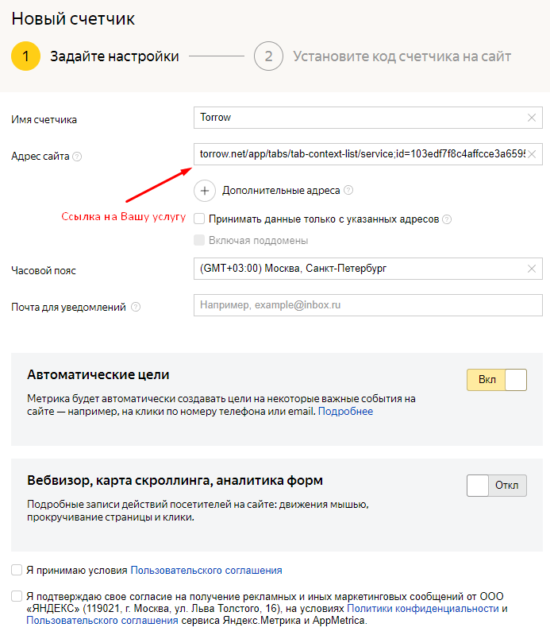

----------------------------

3. Нажмите на кнопку **Создать счетчик**.

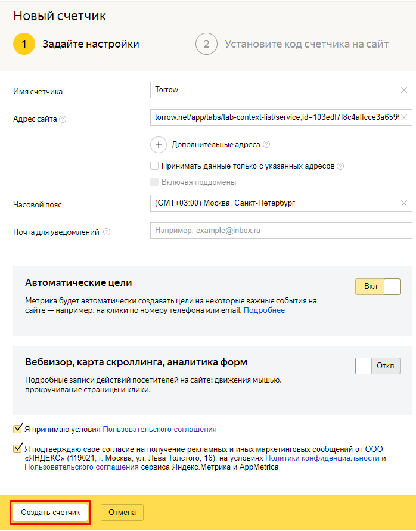

----------------------------

4. Выберите способ **CMS и конструкторы сайтов**. Для сбора аналитики Вам понадобится номер счетчика, скопируйте его.

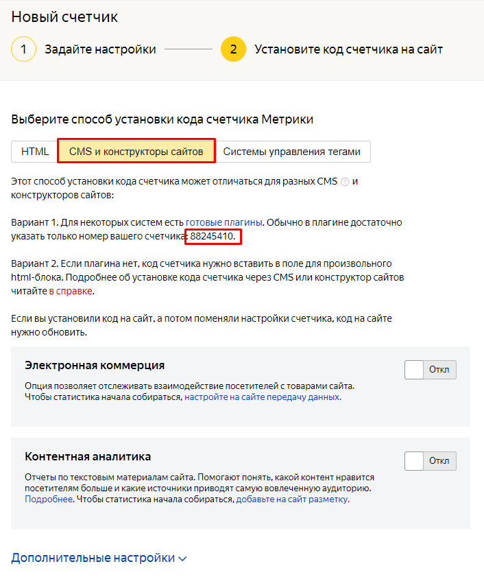

----------------------------

5. Нажмите на кнопку **Начать пользоваться**.

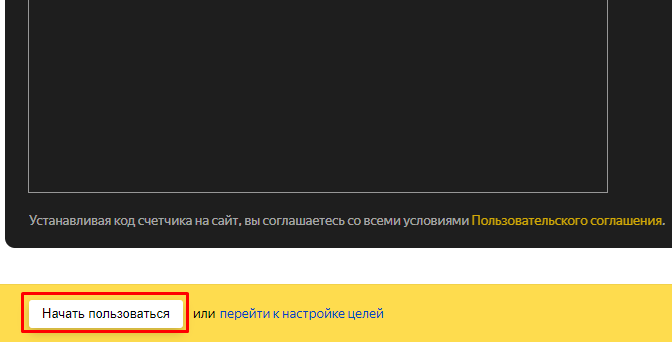

----------------------------

6. Счетчик создан. Теперь перейдите в элемент torrow, где планируется сбор статистики.

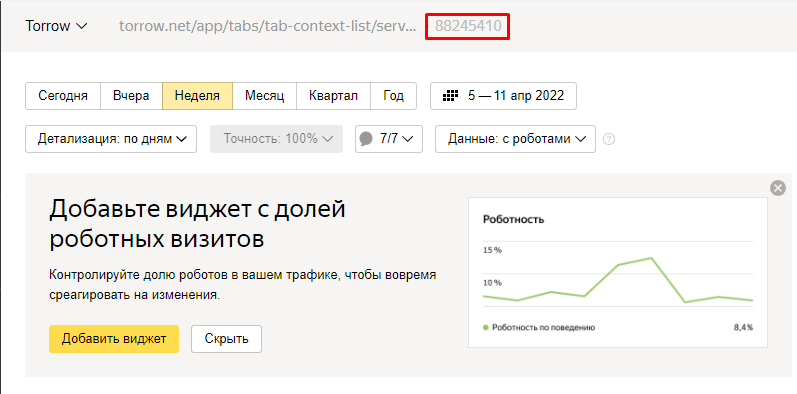

----------------------------

7. Перейдите в **Общие настройки**, выберите **Инструменты аналитики**.

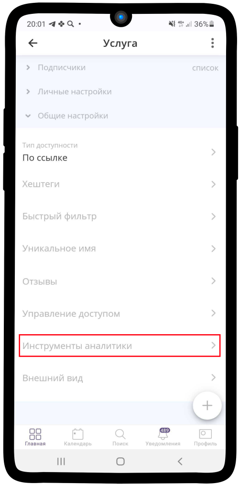

----------------------------

8. Укажите номер счетчика в поле Код Яндекс.Метрики. Сохраните измнения, нажав на |галка|.

    .. |галка| image:: media/galka.png
        :scale: 42 %

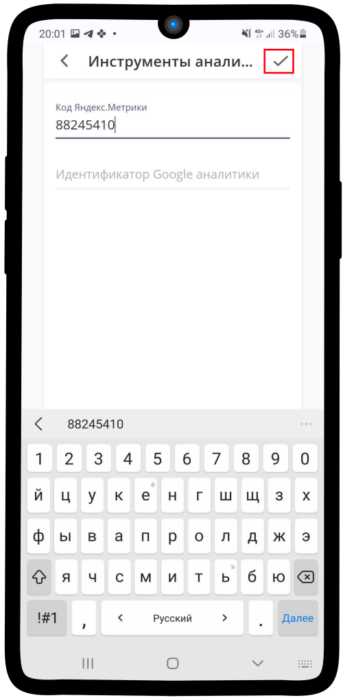

----------------------------

При необходимости можно добавиль Цель - Создание заказа

1. Для этого откройте вкладку **Цели** в Яндекс.Метрике.
   
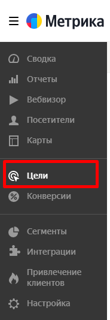

----------------------------

2. Нажмите на кнопку **Добавить цель**.

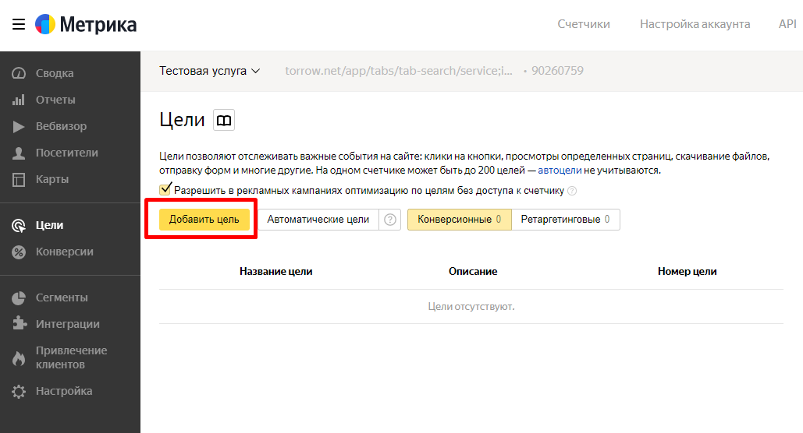

----------------------------

3. Впишите название Цели, выберите **Тип условия** - **JavaScript-событие** и впишите **Индентификатор цели** - **orderCreated**.

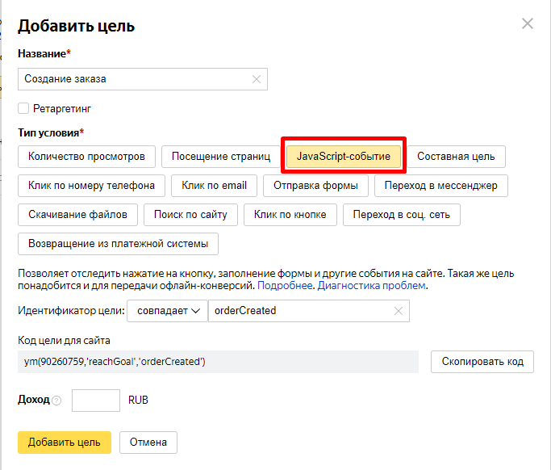

----------------------------

Нажмите на **Добавить цель** - Цель начнет работать **автоматически**.

----------------------------
Подключение Google Analytics
----------------------------

1. Зайдите в свой аккаунт Google Аналитики или создайте новый, как изображено ниже.

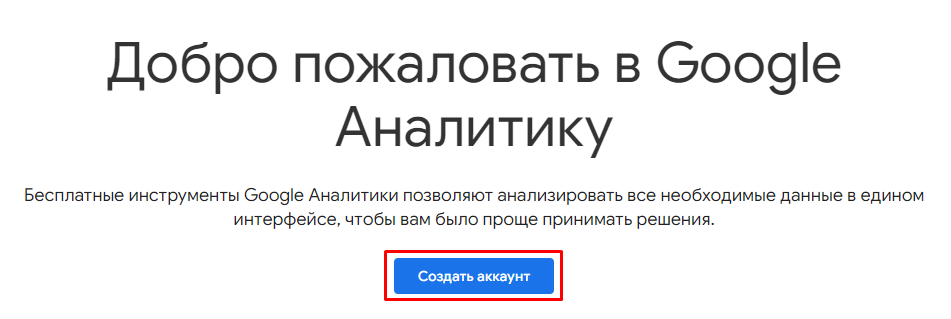

----------------------------

2. Задайте **Название аккаунта**, нажмите **След.**

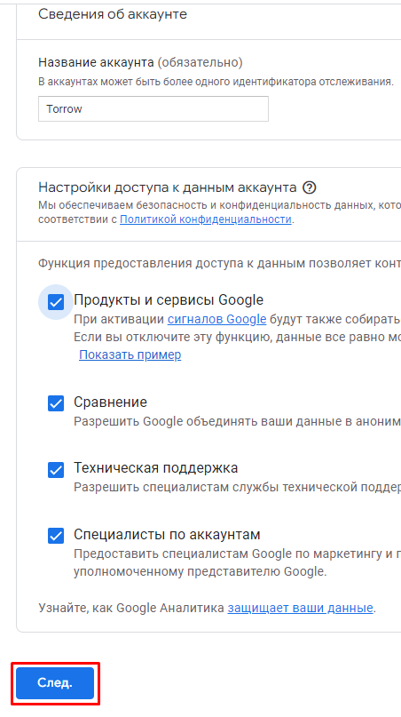

----------------------------

3. Укажите название для ресурса, оно никак не связано с ресурсом torrow. Выберите нужный часовой пояс и валюту. Нажмите **Далее**.

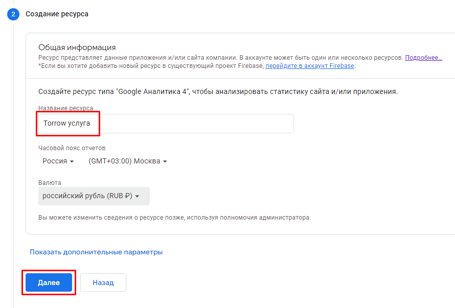

----------------------------

4. Внесите информацию о своей компании и нажмите **Создать**.

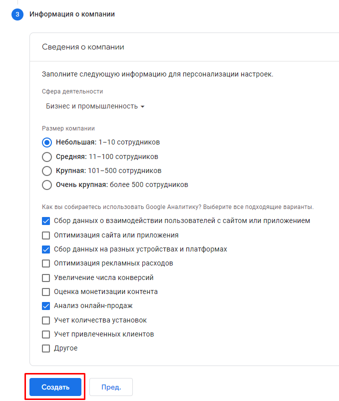

----------------------------

5. Укажите настройки электронной рассылки по своему усмотрению. **Сохраните** изменения.

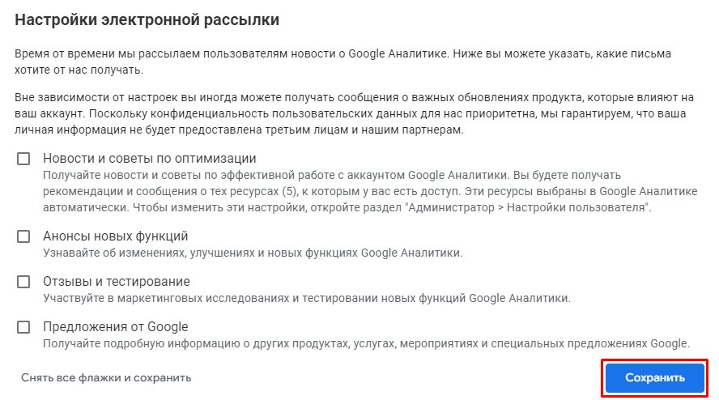

----------------------------

6. Выберите платформу **Веб**.

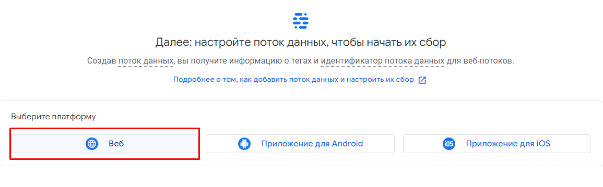

----------------------------

7. Выберите URL веб-сайта **https://** и укажите ссылку на элемент (например, услугу) в поле отмеченное стрелкой. Впишите название для потока. Сохрание изменения по кнопке **Создать поток**.

.. hint:: При вводе ссылки **https://** указывать не надо, так как он прописан в поле слева.

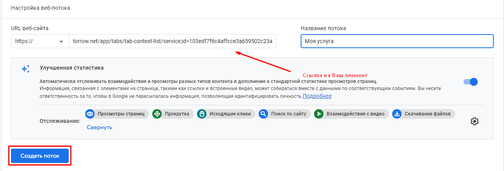

----------------------------

8. Ваш поток готов. Скопируйте **идентификатор потока данных**.

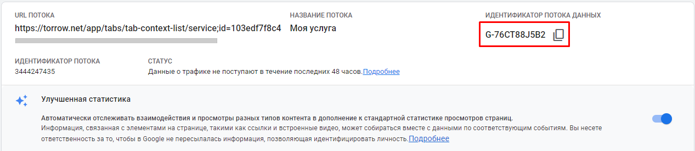

----------------------------

9.  Перейдите в **Общие настройки**, выберите **Инструменты аналитики**.

----------------------------

10. Укажите номер счетчика в поле **Идентификатор Google аналитики**. Сохраните измнения, нажав на |галка|.

    .. |галка| image:: media/galka.png
        :scale: 42 %

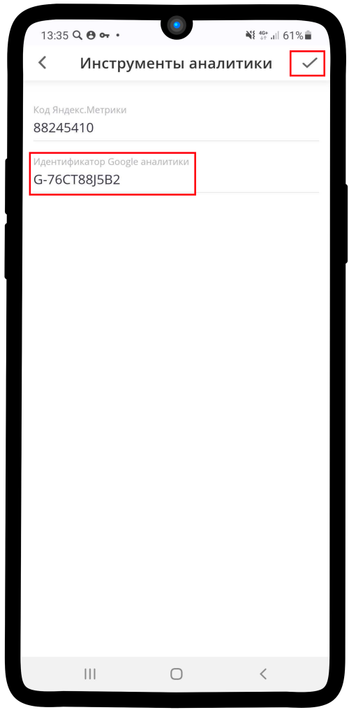

.. raw:: html
   
   <torrow-widget
      id="torrow-widget"
      url="https://web.torrow.net/app/tabs/tab-search/service;id=103edf7f8c4affcce3a659502c23a?closeButtonHidden=true&tabBarHidden=true"
      modal="right"
      modal-active="false"
      show-widget-button="true"
      button-text="Заявка эксперту"
      modal-width="550px"
      button-style = "rectangle"
      button-size = "60"
      button-y = "top"
   ></torrow-widget>
   

.. raw:: html

   <!--  -->