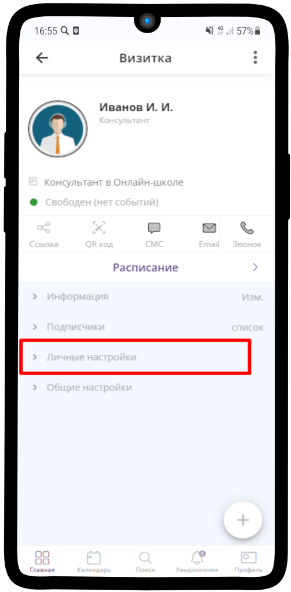
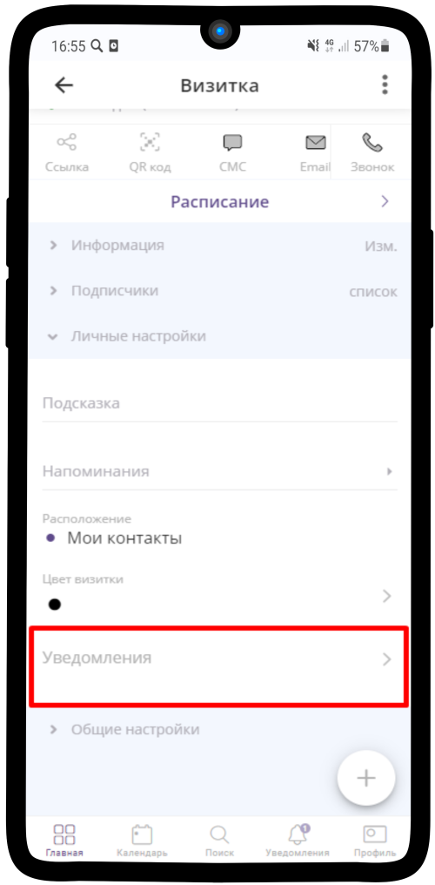
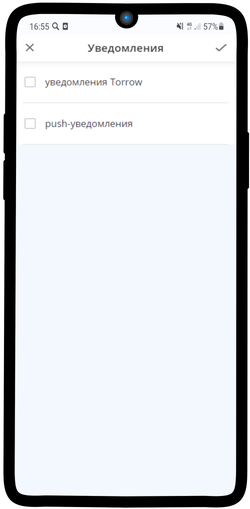
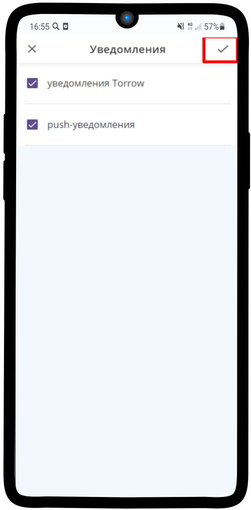

=================================
Как включить уведомления в приложении?
=================================

**Если Вам необходимо подключить уведомления, воспользуйтесь инструкцией:**

.. note:: Данный способ подключения уведомлений подходит для всех элементов

1. Перейдите в **Личные настройки** Вашей Визитки

----------------------------------------

2. Нажмите на пункт **Уведомления**

----------------------------------------

3. Выберите подходящий Вам вариант

----------------------------------------

И нажмите на |галка|, чтобы сохранить изменения

    .. |галка| image:: media/galka.png
        :scale: 42 %

----------------------------------------

