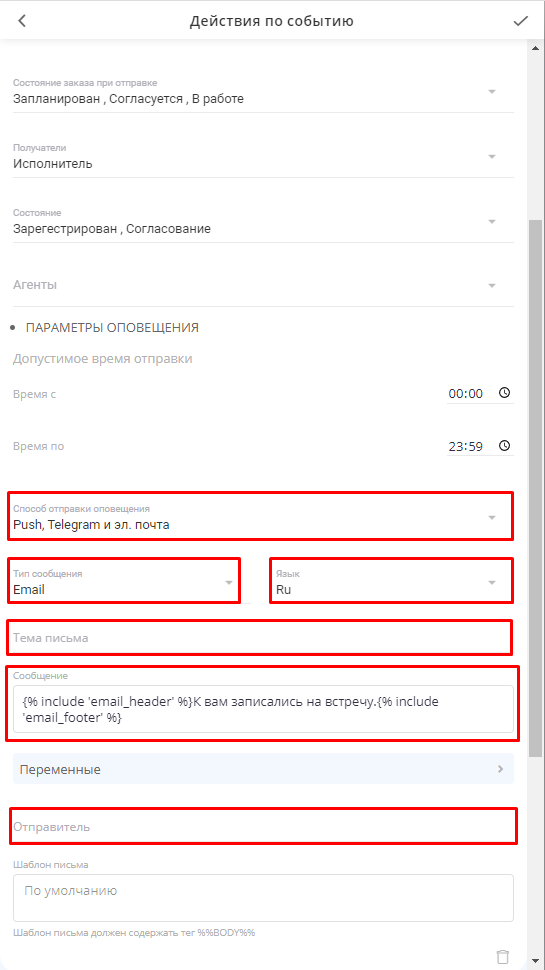

===========================================================
Как настроить оповещения о заказах клиентам и исполнителям?
===========================================================

    .. |галка| image:: media/galka.png
        :scale: 42 %

**Если Вам необходимо подключить оповещения в услуге, воспользуйтесь инструкцией:**

.. note:: Типы действий оповещений:
    
    * Сообщение по времени
    * Сообщение по операции
    * Запросить подтверждение участия по времени
    * Отменить неподтвержденные участия по времени
    * Изменить заказ по операции
    * Изменить заказ по времени
    * Итеграция по операции
    * Интеграция по времени

1. Откройте услугу и нажмите на |точка| в правом верхнем углу

    .. |точка| image:: media/tochka.png
        :scale: 42 %

.. figure:: media/notification/notification2.png
    :scale: 42 %
    :alt: alternate text
    :align: center

----------------------------------------

2. Нажмите на пункт **Изменить** в выпадающем меню

.. figure:: media/notification/notification3.png
    :scale: 42 %
    :alt: alternate text
    :align: center

----------------------------------------

3. Выберите пункт **Действия**

----------------------------------------

.. note:: У всех типов оповещений есть несколько способов отправки. Используйте одну из представленных для отправки сообщений клиентам и Исполнителям.

    * Push, Telegram и эл. почта
    * Push, эл. почта или смс
    * Push, эл. почта и смс

Как настроить Push-уведомления
------------------------------

По умолчанию у Вас уже прописан текст оповещения в зависимости от типа **действия**.

.. code-block::

    Вы записаны на встречу.

Вы можете менять текст, который находится за **фигурными скобками ()** по своему усмотрению. В данном случае все, что написано на кириллице.

Как настроить смс-уведомления
------------------------------

По умолчанию у Вас уже прописан текст оповещения в зависимости от типа **действия**.

.. code-block::

    Вы записаны на встречу.

Вы можете менять текст, который находится за **фигурными скобками ()** по своему усмотрению. В данном случае все, что написано на кириллице.

.. note:: Текст сообщения не должен превышать 77 символов (кириллица). В случае превышения будет списана стоимость 2 и более смс-сообщений.

Как настроить Email-уведомления
-------------------------------

По умолчанию у Вас уже прописан текст оповещения в зависимости от типа **действия**.

.. code-block::

    Вы записаны на встречу.

Вы можете менять текст, который находится за **фигурными скобками ()** по своему усмотрению. В данном случае все, что написано на кириллице.

Также Вы можете поменять некоторые блоки в содержании письма. Например, надписи: детали заказа, тема встречи, torrow и пр.

**Сделать это можно с помощью следующих параметров:**

* RESOURCE_NAME - наименование **ресурсов** в деталях заказа
* DETAIL_SECTION_NAME - наименование блока **Детали заказа**
* SIGN_TEXT - **подпись** в письме (по умолчанию torrow). Помимо подписи Вы можете подставить ссылку на свой сайт или любой другой интернет-ресурс.

Пример заполнения вышеуказанных параметров для email-оповещений.

.. code-block::

    Вы записаны на прием в онлайн-школу Torrow.

.. note:: Соблюдайте наличие всех символов в примере выше. Старайтесь менять только значения, которые прописаны на русском языке, в противном случае сообщение на почту не будет отправляться.

Кастомизация шаблона email-оповещения
-------------------------------------

Вы можете отредактировать письмо, которое получат Ваши клиенты, вставив в поле **Шаблон письма** готовый шаблон (пример указан ниже). Обязательным условием является наличие тега **%%BODY%%** в теле шаблона.

Вы можете указать  **Тему письма** и в поле **Отправитель** задать "Имя компании <noreply@torrowtech.com>". Есть возможность кастомизировать **Шаблон письма**

----------------------------------------

.. literalinclude:: email_template.html

Здесь Вы можете скачать файл с Шаблоном письма :download:`email_template.html`

----------------------------------------

Добавление оповещений
---------------------

1. Если Вы не хотите самостоятельно настраивать оповещения, то воспользуйтесь функцией **Сбросить по умолчанию**. В таком случае автоматически добавится 14 типов действий, которые покрывают практически все существующие потребности в рассылке.

2. Если же Вы хотите настроить каждое действие самостоятельно, то используйте надпись **Добавить действие**.

3. Перед Вами появится список преднастроенных оповещений, которые Вы сможете отредактировать под свои задачи. Принцип отправки будет понятен из приведенных названий.

--------------------------------------

Сообщение участнику о записи
~~~~~~~~~~~~~~~~~~~~~~~~~~~~

1. Рассмотрим на примерах настройки оповещения при записи участника, напоминания и подтверждения участия. Выберите действие **Сообщение участнику о записи**.

2. Перед Вами появится форма с настройками оповещения: список операций, состояние заказа при отправке, список получателей, допустимое время отправки, способ отправки, тип, язык и само сообщение.

.. note:: При операции **Участник зарегистрирован** рекомендуем изменять только способ отправки, тип и само сообщение.

* **Допустимое время отправки** - это время, в которое можно направлять сообщение. Если клиент записался позже или раньше указанного времени, сообщение отправлено не будет.
* **Получатели** - пользователи, которые получат оповещение. Всего можно выбрать три типа получателей: сам **участник** заказа, его **исполнитель** и **сопровождающий** заказа.
* **Способы записи на услугу** - в зависимости от того, кто записал участника можно рассылать разные типы сообщений.

--------------------------------------

Сообщение Исполнителю о записи
~~~~~~~~~~~~~~~~~~~~~~~~~~~~~~

1. Выберите действие **Сообщение исполнителю о записи**.

2. Перед Вами появится форма с настройками оповещения: список операций, состояние заказа при отправке, список получателей, допустимое время отправки, способ отправки, тип, язык и само сообщение.

.. note:: При операции **Участник зарегистрирован** рекомендуем изменять только способ отправки, тип и само сообщение. Получателей сообщения не изменяйте, по умолчанию оно отправится только Исполнителю заказа.

----------------------------------------

Напоминание Участнику или Исполниелю о записи
~~~~~~~~~~~~~~~~~~~~~~~~~~~~~~~~~~~~~~~~~~~~~

1. Выберите действие **Напоминание за 2 часа участнику события** или **Напоминание за 1 час исполнителю события**.

2. Перед Вами появится форма с настройками оповещения: список операций, состояние заказа при отправке, список получателей, допустимое время отправки, время отправки оповещения, способ отправки, тип, язык и само сообщение. В первую очередь проставьте время отправки оповещения **До начала события** или **После начала события** и укажите время. По умолчанию учасстнику оповещение отправляется за 2 часа до начала записи.

.. note:: Рекомендуем изменять только способ отправки, тип, само сообщение и время отправки напоминания.

--------------------------------------------

Запрос подтверждения участия в записи
~~~~~~~~~~~~~~~~~~~~~~~~~~~~~~~~~~~~~~

Запрос подтверждения - это один из самых важных типов оповещений, так как он направляет участнику заказа сообщение (email, смс, telegram) со ссылкой на заказ с возможностью его подтверждения. Таким образом Вы будете точно знать актуальность заказа.

1. Чтобы настроить запрос подтверждения участия в записи, нажмите **Добавить действие** и выберите пункт **Запрос о подтверждении участия в событии**.

2. Вы можете выбрать за какое время отправлять сообщение о подтверждении и указать длительность подтверждения. Также указать доупустимое время отправки, чтобы клиент не получил сообщение глубокой ночью.

.. note:: Рекомендуем изменять только способ отправки, тип, само сообщение, время отправки сообщения и длительность.

--------------------------------------------

.. raw:: html
   
   <torrow-widget
      id="torrow-widget"
      url="https://web.torrow.net/app/tabs/tab-search/service;id=103edf7f8c4affcce3a659502c23a?closeButtonHidden=true&tabBarHidden=true"
      modal="right"
      modal-active="false"
      show-widget-button="true"
      button-text="Заявка эксперту"
      modal-width="550px"
      button-style = "rectangle"
      button-size = "60"
      button-y = "top"
   ></torrow-widget>
   

.. raw:: html

   