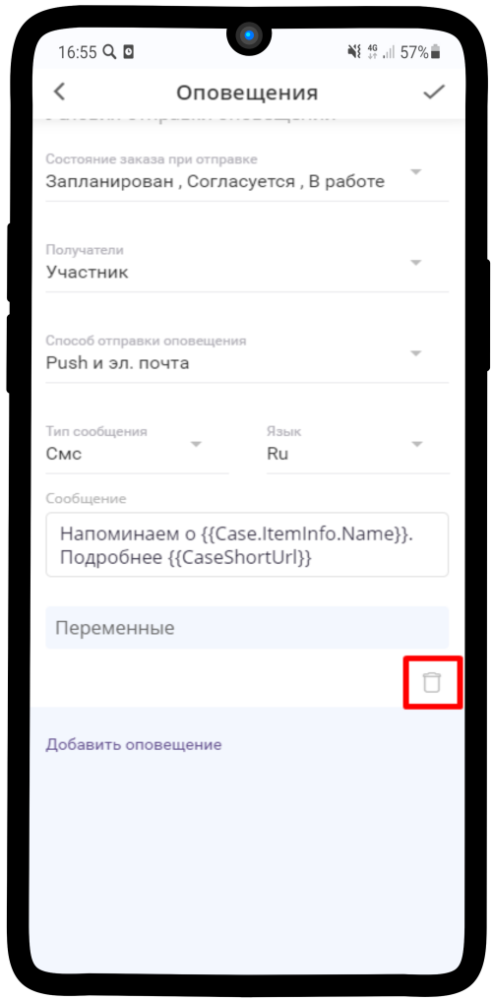

=================================
Как настроить оповещения о заказах?
=================================

**Если Вам необходимо подключить оповещения, воспользуйтесь инструкцией:**

.. note:: Типы оповещений:
    
    * `Заказ создан`_
    * `Напоминание о заказе`_
    * `Подтверждение участия`_

1. Откройте услугу и нажмите на |точка| в правом верхнем углу

    .. |точка| image:: media/tochka.png
        :scale: 42 %

----------------------------------------

2. Нажмите на пункт **Изменить** в выпадающем меню

----------------------------------------

3. Выберите пункт **Оповещения**

----------------------------------------

Заказ создан
--------------

1. При создании услуги автоматически настраивается **оповещение о создании заказа**

----------------------------------------

2. Нажав на дропдаун, Вы можете изменить **Тип оповещения**

----------------------------------------

3. Также Вы можете настроить **Время отправки оповещения** - это время, в которое сообщение будет доставлено клиенту

----------------------------------------

----------------------------------------

4. **Состояние заказа при отправке** - отметьте необходимые Вам

----------------------------------------

----------------------------------------

5. Также можно настроить **Получателей**

----------------------------------------

6. Выберите **Способ отправки оповещения** удобный для Вас
   
.. hint:: СМС-оповещения оплачиваются дополнительно  

----------------------------------------

7. Вы можете скорректировать текст оповещения

.. hint:: Длина смс-сообщения составляет 70 символов

----------------------------------------

С помощью необходимых **Переменных** можно составить нужный текст

----------------------------------------

8. Другой вид оповещения можно добавит, нажав на **Добавить оповещение**

----------------------------------------

Напоминание о заказе
------------------------

Настройка **Напоминаний о заказе** аналогична **О создании заказа**

.. figure:: media/notification/notification13.png
    :scale: 42 %
    :alt: alternate text
    :align: center

----------------------------------------

Подтверждение участия
-----------------------

.. note:: Оповещение о **Подтверждении участия** - клиенту нужно будет перейти по ссылке и подтвердить своё участие

----------------------------------------

Если поставить галочку в этом поле, то заказ будет отменен, если участник не подтвердит своё участие в течение установленного времени

----------------------------------------

Установите необходимо время подтверждения

----------------------------------------

Вы можете удалить ненужные Оповещения, нажав на корзину

----------------------------------------

И нажмите на |галка|, чтобы сохранить изменения

    .. |галка| image:: media/galka.png
        :scale: 42 %

----------------------------------------

.. .. raw:: html
   
..    <torrow-widget
..       id="torrow-widget"
..       url="https://web.torrow.net/app/tabs/tab-search/service;id=103edf7f8c4affcce3a659502c23a?closeButtonHidden=true&tabBarHidden=true"
..       modal="right"
..       modal-active="false"
..       show-widget-button="true"
..       button-text="Заявка эксперту"
..       modal-width="550px"
..       button-style = "rectangle"
..       button-size = "60"
..       button-y = "top"
..    ></torrow-widget>
..    

.. .. raw:: html

..    