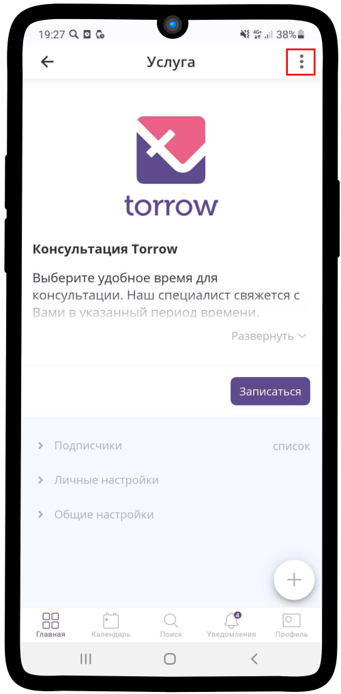
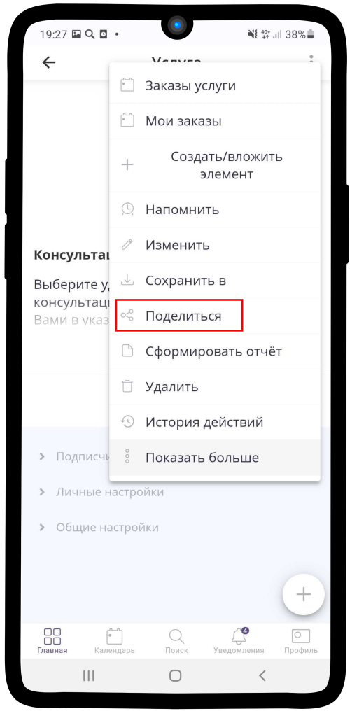
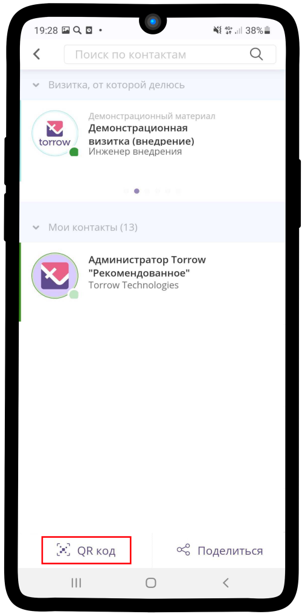
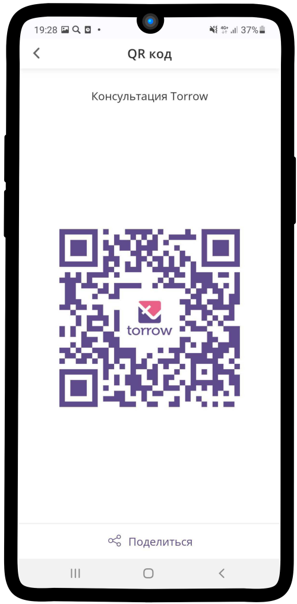

.. _qr-code:

=============================================
Как создать QR-код услуги и других элементов?
=============================================

   .. |точка| image:: media/tochka.png
      :width: 21
      :alt: alternative text

1. Зайдите в нужный элемент и нажмите на |точка|

-----------------------

2. Выберите **Поделиться**

-----------------------

3. В левом нижнем углу нажмите **QR код**. 

-----------------------

4. Теперь Вы можете поделиться QR-кодом в социальной сети, мессенджере или сохранить его на устройство.

.. raw:: html
   
   <torrow-widget
      id="torrow-widget"
      url="https://web.torrow.net/app/tabs/tab-search/service;id=103edf7f8c4affcce3a659502c23a?closeButtonHidden=true&tabBarHidden=true"
      modal="right"
      modal-active="false"
      show-widget-button="true"
      button-text="Заявка эксперту"
      modal-width="550px"
      button-style = "rectangle"
      button-size = "60"
      button-y = "top"
   ></torrow-widget>
   

.. raw:: html

   <!--  -->