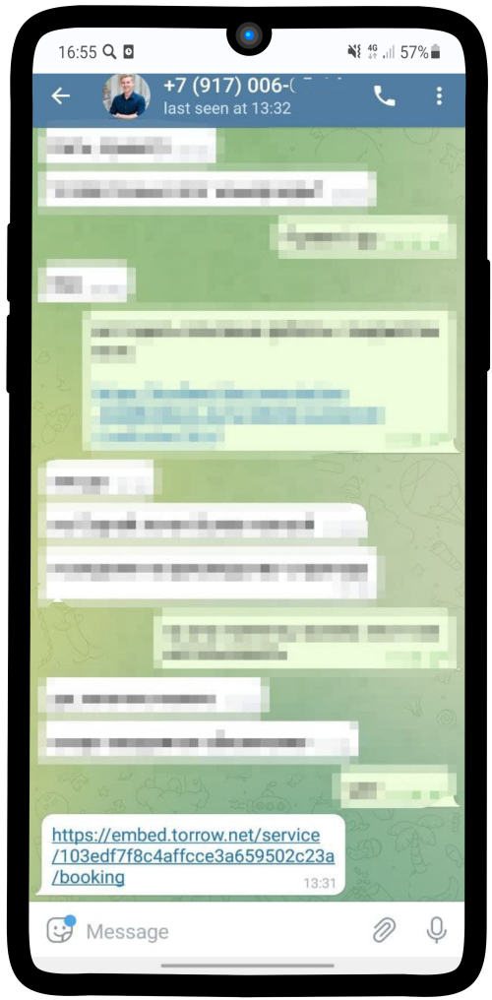
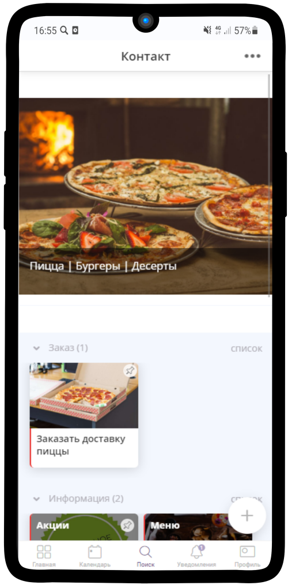
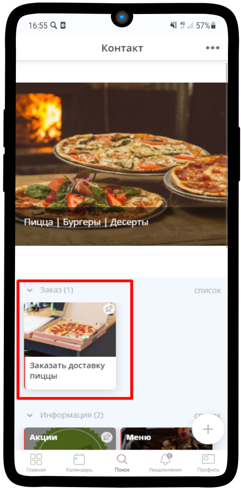
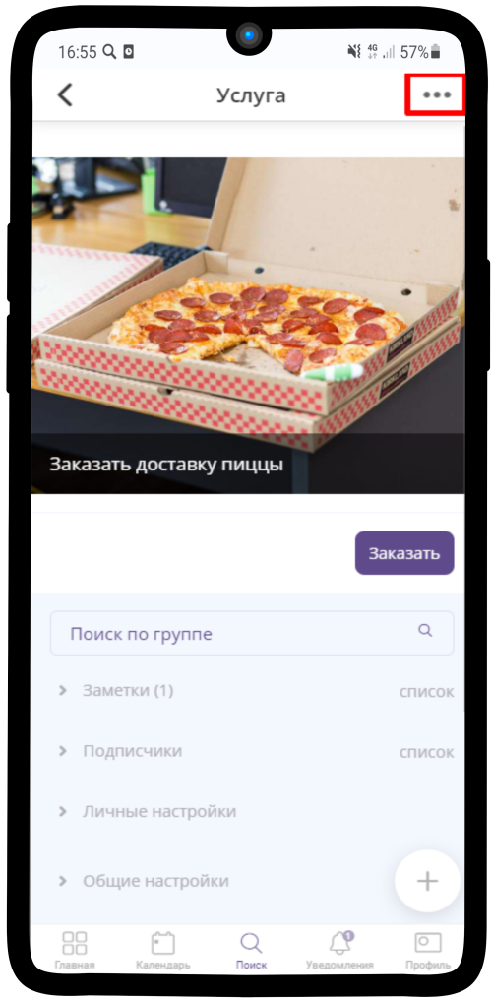
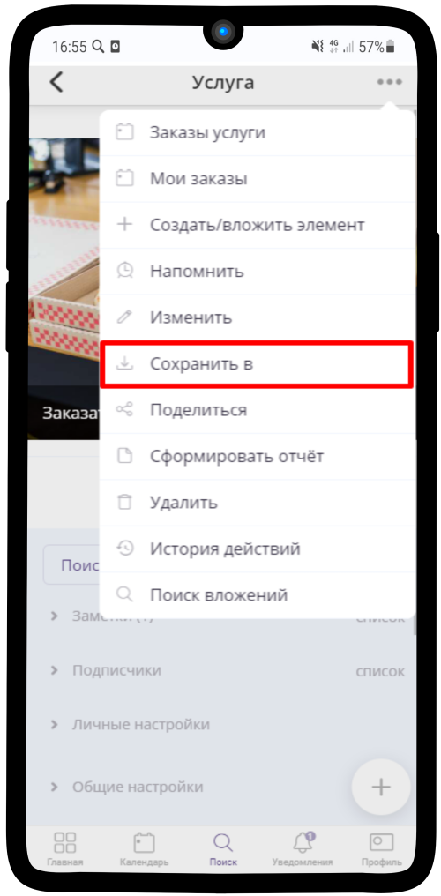
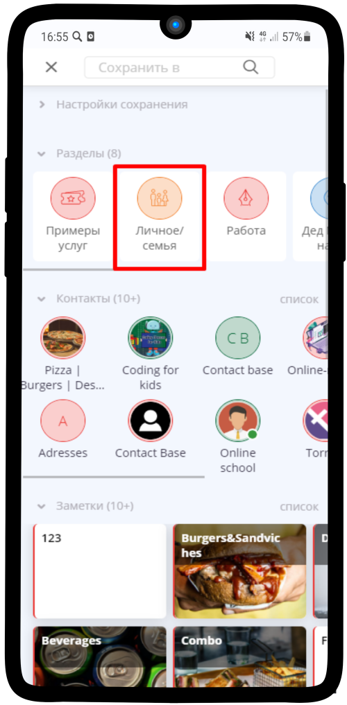
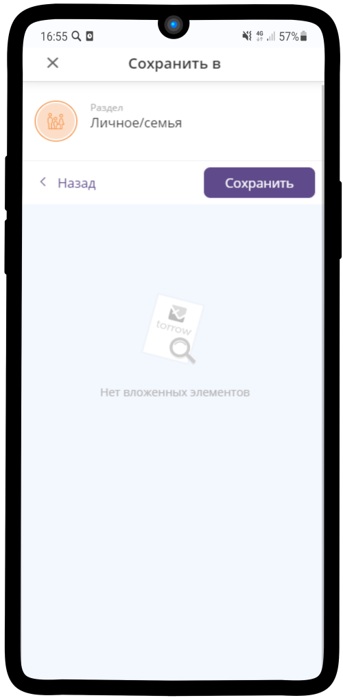
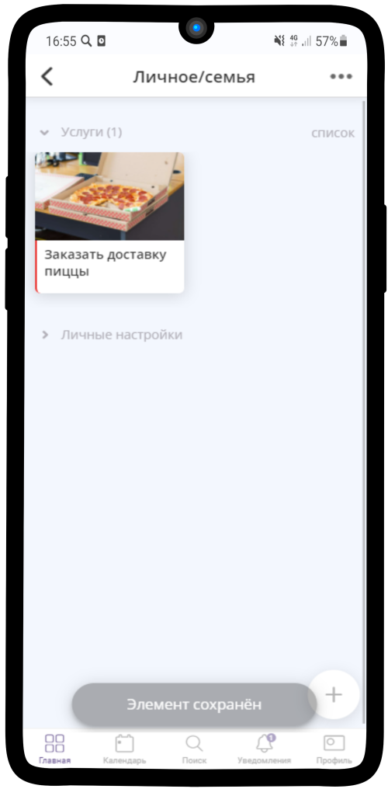

=========================
Как сохранить элемент себе?
=========================

   .. |точка| image:: media/tochka.png
      :width: 21
      :alt: alternative text

Чтобы не искать каждый раз в переписке ссылку для записи, нужный контакт или любой другой элемент, можно сохранить услугу или контакт себе

-----------------------

1. Откройте нужный Вам элемент

-----------------------

2. Например, услугу "Заказать доставку пиццы"

-----------------------

3. Нажмите на |точка| в правом верхнем углу

-----------------------

4. В выпадающем меню выберите пункт **Сохранить в**

-----------------------

5. Выберите место, куда хотите сохранить элемент, например, раздел **Личное/семья**

-----------------------

6. Нажмите на кнопку **Сохранить**

-----------------------

7. Теперь Вам не нужно искать элементы или переходить по ссылкам — нужный Вам элемент сохранен в Вашем личном разделе

-----------------------

.. raw:: html
   
   <torrow-widget
      id="torrow-widget"
      url="https://web.torrow.net/app/tabs/tab-search/service;id=103edf7f8c4affcce3a659502c23a?closeButtonHidden=true&tabBarHidden=true"
      modal="right"
      modal-active="false"
      show-widget-button="true"
      button-text="Заявка эксперту"
      modal-width="550px"
      button-style = "rectangle"
      button-size = "60"
      button-y = "top"
   ></torrow-widget>
   

.. raw:: html

   <!--  -->