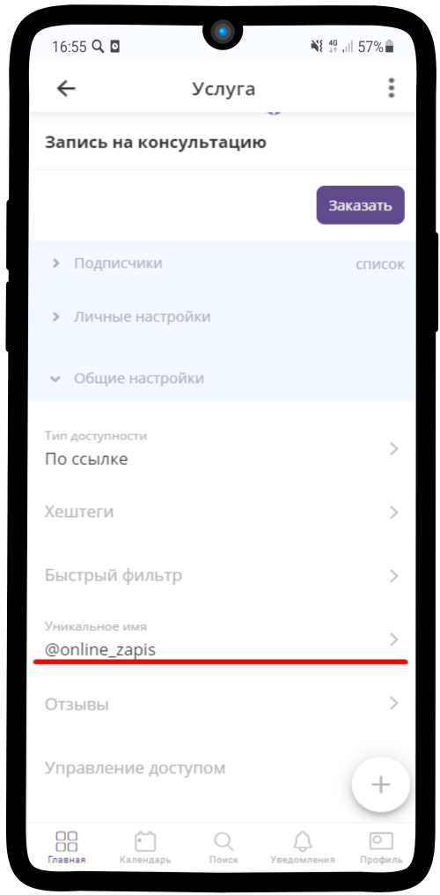

=================================
Как оплатить подписку на сервис?
=================================

   .. |галка| image:: media/galka.png
      :width: 21
      :alt: alternative text

Для оплаты подписки на сервис Torrow банковской картой нужно:

#.	В личном кабинете Torrow откройте раздел **Профиль** и выберите пункты **Мой бизнес** \ **Тарифный план**;

#.	Найдите услугу **Покупка тарифного плана**, нажмите на Услугу, чтобы ее открыть и нажните кнопку **Записаться**;

#.	Выберите Тарифный план;

#.	Выберите дополнительные опции, если они вам необходимы, и нажмите кнопку **Далее**;

#.	Выберите дату, с которой начинает действовать тарифный план;

#.	Пройдите по шагам дальше, включая оплату подписки на платежной форме банка.

Ниже приведены экраны перечисленных шагов.

1. Откройте в приложении раздел **Профиль**

.. figure:: media/unique_name/unique1.png
    :scale: 42 %
    :alt: alternate text
    :align: center

-----------------------

2. Выберите пункт **Мой бизнес** и далее **Тарифный план**

.. figure:: media/unique_name/unique2.png
    :scale: 42 %
    :alt: alternate text
    :align: center

-----------------------

3. Проверьте наличие активных подписок на сервис Torrow и срок их действия

.. figure:: media/unique_name/unique3.png
    :scale: 42 %
    :alt: alternate text
    :align: center

-----------------------

4. Нажмите на услугу **Покупка тарифного плана**, чтобы запустить покупку

.. figure:: media/unique_name/unique4.png
    :scale: 42 %
    :alt: alternate text
    :align: center

-----------------------

5. Выберите тарифный план с требуемым сроком действия, выберите дополнительные опции и кнопку **Далее**

-----------------------

6. Выберите дату, с которой будет действовать выбранный Тарифный план

.. figure:: media/unique_name/unique4.png
    :scale: 42 %
    :alt: alternate text
    :align: center

-----------------------

7. Проверьте корректность контактной информации, при необходимости подправьте ФИО, номер телефона или email и нажмите кнопку **Далее**

.. figure:: media/unique_name/unique4.png
    :scale: 42 %
    :alt: alternate text
    :align: center

-----------------------

8. На форме созданного заказа нажмите кнопку **Оплатить**, чтобы открыть банковскую платежную форму

.. figure:: media/unique_name/unique4.png
    :scale: 42 %
    :alt: alternate text
    :align: center

-----------------------

9. После выполнения оплаты заказ окажется оплаченным и подписка на сервис Torrow будет продлена.

.. figure:: media/unique_name/unique4.png
    :scale: 42 %
    :alt: alternate text
    :align: center

-----------------------

.. raw:: html
   
   <torrow-widget
      id="torrow-widget"
      url="https://web.torrow.net/app/tabs/tab-search/service;id=103edf7f8c4affcce3a659502c23a?closeButtonHidden=true&tabBarHidden=true"
      modal="right"
      modal-active="false"
      show-widget-button="true"
      button-text="Заявка эксперту"
      modal-width="550px"
      button-style = "rectangle"
      button-size = "60"
      button-y = "top"
   ></torrow-widget>
   

.. raw:: html

   <!--  -->