=================================
Как работать с заказами услуги?
=================================

.. note::
    
    * `Просмотр заказов услуги`_
    * `Просмотр истории исполнения заказа`_
    * `Перенос заказа`_
    * `Отмена заказа`_
    * `Отмена участия в заказе клиентом`_
    * `Изменение контактных данных`_
    * `Поиск заказа`_

-------------------------
Просмотр заказов услуги
-------------------------

Чтобы посмотреть все текущие **заявки на консультацию**:

1. Зайдите в необходимую **услугу**.

.. figure:: media/service_order/mpz5.png
    :scale: 42 %
    :alt: alternate text
    :align: center

-----------------------

2. Нажмите на кнопку |точка|.

    .. |точка| image:: media/tochka.png
        :scale: 42 %

.. figure:: media/service_order/orders.png
    :scale: 42 %
    :alt: alternate text
    :align: center

-----------------------

3. В появившемся меню выберите **Заказы услуги**.

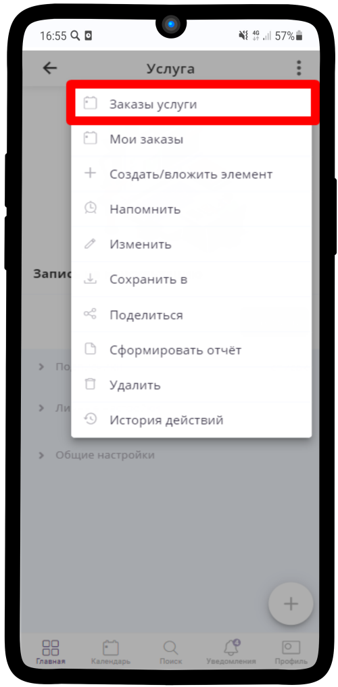

-----------------------

4. Перед Вами список заказов, которые разделены на категории по **статусам выполнения**. Перейдите в одну из вкладок.

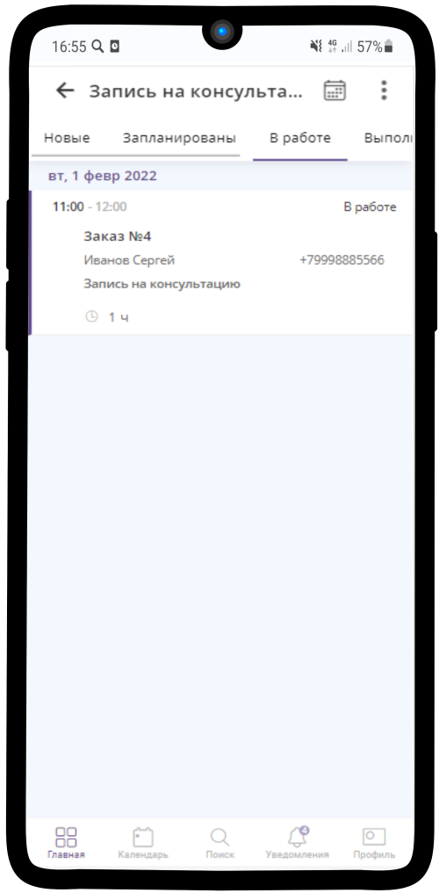

-----------------------

5. Нажмите на имеющийся **Заказ** и на детали заказа |корзина|.

    .. |корзина| image:: media/shopping-cart.png
        :scale: 42 %

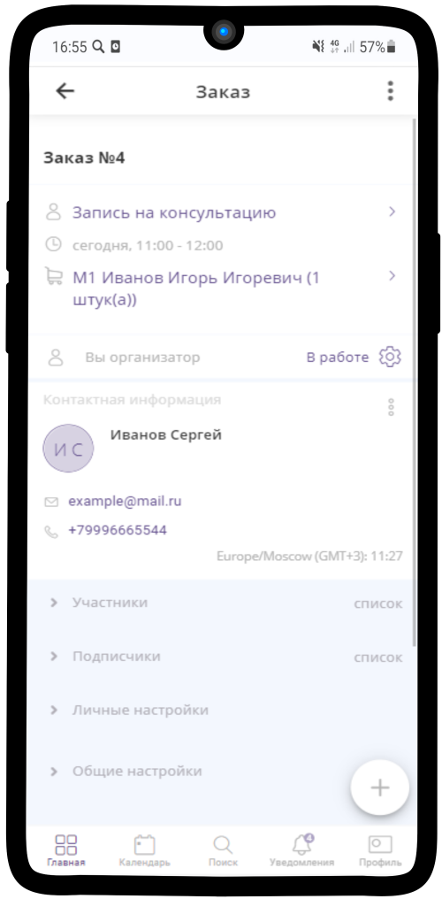

-----------------------

6. Перед Вами откроется **детальная информация** о заказе.

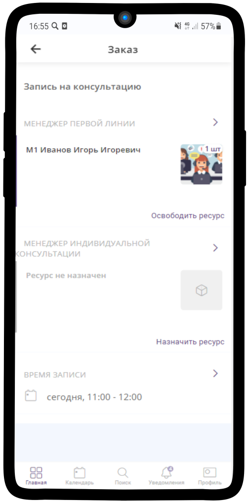

-----------------------

-------------------------
Просмотр истории исполнения заказа
-------------------------

.. note:: Из истории действий над заказом можно узнать информацию о всех операциях совершенных над заказом с учетом времени изменений и исполнителей.

1. Чтобы посмотреть историю действий над заказом, перейдите в нужный заказ.

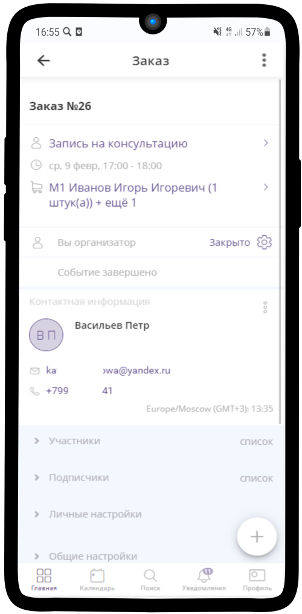

------------------------------------

2. Нажмите на |точка| в правом верхнем углу и из выпадающего меню выберите "История действий".

   .. |точка| image:: media/tochka.png
    :scale: 42 %

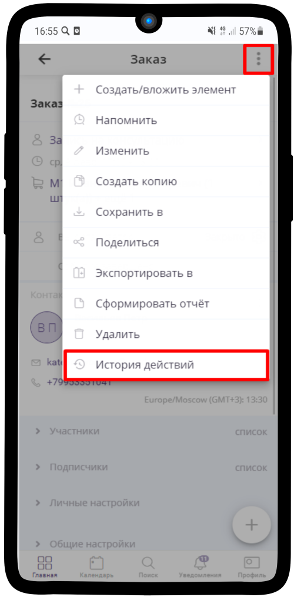

------------------------------------

3. В истории действий можно посмотреть все операции над заказом, а также кто их производил.

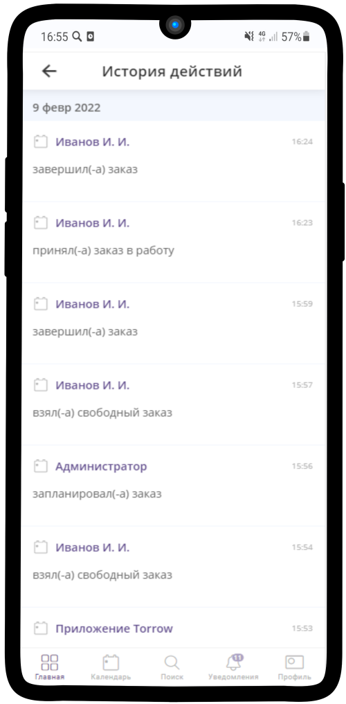

------------------------------------

-------------------------
Перенос заказа
-------------------------

Если клиент попросил перенести Консультацию на другое время, то:

1. Нажмите на кнопку **Перенести заказ**

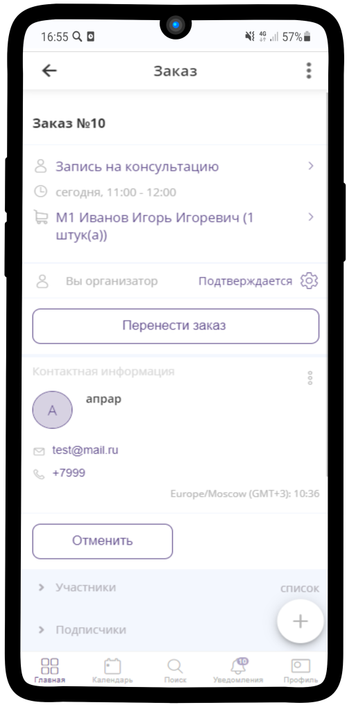

-------------------------------

2. Выберите подходящее время и нажмите кнопку **Подтвердить**

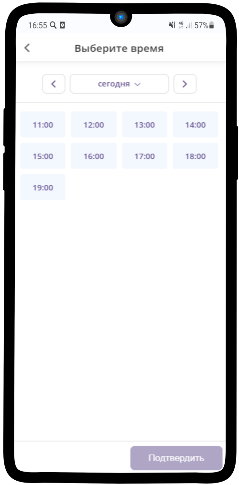

-------------------------------

3. Время консультации изменилось

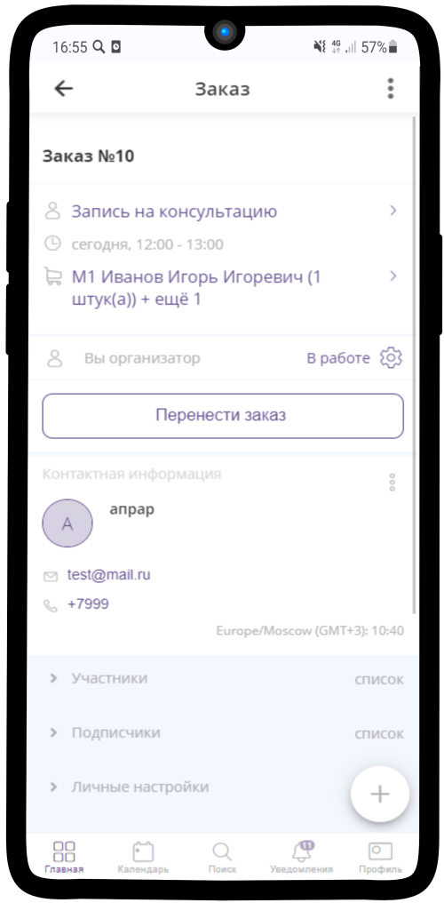

-------------------------------

-------------------------
Отмена заказа
-------------------------

Отменить заказ можно по кнопке **Отменить**

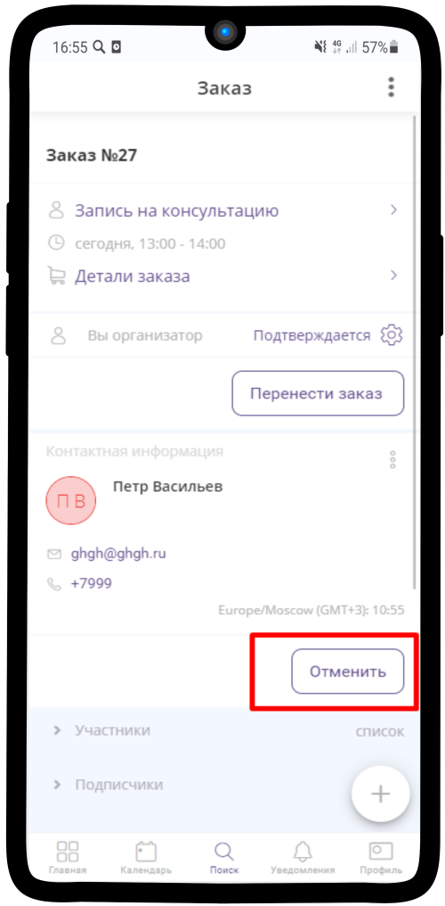

--------------------------

1. Также **отменить** заказ можно, нажав на кнопку **Подтверждается** |шарнир|.
    
    .. |шарнир| image:: media/nastroy.png
        :scale: 42 %

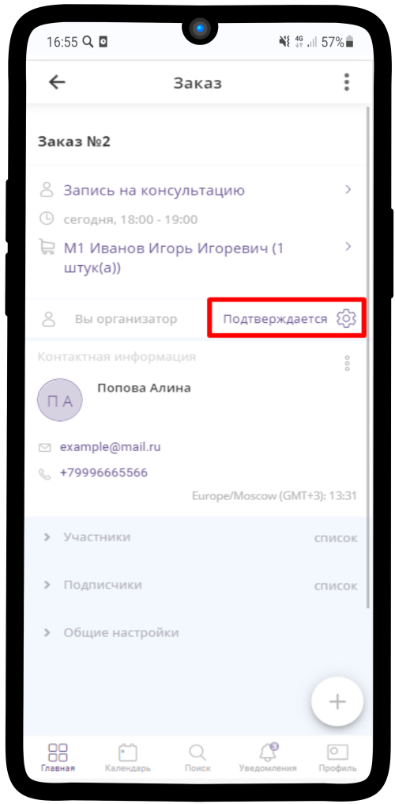

--------------------------

2. В появившемся меню выберите **Изменить состояние**.

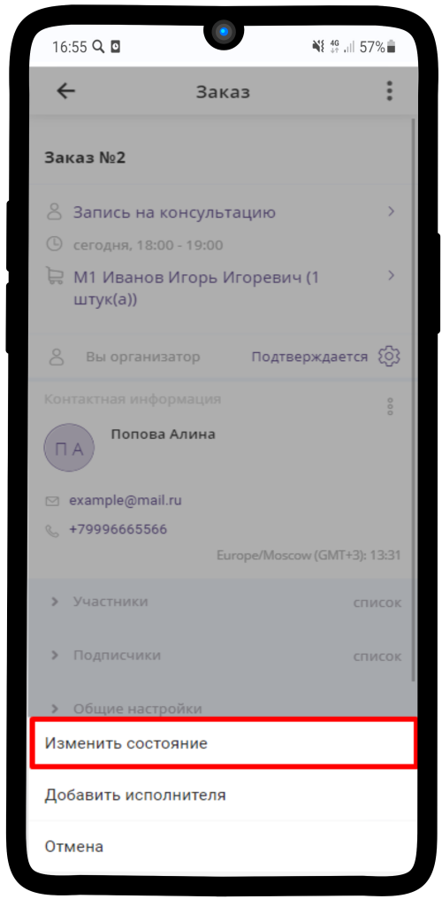

--------------------------

3. Выберите **Отклонить** и нажмите |галка|.

    .. |галка| image:: media/galka.png
        :scale: 42 %

.. hint:: Если необходимо отправить сообщение клиенту при отмене заявки, просто введите его в поле **Сообщение участникам**.

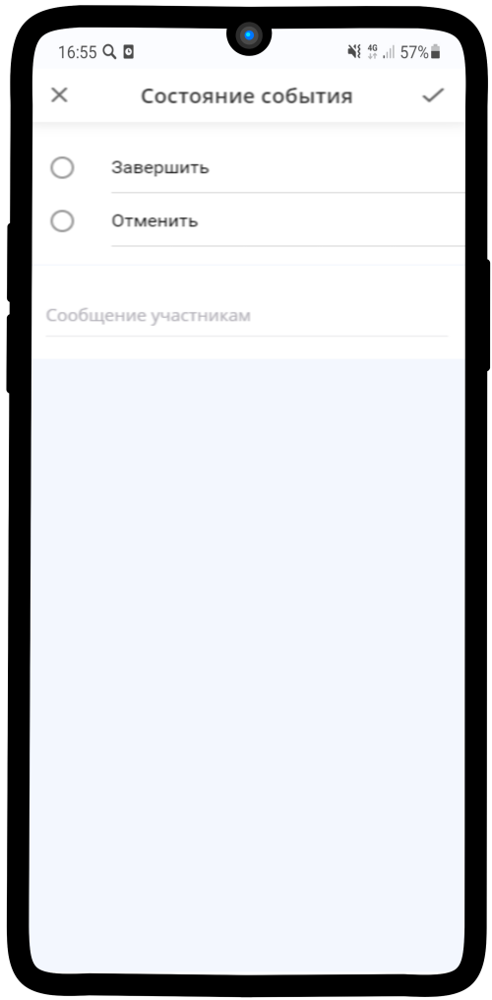

--------------------------

4. Статус данного заказа изменен на **Отменено**.

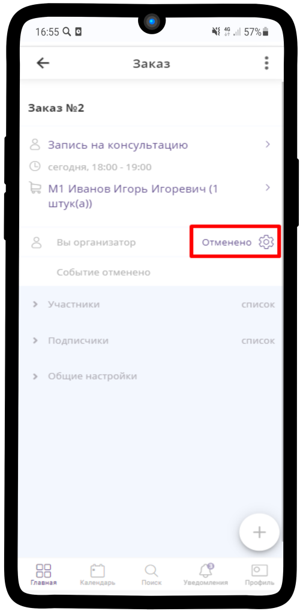

--------------------------

-------------------------
Отмена участия в заказе клиентом
-------------------------

Отменить заказ можно по кнопке **Отменить**

--------------------------

1. Также заказ можно отменить, нажав на |точка|

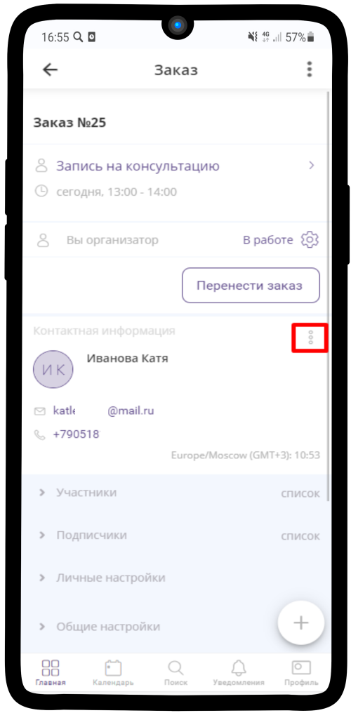

--------------------------

2. Выбрать **отменить участие**

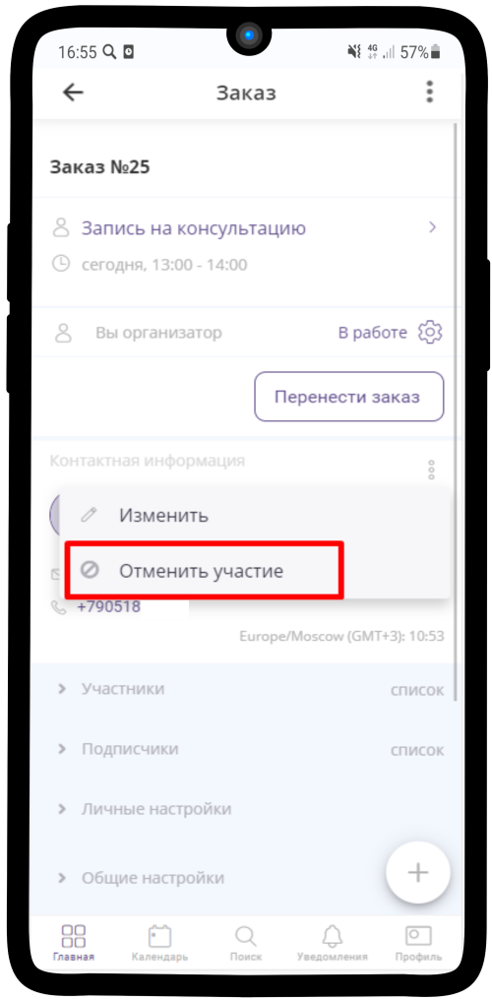

--------------------------

3. Ваше участие в заказе отменено

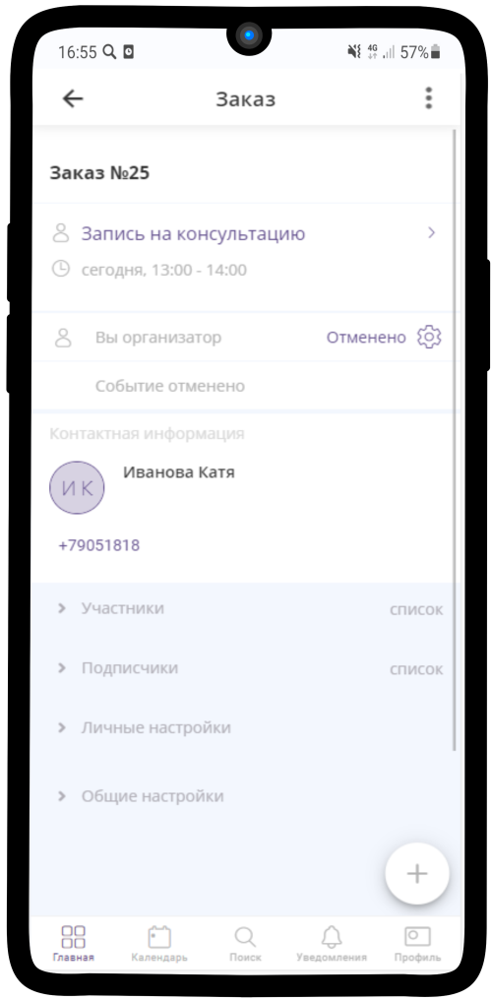

--------------------------

-------------------------
Изменение контактных данных
-------------------------

1. Нажмите на |точка|

--------------------------

2. Выберите **изменить контактные данные**

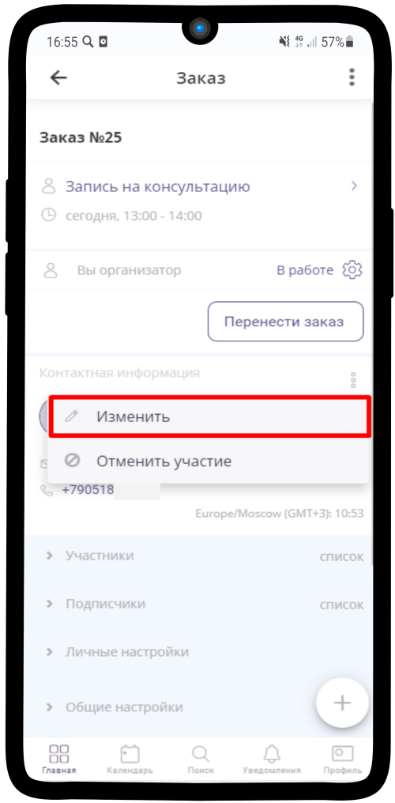

--------------------------

3. Отредактируйте необходимые данные и нажмите |галка|

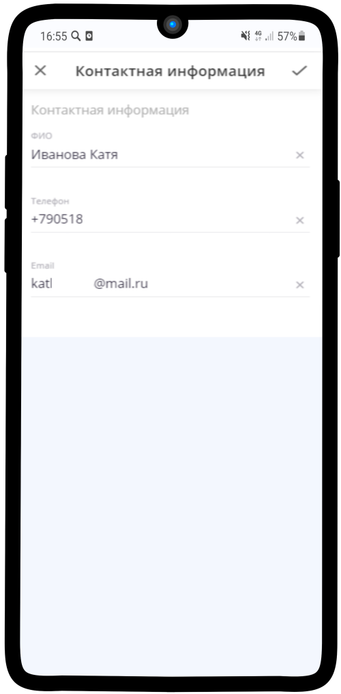

--------------------------

-------------------------
Поиск заказа
-------------------------

При создании заказа и возникновении вопроса с ним можно проверить его наличие с помощью Базы клиентов (:ref:`search_contact_base`)

.. raw:: html
   
   <torrow-widget
      id="torrow-widget"
      url="https://web.torrow.net/app/tabs/tab-search/service;id=103edf7f8c4affcce3a659502c23a?closeButtonHidden=true&tabBarHidden=true"
      modal="right"
      modal-active="false"
      show-widget-button="true"
      button-text="Заявка эксперту"
      modal-width="550px"
      button-style = "rectangle"
      button-size = "60"
      button-y = "top"
   ></torrow-widget>
   

.. raw:: html

   