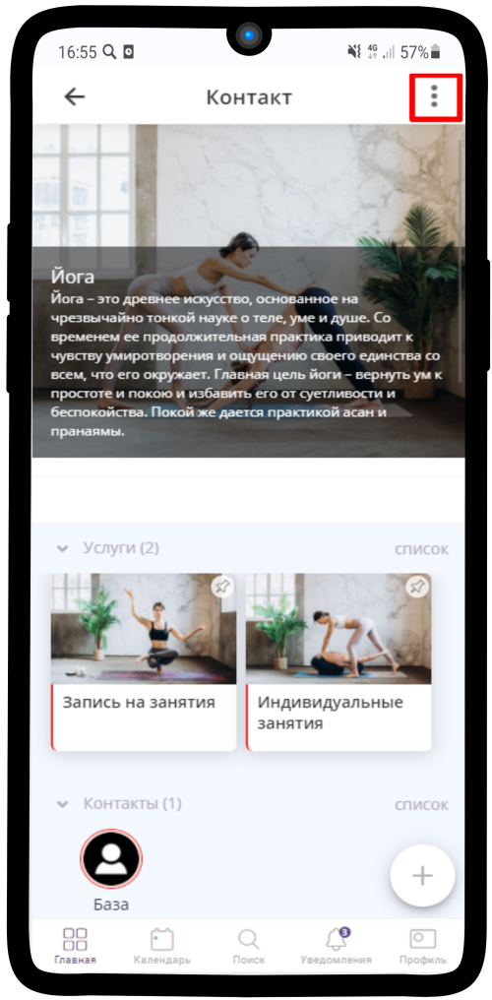
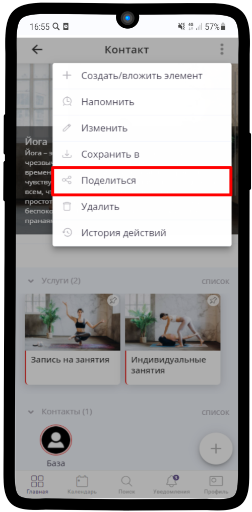
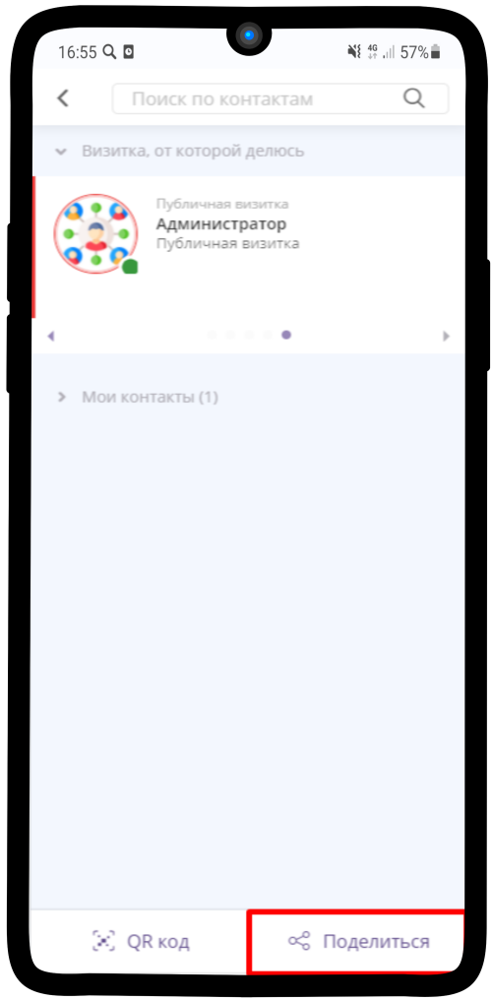
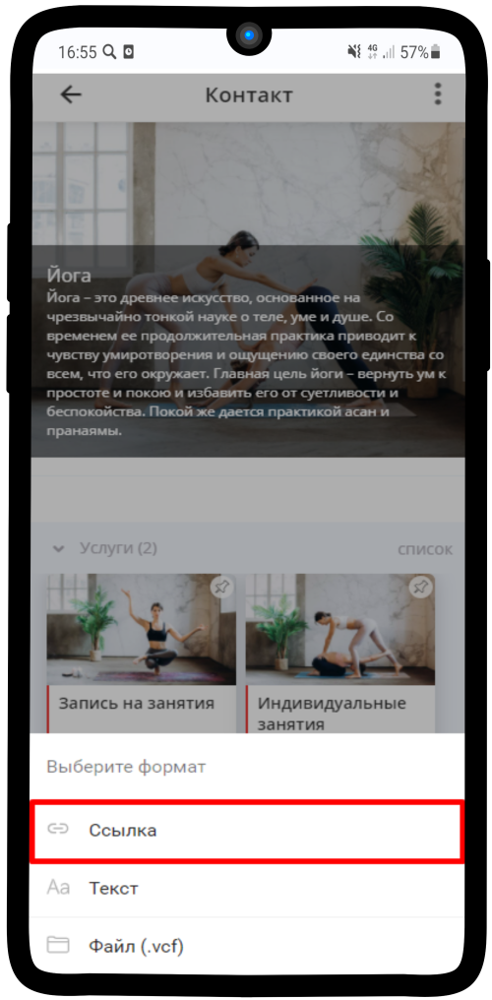
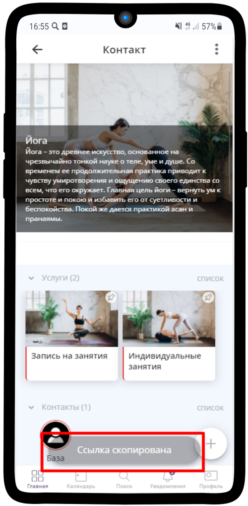
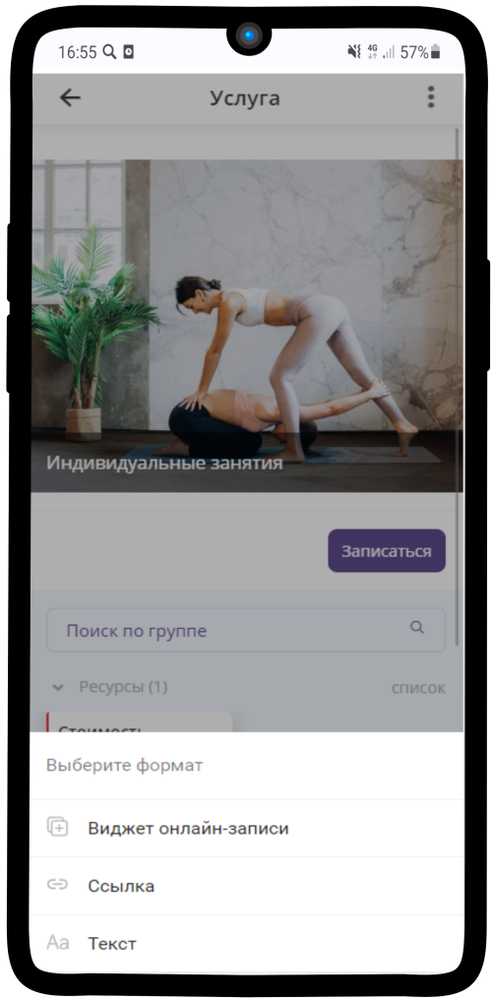

.. _share-label:

=========================
Как скопировать ссылку?
=========================

   .. |точка| image:: media/tochka.png
      :width: 21
      :alt: alternative text

1. Зайдите в нужный элемент и нажмите на |точка|

-----------------------

2. Выберите **Поделиться**

-----------------------

3. В правом нижнем углу нажмите **Поделиться**. Если хотите поделиться элементом с помощью QR-кодам, то выберите **QR-код** 

-----------------------

4. Нажмите **Ссылка**

-----------------------

5. **Ссылка скопирована** в буфер обмена

-----------------------

Также для **Услуги** можно создать **виджет онлайн-записи**

-----------------------

.. .. raw:: html
   
..    <torrow-widget
..       id="torrow-widget"
..       url="https://web.torrow.net/app/tabs/tab-search/service;id=103edf7f8c4affcce3a659502c23a?closeButtonHidden=true&tabBarHidden=true"
..       modal="right"
..       modal-active="false"
..       show-widget-button="true"
..       button-text="Заявка эксперту"
..       modal-width="550px"
..       button-style = "rectangle"
..       button-size = "60"
..       button-y = "top"
..    ></torrow-widget>
..    

.. .. raw:: html

..    