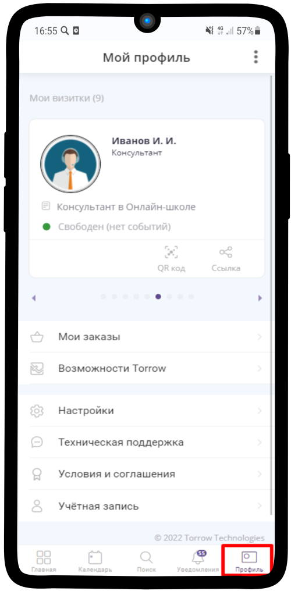
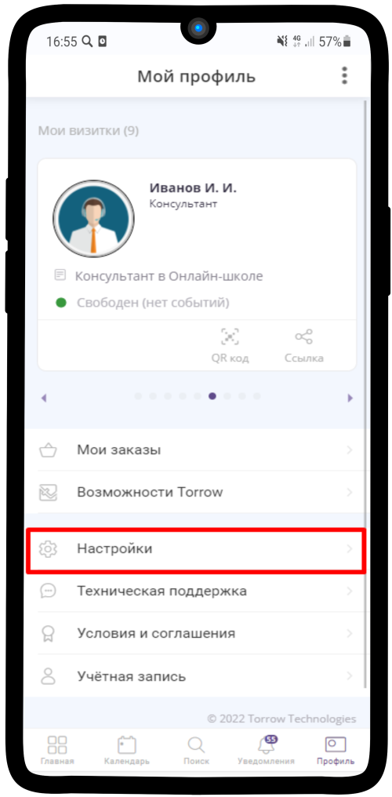
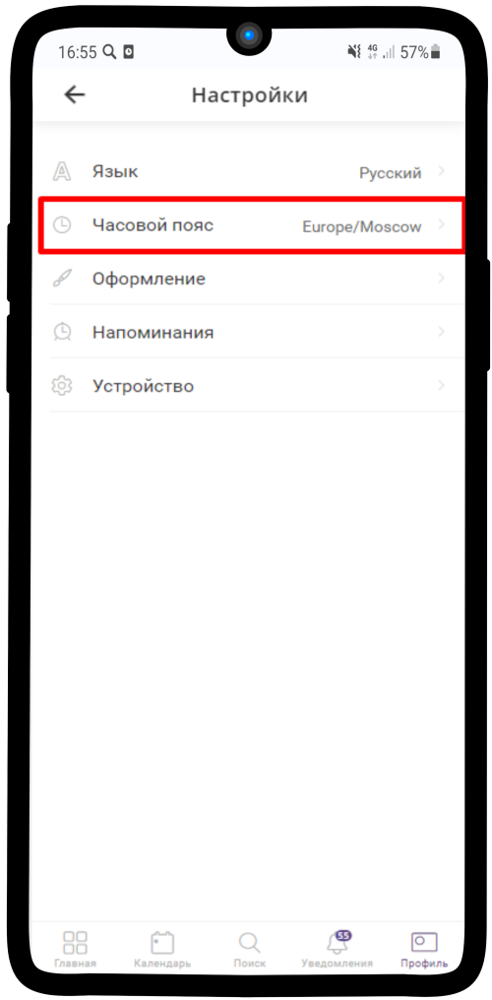
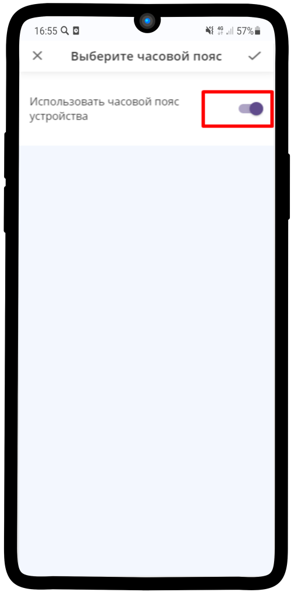
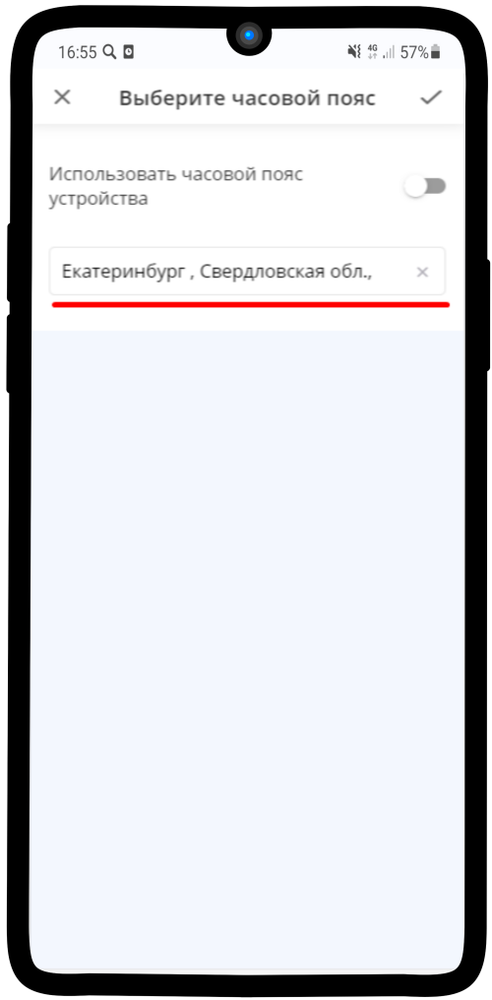
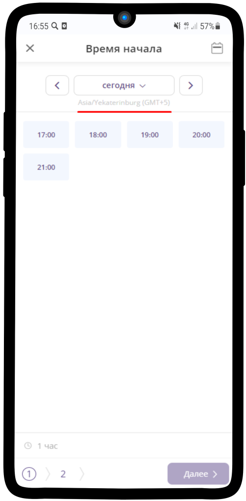
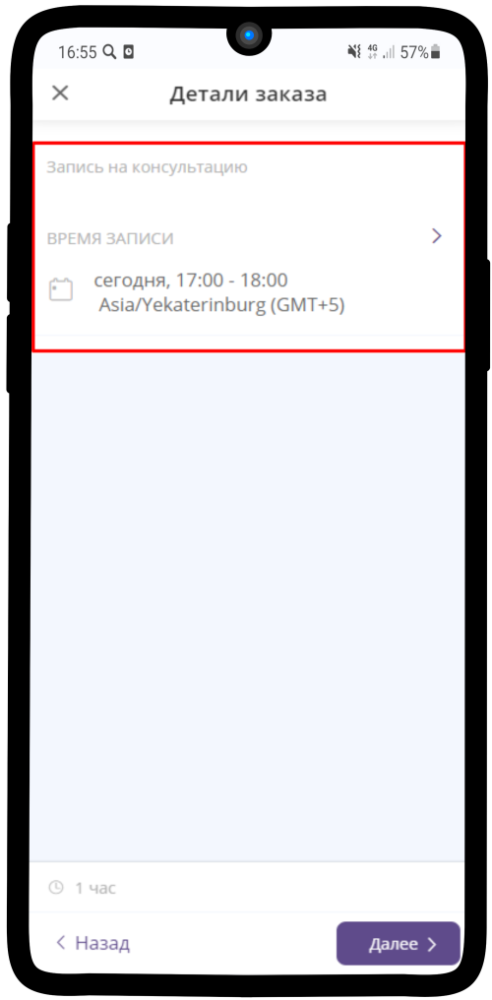

=========================================
Настройка часового пояса пользователя
=========================================

    .. |точка| image:: media/tochka.png
        :scale: 42 %
    .. |профиль| image:: media/profile.png
        :scale: 42 %
    .. |переключатель| image:: media/prin.png
        :scale: 42 %

1. Перейдите в Ваш профиль, нажав на |профиль|

-------------

2. Нажмите на **Настройки**

-------------

3. Выберите пункт **Часовой пояс**

-------------

4. Нажмите на |переключатель|
   

-------------

5. Впишите город, в котором Вы находитесь

-------------

6. Теперь при записи на услугу будет указываться Ваш часовой пояс

-------------

7. В деталях заказа также будет указываться Ваш часовой пояс 

-------------

.. raw:: html
   
   <torrow-widget
      id="torrow-widget"
      url="https://web.torrow.net/app/tabs/tab-search/service;id=103edf7f8c4affcce3a659502c23a?closeButtonHidden=true&tabBarHidden=true"
      modal="right"
      modal-active="false"
      show-widget-button="true"
      button-text="Заявка эксперту"
      modal-width="550px"
   ></torrow-widget>
   