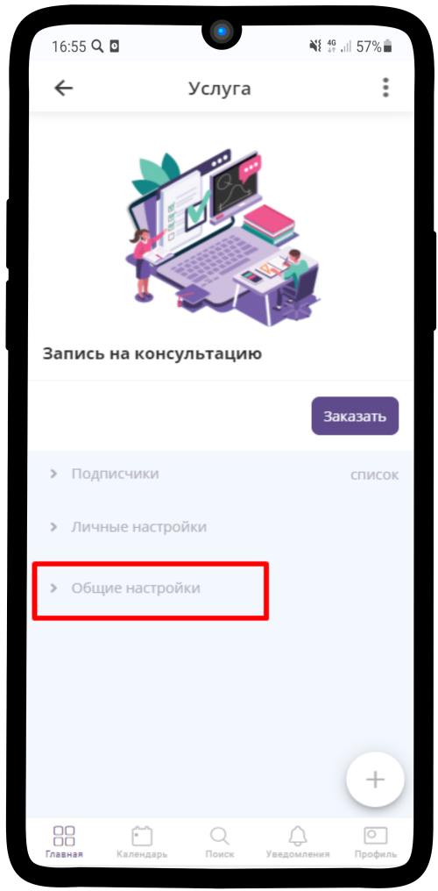
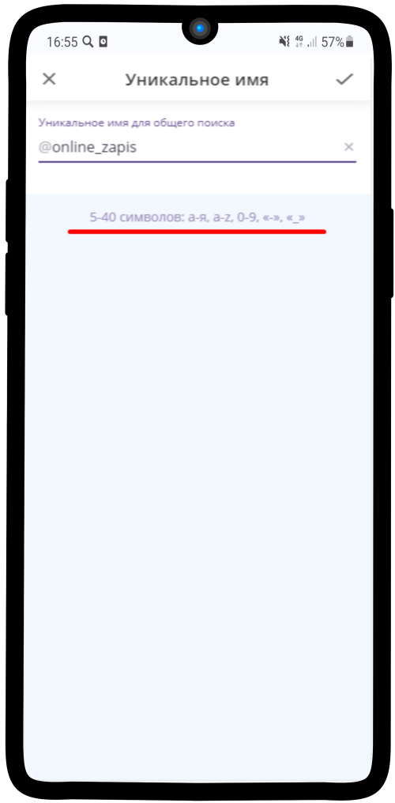
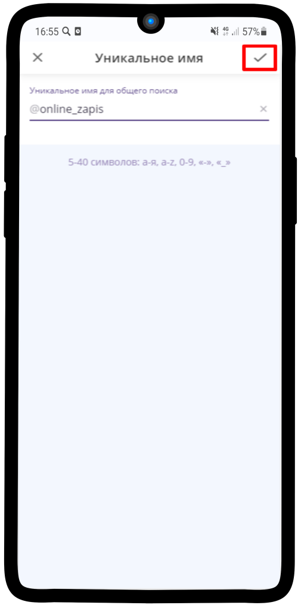
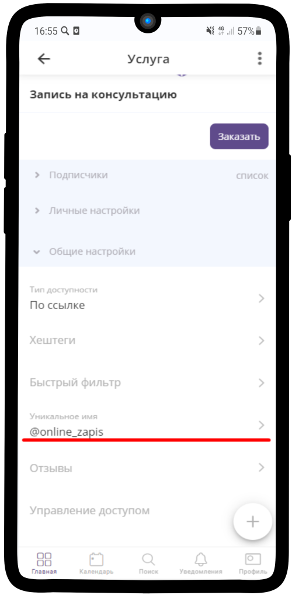

=========================
Как изменить уникальное имя элемента?
=========================

   .. |галка| image:: media/galka.png
      :width: 21
      :alt: alternative text

1. Перейдите в **Общие настройки** элемента

-----------------------

1. Выберите **Уникальное время**

.. figure:: media/unique_name/unique2.png
    :scale: 42 %
    :alt: alternate text
    :align: center

-----------------------

3. Введите **уникальное время**, учитывая параметры

-----------------------

4. Нажмите на |галка|

-----------------------

5. Ваше уникальное имя сохранено - оно будет отображаться в ссылке на элемент 

-----------------------