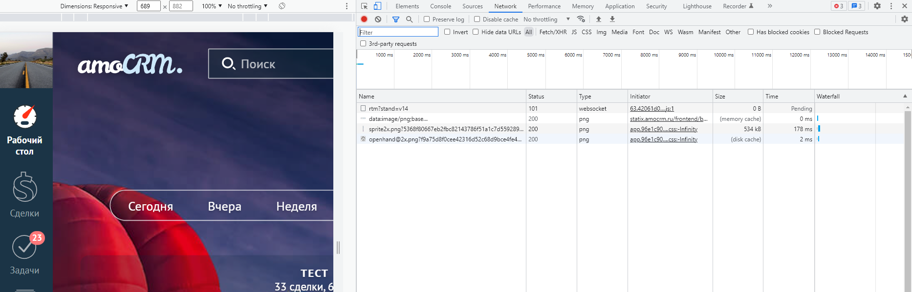
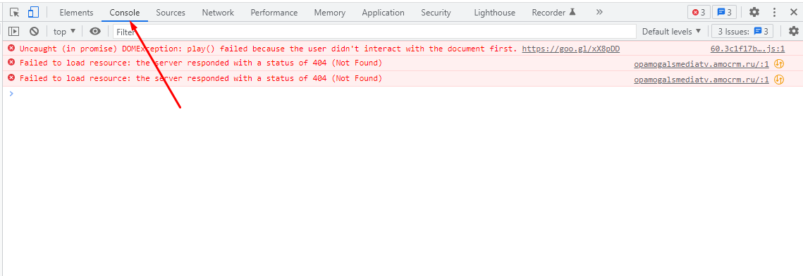
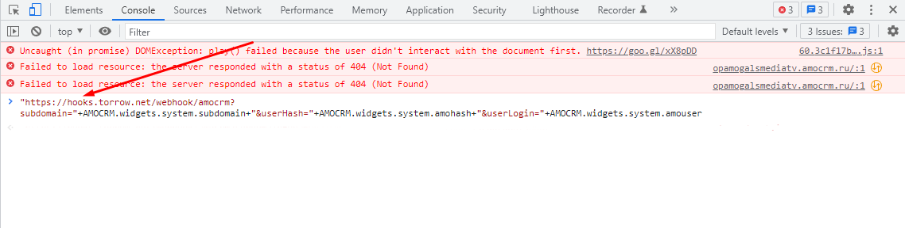
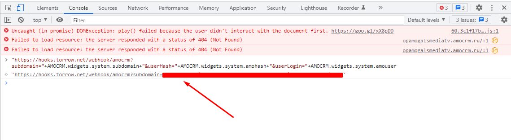
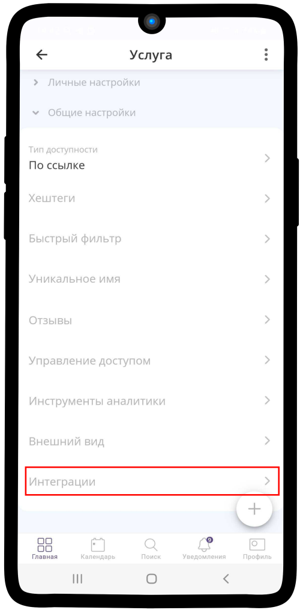
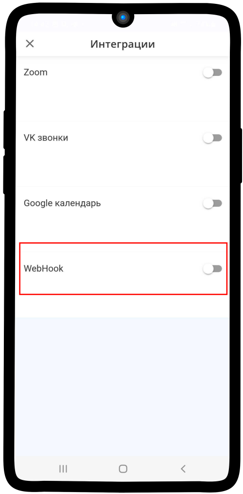
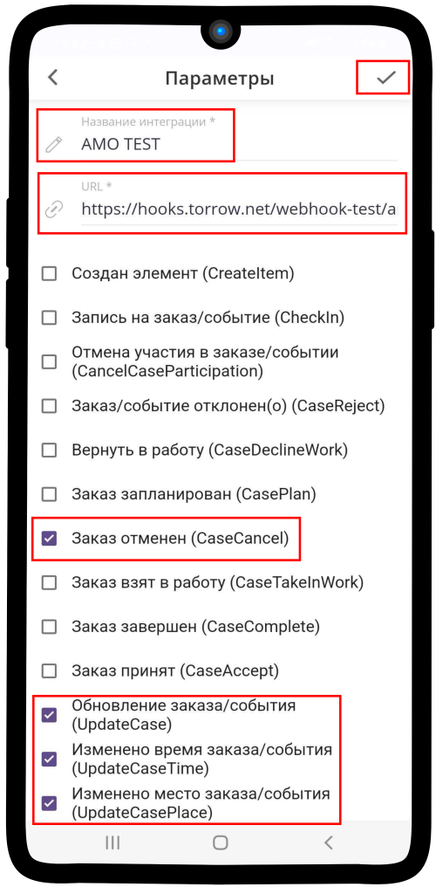
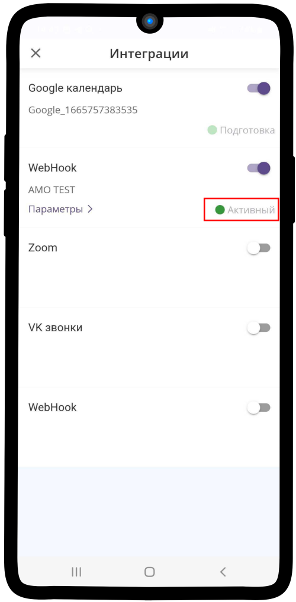

.. _amocrm-label:

===================
Интеграция с AmoCRM
===================

    .. |галка| image:: media/galka.png
        :width: 21
        :alt: alternative text

.. note:: Раздел находится в разработке.

Наш сервис интегрирован с CRM системой amoCRM. Чтобы передавать информацию о заказах из приложения или виджета, используйте инструкцию по подключению описанную ниже.

1. Перейдите в Ваш аккаунт amoCRM и вызовите **Инструменты разработчика** с помощью клавиши **F12**.

    
    Инструменты разработчика

----------------------------------

2. В появившемся окне выберите **Console** (консоль).

----------------------------------

3. В строку консоли втавьте код, указанный ниже и нажмите **Enter**.

.. code-block::

    "https://hooks.torrow.net/webhook/amocrm?subdomain="+AMOCRM.widgets.system.subdomain+"&userHash="+AMOCRM.widgets.system.amohash+"&userLogin="+AMOCRM.widgets.system.amouser

----------------------------------

4. Вы получите ссылку (вебхук), которая нужна для передачи информации о заказах из приложения. Скопируйте данную ссылку.

----------------------------------

5. Зайдите в свою услугу в приложении torrow и перейдите к **Общим настройкам**. Нажмите на поле **Интеграции**.

----------------------------------

6. Из списка интеграций выберите **Webhook**.

------------------------------------

7. Вставьте полученную ссылку в поле URL. Укажите название для интеграции и выберите действия, при которых будет отправляться webhook. После всех действий сохраните изменения, нажав на |галка|.

.. hint:: Рекомендуем по умолчанию выбрать: Создание заказа (CreateOrder), Заказ отменен (CaseCancel), Обновление заказа/события (UpdateCase), Изменено время заказа/события (UpdateCaseTime).

----------------------------------

8. После сохранения новая интеграция будет выглядеть, как на скриншоте ниже, а также получит состояние **Активный**.

----------------------------------

.. raw:: html
   
   <torrow-widget
      id="torrow-widget"
      url="https://web.torrow.net/app/tabs/tab-search/service;id=103edf7f8c4affcce3a659502c23a?closeButtonHidden=true&tabBarHidden=true"
      modal="right"
      modal-active="false"
      show-widget-button="true"
      button-text="Заявка эксперту"
      modal-width="550px"
      button-style = "rectangle"
      button-size = "60"
      button-y = "top"
   ></torrow-widget>
   

.. raw:: html

   