.. _bitrix24-label:

=====================
Интеграция с Bitrix24
=====================

    .. |галка| image:: media/galka.png
        :width: 21
        :alt: alternative text

Сервис Torrow интегрирован с CRM Bitrix24. Чтобы передавать заказы из приложения или виджета в Bitrix24, выполните настройку в Bitrix24, затем подключите интеграцию в Torrow.

В интеграции используются два объекта Bitrix24:

- **Сделки** — элемент CRM с информацией о продаже (название, сумма, стадия, клиент). В сделках сохраняются данные заказа Torrow. Подробнее: `Сделки: что это и как с ними работать <https://helpdesk.bitrix24.ru/open/26161116/>`_.
- **Контакты** — элемент CRM с данными клиента (ФИО, телефон, e-mail). Контакт создаётся или находится по номеру телефона или электронной почте заказчика заказа и привязывается к сделке. Подробнее: `Контакты: что это и как с ними работать <https://helpdesk.bitrix24.ru/open/25042958/>`_.

Интеграция Torrow с Bitrix24 создаёт и обновляет контакты и сделки, привязывает контакты к сделкам и синхронизирует статусы заказов со стадиями воронки. В Torrow настраиваются события Услуги, по которым вызывается webhook в Bitrix24.

----------------------------------
Настройка Bitrix24
----------------------------------

Перед подключением в Torrow необходимо: создать входящий вебхук, обязательно настроить пользовательское поле сделки **torrow_id** (ID заказа Torrow), при необходимости — остальные поля и воронку со стадиями.

1. Создание входящего вебхука
----------------------------------

1.1. В Bitrix24 откройте в главной панели **Ещё** (шестерёнка) → **Настройки** → раздел **Интеграции** → **REST API** → **Другое**.

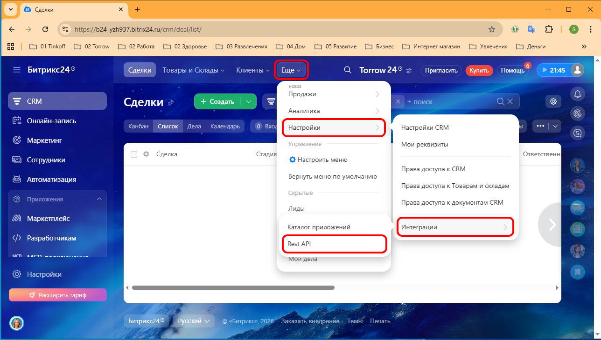

    Переход в раздел Интеграции и REST API

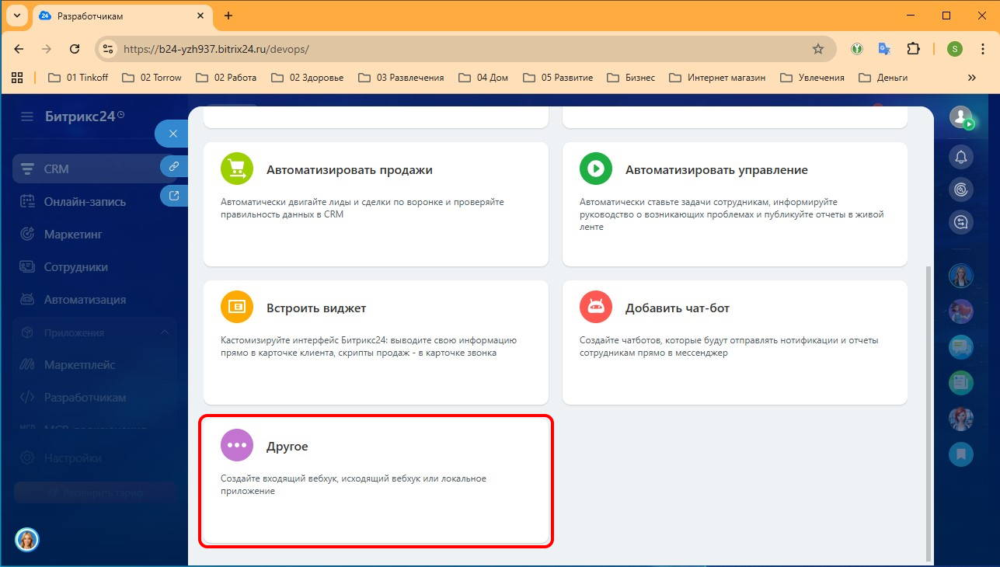

    Добавление вебхука

----------------------------------

1.2. Нажмите **Входящий вебхук**.

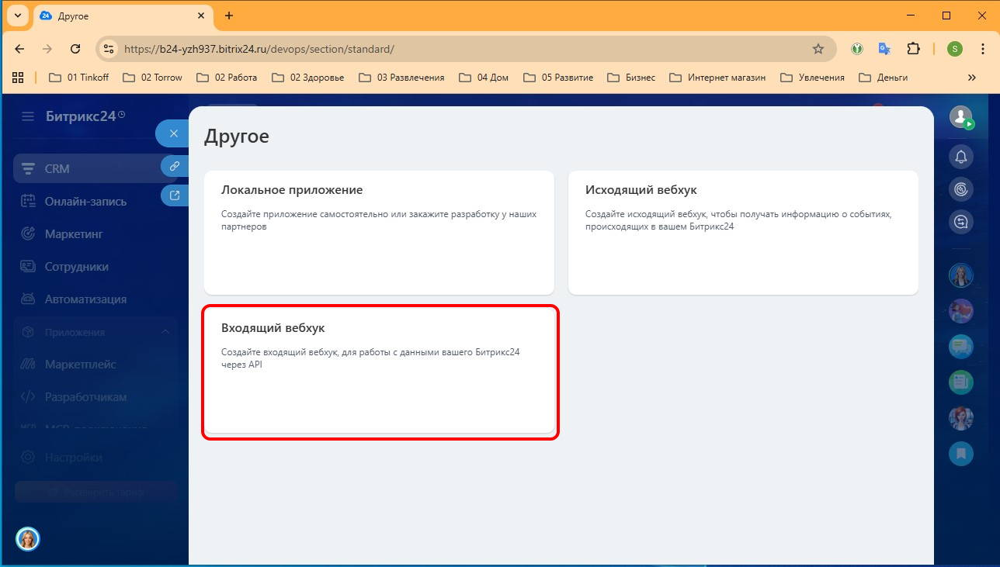

    Создание входящего вебхука

----------------------------------

1.3. В открытом окне будет сгенерирован URL вебхука. Внизу формы выберите права **CRM (crm)** и нажмите кнопку **Сохранить**.

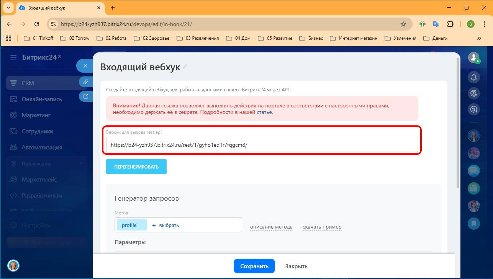

    Форма создания входящего вебхука

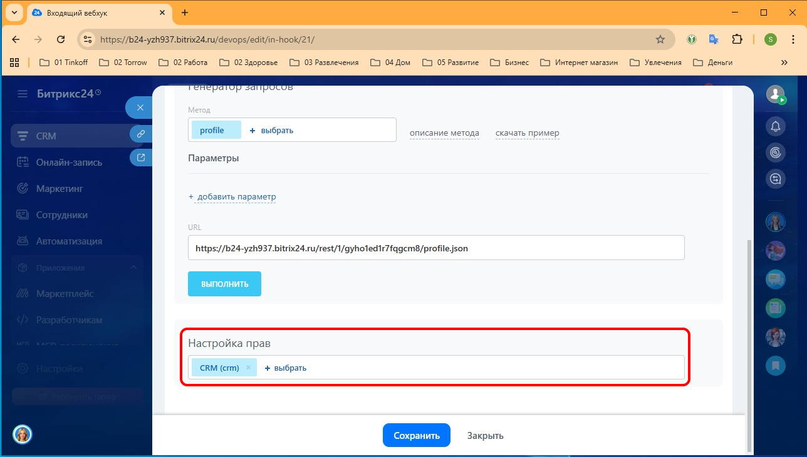

    Выбор прав и сохранение вебхука

----------------------------------

1.4. Скопируйте **URL вебхука**. Из него понадобятся три значения:

- **domain** — поддомен организации (часть перед ``.bitrix24.ru``), например ``b24-yzh937`` из ``https://b24-yzh937.bitrix24.ru/rest/1/gyho1ed1r7fqgcm8/``
- **user_id** — число после ``/rest/`` (в примере ``1``)
- **webhook_code** — строка после ``user_id/`` до конца (в примере ``gyho1ed1r7fqgcm8``)

Эти значения нужно будет подставить в ссылку для Torrow (см. раздел «Подключение в Torrow»).

.. figure:: media/bitrix24/04-webhook-url-copy.jpg
    :scale: 60 %
    :alt: Копирование URL вебхука
    :align: center

----------------------------------

2. Пользовательские поля сделки
----------------------------------

Поле **torrow_id** (ID заказа Torrow) **обязательно** для работы интеграции: по нему выполняется поиск и обновление существующей сделки. Создайте в Bitrix24 пользовательское поле сделки для хранения ID заказа Torrow (тип — текст) и укажите его код или ID в параметре ``torrow_id`` при настройке вебхука в Torrow.

Остальные поля опциональны и используются для сохранения дополнительных данных заказа:

- **torrow_id** — **обязательно.** ID заказа Torrow, тип поля: текст (например, символьный код ``TorrowId``)
- **Время начала** — дата/время
- **Время окончания** — дата/время
- **Дата заказа** — дата или текст
- **Услуга** — текст (название услуги)
- **Детали заказа** — текст, многострочное (описание/детали)

2.1. В Bitrix24 откройте список пользовательских полей сделки: **Ещё** → **Настройки** → **Настройки CRM** → **Настройки форм и отчетов** → **Пользовательские поля**.

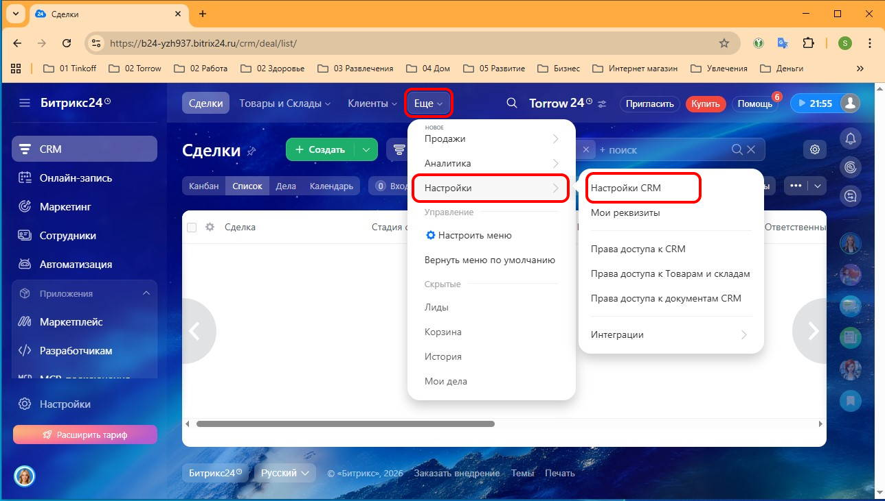

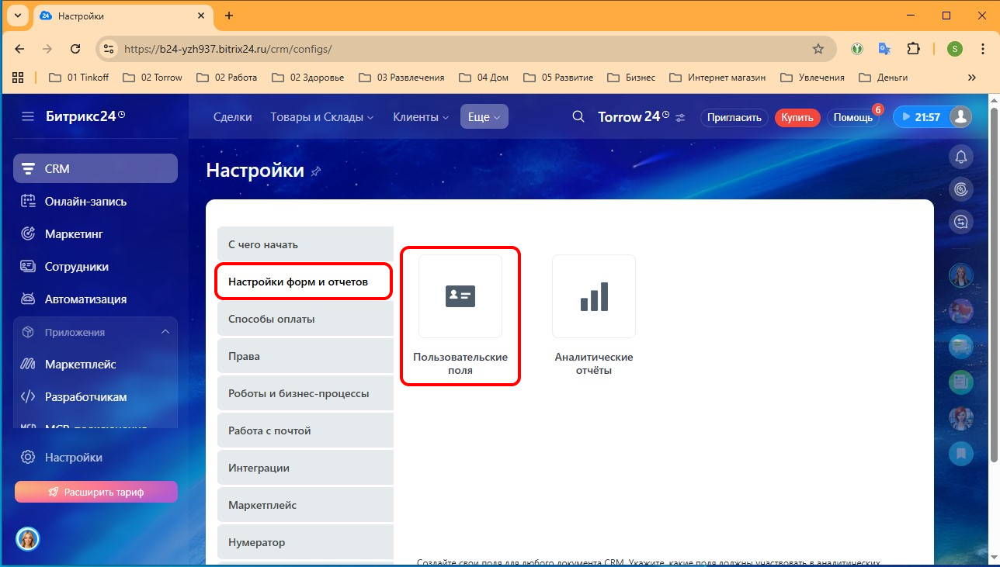

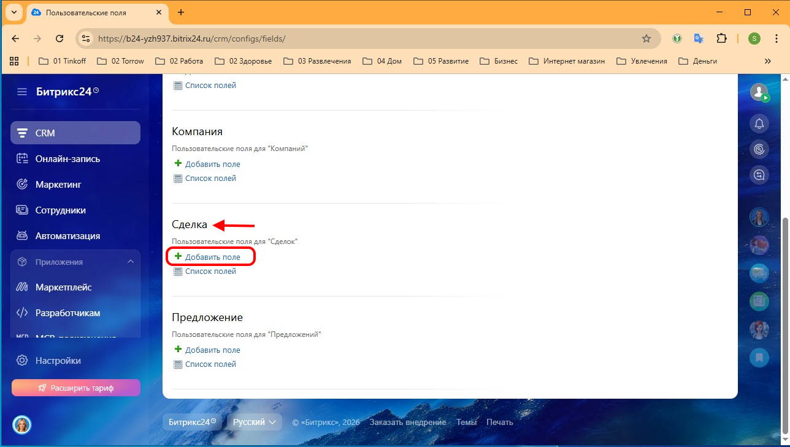

----------------------------------

2.2. Добавьте поле для ID заказа Torrow и при необходимости остальные поля. Заполните **Название** и **Тип** каждого поля и нажмите кнопку **Сохранить**.

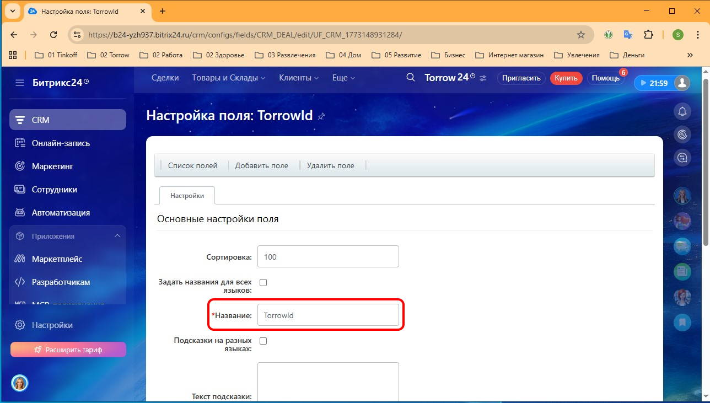

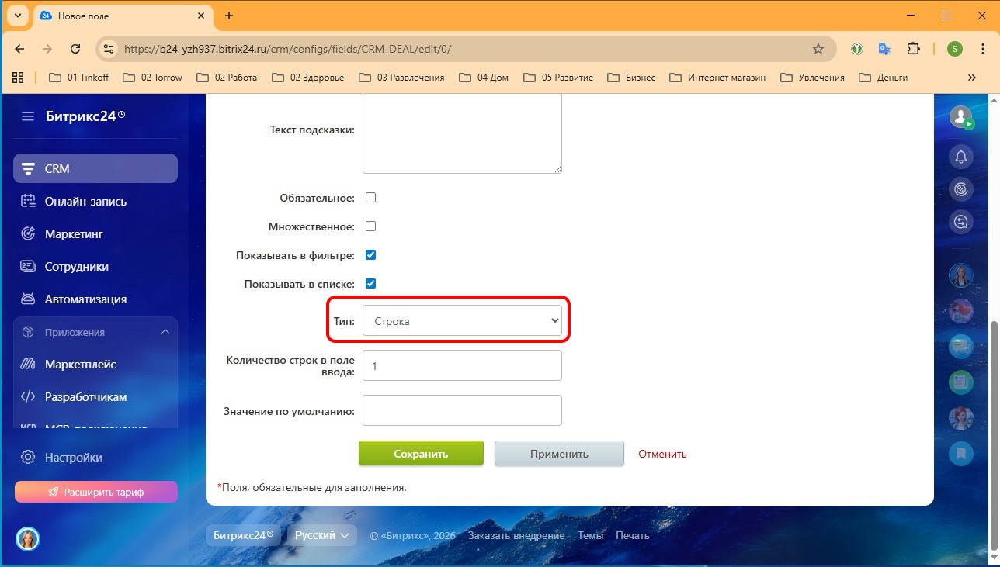

----------------------------------

3. Воронка продаж и стадии
----------------------------------

Интеграция сопоставляет состояния заказа в Torrow со стадиями сделки в Bitrix24. Обязательно нужно указать название воронки и названия стадий в параметрах вебхука.

3.1. Узнайте **название воронки** и **названия стадий** в Bitrix24: в разделе **Сделки** раскрыть фильтр **Все сделки** и выбрать пункт **Воронки и туннели продаж** и для выбранной воронки посмотрите названия стадий (Новая, В работе, Успешно завершена и т.д.).

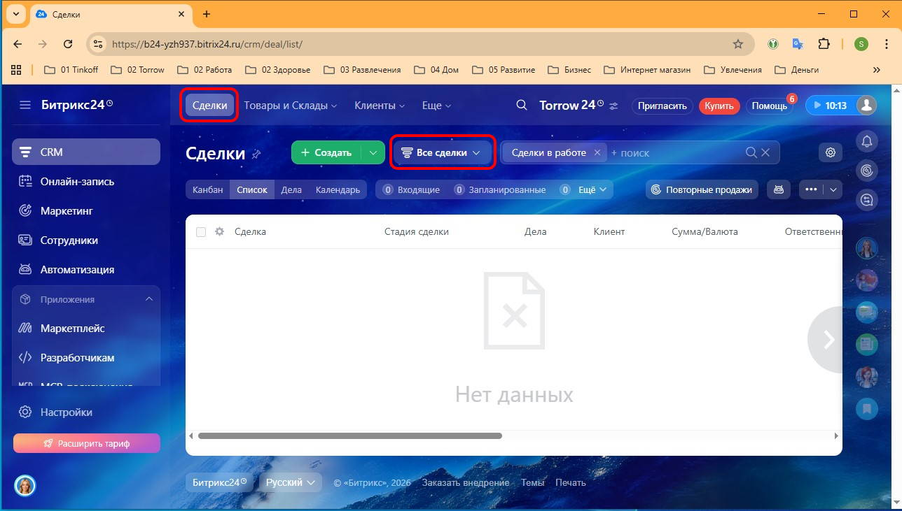

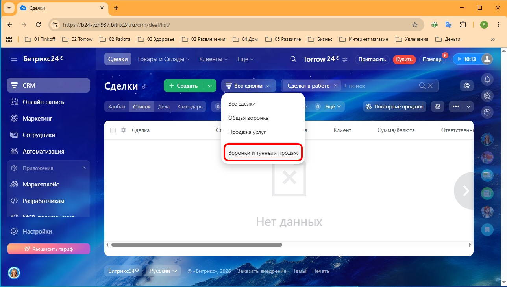

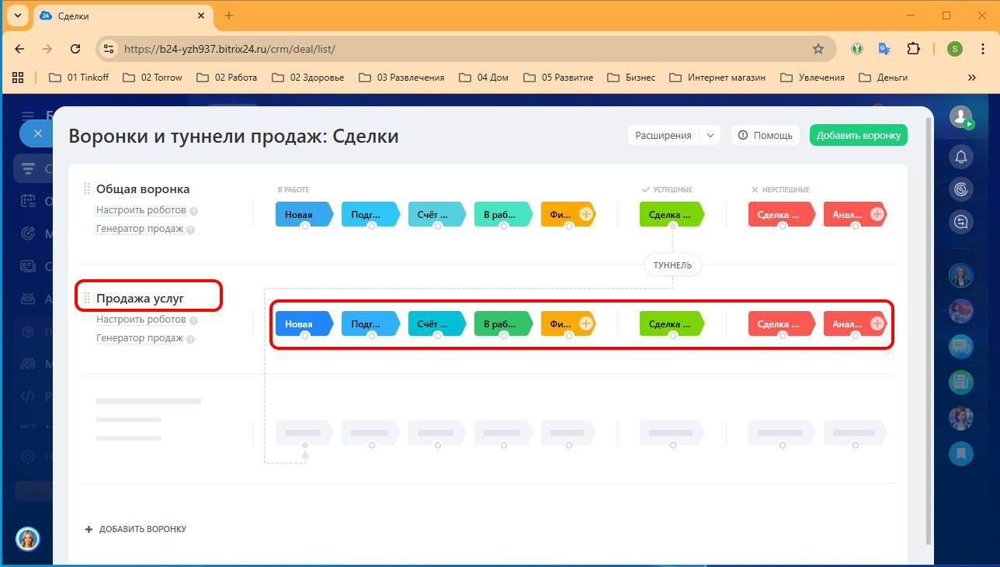

----------------------------------

Параметры (передаются в URL при настройке в Torrow):

- **pipeline** — название воронки (например, «Продажа услуг»).
- **booking** — стадия для состояния «Бронирование».
- **approving** — стадия для «Согласование».
- **confirmed** — стадия для «Подтверждено».
- **cancelled** — стадия для «Отменено».
- **completed** — стадия для «Завершено».

Параметры **pipeline**, **booking**, **approving**, **confirmed**, **cancelled**, **completed** обязательно нужно указать в параметрах вебхука в Torrow.

----------------------------------
Подготовка URL вебхука для подключения в Torrow
----------------------------------

Все параметры передаются в URL при настройке интеграции в Torrow (в поле URL вебхука). Ниже — полный перечень параметров по ТЗ интеграции.

.. note::
   В URL пробелы в значениях параметров (например, в названиях воронок, стадий или полей) нужно заменить на ``%20``.

**Параметры аутентификации (обязательные)**

+-----------------+--------+----------------------------------------+----------------------+
| Параметр        | Тип    | Описание                               | Пример               |
+=================+========+========================================+======================+
| ``domain``      | string | Домен Bitrix24 (без .bitrix24.ru)      | ``b24-yzh937``       |
+-----------------+--------+----------------------------------------+----------------------+
| ``user_id``     | string | ID пользователя вебхука из URL Bitrix24 | ``1``                |
+-----------------+--------+----------------------------------------+----------------------+
| ``webhook_code``| string | Код входящего вебхука Bitrix24         | ``gyho1ed1r7fqgcm8`` |
+-----------------+--------+----------------------------------------+----------------------+

**Параметры воронки и статусов (обязательные)**

Определяют воронку продаж и маппинг стадий сделки на состояния заказа Torrow. Если указан текст — используется поиск по названию стадии; если стадия не найдена — возвращается ошибка валидации.

+--------------+--------+----------------------------------------------------+---------------------------+
| Параметр     | Тип    | Описание                                           | Пример                    |
+==============+========+====================================================+===========================+
| ``pipeline`` | string | Название воронки продаж                            | ``Продажа услуг``         |
+--------------+--------+----------------------------------------------------+---------------------------+
| ``deal_type``| string | Название типа сделки                               | ``Продажа``               |
+--------------+--------+----------------------------------------------------+---------------------------+
| ``booking``  | string | Стадия для состояния «Бронирование»                | ``Новая``                 |
+--------------+--------+----------------------------------------------------+---------------------------+
| ``approving``| string | Стадия для состояния «Согласование»                | ``Подготовка документов`` |
+--------------+--------+----------------------------------------------------+---------------------------+
| ``confirmed``| string | Стадия для состояния «Подтверждено»                | ``В работе``              |
+--------------+--------+----------------------------------------------------+---------------------------+
| ``cancelled``| string | Стадия для состояния «Отменено»                    | ``Сделка провалена``      |
+--------------+--------+----------------------------------------------------+---------------------------+
| ``completed``| string | Стадия для состояния «Завершено»                   | ``Сделка успешна``        |
+--------------+--------+----------------------------------------------------+---------------------------+

**Параметры кастомных полей сделки**

Задают названия пользовательских полей Bitrix24, в которые записываются данные заказа. Поля должны существовать в Bitrix24.

+-----------------+-------------+-----------------------------------------------------+---------------------------+
| Параметр        | Тип         | Описание                                            | Пример                    |
+=================+=============+=====================================================+===========================+
| ``torrow_id``   | string      | **Обязательно.** Название поля для ID заказа Torrow | ``TorrowId``              |
+-----------------+-------------+-----------------------------------------------------+---------------------------+
| ``start_date``  | string      | Название поля для даты/времени начала заказа        | ``Время начала``          |
+-----------------+-------------+-----------------------------------------------------+---------------------------+
| ``end_date``    | string      | Название поля для даты/времени окончания заказа     | ``Время окончания``       |
+-----------------+-------------+-----------------------------------------------------+---------------------------+
| ``order_date``  | string      | Название поля для даты заказа                       | ``Дата заказа``           |
+-----------------+-------------+-----------------------------------------------------+---------------------------+
| ``service_name``| string      | Название поля для названия услуги                   | ``Услуга``                |
+-----------------+-------------+-----------------------------------------------------+---------------------------+
| ``order_details``| string     | Название поля для деталей заказа                    | ``Детали заказа``         |
+-----------------+-------------+-----------------------------------------------------+---------------------------+
| ``field_{ID}``  | string      | Динамические кастомные поля (ID — код поля)         | ``UF_CRM_...``            |
+-----------------+-------------+-----------------------------------------------------+---------------------------+

Пример полного URL с параметрами аутентификации, воронки и полей:

.. code-block:: text

    https://hooks.torrow.net/webhook/bitrix24?domain=b24-yzh937&user_id=1&webhook_code=gyho1ed1r7fqgcm8&torrow_id=TorrowId&pipeline=Продажа%20услуг&booking=Новая&approving=Подготовка&confirmed=В%20работе&cancelled=Провалена&completed=Успешно&start_date=Время%20начала&end_date=Время%20окончания&service_name=Услуга&order_details=Детали%20заказа

----------------------------------
Подключение в Torrow
----------------------------------

4. Откройте свою услугу в приложении Torrow и перейдите в **Общие настройки** → **Интеграции**.

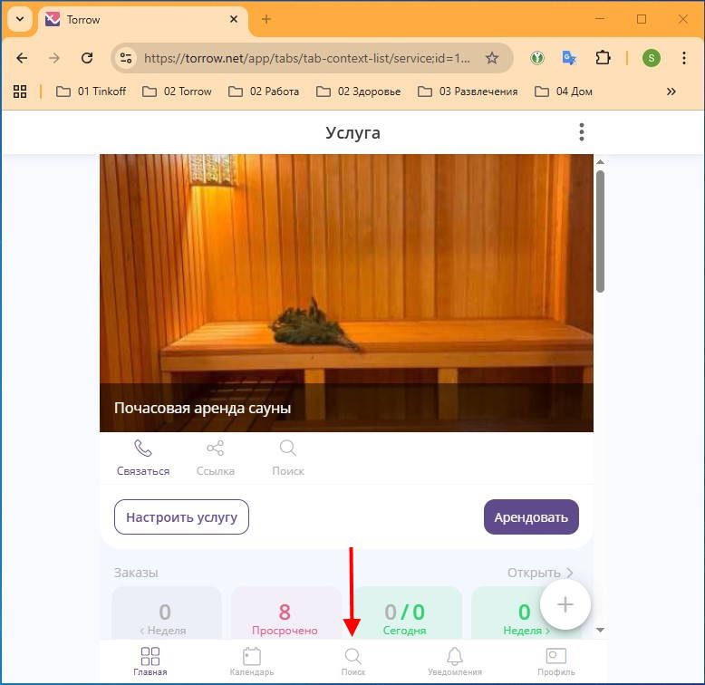

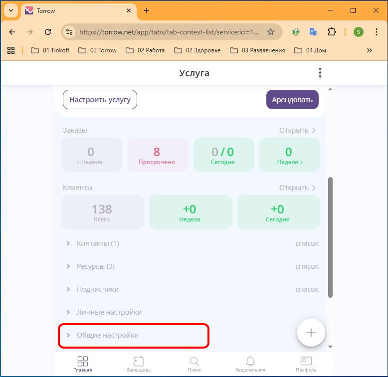

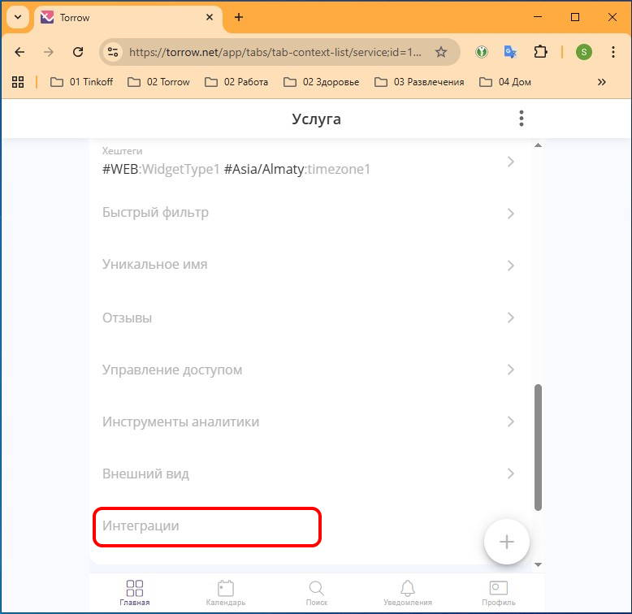

----------------------------------

5. В списке интеграций выберите **Webhook**.

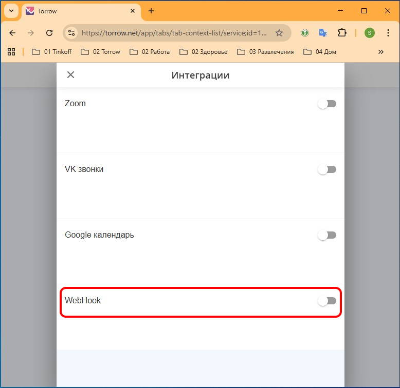

----------------------------------

6. Заполните форму WebHook: укажите название WebHook, в поле **URL** вставьте ссылку для Bitrix24 в соответствии с подготовленным URL вебхука выше и укажите события, при которых будет отправляться webhook. Сохраните изменения, нажав |галка|.

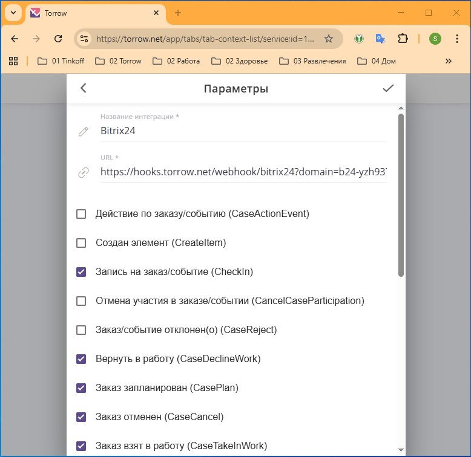

.. hint:: Список рекомендуемых для выбора событий: Запись на заказ/событие (CheckIn), Заказ отменен (CaseCancel), Обновление заказа/события (UpdateCase), Изменено время заказа/события (UpdateCaseTime)

----------------------------------

7. После сохранения интеграция отобразится в списке со статусом **Активный**.

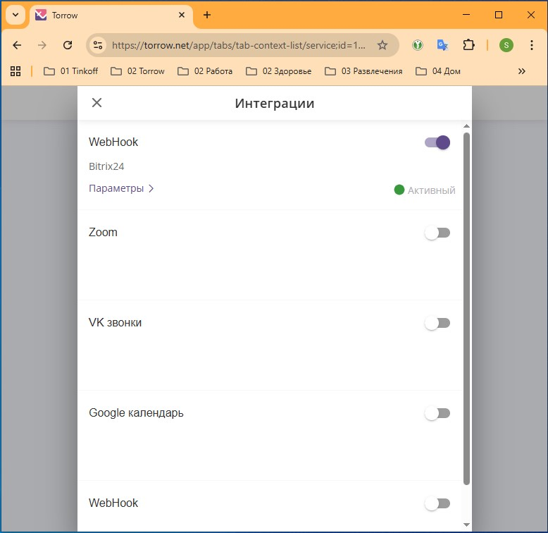

----------------------------------
Справочная информация
----------------------------------

**Объекты Bitrix24 в интеграции:**

- `Сделки: что это и как с ними работать <https://helpdesk.bitrix24.ru/open/26161116/>`_
- `Контакты: что это и как с ними работать <https://helpdesk.bitrix24.ru/open/25042958/>`_

**Документация Bitrix24 REST API (для разработчиков):**

- `Обзор REST API <https://dev.1c-bitrix.ru/rest_help/general/index.php>`_
- `Входящий вебхук <https://dev.1c-bitrix.ru/rest_help/general/webhooks/incoming_webhook.php>`_
- `Сделки (crm.deal) <https://dev.1c-bitrix.ru/rest_help/crm/crm_deal_list.php>`_
- `Контакты (crm.contact) <https://dev.1c-bitrix.ru/rest_help/crm/contacts/crm_contact_list.php>`_

----------------------------------

.. raw:: html
   
   <torrow-widget
      id="torrow-widget"
      url="https://web.torrow.net/app/tabs/tab-search/service;id=103edf7f8c4affcce3a659502c23a?closeButtonHidden=true&tabBarHidden=true"
      modal="right"
      modal-active="false"
      show-widget-button="true"
      button-text="Заявка эксперту"
      modal-width="550px"
      button-style = "rectangle"
      button-size = "60"
      button-y = "top"
   ></torrow-widget>
   

.. raw:: html

   <!--  -->