.. _fo-label:

========================================================
Виджет онлайн-записи/-аренды в конструкторе сайтов fo.ru
========================================================

    .. |галка| image:: media/galka.png
        :width: 21
        :alt: alternative text

.. note:: Раздел находится в разработке.

Виджет Torrow интегрирован в `конструктор сайтов fo.ru <https://fo.ru/>`_.

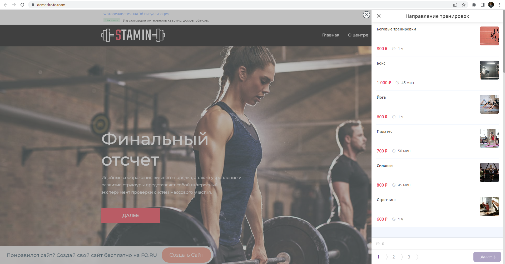
    
    Пример виджета на конструкторе fo

Чтобы установить виджет на сайт **FO**:

1. Перейдите в раздел **Мои сайты**.

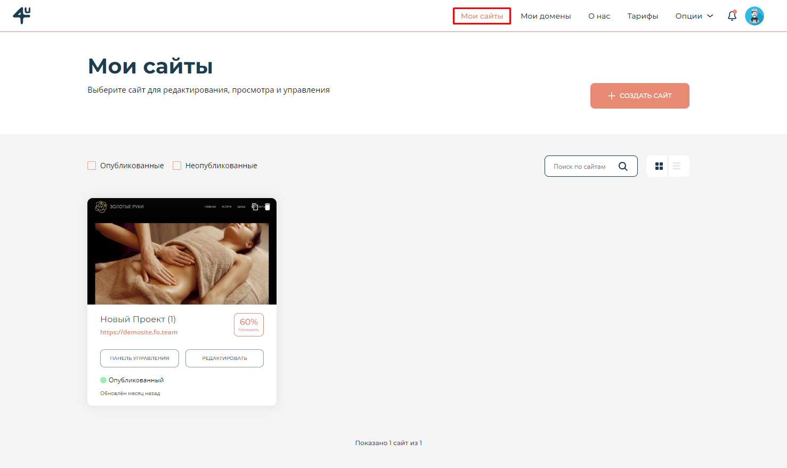

2. Выберите уже начатый проект в режиме **редактирования** или же создайте **новый сайт**.

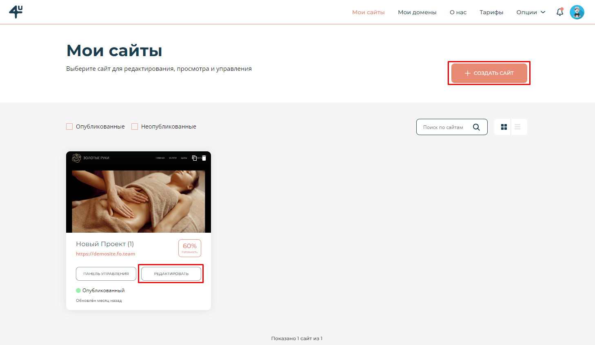

3. В режиме редактирования нажмите на блок **Элементы**.

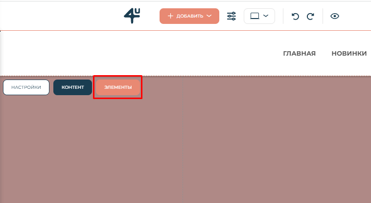

4. В появившемся меню выберите **Torrow Запись**. Если Вы не нашли данный элемент, воспользуйтесь **Поиском**.

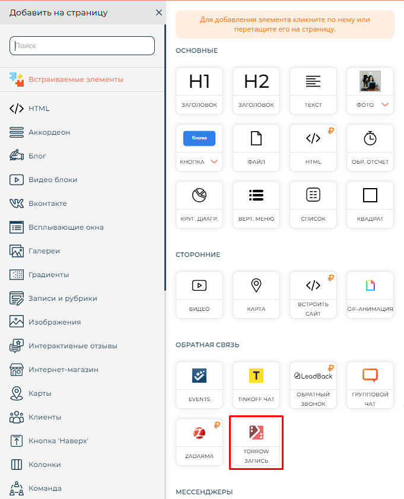

5. Введите свой номер телефона или почту, к которому(ой) привязан существующий аккаунт torrow или пройдите процедуру регистрации.

.. hint:: Регистрация осуществляется тем же способом, что и авторизация. Вам необходимо просто ввести свой номер телефона или e-mail.

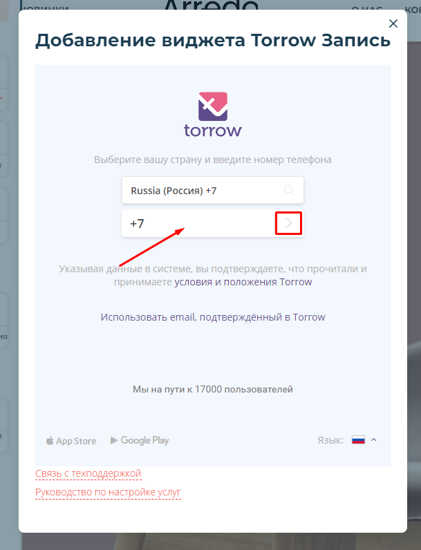

6. Выберите услугу, которую хотите подключить к виджету из списка. Если Вы еще не создали её, нажмите **Создать услугу по шаблону**.

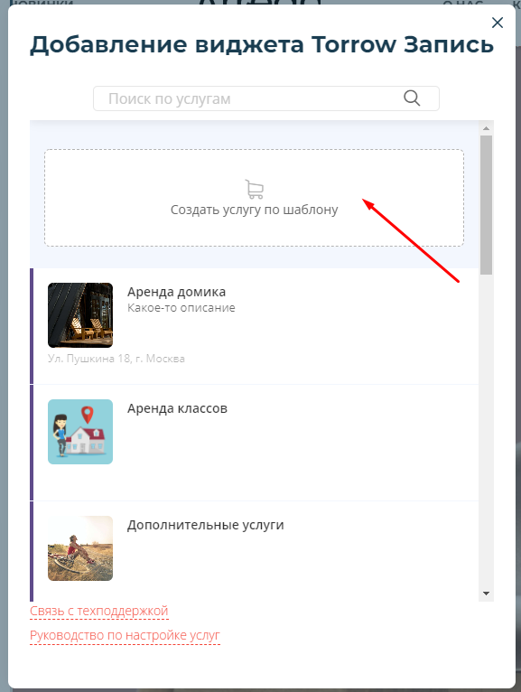

7. Выберите подходящий шаблон из списка.

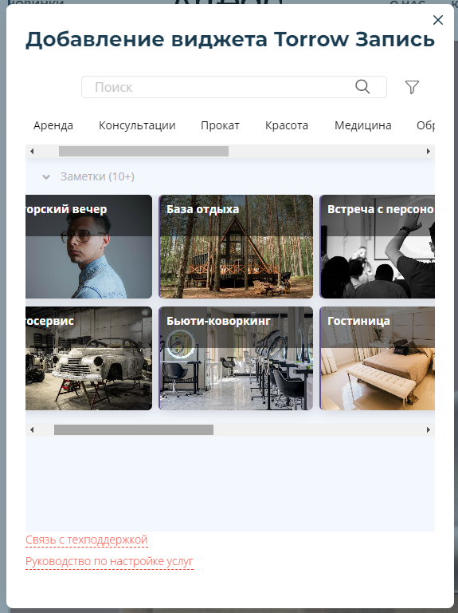

8. Ознакомьтесь с информацией о шаблоне, в случае необходимости посмотрите **пример**, расположенный ниже. Если он соответствует Вашему процессу или приближен к нему, нажмите **Создать услугу по шаблону**.

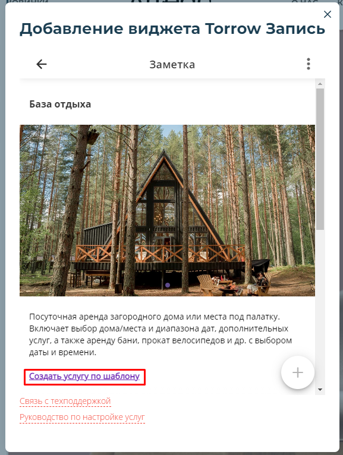

9. После загрузки шаблона Вы получите следующее сообщение. Нажмите на кнопку **Открыть**.

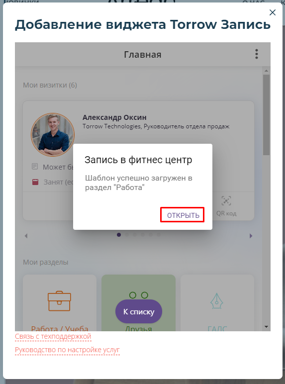

10. Вы попадете к персоначальному списку. Теперь выберите необходимую услугу.

.. figure:: media/fo/fo10.png
    :scale: 52 %
    :alt: alternative text
    :align: center

11. Нажмите на кнопку **Выбрать**.

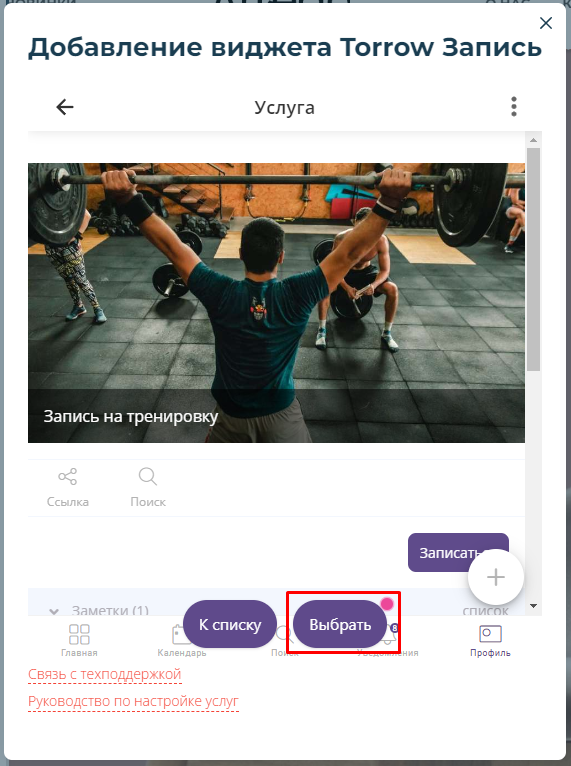

12. Вы получите следующее собщение.

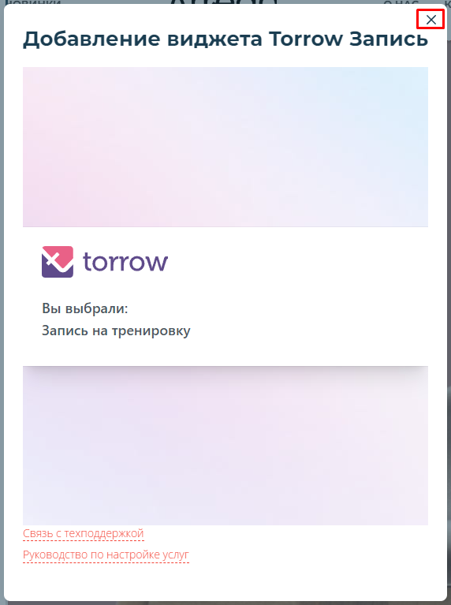

13. Готово! Виджет установлен на Ваш сайт. Осталось опубликовать его.

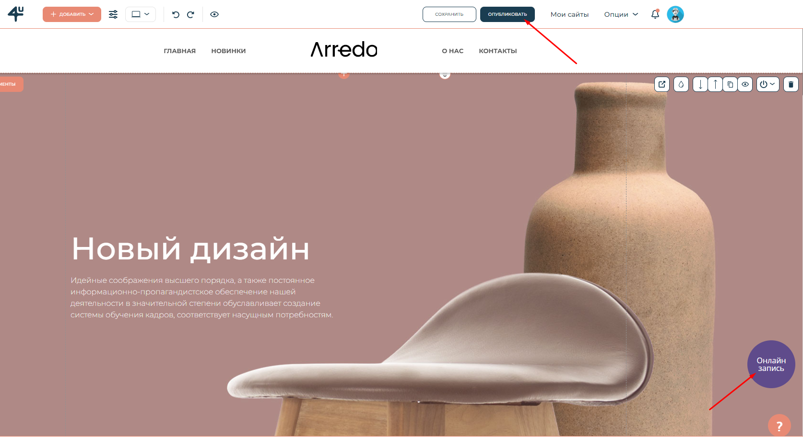

.. hint:: После установки виджета на сайт рекомендуем настроить Вашу услугу. Если Вы использовали готовый шаблон, то можете воспользоваться :ref:`инструкцией<template-label>`.

.. raw:: html
   
   <torrow-widget
      id="torrow-widget"
      url="https://web.torrow.net/app/tabs/tab-search/service;id=103edf7f8c4affcce3a659502c23a?closeButtonHidden=true&tabBarHidden=true"
      modal="right"
      modal-active="false"
      show-widget-button="true"
      button-text="Заявка эксперту"
      modal-width="550px"
      button-style = "rectangle"
      button-size = "60"
      button-y = "top"
   ></torrow-widget>
   

.. raw:: html

   <!--  -->