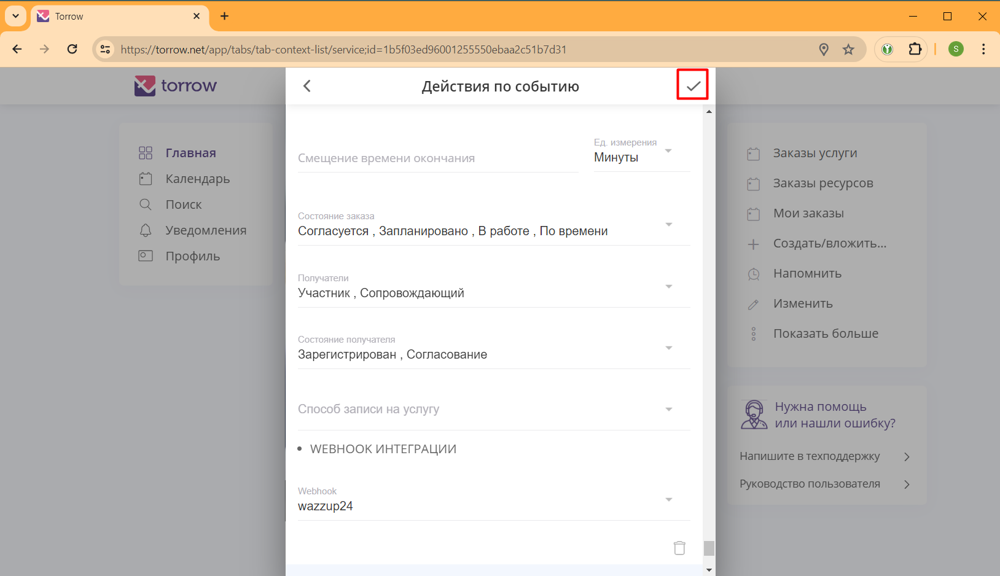

.. _green-api-label:

=========================================================
Интеграция с WhatsApp через Green-Api сервис
=========================================================

    .. |галка| image:: media/galka.png
        :width: 21
        :alt: alternative text

Наш сервис интегрирован с WhatsApp для отправки уведомлений через сервис `Green-Api`_. Используйте данную инструкцию, чтобы настроить рассылку уведомлений вашим клиентам через WhatsApp.

.. note:: 
    При выборе данного способа отправки уведомлений вашим клиентам учитывайте следующую информацию:

    1. Для отправки уведомлений WhatsApp вам требуется оплачивать подписку на сервис `Green-Api`_, т.е. сообщения платные так же, как и отправка Sms.
   
    2. Не все ваши клиенты имеют WhatsApp, поэтому не все клиенты будут получать уведомления. По статистике, примерно 12% клиентов не имеют WhatsApp.

Настройка Green-Api
----------------------------

1. Создайте личный кабинет `Green-Api`_ по ссылке: https://green-api.com/?referal=SWTORROW

2. В личном кабинете `Green-Api`_ настройте Инстанс в соответствии с инструкцией: https://green-api.com/docs/before-start/?referal=SWTORROW

3. Скопируйте из личного кабинета `Green-Api`_ идентификаторы apiUrl, idInstance и apiTokenInstance для настройки WebHook (смотрите картинку ниже).

4. Если в WebHook вы будете использовать параметр **repeat** (описание параметров ниже), то включите настройку **Получать уведомления о статусах отправленных сообщений** (смотрите шаги ниже)

5. После настройки и проверки WebHook оплатите подписку за сервис `Green-Api`_.

Если в WebHook, вы будете использовать параметр **repeat**, то выполните в Личном кабинете `Green-Api`_ следующие шаги настройки параметра **Получать уведомления о статусах отправленных сообщений**:

1. Откройте карточку вашего Инстанса и нажмите кнопку **"Изменить"**:

-----------------------------

2. Вы увидите настройку параметров Инстанса:

-----------------------------

3. Промотайте вниз до параметра **Получать уведомления о статусах отправленных сообщений**:

-----------------------------

4. Включите параметр **Получать уведомления о статусах отправленных сообщений**:

-----------------------------

5. Промотайте еще ниже и нажмите кнопку **"Сохранить изменения"**, перезапустите Инстанс и через 5 минут изменения вступят в силу:

-----------------------------

6. Нажмите кнопку **"Перезапустить"** и через 5 минут изменения вступят в силу:

-----------------------------

Если у вас будут вопросы по настройке, то напишите в `техническую поддержку Torrow`_.

.. _`техническую поддержку Torrow`: https://t.me/TorrowSupport

.. _`Green-Api`: https://green-api.com/?referal=SWTORROW

Параметры WebHook
----------------------------

WebHook для отправки WhatsApp сообщения через green-api имеет следующий URL: https://hooks.torrow.net/webhook/green-api

Для настройки WebHook используются следующие параметры:

* **apiUrl** - ссылка на хост API сервиса Green-api без префикса HTTPS. Например, 1103.api.green-api.com

* **idInstance** - идентификатор инстанса в Green-api для отправки сообщений в формате числовой строки, например: 1234567890.

* **apiTokenInstance** - ключ доступа к инстансу в Green-api в формате строки, например 9410830193ce4ad56fe4df0378d1a0a8da13672248d94697b3.

* **errorEmail** - адрес электронной почты, на который отправлять уведомления об ошибках отправки WhatsApp сообщений.

* **message** - сообщение, добавляемое к форматированному сообщению WhatsApp. Например: Вы записаны на услугу.

* **repeat** - признак повторения отправки сообщения через 10 секунд, если сообщение не доставлено на устройство получателя (для повышения гарантии доставки). Для работы данного параметра выполните в Личном кабинете `Green-Api`_ настройку параметра **Получать уведомления о статусах отправленных сообщений** (смотри раздел настройки GreenApi выше).

Пример WebHook:

.. code-block::

    https://hooks.torrow.net/webhook/green-api?apiUrl=1103.api.green-api.com&idInstance=1234567890&apiTokenInstance=9410830193ce4ad56fe4df0378d1a0a8da13672248d94697b3&errorEmail=test@gmail.com&message=Вы%20записаны%20на%20услугу

Дополнительные параметры форматирования сообщения:

* **resource_name** - название ресурсов, по умолчанию: *Услуги/ресурсы*

* **detail_section_name** - название раздела с деталями заказа, по умолчанию: *Детали заказа, Детали записи, Детали мероприятия*.

* **case_type_name** - название типа события, по умолчанию: *заказ, запись, участие в мероприятии*

* **hide_detail_section** - признак сокрытия раздела с деталями заказа, по умолчанию: *false*.

* **hide_resource_description** - признак сокрытия описания деталей ресурсов, по умолчанию: *false*.

* **hide_order_duration** - признак сокрытия длительности заказа, по умолчанию: *false*.

* **hide_address** - признак сокрытия адреса оказания услуги, по умолчанию: *false*.

* **hide_service_name** - признак сокрытия названия услуги, по умолчанию: *false*.

* **hide_order_description** - признак сокрытия описания заказа, по умолчанию: *false*.

* **hide_url** - признак сокрытия ссылок на услугу и на заказ, по умолчанию: *false*.

* **hide_contact_info** - признак сокрытия контактной информации, по умолчанию *true*.

* **date_locales** - формат даты и времени, по умолчанию: *ru-RU*, другие значения: *en-US*

* **timezone** - часовой пояс, по умолчанию: Europe/Moscow, другие значения: https://timezonedb.com/time-zones

* **timezone_name** - название часового пояса, по умолчанию: *Мск*, другие значения: указываются при разработке.
 

Проверка параметров WebHook: 
----------------------------

Для проверки параметров WebHook нужно открыть сформированный URL в браузере и проверить результат выполнения.

.. figure:: media/green-api/CheckResultSuccess.png
    :width: 80 %
    :alt: Успешная проверка параметров URL
    :align: center

------------------------------------

В ответе вызова WebHook вы получите статус проверки (Status):

1. **Success** - вызов был успешным, все параметры корректны и WebHook можно подключать к Услуге Torrow.

2. **Error** или **Wrong parameters** - есть ошибки в параметрах WebHook, которые нужно исправить. В поле **“ErrorMessage”** будет описание ошибок, которые нужно исправить. В поле **“WarningMessage”** - может находится информация, которая не влияет на работоспособность WebHook, но может быть полезна чтобы настроить WebHook полностью.

.. figure:: media/green-api/CheckResultWrong.png
    :width: 80 %
    :alt: Некорректные параметры URL
    :align: center

------------------------------------

.. figure:: media/green-api/CheckResultError.png
    :width: 80 %
    :alt: Некорректные параметры URL
    :align: center

------------------------------------

Подключение WebHook к услуге
----------------------------------

1. Откройте Услугу и раскройте раздел **“Общие настройки”**:

.. figure:: media/green-api/ServiceOptions.png
    :width: 80 %
    :alt: Общие настройки услуги
    :align: center

----------------------------------

2. В разделе **“Общие настройки”** выберите поле **“Интеграции”**:

.. figure:: media/green-api/ServiceIntegration.png
    :width: 80 %
    :alt: Поле "Интеграции" в "Общих настройках"
    :align: center

----------------------------------

3. В интеграциях включите чекбокс **WebHook**:

.. figure:: media/green-api/ServiceWebhook.png
    :width: 80 %
    :alt: Чекбокс WebHook
    :align: center

----------------------------------

4. Заполните поля для настройки WebHook:

* **Название интеграции** - например “Green-api”

* **URL** - сформированный выше WebHook

* Чекбоксы событий, по которым будет вызываться WebHook: 
   * **Действие по заказу/событию (CaseActionEvent)** - уведомление, которое можно подключить в настройках Услуги в поле "Действия" 

.. figure:: media/green-api/WebhookOptions.png
    :width: 80 %
    :alt: Настройки WebHook
    :align: center

------------------------------------

5. Откройте редактирование Услуги и выберите поле "Действия":

------------------------------------

6. В самом низу формы добавьте вид действия, на которое будет отправляться WhatsApp уведомление:

* Добавьте вид действия "Сообщение участнику о записи"

------------------------------------

.. figure:: media/green-api/Action03.png
    :width: 80 %
    :alt: Результат выбора действия
    :align: center

------------------------------------

7. В настройках Действия поменяйте "Тип действия" на "Интеграция по операции":

.. figure:: media/green-api/Action04.png
    :width: 80 %
    :alt: Тип действия
    :align: center

------------------------------------

.. figure:: media/green-api/Action05.png
    :width: 80 %
    :alt: Выбор действия из списка
    :align: center

------------------------------------

------------------------------------

8. Выберите WebHook "Green-api", который будет вызываться при выполнении Действия:

.. figure:: media/green-api/Action07.png
    :width: 80 %
    :alt: Поле WebHook
    :align: center

------------------------------------

.. figure:: media/green-api/Action08.png
    :width: 80 %
    :alt: Выбор WebHook
    :align: center

------------------------------------

9. После сохранения параметров можно проверять Услугу и отправку сообщений в WhatsApp по номеру телефона, указанному в контактной информации при записи на Услугу.

------------------------------------

Полезные инструменты для настройки и отладки
----------------------------------------------

* Отправка Webhook: https://reqbin.com

* Ловец WebHook: https://webhook.site или https://hookbin.com

* `Пример файла JSON`_
  .. _`Пример файла JSON`: media/green-api/Sample_JSON.json

.. raw:: html
   
   <torrow-widget
      id="torrow-widget"
      url="https://web.torrow.net/app/tabs/tab-search/service;id=103edf7f8c4affcce3a659502c23a?closeButtonHidden=true&tabBarHidden=true"
      modal="right"
      modal-active="false"
      show-widget-button="true"
      button-text="Заявка эксперту"
      modal-width="550px"
      button-style = "rectangle"
      button-size = "60"
      button-y = "top"
   ></torrow-widget>
   

.. raw:: html

   <!--  -->