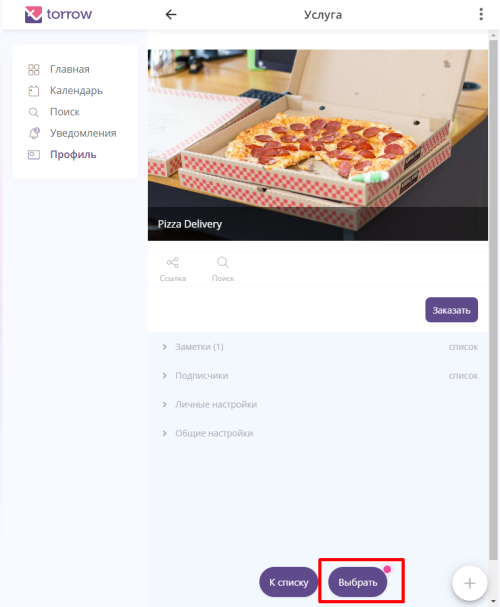

.. _insales-label:

============================
Виджет онлайн-записи/-аренды в insales
============================

    .. |галка| image:: media/galka.png
        :width: 21
        :alt: alternative text

.. note:: Раздел находится в разработке.

При использовании нашего приложения вы сможете разместить кнопку онлайн-записи прямо на своем сайте.

.. figure:: media/insales/insales_11.png
    :scale: 90 %
    :alt: alternative text
    :align: center
    
    Кнопка виджета на сайте

----------------------------------

1. Для добавления кнопки вам нужно Войти/Зарегистрироваться на сайте https://www.insales.ru/.

----------------------------------

2. Перейдите Панель администратора.

----------------------------------

3. Выберите вкладку **Расширения**.

----------------------------------

1. На вкладке **Расширения** найдите **Каталог расширений**.

----------------------------------

5. Введите в поиске **Torrow** и выберите подходящий сервис.

----------------------------------

6. В списке Установленных расширений появился выбранный Вами сервис Torrow. Нажмите на него

------------------------------------

7. Перед Вами окно настройки виджета. **Каждое** поле можно настроить: изменить надписи на кнопке, расположение, размер и цвет кнопки. Нажмите на кнопку **Войти и выбрать услугу**

----------------------------------

8. Если вы ранее не регистрировались в Torrow и не настраивали услугу, то Вы можете **Создать услугу по шаблону**. Если у Вас есть готовая услугу, то выберите ее из списка

----------------------------------

9. Нажмите на кнопку **Выбрать** или **К списку**, если Вы хотите выбрать другую услугу

----------------------------------

10. Виджет с услугой успешно установлен. Можете перейти к Настройке услуги — Инструкция по настройке находится в Вашем шаблоне или Вы можете воспользоваться `Руководством <https://torrownet.readthedocs.io/ru/latest/service/index.html>`_
    

----------------------------------

.. raw:: html
   
   <torrow-widget
      id="torrow-widget"
      url="https://web.torrow.net/app/tabs/tab-search/service;id=103edf7f8c4affcce3a659502c23a?closeButtonHidden=true&tabBarHidden=true"
      modal="right"
      modal-active="false"
      show-widget-button="true"
      button-text="Заявка эксперту"
      modal-width="550px"
      button-style = "rectangle"
      button-size = "60"
      button-y = "top"
   ></torrow-widget>
   

.. raw:: html

   