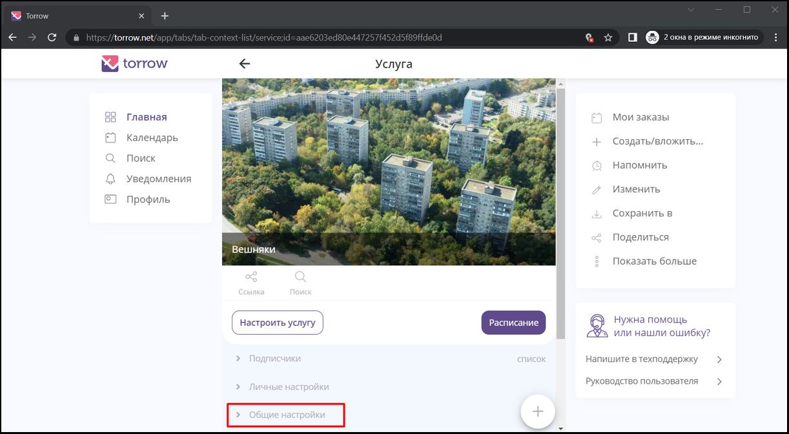
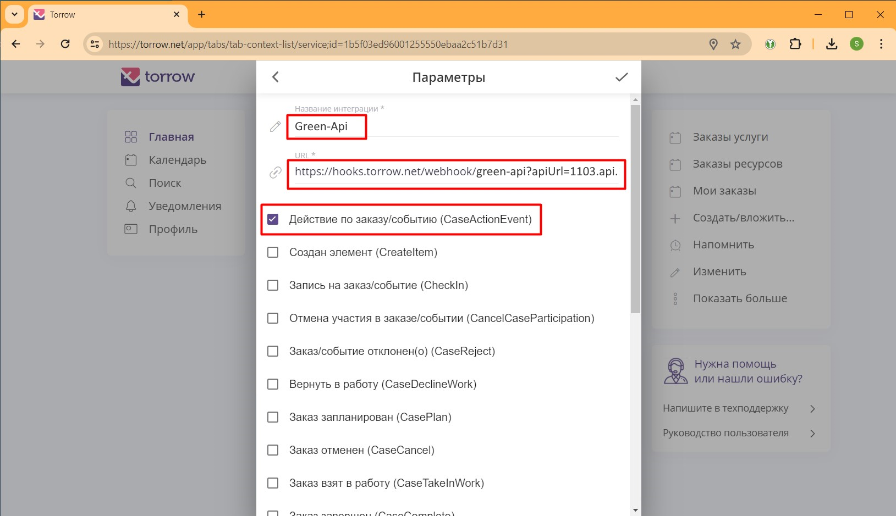
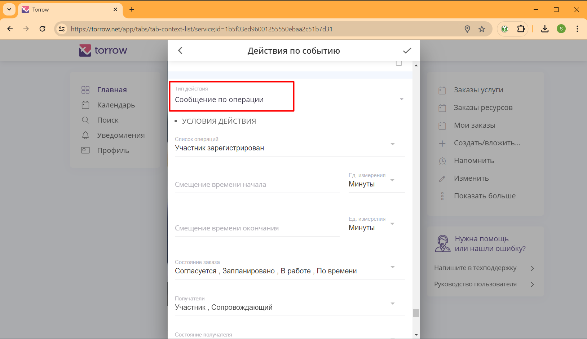
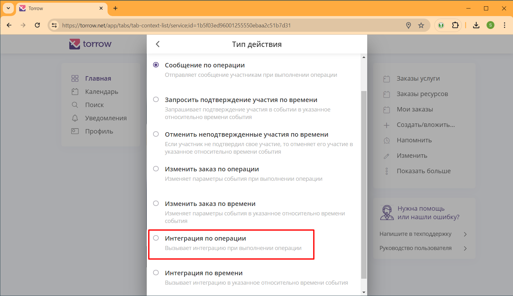
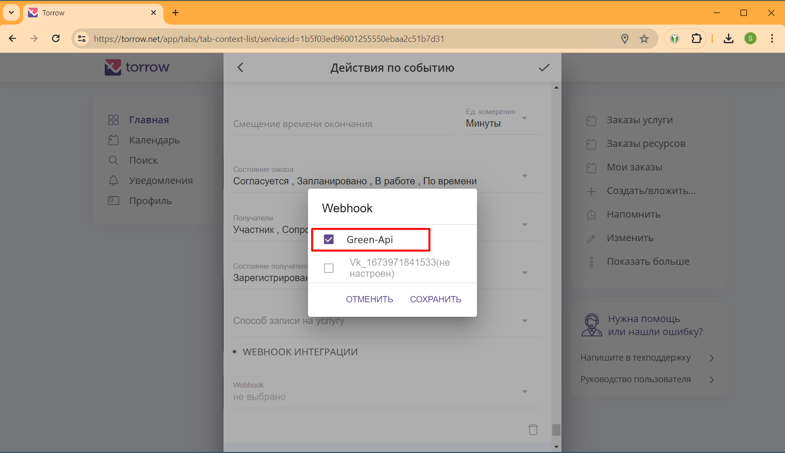

.. _green-api-label:

=========================================================
Интеграция с Telegram для отправки уведомлений
=========================================================

    .. |галка| image:: media/galka.png
        :width: 21
        :alt: alternative text

Наш сервис интегрирован с Telegram для отправки уведомлений клиентам услуги, но только если вы используете специальный Telegram бот (например, от LMS системы), который формирует специальную ссылку записи.
Используйте данную инструкцию, чтобы настроить рассылку уведомлений вашим клиентам через Telegram.

.. note:: 
    При выборе данного способа отправки уведомлений вашим клиентам учитывайте следующую информацию:

    1. Для отправки Telegram уведомлений вам требуется использовать специального Telegram бота, который будет формировать специальную ссылку записи на услугу.
   
    2. Ссылка записи на услугу должна содержать идентификатор пользователя в Telegram чате с Telegram ботом.

Настройка Telegram бота
----------------------------

1. Настройка Telegram бота зависит от выбранной системы, предоставляющей Telegram бот. Смотрите инструкцию на выбранную вами систему.

2. Важно получить токен Telegram бота для настройки WebHook Torrow  (пример токена **6126237741:AAFQKNyn1jhScXSGsYCh_yxwWDT578ARMGA**). Как получить токен - читайте инструкцию на выбранную вами систему.

Если у вас будут вопросы по настройке, то напишите в `техническую поддержку Torrow`_.

.. _`техническую поддержку Torrow`: https://t.me/TorrowSupport

Параметры WebHook
----------------------------

WebHook для отправки Telegram уведомлений имеет следующий URL: https://hooks.torrow.net/webhook/telegram

Для настройки WebHook используются следующие параметры:

* **telegramToken** - токен Telegram бота, через который будет отправляться сообщение. Например, 6126237741:AAFQKNyn1jhScXSGsYCh_yxwWDT578ARMGA

* **telegramFieldName** - название поля в Контактной информации услуги, в котором будет находиться Идентификатор пользователя Telegram. Например, \*TelegramId (при настройке полей Контактной информации Услуги в названии поля можно указать символ звездочка, чтобы это поле не было видно пользователю и заполнялось из URL ссылки).

* **errorEmail** - адрес электронной почты, на который отправлять уведомления об ошибках отправки WhatsApp сообщений.

* **message** - сообщение, добавляемое к форматированному сообщению WhatsApp. Например: Вы записаны на услугу.

Пример WebHook:

.. code-block::

    https://hooks.torrow.net/webhook/telegram?telegramToken=6126237741:AAFQKNyn1jhScXSGsYCh_yxwWDT578ARMGA&telegramFieldName =*TelegramId&errorEmail=test@gmail.com&message=Вы%20записаны%20на%20услугу

Дополнительные параметры форматирования сообщения:

* **resource_name** - название ресурсов, по умолчанию: *Услуги/ресурсы*

* **detail_section_name** - название раздела с деталями заказа, по умолчанию: *Детали заказа, Детали записи, Детали мероприятия*.

* **case_type_name** - название типа события, по умолчанию: *заказ, запись, участие в мероприятии*

* **hide_detail_section** - признак сокрытия раздела с деталями заказа, по умолчанию: *false*.

* **hide_resource_description** - признак сокрытия описания деталей ресурсов, по умолчанию: *false*.

* **hide_order_duration** - признак сокрытия длительности заказа, по умолчанию: *false*.

* **hide_address** - признак сокрытия адреса оказания услуги, по умолчанию: *false*.

* **hide_service_name** - признак сокрытия названия услуги, по умолчанию: *false*.

* **hide_order_description** - признак сокрытия описания заказа, по умолчанию: *false*.

* **hide_url** - признак сокрытия ссылок на услугу и на заказ, по умолчанию: *false*.

* **hide_contact_info** - признак сокрытия контактной информации, по умолчанию *true*.

* **date_locales** - формат даты и времени, по умолчанию: *ru-RU*, другие значения: *en-US*

* **timezone** - часовой пояс, по умолчанию: Europe/Moscow, другие значения: https://timezonedb.com/time-zones

* **timezone_name** - название часового пояса, по умолчанию: *Мск*, другие значения: указываются при настройке.

* **sign_text** - подпись в конце сообщения, по умолчанию: пусто.
 
.. note:: 
    В текстовых сообщениях нужно использовать `ASCII`_ коды: вместо пробела нужно встравлять код **%20**, вместо переноса строки код **%0A**

    Например: **строка%20один%0Aстрока%20два**

.. _`ASCII`: https://www.eso.org/~ndelmott/url_encode.html

Проверка параметров WebHook: 
----------------------------

Для проверки параметров WebHook нужно открыть сформированный URL в браузере и проверить результат выполнения.

.. figure:: media/green-api/CheckResultSuccess.png
    :width: 80 %
    :alt: Успешная проверка параметров URL
    :align: center

------------------------------------

В ответе вызова WebHook вы получите статус проверки (Status):

1. **Success** - вызов был успешным, все параметры корректны и WebHook можно подключать к Услуге Torrow.

2. **Error** или **Wrong parameters** - есть ошибки в параметрах WebHook, которые нужно исправить. В поле **“ErrorMessage”** будет описание ошибок, которые нужно исправить. В поле **“WarningMessage”** - может находится информация, которая не влияет на работоспособность WebHook, но может быть полезна чтобы настроить WebHook полностью.

.. figure:: media/green-api/CheckResultWrong.png
    :width: 80 %
    :alt: Некорректные параметры URL
    :align: center

------------------------------------

.. figure:: media/green-api/CheckResultError.png
    :width: 80 %
    :alt: Некорректные параметры URL
    :align: center

------------------------------------

Подключение WebHook к услуге
----------------------------------

1. Откройте Услугу и раскройте раздел **“Общие настройки”**:

----------------------------------

2. В разделе **“Общие настройки”** выберите поле **“Интеграции”**:

.. figure:: media/green-api/ServiceIntegration.png
    :width: 80 %
    :alt: Поле "Интеграции" в "Общих настройках"
    :align: center

----------------------------------

3. В интеграциях включите чекбокс **WebHook**:

.. figure:: media/green-api/ServiceWebhook.png
    :width: 80 %
    :alt: Чекбокс WebHook
    :align: center

----------------------------------

4. Заполните поля для настройки WebHook:

* **Название интеграции** - например “Green-api”

* **URL** - сформированный выше WebHook

* Чекбоксы событий, по которым будет вызываться WebHook: 
   * **Действие по заказу/событию (CaseActionEvent)** - уведомление, которое можно подключить в настройках Услуги в поле "Действия" 

------------------------------------

5. Откройте редактирование Услуги и выберите поле "Действия":

.. figure:: media/green-api/Action01.png
    :width: 80 %
    :alt: Настройки WebHook
    :align: center

------------------------------------

6. В самом низу формы добавьте вид действия, на которое будет отправляться WhatsApp уведомление:

* Добавьте вид действия "Сообщение участнику о записи"

.. figure:: media/green-api/Action02.png
    :width: 80 %
    :alt: Вид действия
    :align: center

------------------------------------

.. figure:: media/green-api/Action03.png
    :width: 80 %
    :alt: Результат выбора действия
    :align: center

------------------------------------

7. В настройках Действия поменяйте "Тип действия" на "Интеграция по операции":

------------------------------------

------------------------------------

.. figure:: media/green-api/Action06.png
    :width: 80 %
    :alt: Результат выбора действия
    :align: center

------------------------------------

8. Выберите WebHook "Green-api", который будет вызываться при выполнении Действия:

.. figure:: media/green-api/Action07.png
    :width: 80 %
    :alt: Поле WebHook
    :align: center

------------------------------------

------------------------------------

9. После сохранения параметров можно проверять Услугу и отправку сообщений в WhatsApp по номеру телефона, указанному в контактной информации при записи на Услугу.

.. figure:: media/green-api/Action09.png
    :width: 80 %
    :alt: Сохранение параметров
    :align: center

------------------------------------

Полезные инструменты для настройки и отладки
----------------------------------------------

* Отправка Webhook: https://reqbin.com

* Ловец WebHook: https://webhook.site или https://hookbin.com

* `Пример файла JSON`_
  .. _`Пример файла JSON`: media/green-api/Sample_JSON.json

.. raw:: html
   
   <torrow-widget
      id="torrow-widget"
      url="https://web.torrow.net/app/tabs/tab-search/service;id=103edf7f8c4affcce3a659502c23a?closeButtonHidden=true&tabBarHidden=true"
      modal="right"
      modal-active="false"
      show-widget-button="true"
      button-text="Заявка эксперту"
      modal-width="550px"
      button-style = "rectangle"
      button-size = "60"
      button-y = "top"
   ></torrow-widget>
   

.. raw:: html

   <!--  -->