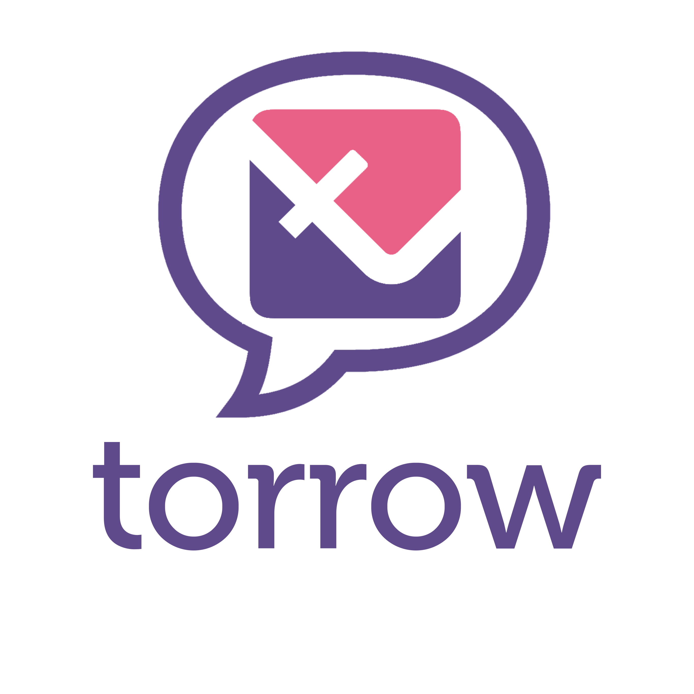

.. _torrow-service-bot-label:

.. favicon:: media/torrow_service_bot/TorrowServiceBot.png

=========================================================
|Иконка TorrowServiceBot| Настройка TorrowServiceBot для Telegram
=========================================================

Введение
--------

**TorrowServiceBot** (Torrow услуги) - это персональный Telegram Bot сервиса Torrow (имя в Телеграмм **@TorrowServiceBot**), который позволяет пользователям телеграмм записываться на услуги бизнеса внутри чата.

Чтобы пользователь телеграмм мог записываться на услуги вашего бизнеса, требуется отправить ему специальную ссылку запуска бота с информацией о вашем бизнесе из сервиса **Torrow**.

Протестировать **Torrow Service Bot** можно по ссылке: https://t.me/TorrowServiceBot?start=aae6103ea895c4e68f915af00015955a0 

Настройка сервиса Torrow для работы с TorrowServiceBot
----------------------------------

В Torrow Service Bot пользователи подписываются на визитные карточки бизнеса, в которые должны быть вложены услуги, чтобы они стали доступны для записи через Telegram.

#. Создайте новый или используйте существующий контакт и заполните его информацией о вашем бизнесе и контактной информацией:

    * Организация или Фамилия Имя Отчество
    * Телефон
    * Мессенджеры Telegram
    * Описание

#. Для контакта в блоке "общие настройки" установите тип доступности **"Открытый"**.

#. Вложите в контакт одну или несколько услуг, на которые должны записываться клиенты, и прикрепите услуги к контакту (у прикрепленных услуг нет перечеркнутого глазика в правом верхнем углу).

#. Для услуг в блоке "общие настройки" установите тип доступности **"Открытый"**.

#. В интернет браузере скопируйте идентификатор контакта из строки адреса. Ссылка на контакт представляет из себя URL адрес следующего вида: https://torrow.net/app/tabs/tab-search/contact;id=aae6103ea895c4e68f915af00015955a0, где **aae6103ea895c4e68f915af00015955a0** - является идентификатором контакта.

#. Сформируйте ссылку запуска Torrow Service Bot-а с подпиской на ваш контакт следующего вида: https://t.me/TorrowServiceBot?start=идентификатор_контакта (например, https://t.me/TorrowServiceBot?start=aae6103ea895c4e68f915af00015955a0).

#. Купите подписку на сервис Torrow с опцией **"Интеграция с Torrow Service Bot"** (данная опция включена в подписку тестового периода, чтобы вы могли протестировать работу).

#. Опубликуйте для ваших клиентов ссылку запуска Torrow Service Bot-а в Телеграмм канале, Web сайте или других Интернет ресурсах.

Настройка уведомлений в Telegram
-------------------------------

Для получения пользователями Телеграм уведомлений об успешной записи на услугу, напоминаний, переносе или отмены требуется в Услугах:

#. в настройках контактной информации добавить поле **\*TelegramId**, в котором будет сохраняться идентификатор пользователя Telegram;

#. настроить WebHook интеграции с Телеграм;

Поля контактной информации Услуги настраиваются в форме редактирования Услуги (пункт меню **"Изменить"**) в самом низу формы (раздел **"Контактная информация"**). Требуется добавить поле с именем **\*TelegramId** и с типом **"строка"**.

Описание параметров WebHook находится в разделе :doc:`"Интеграция с Telegram через внешнего Telegram бота" <telegram>`, при этом в параметре telegramToken требуется указать **"TorrowServiceBot"** (telegramToken=TorrowServiceBot).

Другие параметры элементов
-------------------------

Для настройки параметров работы Torrow Service Bot в Услугах предусмотрены следующие хеш-теги:

**WidgetType** - хеш-тег для принудительной установки типа виджета:

* значение **WEB** активирует простой Web виджет, в котором не должно быть видимых для выбора пользователем шагов записи кроме выбора времени. Например, #WEB:WidgetType;
* значение **FULL** активирует полный виджет-приложение. Например, #FULL:WidgetType;
* пустое значение или отсутствующий тег - автоматическое определение типа виджета по параметрам услуги.

Дополнительно в Услуге поддерживаются другие хеш-теги:

* **DisableUpdateOrderTime** - за сколько минут до начала заказа закрывается возможность переносить заказ. Например, #300:DisableUpdateOrderTime - за 5 часов до начала записи нельзя менять время.
* **DisableCancelMyParticipation** - за сколько минут до начала заказа закрывается возможность отменять свое участие. Например, #300:DisableCancelMyParticipation - за 5 часов до начала записи нельзя отменять участие в заказе.

Для работы Torrow Service Bot в элементе Контакт используются следующие хеш-теги:

* **TlgUserId** - хеш-тег для хранения подписанных на контакт пользователей. Хеш-тег обновляется автоматически в процессе работы Torrow Service Bot-а и его не требуется устанавливать или менять. Одновременно может подписаться не более 20 клиентов. Когда подписывается 21 клиент, то один из клиентов удаляется из списка и, в этом случае, ему потребуется заново подписаться при следующем заказе услуги (снова открыть ссылку запуска Torrow Service Bot).

Команды Torrow Service Bot
----------------------

**/help** - получение информации о Torrow Service Bot-е и командах бота.

**/services** - просмотр списка услуг и запись на выбранную услугу.

**/unsibscribe** - отмена подписки на визитную карточку.

Ограничения Torrow Service Bot
--------------------------

#. После подписки на визитную карточку бизнеса пользователи Telegram могут заказывать услуги бизнеса. Одновременно на одну и ту же визитную карточку (контакт) может быть подписано не более 20 пользователей Telegram. Когда подписывается 21 пользователь, то один из старых пользователей удаляется из списка и, в этом случае, ему потребуется заново подписаться при следующем заказе услуги (снова открыть ссылку запуска Torrow Service Bot). Если у вас выполняется интенсивная запись на ваши услуги, то общий Torrow Service Bot не подойдет и вам нужно разработать персонального Telegram Bot-а. По всем вопросам обращайтесь в техническую поддержку Torrow: https://t.me/TorrowSupport или https://wa.me/79819334617.

#. Один и тот же пользователь Telegram может иметь до 6 подписок на визитные карточки. При подписке на 7-ю визитную карточку одна и старых подписок отменяется, в этом случае, пользователю потребуется заново подписаться при следующем заказе услуги (снова открыть ссылку запуска Torrow Service Bot). Если вы хотите, чтобы ваши клиенты не теряли подписку на ваши услуги, то вам нужно разработать персонального Telegram Bot-а. По всем вопросам обращайтесь в техническую поддержку Torrow: https://t.me/TorrowSupport или https://wa.me/79819334617.

Если у вас будут вопросы по настройке, то напишите в `техническую поддержку Torrow`_.

.. _`техническую поддержку Torrow`: https://t.me/TorrowSupport

.. raw:: html
   
   <torrow-widget
      id="torrow-widget"
      url="https://web.torrow.net/app/tabs/tab-search/service;id=103edf7f8c4affcce3a659502c23a?closeButtonHidden=true&tabBarHidden=true"
      modal="right"
      modal-active="false"
      show-widget-button="true"
      button-text="Заявка эксперту"
      modal-width="550px"
      button-style = "rectangle"
      button-size = "60"
      button-y = "top"
   ></torrow-widget>
   

.. raw:: html
