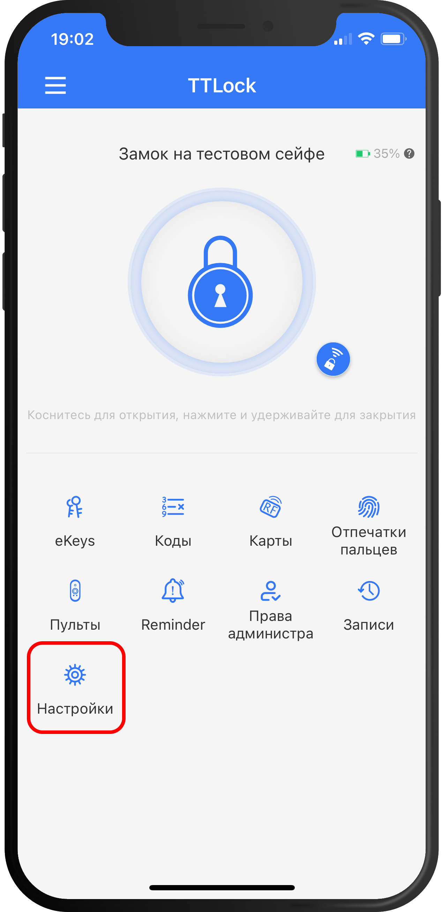
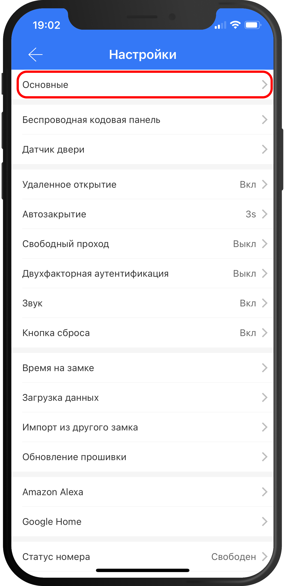
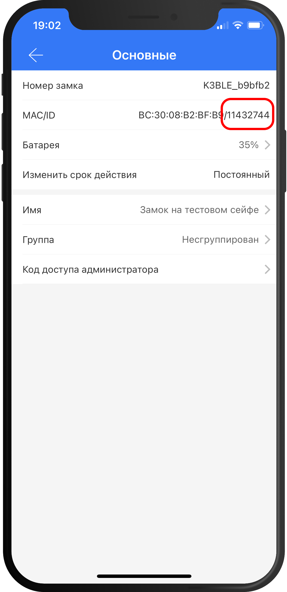
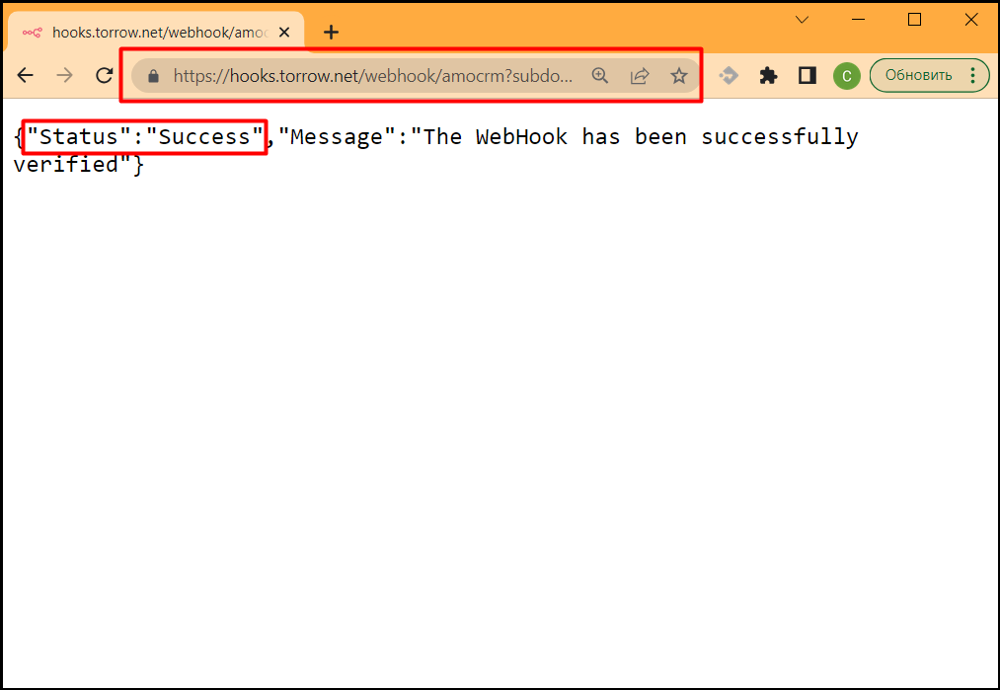
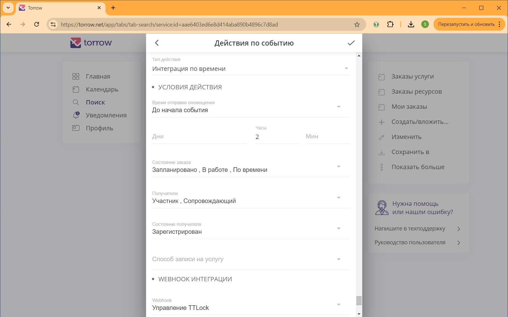

.. _ttlock-label:

=========================================================
Интеграция с электронным замком TTLock
=========================================================

    .. |галка| image:: media/galka.png
        :width: 21
        :alt: alternative text

Наш сервис интегрирован с электронными замками TTLock для установки кодов доступа в указанный промежуток времени. Используйте данную инструкцию, чтобы настроить установку кода доступа к электронному замку TTLock.

.. note:: 
    При настройке интеграции учитывайте следующую информацию:

    1. Ваш `электронный замок`_ должен управляться приложением `APP TTLock`_.
   
    2. Для дистанционного управления замок должен быть подключен к Интернет через WiFi шлюз `Gateway`_.

Настройка интеграции с замком TTLock
--------------------------------------

1. Установить на мобильный телефон приложение `TTLock`_.

2. Настроить подключение электронного замка к Интернет через WiFi шлюз `Gateway`_.

3. Настроить WebHook.

4. Подключить WebHook к Услуге.

5. Настроить Услугу для отправки кода доступа электронного замка.

6. Приобрести подписку на сервис Torrow с опцией **"Интеграция с TTLock"**.

.. _`APP TTLock`: https://ttlock.com.ru/vozmozhnosti
.. _`Gateway`: https://ttlock.com.ru/shop/tag/wifi+%D1%88%D0%BB%D1%8E%D0%B7+ttlock/
.. _`TTLock`: https://ttlock.com.ru/skachat-prilozhenie
.. _`электронный замок`: https://ttlock.com.ru/produktsiya

.. note:: При эксплуатации электронного замка создайте несколько одноразовых кодов доступа, которые вы сможете передать вашему клиенту, если вдруг пропадет Интернет и не будет возможность установить временный код доступа.

Получение lockId для WebHook
----------------------------

Значение параметра lockId, который необходим для WebHook можно найти в приложении `TTLock`_

Откройте главное окно с информацией о замке и нажмите на иконку "Настройки":

------------------------------------

Выберите раздел "Основные":

------------------------------------

В поле "MAC/ID" число после символа слеш "/" будет значением lockId:

------------------------------------

Настройка WebHook
----------------------------

WebHook управления TTLock замками генерит случайный код доступа и сохраняет его в электронный замок. Код доступа действует в определенный промежуток времени, задаваемый параметрами WebHook относительно времени заказа/аренды.
Так же код доступа сохраняется в описание *Заказа*, чтобы клиент мог открыть заказ и узнать код доступа. На изменение Заказа может быть настроено *Действие услуги* для отправки уведомления клиенту на электронную почту или смс.

WebHook для управления TTLock имеет следующий URL: https://hooks.torrow.net/webhook/ttlock

Для настройки WebHook используются следующие параметры:

* **username** - имя пользователя TTLock (электронная почта или телефон входа в личный кабинет)..

* **password** - пароль подключения к TTLock (пароль входа в личный кабинет).

* **lockId** - идентификатор электронного замка. Данный параметр не указывается, если идентификатор замка будет настраиваться в ресурсах услуги (см. примечание ниже).

* **codeLength** - длина кода открытия замка, корректное значение от 4 до 9 символов. По умолчанию 6 символов.
  
* **keepHours** - число часов хранения кодов доступа перед удалением. По умолчанию 120 часов (5 дней).
  
* **validBeforeMinutes** - число минут до начала события, когда код доступа становится валидным (отрицательное значение - число минут после начала события). По умолчанию 0 минут. 
  
* **expiredBeforeMinutes** - число минут до окончания события, когда код доступа перестает действовать (отрицательное значение - число минут после окончания события). По умолчанию 0 минут. 
  
* **errorEmail** - адрес электронной почты для уведомления об ошибках управления электронным замком. Обязальный параметр.

* **templateMsg** - шаблон сообщения, которое будет добавлено в описание заказа. По умолчанию шаблон: *** Код доступа [passcode]%23 *** , где вместо [passcode] будет подставлен код доступа к электронному замку (%23 - символ **#**, который нужно нажимать на замке после ввода кода).

Пример WebHook:

.. code-block::

    https://hooks.torrow.net/webhook/ttlock?username=ttlock@torrowtech.com&password=123&lockId=11432744&codeLength=6&keepHours=48&validBeforeMinutes=15&expiredBeforeMinutes=15&errorEmail=test@gmail.com

.. note:: 
    Если **lockId** не указан в параметрах WebHook, то идентификатор будет браться из хештегов ресурсов сделанного заказа. В хештеге ресурса идентификатор должен указываться в формате **<номер замка>:lockId** (т.е. создается категория хештегов с названием **"lockId"**). Например: **11432744:lockId**.

Проверка параметров WebHook: 
----------------------------

Для проверки параметров WebHook нужно открыть сформированный URL в браузере и проверить результат выполнения.

------------------------------------

В ответе вызова WebHook вы получите статус проверки (Status):

1. **Success** - вызов был успешным, все параметры корректны и WebHook можно подключать к Услуге Torrow.

2. **Error** или **Wrong parameters** - есть ошибки в параметрах WebHook, которые нужно исправить. В поле **“ErrorMessage”** будет описание ошибок, которые нужно исправить. В поле **“WarningMessage”** - может находится информация, которая не влияет на работоспособность WebHook, но может быть полезна чтобы настроить WebHook полностью.

------------------------------------

.. figure:: media/ttlock/CheckResultError.png
    :width: 80 %
    :alt: Некорректные параметры URL
    :align: center

------------------------------------

Подключение WebHook к услуге
----------------------------------

1. Откройте Услугу и раскройте раздел **“Общие настройки”**:

----------------------------------

1. В разделе **“Общие настройки”** выберите поле **“Интеграции”**:

.. figure:: media/ttlock/ServiceIntegration.png
    :width: 80 %
    :alt: Поле "Интеграции" в "Общих настройках"
    :align: center

----------------------------------

3. В интеграциях включите чекбокс **WebHook**:

----------------------------------

4. Заполните поля для настройки WebHook:

* **Название интеграции** - например “TTLock”

* **URL** - сформированный выше WebHook

* Чекбоксы событий, по которым будет вызываться WebHook: 
   * **Действие по заказу/событию (CaseActionEvent)** - уведомление, которое можно подключить в настройках Услуги в поле "Действия" 

.. figure:: media/ttlock/WebhookOptions.jpg
    :width: 80 %
    :alt: Настройки WebHook
    :align: center

------------------------------------

Настройка Действия в Услуге для вызова WebHook
-------------------------------------------------

Для создания кода доступа перед началом заказа/аренды требуется настроить следующие параметры "Действия" в Услуге:

* **Тип действия** - “Интеграция по времени” 

* **Время отправки сообщения** - “До начала события”.

* **Поля времени** - установите промежуток времени за который до начала события требуется вызвать WebHook для создания кода доступа к электронному замку. Например, 2 часа.

* **Состояние заказа** - “Запланировано”, “В работе”, “По времени”

* **Получатели** - “Участник”

* **Состояние получателя** - “Зарегистрирован“

* **Способ записи на услугу** - пусто

* **Webhook** - выбрать настроенный Webhook.
 
.. note:: 
    Внимание! При настройке *Действия* требуется учитывать, что код доступа должен начинать свое действие (время начала заказа минус validBeforeMinutes ) не менее чем через 10 минут после вызова WebHook. Т.е. если WebHook вызывается в 12 часов дня, то самая ранняя дата начала действия кода доступа должна быть в 12:10 (время начала заказа минус validBeforeMinutes ), в противном случае время начала действия кода доступа будет установлена как текущее время + 10 минут.

1. Откройте редактирование Услуги и выберите поле "Действия":

.. figure:: media/ttlock/Action01.png
    :width: 80 %
    :alt: Настройки WebHook
    :align: center

------------------------------------

2. В самом низу формы добавьте вид действия, на которое будет отправляться WhatsApp уведомление:

* Добавьте вид действия "Сообщение участнику о записи"

.. figure:: media/ttlock/Action02.png
    :width: 80 %
    :alt: Вид действия
    :align: center

------------------------------------

------------------------------------

3. В настройках Действия поменяйте "Тип действия" на "Интеграция по времени":

.. figure:: media/ttlock/Action04.png
    :width: 80 %
    :alt: Тип действия
    :align: center

------------------------------------

.. figure:: media/ttlock/Action05.png
    :width: 80 %
    :alt: Выбор действия из списка
    :align: center

------------------------------------

.. figure:: media/ttlock/Action06.png
    :width: 80 %
    :alt: Результат выбора действия
    :align: center

------------------------------------

4. Выберите WebHook "TTLock", который будет вызываться при выполнении Действия:

------------------------------------

------------------------------------

5. После сохранения параметров можно проверять Услугу и создание кода доступа к электронному замку.

------------------------------------

Полезные инструменты для настройки и отладки
----------------------------------------------

* Отправка Webhook: https://reqbin.com

* Ловец WebHook: https://webhook.site или https://hookbin.com

* `Пример файла JSON`_
  .. _`Пример файла JSON`: media/ttlock/Sample_JSON.json

.. raw:: html
   
   <torrow-widget
      id="torrow-widget"
      url="https://web.torrow.net/app/tabs/tab-search/service;id=103edf7f8c4affcce3a659502c23a?closeButtonHidden=true&tabBarHidden=true"
      modal="right"
      modal-active="false"
      show-widget-button="true"
      button-text="Заявка эксперту"
      modal-width="550px"
      button-style = "rectangle"
      button-size = "60"
      button-y = "top"
   ></torrow-widget>
   

.. raw:: html

   <!--  -->