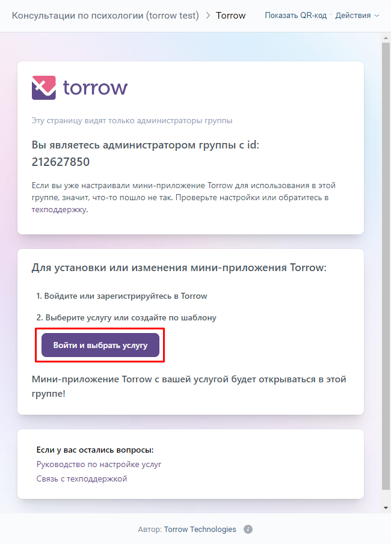
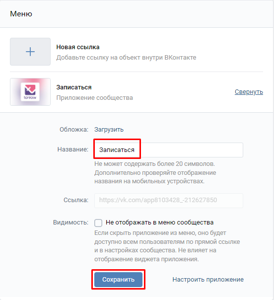

.. _vk-label:

============================
Виджет Вконтакте (VKontakte)
============================

.. note:: Раздел находится в разработке.

.. note:: **Виджет Вконтакте** - это мини-приложение torrow, которое можно разместить в Вашем сообществе. С помощью него можно организовать запись на любые виды услуг и принимать оплату от клиентов.

---------------------------------------
Установка Виджета Вконтакте (VKontakte)
---------------------------------------

**Чтобы установить виджет Вконтакте (VKontakte) в свое сообщество:**

1. Перейдите по ссылке: `Установить виджет в сообщество Вконтакте <https://vk.com/add_community_app.php?aid=8103428>`_

2. Выберите из списка сообщество, куда хотите установить виджет и нажмите **Добавить**.

3. Вы получите следующее сообщение.

.. figure:: media/vk/vk-widget2.png
    :scale: 70 %
    :alt: alternative text
    :align: center

4. Теперь просто перейдите в свое сообщество. В разделе меню уже будет расположена кнопка записи.

5. Нажмите на кнопку записи. При первичном нажатии Вам необходимо авторизоваться и выбрать одну из услуг на аккаунте.

6. После авторизации Вам будет предложено создать **новую** услугу по шаблону или выбрать **одну из существующих**.

7. После выбора услуги из списка нажмите на кнопку **Выбрать**, чтобы подтвердить действие.

8. После всех перечисленных действий Вы получите сообщение как на изображении ниже. В Вашей услуге torrow будет проставлен уникальный идентификатор.

9. Ваше мини-приложение torrow для записи полностью настроено. Теперь можете просто вернуться в Ваше сообщество. При необходимости Вы можете изменить надпись и другие параметры кнопки по инструкции ниже.

.. hint:: Вы можете редактировать услугу прямо через мини-приложение Вконтакте. Клиент, в свою очередь, будет видеть стандартную форму записи.

-------------------------------------------------

-------------------------------------------------------------
Как изменить надпись на кнопке виджета Вконтакте? (VKontakte)
-------------------------------------------------------------

**Чтобы изменить надпись на кнопке виджета:**

1. В меню сообщества Вконтакте, нажмите на надпись **Настроить**.

2. Измените **название** на необходимое Вам и нажмите на кнопку **сохранить**.

.. raw:: html
   
   <torrow-widget
      id="torrow-widget"
      url="https://web.torrow.net/app/tabs/tab-search/service;id=103edf7f8c4affcce3a659502c23a?closeButtonHidden=true&tabBarHidden=true"
      modal="right"
      modal-active="false"
      show-widget-button="true"
      button-text="Заявка эксперту"
      modal-width="550px"
      button-style = "rectangle"
      button-size = "60"
      button-y = "top"
   ></torrow-widget>
   

.. raw:: html

   