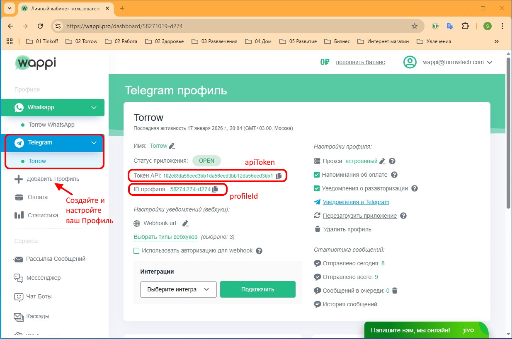
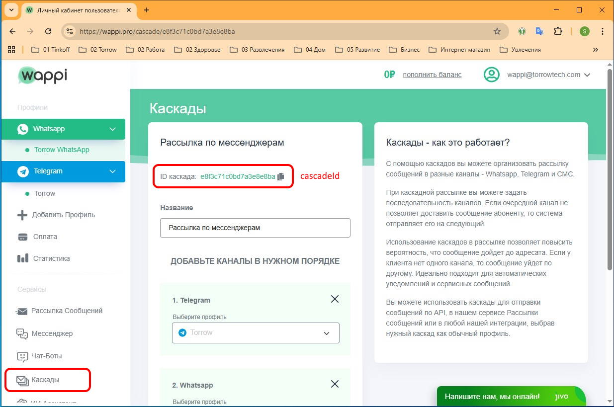
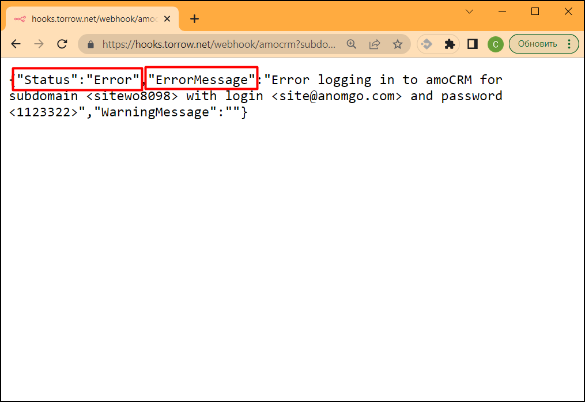
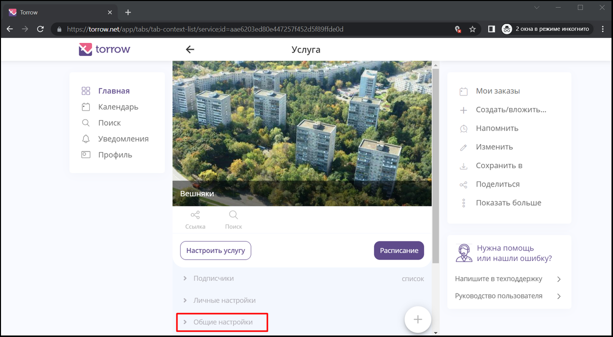

.. _wappi-label:

=========================================================
Интеграция с Telegram, WhatsApp, MAX и VKontakte через Wappi сервис
=========================================================

    .. |галка| image:: media/galka.png
        :width: 21
        :alt: alternative text

Наш сервис интегрирован с мессенджерами Telegram, WhatsApp, MAX и VKontakte для отправки уведомлений через сервис `Wappi`_. Используйте данную инструкцию, чтобы настроить рассылку уведомлений вашим клиентам.

.. note:: 
    При выборе данного способа отправки уведомлений вашим клиентам учитывайте следующую информацию:

    1. Для отправки уведомлений Telegram, WhatsApp, MAX и VKontakte вам требуется оплачивать подписку на сервис `Wappi`_, т.е. сообщения платные так же, как и отправка Sms.
   
    2. Не все ваши клиенты подключены к мессенджерам, поэтому нужно настраивать в `Wappi`_ каскадные рассылки на все виды мессанджеров, чтобы максимально повысить вероятность доставки сообщений.

Настройка Wappi
----------------------------

1. Создайте личный кабинет `Wappi`_ по ссылке: https://wappi.pro/registration?ref=73bf516f

2. В личном кабинете `Wappi`_ добавьте Профили под каждый вид мессенджера (Telegram, WhatsApp, MAX, VKontakte и др.) и настройте Профили.

3. В личном кабинете `Wappi`_ настройте Каскады для каскадной отправки сообщений по всем настроенным мессенджерам.

4. Скопируйте из личного кабинета `Wappi`_ идентификаторы apiToken, profileId и cascadeId для настройки WebHook (смотрите изображения ниже).

5. После настройки и проверки WebHook оплатите подписку за сервис `Wappi`_.

------------------------------------

Параметры **apiToken** и **profileId** находятся на странице настройки **Профиля**. После регистрации сначала нужно создать и настроить **Профиль** для выбранного мессенджера.

------------------------------------

Параметр **cascadeId** находится на странице редактирования Каскада. После регистрации сначала нужно создать и настроить **Каскад** после настройки **Профилей**.

------------------------------------

Если у вас будут вопросы по настройке, то напишите в `техническую поддержку Torrow`_.

.. _`техническую поддержку Torrow`: https://t.me/TorrowSupport

.. _`Wappi`: https://wappi.pro/registration?ref=73bf516f

Параметры WebHook
----------------------------

WebHook для отправки каскадных сообщений с использованием настроенных мессенджеров через Wappi имеет следующий URL: https://hooks.torrow.net/webhook/wappi

Для настройки WebHook используются следующие параметры:

* **cascadeId** - идентификатор **Каскада** в Wappi для отправки сообщений по всем настроенным мессанджерам в формате шестнадцатеричной строки, например: e9f1c45c0bd7a3e8e8ba.

* **apiToken** - ключ доступа к Wappi в формате строки, например 9410830193ce4ad56fe4df0378d1a0a8da13672248d94697b3.

* **errorEmail** - адрес электронной почты, на который отправлять уведомления об ошибках отправки сообщений.

* **message** - сообщение, добавляемое к форматированному сообщению. Например: *Вы записаны на услугу*.
 
* **profileId** - идентификатор **Профиля** в Wappi для отправки сообщений с помощью конкретного мессенджера (например, Telegram) в формате строки, например: 58271315-d123. В параметрах WebHook обязательно должен быть либо cascadeId, либо profileId.

Пример WebHook для **Wappi**:

.. code-block::

    https://hooks.torrow.net/webhook/wappi?cascadeId=e9f1c45c0bd7a3e8e8ba&apiToken=9410830193ce4ad56fe4df0378d1a0a8da13672248d94697b3&errorEmail=test@gmail.com&message=Вы%20записаны%20на%20услугу

Дополнительные параметры форматирования сообщения:

* **resource_name** - название ресурсов, по умолчанию: *Услуги/ресурсы*

* **detail_section_name** - название раздела с деталями заказа, по умолчанию: *Детали заказа, Детали записи, Детали мероприятия*.

* **case_type_name** - название типа события, по умолчанию: *заказ, запись, участие в мероприятии*

* **hide_detail_section** - признак сокрытия раздела с деталями заказа, по умолчанию: *false*.

* **hide_resource_description** - признак сокрытия описания деталей ресурсов, по умолчанию: *false*.

* **hide_order_duration** - признак сокрытия длительности заказа, по умолчанию: *false*.

* **hide_address** - признак сокрытия адреса оказания услуги, по умолчанию: *false*.

* **hide_service_name** - признак сокрытия названия услуги, по умолчанию: *false*.

* **hide_order_description** - признак сокрытия описания заказа, по умолчанию: *false*.

* **hide_url** - признак сокрытия ссылок на услугу и на заказ, по умолчанию: *false*.

* **hide_contact_info** - признак сокрытия контактной информации, по умолчанию *true*.

* **date_locales** - формат даты и времени, по умолчанию: *ru-RU*, другие значения: *en-US*

* **timezone** - часовой пояс, по умолчанию: Europe/Moscow, другие значения: https://timezonedb.com/time-zones

* **timezone_name** - название часового пояса, по умолчанию: *Мск*, другие значения: указываются при настройке.

* **sign_text** - подпись в конце сообщения, по умолчанию: пусто.
 
.. note:: 
    В текстовых сообщениях нужно использовать `ASCII`_ коды: вместо пробела нужно встравлять код **%20**, вместо переноса строки код **%0A**

    Например: **строка%20один%0Aстрока%20два**

.. _`ASCII`: https://www.eso.org/~ndelmott/url_encode.html

Вспомогательные параметры отправки сообщения:

* **phone** - номер телефона, на который нужно отправить сообщение, которое указано в поле **message**. Имеет приоритет перед всеми другими параметрами.

Пример WebHook для отправки сообщения на постоянный номер:

.. code-block::

    https://hooks.torrow.net/webhook/wappi?cascadeId=e9f1c45c0bd7a3e8e8ba&apiTokenInstance=9410830193ce4ad56fe4df0378d1a0a8da13672248d94697b3&errorEmail=test@gmail.com&phone=79819998877&message=Сообщение%20на%20постоянный%20номер

Проверка параметров WebHook: 
----------------------------

Для проверки параметров WebHook нужно открыть сформированный URL в браузере и проверить результат выполнения.

.. figure:: media/wappi/CheckResultSuccess.png
    :width: 80 %
    :alt: Успешная проверка параметров URL
    :align: center

------------------------------------

В ответе вызова WebHook вы получите статус проверки (Status):

1. **Success** - вызов был успешным, все параметры корректны и WebHook можно подключать к Услуге Torrow.

2. **Error** или **Wrong parameters** - есть ошибки в параметрах WebHook, которые нужно исправить. В поле **“ErrorMessage”** будет описание ошибок, которые нужно исправить. В поле **“WarningMessage”** - может находится информация, которая не влияет на работоспособность WebHook, но может быть полезна чтобы настроить WebHook полностью.

.. figure:: media/wappi/CheckResultWrong.png
    :width: 80 %
    :alt: Некорректные параметры URL
    :align: center

------------------------------------

------------------------------------

Подключение WebHook к услуге
----------------------------------

1. Откройте Услугу и раскройте раздел **“Общие настройки”**:

----------------------------------

2. В разделе **“Общие настройки”** выберите поле **“Интеграции”**:

.. figure:: media/wappi/ServiceIntegration.png
    :width: 80 %
    :alt: Поле "Интеграции" в "Общих настройках"
    :align: center

----------------------------------

3. В интеграциях включите чекбокс **WebHook**:

.. figure:: media/wappi/ServiceWebhook.png
    :width: 80 %
    :alt: Чекбокс WebHook
    :align: center

----------------------------------

4. Заполните поля для настройки WebHook:

* **Название интеграции** - например “Wappi”

* **URL** - сформированный выше WebHook

* Чекбоксы событий, по которым будет вызываться WebHook: 
   * **Действие по заказу/событию (CaseActionEvent)** - уведомление, которое можно подключить в настройках Услуги в поле "Действия" 

.. figure:: media/wappi/WebhookOptions.png
    :width: 80 %
    :alt: Настройки WebHook
    :align: center

------------------------------------

5. Откройте редактирование Услуги и выберите поле "Действия":

.. figure:: media/wappi/Action01.png
    :width: 80 %
    :alt: Настройки WebHook
    :align: center

------------------------------------

6. В самом низу формы добавьте вид действия, на которое будет отправляться WhatsApp уведомление:

* Добавьте вид действия "Сообщение участнику о записи"

.. figure:: media/wappi/Action02.png
    :width: 80 %
    :alt: Вид действия
    :align: center

------------------------------------

.. figure:: media/wappi/Action03.png
    :width: 80 %
    :alt: Результат выбора действия
    :align: center

------------------------------------

7. В настройках Действия поменяйте "Тип действия" на "Интеграция по операции":

.. figure:: media/wappi/Action04.png
    :width: 80 %
    :alt: Тип действия
    :align: center

------------------------------------

.. figure:: media/wappi/Action05.png
    :width: 80 %
    :alt: Выбор действия из списка
    :align: center

------------------------------------

.. figure:: media/wappi/Action06.png
    :width: 80 %
    :alt: Результат выбора действия
    :align: center

------------------------------------

8. Выберите WebHook "Wappi", который будет вызываться при выполнении Действия:

.. figure:: media/wappi/Action07.png
    :width: 80 %
    :alt: Поле WebHook
    :align: center

------------------------------------

.. figure:: media/wappi/Action08.png
    :width: 80 %
    :alt: Выбор WebHook
    :align: center

------------------------------------

9. После сохранения параметров можно проверять Услугу и отправку сообщений в WhatsApp по номеру телефона, указанному в контактной информации при записи на Услугу.

.. figure:: media/wappi/Action09.png
    :width: 80 %
    :alt: Сохранение параметров
    :align: center

------------------------------------

Полезные инструменты для настройки и отладки
----------------------------------------------

* Отправка Webhook: https://reqbin.com

* Ловец WebHook: https://webhook.site или https://hookbin.com

* `Пример файла JSON`_
  .. _`Пример файла JSON`: media/wappi/Sample_JSON.json

.. raw:: html
   
   <torrow-widget
      id="torrow-widget"
      url="https://web.torrow.net/app/tabs/tab-search/service;id=103edf7f8c4affcce3a659502c23a?closeButtonHidden=true&tabBarHidden=true"
      modal="right"
      modal-active="false"
      show-widget-button="true"
      button-text="Заявка эксперту"
      modal-width="550px"
      button-style = "rectangle"
      button-size = "60"
      button-y = "top"
   ></torrow-widget>
   

.. raw:: html

   <!--  -->