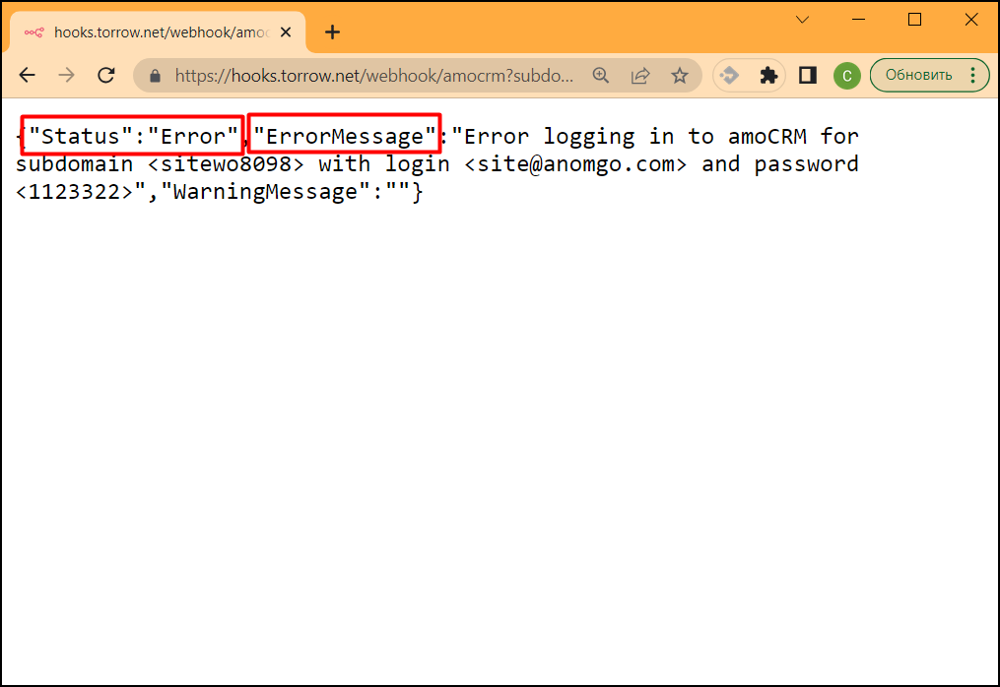
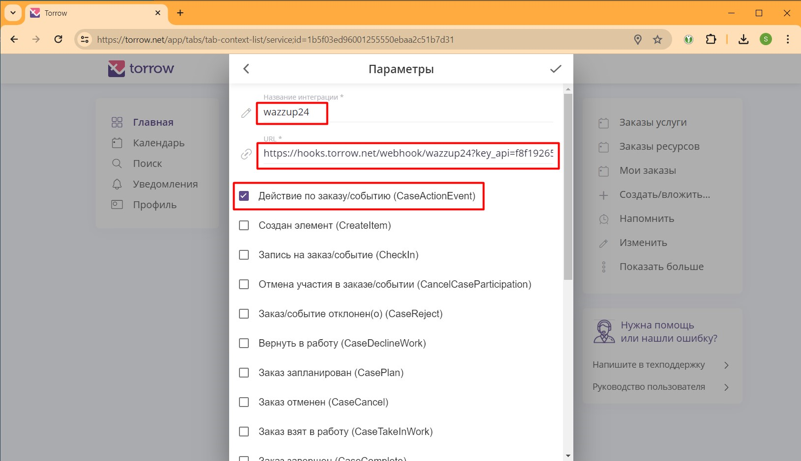

.. _wazzup24-label:

=========================================================
Интеграция с WhatsApp через Wazzup24 сервис
=========================================================

    .. |галка| image:: media/galka.png
        :width: 21
        :alt: alternative text

Наш сервис интегрирован с WhatsApp для отправки уведомлений через сервис Wazzup24. Используйте данную инструкцию, чтобы настроить рассылку уведомлений вашим клиентам через WhatsApp.

.. note:: 
    При выборе данного способа отправки уведомлений вашим клиентам учитывайте следующую информацию:

    1. Отправка уведомлений WhatsApp платная, так же как и отправка Sms.
   
    2. В отличие от Sms-уведомлений, в WhatsApp вы платите за 1 день переписки с вашим клиентом, а не за отдельные сообщения.
   
    3. Не все ваши клиенты имеют WhatsApp, поэтому не все клиенты будут получать уведомления. По статистике, примерно 15% клиентов не имеют WhatsApp.

Настройка Wazzup24
----------------------------

1. Создать личный кабинет Wazzup24 по ссылке: https://wazzup24.com/?utm_p=zGYFL7

2. В личном кабинете настроить канал.

3. Настроить интеграцию с CRM: добавить "Использовать API".

4. Скопировать ключ API, которые будет добавлен в URL WebHook ниже.

5. Скопировать идентификатор канала из URL настройки канала.

6. Оплатить подписку Pro и выше, чтобы была возможность писать первым в WhatsApp.

Параметры WebHook
----------------------------

Для настройки WebHook используются следующие параметры:

* **key_api** - ключ для подключения к Wazzup24 в формате строки, например f8f1955587ac4d8894cee95f92dcaca4.

* **channel_id** - идентификатор канала в формате строки GUID, например: 3344fab4-b01b-4232-b9cb-a15ec3acc053.

* **chat_type** - тип чата для указанного канала. В данный момент поддерживается значение  whatsapp.

* **message** - сообщение, добавляемое к форматированному сообщению WhatsApp. Например: Вы записаны на услугу.

Пример WebHook:

.. code-block::

    https://hooks.torrow.net/webhook/wazzup24?key_api=f8f1955587ac6d7894cee95f92dcaca4&channel_id=3349fab8-b01b-4232-b9cb-a15ec3acc053&chat_type=whatsapp&message=Вы%20записаны%20на%20услугу

Дополнительные параметры форматирования сообщения:

* **resource_name** - название ресурсов, по умолчанию: Услуги/ресурсы

* **detail_section_name** - название раздела с деталями заказа, по умолчанию: Детали заказа, Детали записи, Детали мероприятия.

* **case_type_name** - название типа события, по умолчанию: заказ, запись, участие в мероприятии

* **hide_detail_section** - признак сокрытия раздела с деталями заказа, по умолчанию: false.	

* **hide_resource_description** - признак сокрытия описания деталей ресурсов, по умолчанию: false.

* **hide_order_duration** - признак сокрытия длительности заказа, по умолчанию: false.

* **hide_address** - признак сокрытия адреса оказания услуги, по умолчанию: false.	

* **hide_service_name** - признак сокрытия названия услуги, по умолчанию: false.

* **hide_order_description** - признак сокрытия описания заказа, по умолчанию: false.

* **hide_url** - признак сокрытия ссылок на услугу и на заказ, по умолчанию: false.

* **hide_contact_info** - признак сокрытия контактной информации, по умолчанию true.

* **date_locales** - формат даты и времени, по умолчанию: ru-RU, другие значения: en-US

* **time_zone** - часовой пояс, по умолчанию: Europe/Moscow, другие значения: https://timezonedb.com/time-zones

* **time_zone_name** - название часового пояса, по умолчанию: Мск, другие значения: указываются при разработке.
 
Проверка параметров WebHook: 
----------------------------

Для проверки параметров WebHook нужно открыть сформированный URL в браузере и проверить результат выполнения.

.. figure:: media/wazzup24/CheckResultSuccess.png
    :scale: 60 %
    :alt: Успешная проверка параметров URL
    :align: center

В ответе вызова WebHook вы получите статус проверки (Status):

1. **Success** - вызов был успешным, все параметры корректны и WebHook можно подключать к Услуге Torrow.

2. **Error** или **Wrong parameters** - есть ошибки в параметрах WebHook, которые нужно исправить. В поле **“ErrorMessage”** будет описание ошибок, которые нужно исправить. В поле **“WarningMessage”** - может находится информация, которая не влияет на работоспособность WebHook, но может быть полезна чтобы настроить WebHook полностью.

.. figure:: media/wazzup24/CheckResultWrong.png
    :scale: 60 %
    :alt: Некорректные параметры URL
    :align: center

Подключение WebHook к услуге
----------------------------------

1. Откройте Услугу и раскройте раздел **“Общие настройки”**:

.. figure:: media/wazzup24/ServiceOptions.png
    :scale: 60 %
    :alt: Общие настройки услуги
    :align: center

----------------------------------

2. В разделе **“Общие настройки”** выберите поле **“Интеграции”**:

----------------------------------

3. В интеграциях включите чекбокс **WebHook**:

.. figure:: media/wazzup24/ServiceWebhook.png
    :scale: 60 %
    :alt: Чекбокс WebHook
    :align: center

----------------------------------

4. Заполните поля для настройки WebHook:

* Название интеграции - например “Wazzup24”

* URL - сформированный выше WebHook

* Чекбоксы событий, по которым будет вызываться WebHook: 
   * **Запись на заказ/событие (CheckIn)** - уведомление при записи на событие или создании заказа

   * **Заказ отменен (CaseCancel)** - уведомление при отмене заказа

   * **Заказ завершен (CaseComplete)** – уведомление при завершении заказа

   * **Изменено время заказа/события (UpdateCaseTime)** - уведомление при изменении времени

   * **Изменено место заказа/события (UpdateCasePlace)** - уведомление при изменении места

   * **ApproveMoneyReceive** - уведомление при получении денег

------------------------------------

5. После сохранения параметров можно проверять Услугу и отправку сообщений в WhatsApp по номеру телефона, указанному в контактной информации при записи на Услугу.

Полезные инструменты для настройки и отладки
------------------------------------

* Отправка Webhook: https://reqbin.com

* Ловец WebHook: https://webhook.site или https://hookbin.com

* Пример файла JSON:

.. :file:`media/wazzup24/Sample_JSON.json`

.. raw:: html
   
   <torrow-widget
      id="torrow-widget"
      url="https://web.torrow.net/app/tabs/tab-search/service;id=103edf7f8c4affcce3a659502c23a?closeButtonHidden=true&tabBarHidden=true"
      modal="right"
      modal-active="false"
      show-widget-button="true"
      button-text="Заявка эксперту"
      modal-width="550px"
      button-style = "rectangle"
      button-size = "60"
      button-y = "top"
   ></torrow-widget>
   

.. raw:: html

   