.. _yandex-label:

============================
Онлайн-запись в Яндекс картах
============================

.. |галка| image:: media/galka.png
    :width: 21
    :alt: alternative text

При использовании нашего приложения вы сможете разместить кнопку онлайн-записи прямо в интерфейсе **яндекс-карт**.

Кнопка действия доступна только при наличии рекламной подписки Яндекса. Вы можете самостоятельно определить наличие рекламной подписки по зеленой иконке в карточке организации. У организации с рекламной подпиской есть возможность добавить кнопку действия, которая будет отображаться в «Яндекс.Карты» и в карточке организации при поиске в Яндексе.

    
    Карточка компании в Яндекс.картах

1. Для добавления кнопки действия вам нужно в **Яндекс.Бизнес** выбрать свою организацию и нажать на кнопку **Рекламировать**.

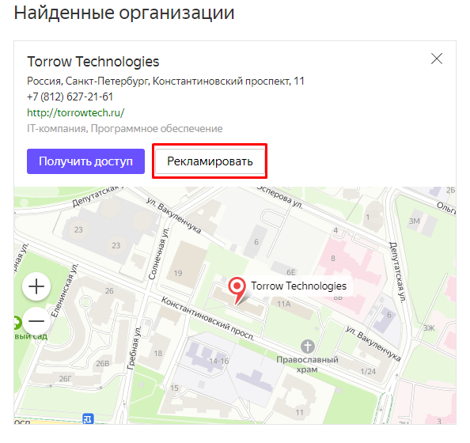

2. Перейдите в настройки рекламной подписки.

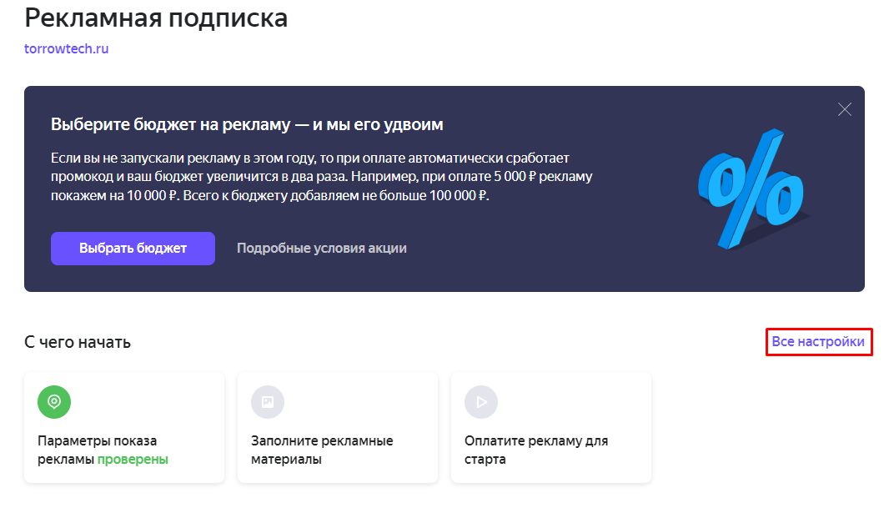

3. Выберите вкладку **Рекламные материалы**.

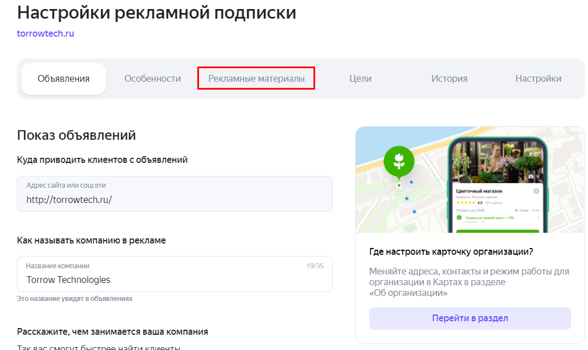

4. На вкладке **Рекламные материалы** найдите надпись **Кнопка действия** и нажмите кнопку **Добавить**.

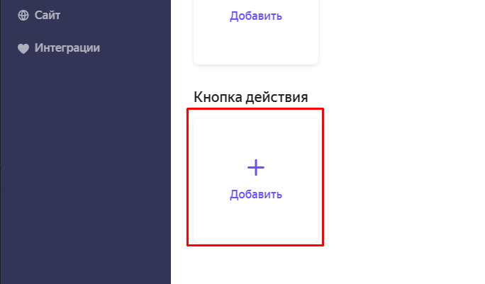

5. Выберите надпись на кнопке.

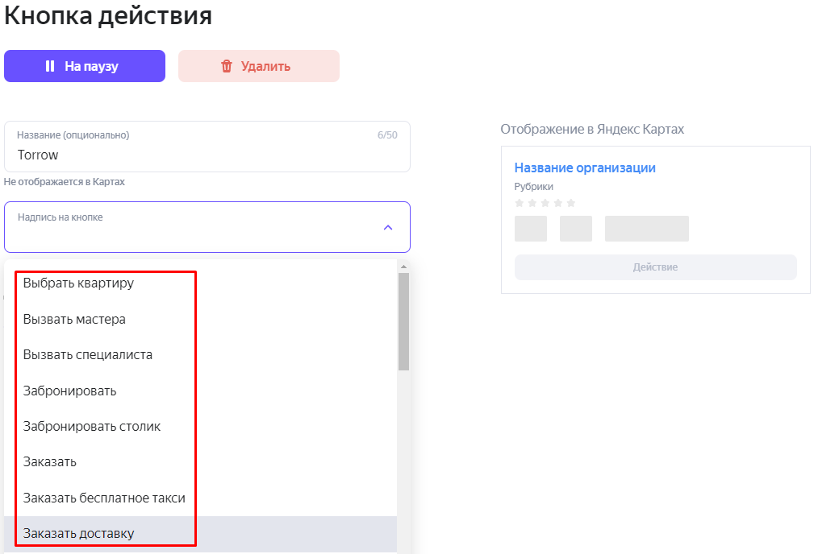

6. Укажите ваш :ref:`контакт torrow <contact-label>` или ссылку на ваш :ref:`виджет онлайн-записи <widget-label>`. Сохраните изменения.

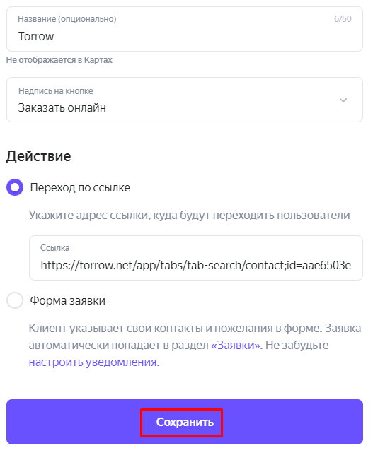

.. hint:: Бюджет рекламной компании и ее сроки определяются в разделе **Реклама**. Платформа Torrow к рекламной подписке яндекса никакого отношения не имеет.

---------------------------------------

===================================================
Виджет онлайн-записи в Яндекс картах
===================================================

Если Вы владелец салона красоты, барбершопа или любой другой организации из `разрешенного списка категорий`_, то можете бесплатно разместить виджет записи в сервисе Яндекс.карты с помощью нашей платформы.

.. _`разрешенного списка категорий`: https://yandex.ru/support/business-priority/manage/categories-all.html

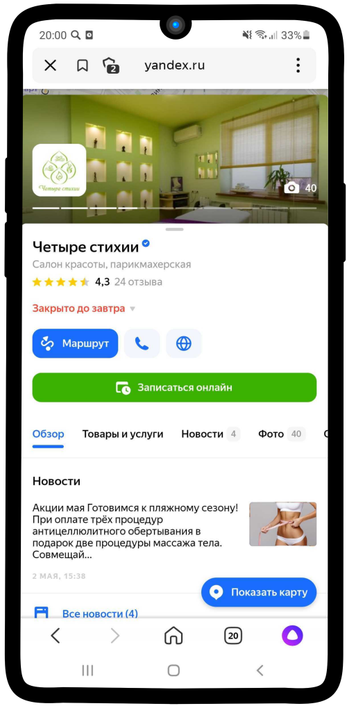

Чтобы разместить виджет онлайн-записи в яндекс картах:

1. Пройдите регистрацию в сервисе torrow: :ref:`registration-label`.

.. hint:: Также Вы можете использовать шаблон салона-красоты на нашем сайте: https://info.torrow.net/templates.

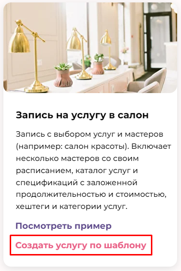

Этот же шаблон можно загрузить перейдя по ссылке: https://trrw.me/Ya4KZXVZN1Fwn34.

2. Создайте контакт своей организации в сервисе torrow (:ref:`contact-label`) или используйте созданный с помощью шаблона.

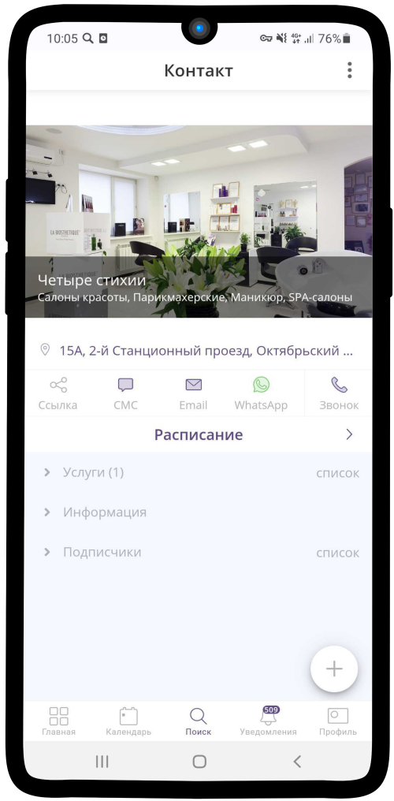

3. В контакте компании проставьте поля приведенные ниже, затем сохраните изменения, нажав на |галка|.
   
**Обязательные поля:**

   * Название в поле **ФИО**
   * **Адрес** с координатами в скобках (lat, lon). Пример: г.Тула, пос. Косая Гора 123 (55.75582, 37.617633)
   * Остальные поля являются необязательными, можете проставить их по желанию.

**Желательные поля:**

   * Изображение контакта
   * Телефоны
   * Url сайтов

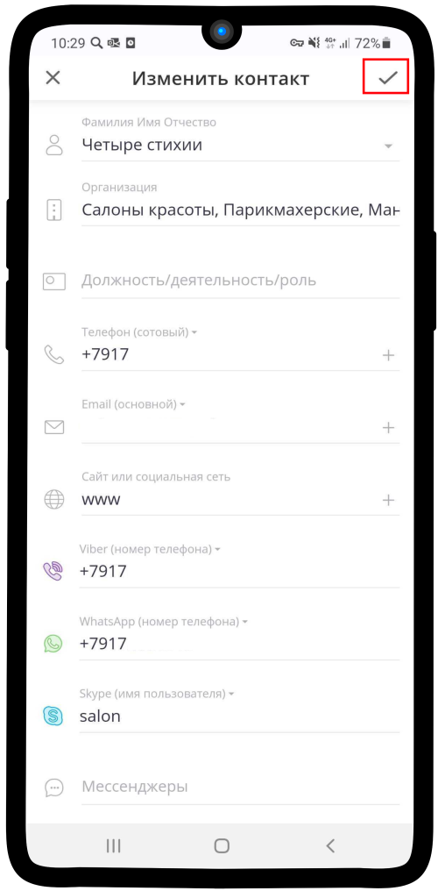

4. В общих настройках контакта проставьте **Открытый** тип доступности.

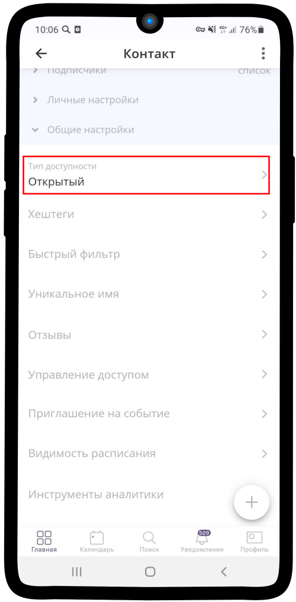

5. В общих настройках контакта укажите **хештеги**: #YandexBooking и категорию бизнеса в #<категория>:YandexBookingRubrics (например, #Салон красоты:YandexBookingRubrics). Пример заполнения на изображении ниже. После заполнения сохрание изменения, нажав на |галка|.

.. note:: 

    Список разрешенных к публикации на Яндекс-картах категорий вы можете найти на странице Яндекса: https://yandex.ru/support/business-priority/manage/categories-all.html

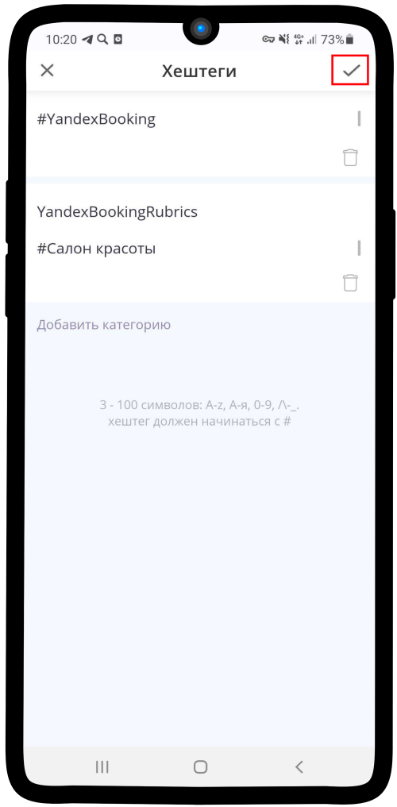

6. Создайте и настройте услугу (:ref:`service-label`) или используйте имеющуюся в шаблоне. Услуга должна быть **прикреплена** к контакту (:ref:`attach-label`).

**Обязательные настройки услуги:**

   * Должна быть доступна запись без регистрации с обязательными полями: **ФИО**, **Телефон** и необязательным **Email**
   * Должна быть группа ресурсов с типом **Спецификация** (:ref:`specification-label`). Ресурсы из неё будут разделами Услуги в виджете яндекса
   * В каждом ресурсе в этой группе должна быть **цена**

**Необязательные настройки услуги:**

   * Должна быть группа ресурсов с типом **Аренда** (:ref:`rent-resource-label`) (ресурсы из неё будут разделами Мастера в виджете яндекса)
   * Ресурсы должны иметь **описание** и **картинку**

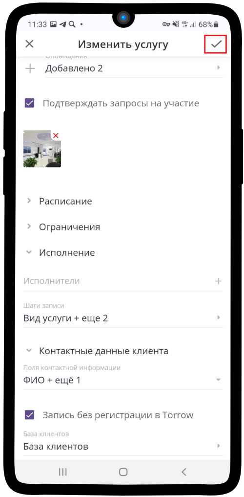

7. В общих настройках услуги проставьте тип доступности **Открытый** или **По ссылке**.

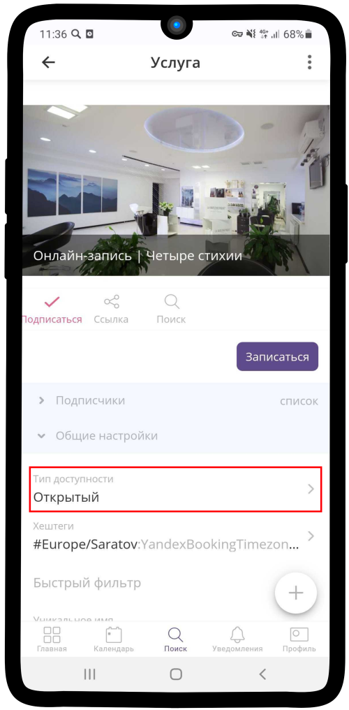

8. В общих настройках услуги укажите **хештег** с указанием таймзоны, если она отличается от московской: Название категории - YandexBookingTimezone, хештег - #Europe/Saratov. Пример заполнения на изображении ниже. После заполнения сохрание изменения, нажав на |галка|.

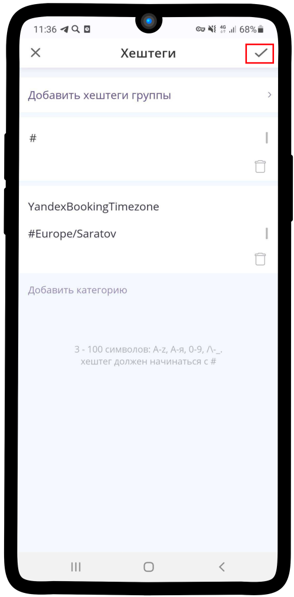

9. Далее Ваш профиль будет находиться на проверке у Яндекс.карт. При завершении модерации у организации появится кнопка **Записаться онлайн**.

10. Форма виджета в Яндекс.картах.

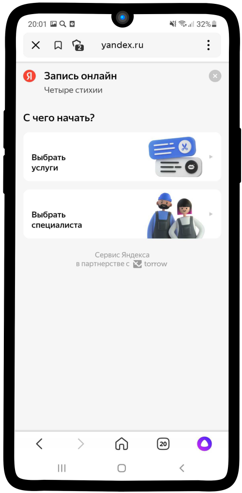

.. raw:: html
   
   <torrow-widget
      id="torrow-widget"
      url="https://web.torrow.net/app/tabs/tab-search/service;id=103edf7f8c4affcce3a659502c23a?closeButtonHidden=true&tabBarHidden=true"
      modal="right"
      modal-active="false"
      show-widget-button="true"
      button-text="Заявка эксперту"
      modal-width="550px"
      button-style = "rectangle"
      button-size = "60"
      button-y = "top"
   ></torrow-widget>
   

.. raw:: html

   