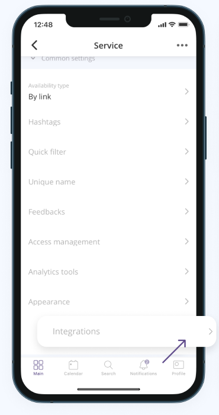
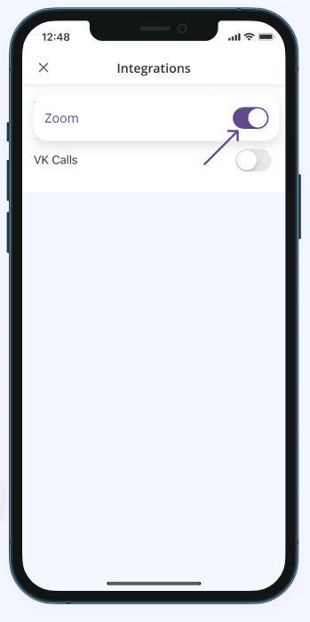
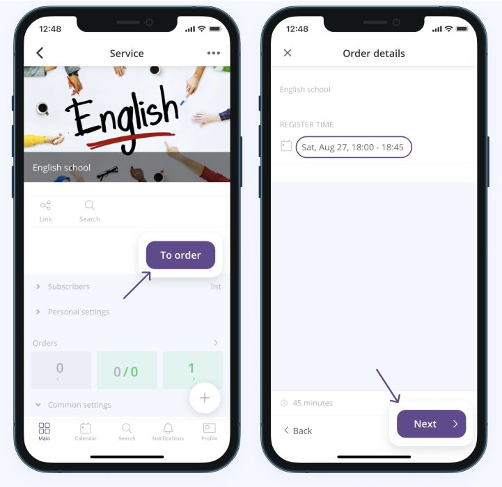
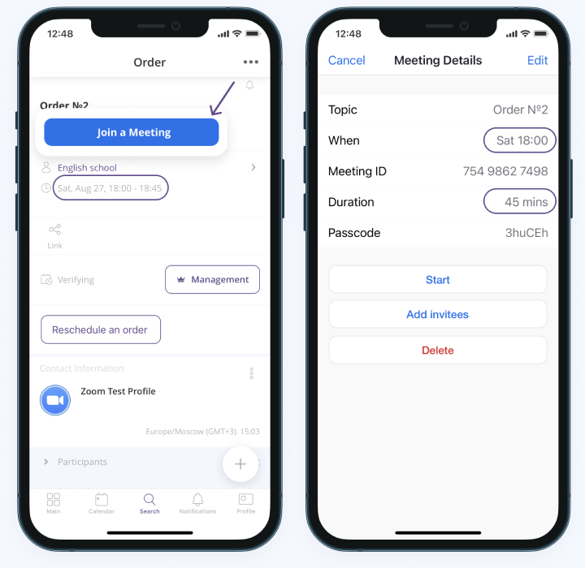

====================
Zoom Integration
====================

**Instruction for connecting Zoom to services in Torrow**

You can easily connect Zoom to your Torrow services.
The integration allows you to create a meeting link while creating orders for your services.

1. Sign up or sign in for Torrow

------------------------------

2. Create your own service (:ref:`service-label`)

   .. |точка| image:: media/Menu24.png
      :width: 21
      :alt: alternative text

------------------------------

3. On the page of the created service, open the **Common settings** section and click **Integrations** item

------------------------------

4. Switch the Zoom integration to **On**. You need to be authorized and provide access to your **Zoom** account

------------------------------

5. Now you or your customers can create orders, and **Torrow will automatically generate a link to the meeting** for further convenient interaction

------------------------------

6. Congratulations! The **invitation link** to the meeting is displayed in the order as a **Join a meeting** button. A scheduled meeting for the **ordered date** with **duration** will appear in your **Zoom** account

------------------------------

7. If you want to remove the integration, you **have two options**:

    * Go to the **Common settings** in Torrow app -> click **Integrations** and switch off the **Zoom**
    * Or login to your **Zoom Account** in browser -> navigate to the **Zoom App Marketplace** -> search for the Torrow app and click **Remove**

------------------------------

8. If you or your customers update some fields (**Name**, **StartTime**, **Duration**) in the created order, Torrow will also update this information in your Zoom account

------------------------------

9. You can't delete an order. You can only change the status to **Cancelled** or **Rejected**. So, **Torrow will never delete a meeting in Zoom**. You can do it yourself manually in your Zoom account.

------------------------------

.. raw:: html
   
   <torrow-widget
      id="torrow-widget"
      url="https://web.torrow.net/app/tabs/tab-search/service;id=103edf7f8c4affcce3a659502c23a?closeButtonHidden=true&tabBarHidden=true"
      modal="right"
      modal-active="false"
      show-widget-button="true"
      button-text="Заявка эксперту"
      modal-width="550px"
      button-style = "rectangle"
      button-size = "60"
      button-y = "top"
   ></torrow-widget>
   

.. raw:: html

   